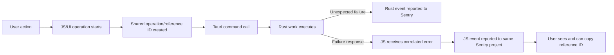

# Unified Unexpected Error Reporting

## Problem Frame

Acepe already has frontend Sentry setup in `packages/desktop/src/lib/analytics.ts` and Rust Sentry setup in `packages/desktop/src-tauri/src/analytics.rs`. But the product still leaks the real cause of failures: Rust command errors are commonly flattened to strings, unexpected failures are not captured consistently at the command boundary, frontend and backend events are not correlated into one failure story, and blocked users do not get a reliable reference ID they can share with engineering.

That leaves Acepe in a bad state for a release-quality desktop product: real users can hit abnormal failures, see a vague message, and the best debugging path is still manual reproduction or pasted screenshots. The next release needs a single, coherent system that automatically reports unexpected failures across JS and Rust, ties both layers together, and gives blocked users a reference ID that maps back to the real incident.

## Target Flow

Desired end-to-end flow for the release:

## Requirements

**Unexpected failure capture**
- R1. Unexpected Rust-side failures must be reported automatically without relying on feature authors to remember manual `capture_error` calls.
- R2. Unexpected JS-side failures must be reported automatically for both global/unhandled failures and surfaced failures that have been explicitly classified as unexpected by the centralized JS reporting boundary.
- R3. The system must use one shared expected-versus-unexpected classification rule across JS and Rust boundaries so automatic reporting stays consistent across layers. At a policy level, any failure not normalized into a known expected/domain error class is treated as unexpected at the reporting boundary.
- R4. Expected failures must stay out of Sentry by default. Normal validation errors, cancellations, and routine user-correctable rejections should continue to behave as product feedback rather than crash reporting.
- R5. Crash-style failures must still be captured even when no higher-level classification logic runs. When full per-operation correlation is unavailable, the system must still emit the failure and surface the best available reference ID.

**Cross-layer correlation**
- R6. Every JS-to-Rust entry flow reachable from the exact in-scope surfaces below must carry one shared operation/reference identifier so the resulting JS event, Rust event, logs, and user-visible failure all describe the same incident.
- R7. JS and Rust unexpected-failure events must be sent to the same Sentry project and be distinguishable through runtime-aware metadata such as runtime, operation, release, and environment.
- R8. The user-visible reference ID must be globally unique, searchable in Sentry when telemetry is available, and copied unchanged across the correlated failure story. It must be an incident-scoped ID rather than a stable user/device identifier or a Sentry-internal display artifact.
- R9. The global application error boundary may use a best-available crash/event ID rather than a full operation-scoped ID when a crash bypasses normal request correlation.

**User-facing error experience**
- R10. This release's exact user-facing surface set is:
  - the global application error boundary
  - project import / project-open style failures where the user is blocked from bringing a project into Acepe
  - the existing agent error card surface in the agent panel
- R11. Each in-scope surface must show the reference ID when the user is blocked by an abnormal failure.
- R12. Each in-scope surface must provide a one-click way to copy the reference ID.
- R13. Unexpected failures outside the exact surface set may still be reported to Sentry without gaining a user-facing reference ID in this release.

**Privacy and signal quality**
- R14. This release must preserve Acepe's privacy-first telemetry posture: do not broaden default personally identifiable data capture just to improve debugging.
- R15. Reference IDs must be incident-scoped, generated from cryptographically random values or an equivalent non-derived scheme, and must not be derived from stable user, device, machine, or session-persistent identifiers.
- R16. JS and Rust capture paths must gate on the same persisted analytics opt-out preference before emitting telemetry.
- R17. When telemetry is disabled or Sentry is unavailable, in-scope surfaces must still show a best-effort local reference ID. The UI must not imply that such an ID is searchable in Sentry.
- R18. The unified reporting system must improve signal quality, not flood Sentry. The design must deduplicate or otherwise suppress repeated identical failures within one app session rather than reporting every repeated failure instance. For this requirement, "identical" means the same failure fingerprint for the same operation or crash surface.

## Success Criteria

- A blocked user on each in-scope surface can see and copy a reference ID without digging through raw logs.
- When telemetry is available, engineering can search one reference ID and locate the correlated JS and Rust failure story in the same Sentry project.
- Unexpected project import failures and global application failures are no longer vague dead ends; they provide a clear reference ID back to the real incident.
- Expected errors remain product feedback, not crash-reporting noise.
- Users who have disabled telemetry still receive a best-effort local reference ID and are not misled about Sentry searchability.
- Repeating the same unexpected failure in one app session does not flood Sentry with duplicate events for the same operation or crash surface.

## Scope Boundaries

- Not sending every failed operation to Sentry.
- Not creating separate Sentry projects for JS and Rust.
- Not adding issue creation or GitHub draft flows in this release.
- Not expanding user-facing reference IDs beyond the exact in-scope surface set above.
- Not changing Acepe's privacy policy to enable broad default PII capture.
- Not requiring every toast or minor inline error to gain a reference ID.

## Key Decisions

- **Unexpected-only reporting**: Sentry is for crashes and abnormal failures, not normal user mistakes or expected rejections.
- **Full-stack guarantee**: The release target is end-to-end unexpected error reporting across JS and Rust for the exact in-scope surfaces above, not a narrow pilot of a single flow.
- **Shared failure story**: Cross-layer correlation is required so one user-visible incident maps to one connected JS/Rust debugging trail.
- **Single Sentry project**: JS and Rust events live in the same project, separated by metadata rather than by project split.
- **Supportable UX**: In-scope user-facing failures show a shareable reference ID with a copy affordance.
- **No issue flow in this release**: This release stops at reporting, correlation, and user-visible reference IDs.

## Dependencies / Assumptions

- `packages/desktop/src/lib/analytics.ts` already initializes JS Sentry and exposes `captureException`.
- `packages/desktop/src-tauri/src/analytics.rs` already initializes Rust Sentry, but explicit Rust error capture is not structurally wired today.
- There is no existing shared cross-layer operation/reference ID today; that correlation path is a net-new capability for this release.
- JS and Rust Sentry currently read different environment variables (`VITE_SENTRY_DSN` in the frontend build and `SENTRY_DSN` in Rust runtime), so release configuration must keep them aligned if one-project reporting is required.
- Existing JS and Rust Sentry initialization already respect the persisted analytics opt-out preference; unified reporting should preserve that behavior.
- `packages/desktop/src/lib/components/error-boundary.svelte` already captures global JS errors and unhandled rejections.
- Project import failures are currently surfaced in flows such as `packages/desktop/src/lib/acp/components/welcome-screen/welcome-screen.svelte` and `packages/desktop/src/lib/components/main-app-view/logic/managers/project-handler.ts`, so planning should treat import/open flows as real current surfaces rather than hypothetical ones.
- The existing agent error card surface already exists in the agent panel and is an explicit in-scope UI surface for reference-ID display.

## Outstanding Questions

### Deferred to Planning

- [Affects R1-R5][Technical] What shared error model or boundary wrapper best distinguishes expected versus unexpected failures across Tauri command handlers and the centralized JS reporting boundary without forcing a disruptive all-at-once rewrite?
- [Affects R6-R9][Technical] What is the cleanest way to generate, transport, and expose the shared operation/reference ID across JS invoke calls, Rust execution, logs, Sentry metadata, and user-visible UI, including best-available IDs for crash/global-failure paths?
- [Affects R18][Technical] What deduplication or repeated-failure suppression strategy should the release use so automatic reporting improves signal quality without hiding distinct incidents?

## Next Steps

-> `/ce:plan` for structured implementation planning
