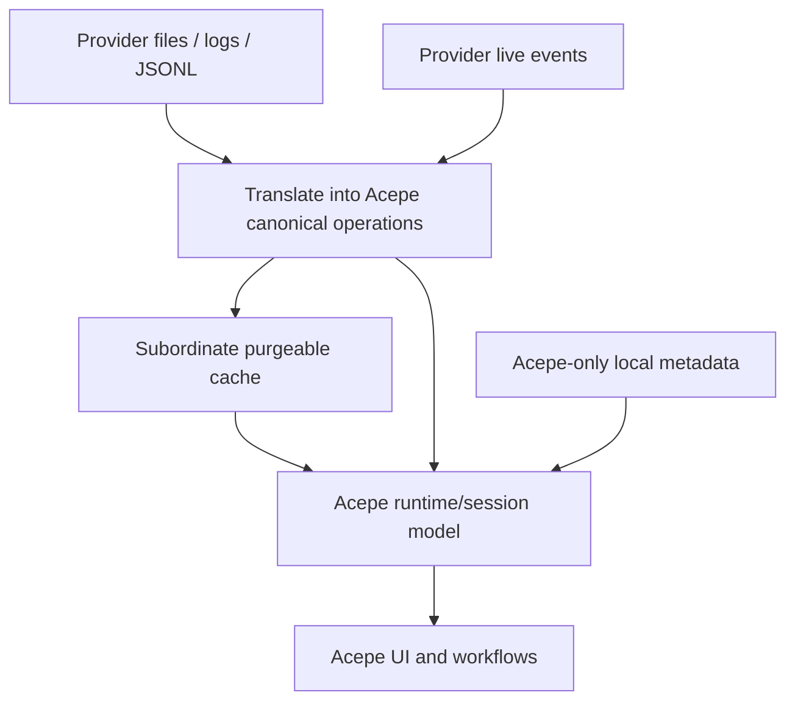

# Provider-Authoritative Session Restore

## Problem Frame

Acepe's storage work exposed a deeper product-boundary question: should Acepe durably own canonical session truth, or should it remain a thin wrapper over provider-owned history?

The decision from this brainstorm is clear: **provider files and provider live events remain the restore authority**. Acepe should not keep a second durable copy of transcript/session truth when the provider already owns it. Acepe's job is to translate provider-native history and live events into Acepe's canonical operations/runtime model, then layer Acepe-only metadata and workflows on top.

The problem this work must solve is therefore narrower and cleaner than the earlier storage-seam framing:

- stop duplicate durable transcript storage from growing local disk usage,
- keep cold-open and live-session behavior consistent through one canonical operations model,
- preserve Acepe-only product state without promoting local persistence into a second transcript authority.

## Requirements

**Authority and Restore**
- R1. Provider-owned files, logs, JSONL, and equivalent provider-native history are the source of truth for cold-open restore.
- R2. Provider live events are the source of truth for attached/live sessions.
- R3. Acepe must use one canonical operations/runtime model for both cold-open and live-session translation so the same session semantics do not diverge by source.
- R4. Acepe must not treat local transcript/session persistence as a restore authority for session content; provider-owned history is the sole restore authority for transcript/session truth.

**Local Persistence**
- R5. Local durable storage must shrink to Acepe-owned metadata only: review state, permission decisions, local annotations, and discovery/indexing metadata that are generated by Acepe product logic rather than derived transcript/session content.
- R6. Any locally stored cache of translated provider history must be explicitly subordinate, purgeable, rebuildable from provider-owned authority, and limited to pointers, offsets, indexes, or summaries that accelerate re-translation. It must not durably store full transcript payloads, message bodies, or tool-call bodies.
- R7. Large provider payloads must not be durably duplicated across journal/snapshot/cache layers in Acepe-managed storage.

**Product Behavior**
- R8. Opening a transcript from disk and observing a live attached session must produce the same canonical operations model for completed, non-transient operations. Transient live-only states such as streaming tokens or in-flight tool calls are not required to be reproducible on cold open.
- R9. Acepe-only metadata-driven workflows must remain available without restoring duplicate transcript truth. At minimum this includes review state, permission history/decisions, local annotations, and discovery/indexing behavior that depends on Acepe-owned metadata rather than provider-owned transcript copies.
- R10. When provider-owned history is unavailable or cannot be parsed correctly, Acepe must surface the failure explicitly and must not present an empty or partial restore as a successful session restore.

## Success Criteria

- Cold-open restore can be explained as "read provider-owned history, translate into Acepe canonical operations, layer Acepe-only metadata."
- Live sessions can be explained as "read provider events, translate into the same canonical operations, layer Acepe-only metadata."
- Acepe no longer needs a second durable copy of transcript/session truth in local storage to restore normal sessions.
- No Acepe-managed durable table, file, or cache grows by storing repeated transcript payload copies or full translated transcript bodies.
- When provider-owned history is missing or unparseable, Acepe fails explicitly rather than silently restoring incomplete session state.

## Scope Boundaries

- This work does **not** require zero local persistence; it only narrows local durable storage to Acepe-owned facts and subordinate caches.
- This work does **not** redesign provider file formats or eliminate the need to reverse engineer them.
- This work does **not** require Acepe to work offline when the provider-owned restore source is unavailable; explicit restore failure is acceptable, silent local fallback is not.
- This work does **not** decide the exact cache format, invalidation policy, or parser implementation details; those belong in planning.

## Key Decisions

- **Provider-owned history is the restore authority**: Acepe stays thin and avoids duplicating transcript truth.
- **Acepe owns canonical operations/runtime state, not canonical durable transcript storage**: the canonical model is for translation and behavior, not for durable second-source persistence.
- **Local durable storage is Acepe-only metadata plus optional subordinate caches**: this preserves product-specific workflows without recreating split transcript authority.
- **Reverse engineering provider formats is an intentional cost**: the architecture accepts parser maintenance instead of compensating by storing duplicate durable truth locally.

## Dependencies / Assumptions

- Provider-owned history is sufficiently available and parseable for the restore experiences Acepe wants to support.
- Acepe can translate both historical provider files and live provider events into one common operations/runtime model.
- Acepe-only metadata remains small relative to transcript payload storage.

## Outstanding Questions

### Deferred to Planning
- [Affects R6][Technical] What cache shapes, if any, are worth keeping locally for performance without becoming implicit restore authority?
- [Affects R5][Technical] Which current local tables are truly Acepe-owned metadata versus duplicated transcript/session truth that should be removed?
- [Affects R10][Needs research] What parser-failure surfacing and provider-format drift signals are needed so restore failures are loud, actionable, and never mistaken for successful restore?
- [Affects R8][Needs research] How should detach/crash recovery behave while waiting for provider-owned history to flush the latest completed operations to disk?

## Next Steps

-> `/ce:plan` for structured implementation planning.
