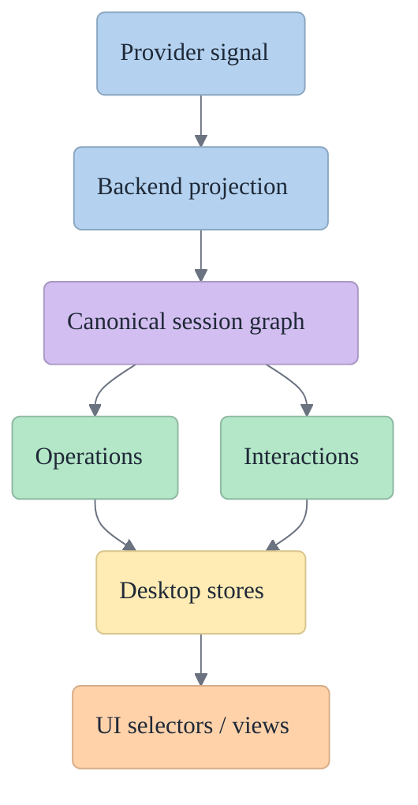

# Acepe Concepts

This section is the **architecture reference** for Acepe's core product concepts.

Use it when you need to answer questions like:

- What is the canonical session graph?
- What is an operation versus an interaction?
- What is transcript history allowed to own?
- How should reconnect and resume rebuild state?
- Where is provider-specific logic allowed to live?

## How to use these docs

Treat these pages as the **source of truth for intended architecture**, not as loose notes.

When code and concepts disagree:

1. assume the concept doc describes the intended model,
2. confirm the code path and the mismatch,
3. update the code to match the concept or explicitly revise the concept doc in the same change.

The goal is to stop the codebase from drifting into multiple hidden authorities.

## Mental model

| Concept | What it is | What it is not |
|---|---|---|
| Session graph | The canonical product-state model for a session | A loose cache of whatever the UI last saw |
| Transcript | Renderable conversation history | The sole authority for runtime tool state |
| Operation | Durable runtime work record | Just a prettified transcript tool row |
| Interaction | Durable decision/input gate | A transient popup owned by a component |
| Reconnect/resume | Rehydration of canonical state | A best-effort replay of raw transport events |

## Core concepts

| Page | Focus | Read when |
|---|---|---|
| [Session graph](./session-graph.md) | Overall ownership model | You need to know what is authoritative |
| [Operations](./operations.md) | Durable runtime work state | You are touching tool execution or lifecycle |
| [Interactions](./interactions.md) | Permissions, questions, approvals | You are touching blocked/awaiting-user flows |
| [Reconnect and resume](./reconnect-and-resume.md) | Restore and survival rules | You are debugging reopen/reconnect drift |

## Canonical ownership at a glance

| Surface | Canonical owner |
|---|---|
| Transcript history | `SessionEntryStore` materialized from the session graph |
| Runtime work | `OperationStore` |
| Human / policy gates | Interaction, permission, and question stores |
| Session truth stream | Revisioned session graph envelopes |
| UI rendering | Selectors over canonical stores |

| If you are asking... | Look here first |
|---|---|
| "What is the current tool?" | Operation-backed selectors |
| "Why is this blocked?" | Interaction + operation linkage |
| "What should survive reopen?" | Session graph + restore model |
| "Can the UI infer this from transcript?" | Usually no; check ownership docs |

## Related references

- [`docs/solutions/architectural/revisioned-session-graph-authority-2026-04-20.md`](../solutions/architectural/revisioned-session-graph-authority-2026-04-20.md)
- [`docs/solutions/architectural/provider-owned-semantic-tool-pipeline-2026-04-18.md`](../solutions/architectural/provider-owned-semantic-tool-pipeline-2026-04-18.md)
- [`docs/solutions/best-practices/provider-owned-policy-and-identity-not-ui-projections-2026-04-09.md`](../solutions/best-practices/provider-owned-policy-and-identity-not-ui-projections-2026-04-09.md)
