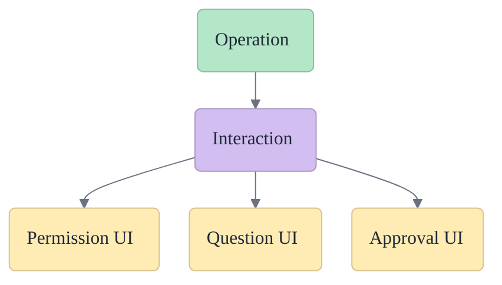
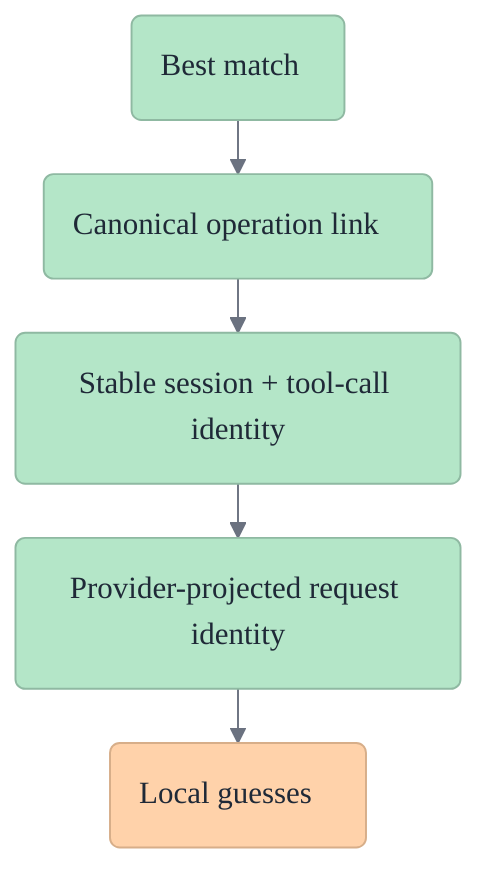

# Interactions

An **interaction** is the canonical record of something the system is waiting on from a human or decision path.

In Acepe, interactions are the durable state behind things like:

- permission requests,
- questions,
- plan/apply approvals,
- other explicit action gates tied to runtime work.

## Interaction in one picture

## Interaction in one picture

## Why interactions matter

Without a canonical interaction model, these flows tend to collapse into transient UI state:

- a prompt appears,
- a component decides whether it is visible,
- reconnect happens,
- the prompt disappears or reattaches incorrectly.

Interactions prevent that by making the gate itself part of the session graph.

## Ownership table

| Concern | Owned by interaction? | Notes |
|---|---|---|
| Pending permission state | Yes | Should survive reconnect |
| Question/approval identity | Yes | Must not depend on render timing |
| Link to work being blocked | Yes | Deterministic association beats UI guessing |
| "Is this popup open?" | No | That is a view concern over canonical state |
| Button styling/placement | No | Presentation concern only |

## Interaction vs operation

The split is:

- **operation** = the runtime work item
- **interaction** = the decision or input gate related to that work

They are linked, but they are not the same thing.

This matters because the same operation can be:

- blocked by a permission,
- waiting on a plan approval,
- associated with a question,
- resumed later with the gate still intact.

## Relationship table

| Concept | Purpose |
|---|---|
| Operation | The work item being executed |
| Interaction | The gate or decision tied to that work |
| Transcript | The visible conversation/history surface |

## What interactions own

Interactions should own:

- their stable identity,
- session ownership,
- interaction type,
- pending/resolved state,
- linkage to the relevant operation or tool call,
- enough metadata to render the right UX after reconnect.

## Association hierarchy

## What the UI should not do

The UI should not treat permissions, questions, or plan approvals as purely local component state.

It should render from canonical interaction state and reply through store/controller paths that mutate the underlying graph-backed model.

## Association rules

Interaction association must be deterministic.

That means shared code should prefer:

- canonical operation linkage,
- stable session + tool-call identity,
- provider-projected request identity,

over:

- matching by visible text,
- transcript row timing,
- component-local guesses.

## Failure modes

| Symptom | Likely cause |
|---|---|
| Prompt disappears after reconnect | Interaction was transient, not canonical |
| Shortcut cannot resolve the pending request | UI re-looked up a narrower identity path than the rendered interaction |
| Permission attaches to wrong tool | Association used heuristic timing or text instead of canonical linkage |
| Plan approval is visible in one surface but not another | Multiple render paths are not reading the same interaction state |

## Reconnect consequence

If interactions are canonical:

- blocked operations remain blocked after reconnect,
- pending prompts can re-render correctly,
- keyboard shortcuts and action buttons can resolve the same pending interaction,
- late-arriving operation data can still attach to the existing gate.

If interactions are not canonical, reconnect becomes a race between UI timing and transport timing.
