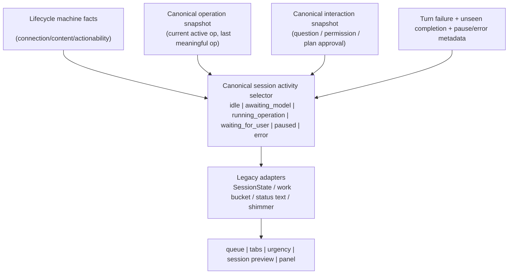
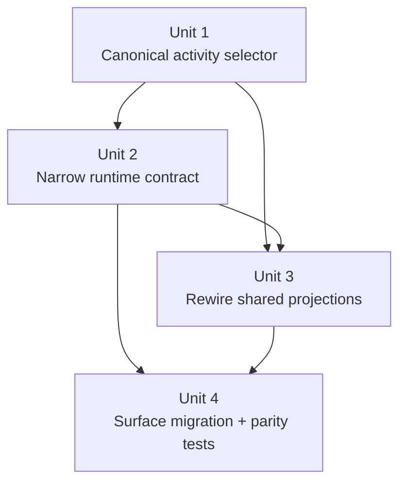

# refactor: Canonical session activity ownership

## Overview

Replace the current mixed live-session activity inference (`SessionRuntimeState.showThinking`, transcript `lastEntry`, hot-state, and `OperationStore`) with one canonical session-activity selector that every surface consumes. The immediate goal is to eliminate app-wide drift like `"Planning next moves"` appearing while real tool or sub-agent work is still active; the broader goal is to align the desktop implementation with Acepe's documented session-graph and operations architecture.

## Problem Frame

Acepe's architecture docs already require one canonical operations/runtime model for both live and restored sessions (see origin: `docs/brainstorms/2026-04-22-provider-authoritative-session-restore-requirements.md`). The current desktop projection still violates that rule in one important seam: live activity is inferred from a mix of machine lifecycle, transcript history, and canonical operation state.

Today, `packages/desktop/src/lib/acp/logic/session-ui-state.ts` derives `showThinking` from the lifecycle machine plus a `lastEntry` heuristic, and `packages/desktop/src/lib/acp/store/live-session-work.ts` turns that into live session activity before every consumer asks the operation layer whether work is actually still running. Because queue, tabs, urgency, session-item preview, and agent-panel surfaces all depend on that shared projection, one stale heuristic can misclassify the entire app.

This is the exact drift the session-graph and operations docs warn about: transcript rows are presentation history, not runtime truth, and different surfaces must not reconstruct "what is happening now?" from different inputs. This plan tightens ownership so lifecycle facts, canonical operations, and canonical interactions produce one shared activity answer.

## Requirements Trace

- R1. Live session activity must derive from one canonical operations/runtime model rather than transcript heuristics or surface-local reconstruction (origin R3; `docs/concepts/session-graph.md` invariants 1 and 4).
- R2. Transcript entries must remain history/presentation data only; live activity must not depend on `lastEntry` or degraded transcript tool rows (`docs/concepts/operations.md`, `docs/concepts/session-graph.md`).
- R3. Queue, tabs, sidebar/session preview, urgency, and panel surfaces must agree on the same activity classification and status label for the same session state.
- R4. The model must preserve distinct outcomes for awaiting model response, actively running tool work, waiting on user input, paused state, error state, and idle/review-ready state.
- R5. Regression coverage must prove cross-surface parity for canonical activity cases, including active child operations, normal streaming tools, waiting-for-user interactions, and paused/error overrides.

## Scope Boundaries

- This plan does **not** redesign provider transport, backend session graph storage, or restore authority beyond the desktop selector/store seam already discussed in the origin doc.
- This plan does **not** change transcript rendering responsibilities; transcript rows still render history.
- This plan does **not** require a user-visible copy rewrite. `"Planning next moves"` remains valid copy for the true awaiting-model state.
- This plan may keep compatibility adapters such as `SessionState` or `SessionStatus` temporarily if they are no longer the authority for live activity.

## Context & Research

### Relevant Code and Patterns

- `packages/desktop/src/lib/acp/store/live-session-work.ts` is the current live-session projection seam that merges runtime state, hot-state, operation state, and interaction state.
- `packages/desktop/src/lib/acp/store/session-work-projection.ts` is the compact adapter layer that converts live `SessionState` into work buckets, compact activity kinds, and legacy status outputs.
- `packages/desktop/src/lib/acp/logic/session-ui-state.ts` currently lets transcript `lastEntry` affect `showThinking`, which is the key heuristic leak.
- `packages/desktop/src/lib/acp/store/operation-store.svelte.ts` already owns canonical operation lifecycle for current/last tool state, including parent/child relationships.
- `packages/desktop/src/lib/acp/store/operation-association.ts` establishes the shared interaction snapshot pattern that queue/tab/urgency projections already reuse.
- `packages/desktop/src/lib/acp/components/activity-entry/activity-entry-projection.ts` is the shared projection behind queue/panel tool activity snippets, so it must align with the same canonical activity contract even though it is not itself a top-level surface.
- `packages/desktop/src/lib/acp/store/queue/utils.ts`, `packages/desktop/src/lib/acp/store/tab-bar-utils.ts`, `packages/desktop/src/lib/acp/store/urgency-tabs-store.svelte.ts`, and `packages/desktop/src/lib/components/ui/session-item/session-item.svelte` are the main cross-surface consumers that must converge.

### Institutional Learnings

- `docs/solutions/architectural/revisioned-session-graph-authority-2026-04-20.md` explicitly says transcript tool rows are not the live tool authority and that split authority produces inconsistent tool/status UI.
- `docs/solutions/logic-errors/operation-interaction-association-2026-04-07.md` shows the preferred pattern: ownership at the store/association layer, many surfaces consuming the same resolved snapshot.
- `docs/solutions/logic-errors/kanban-live-session-panel-sync-2026-04-02.md` documents the same root smell in another surface: one runtime owner, many projections.

### External References

- None. The codebase and internal architecture docs already define the desired ownership model clearly enough that external research would add little value.

## Key Technical Decisions

- **Introduce a canonical session-activity selector in shared logic**: activity should be a pure selector over canonical lifecycle, canonical operations, canonical interactions, and terminal/error metadata rather than a side effect of `showThinking` plus UI-specific checks.
- **Narrow `SessionRuntimeState` back to lifecycle/actionability**: runtime state should answer lifecycle-machine questions (`canSubmit`, `canCancel`, `connectionPhase`, `contentPhase`), not infer live activity from transcript history.
- **Keep `SessionState` and legacy work/status projections as adapters during migration**: shared consumers can move incrementally as long as the new canonical activity selector becomes the authority.
- **Make cross-surface parity a first-class contract**: the selector is only successful if queue/tab/sidebar/panel projections all agree for the same canonical input fixture.

## Open Questions

### Resolved During Planning

- **Which upstream document should anchor this work?** Use `docs/brainstorms/2026-04-22-provider-authoritative-session-restore-requirements.md` because it already mandates one canonical operations/runtime model for both live and restored sessions.
- **Is external research necessary?** No. The repo already has strong local authority docs (`docs/concepts/session-graph.md`, `docs/concepts/operations.md`, `docs/concepts/session-lifecycle.md`) and concrete store-layer patterns to follow.
- **Should this be treated as a deep refactor?** Yes. It touches cross-surface behavior, canonical state ownership, and shared selector contracts.

### Deferred to Implementation

- **Should `showThinking` remain in `SessionRuntimeState` as a compatibility field or be removed immediately?** Decide after the canonical selector is in place and the remaining consumers are enumerated in code; either outcome is valid if runtime no longer owns activity truth.
- **Should the first slice introduce a new exported enum name (for example `awaiting_model` vs `thinking`) or preserve current naming and only change ownership?** Make the smallest naming decision that keeps migration readable without obscuring the new ownership boundary.

## High-Level Technical Design

> *This illustrates the intended approach and is directional guidance for review, not implementation specification. The implementing agent should treat it as context, not code to reproduce.*

| Canonical activity | What it means | Primary UI consequence |
|---|---|---|
| `awaiting_model` | The agent is waiting to produce the next response and no operation is actively running | Show `"Planning next moves"` and planning shimmer |
| `running_operation` | A canonical operation is still active, including nested child/sub-agent work | Show active tool/sub-agent state and active-work shimmer |
| `waiting_for_user` | The session is blocked on question/permission/approval style interaction | Surface the pending interaction as the dominant state, no planning shimmer |
| `paused` | Provider/runtime has paused the turn | Preserve paused affordances, no active shimmer |
| `error` | Connection or turn failure is the dominant state | Surface error/recovery affordances, no active shimmer |
| `idle` | No live work is active; completion/review cues may still apply | Render ready/review states; unseen-completion stays adapter-layer decoration, not a separate activity variant |

## Implementation Units

- [ ] **Unit 1: Establish a canonical session-activity selector**

**Goal:** Create one shared activity model that answers "what is this session doing right now?" from canonical lifecycle, operation, interaction, and failure inputs.

**Requirements:** R1, R2, R4

**Dependencies:** None

**Files:**
- Create: `packages/desktop/src/lib/acp/logic/session-activity.ts`
- Create: `packages/desktop/src/lib/acp/logic/__tests__/session-activity.test.ts`
- Modify: `packages/desktop/src/lib/acp/store/live-session-work.ts`
- Modify: `packages/desktop/src/lib/acp/store/session-work-projection.ts`

**Approach:**
- Define a pure selector/domain that distinguishes awaiting-model, running-operation, waiting-for-user, paused, error, and idle states.
- Feed the selector from normalized lifecycle facts plus canonical operation and interaction snapshots, rather than from transcript history. When `runtimeState` is unavailable, `live-session-work.ts` should first normalize `hotState` into the same lifecycle fact shape before invoking the selector, so the selector never needs nullable runtime input or transcript fallback logic.
- Use an explicit priority chain in the selector (`error` > `paused` > `waiting_for_user` > `running_operation` > `awaiting_model` > `idle`) so recovery and human-blocked states cannot be reintroduced as surface-local heuristics.
- Keep unseen-completion and review cues as adapter-layer decoration on top of canonical `idle`, not as a separate activity state.
- Convert `deriveLiveSessionState()`, `deriveLiveSessionWorkProjection()`, and `session-work-projection.ts` into adapters that consume the canonical selector instead of inventing activity first.

**Execution note:** Start with failing selector tests that cover the current bug matrix before changing shared projections.

**Patterns to follow:**
- `docs/concepts/session-graph.md`
- `docs/concepts/operations.md`
- `packages/desktop/src/lib/acp/store/operation-association.ts`
- `packages/desktop/src/lib/acp/store/live-session-work.ts`

**Test scenarios:**
- Happy path: lifecycle says the turn is waiting for model output and there is no active operation -> selector returns `awaiting_model`.
- Happy path: lifecycle is running and a normal tool operation is `in_progress` -> selector returns `running_operation`.
- Edge case: parent task is terminal but a child operation/sub-agent is still `in_progress` -> selector still returns `running_operation`.
- Edge case: lifecycle is running with no current operation and no pending interaction -> selector chooses the non-operation waiting state, not running.
- Edge case: provider/runtime pause metadata is present while operation data still exists -> selector returns `paused`, not `running_operation` or `awaiting_model`.
- Edge case: no live work is active and only unseen-completion metadata remains -> selector returns `idle`, with review cues added by adapters.
- Error path: connection error or active turn failure is present -> selector returns `error` regardless of stale planning heuristics.
- Integration: `deriveLiveSessionState()` maps the canonical selector back into the legacy `SessionState.activity` shape without changing unrelated pending-input or attention metadata.

**Verification:**
- A single selector fixture matrix can explain every live activity outcome without mentioning transcript `lastEntry`.

- [ ] **Unit 2: Demote transcript-driven heuristics from runtime state**

**Goal:** Re-establish `SessionRuntimeState` as a lifecycle/actionability contract instead of a secondary activity owner.

**Requirements:** R1, R2, R4

**Dependencies:** Unit 1

**Files:**
- Modify: `packages/desktop/src/lib/acp/logic/session-ui-state.ts`
- Modify: `packages/desktop/src/lib/acp/store/session-store.svelte.ts`
- Test: `packages/desktop/src/lib/acp/logic/__tests__/session-machine.test.ts`
- Test: `packages/desktop/src/lib/acp/store/__tests__/session-store-projection-state.vitest.ts`

**Approach:**
- Remove or demote the `lastEntry`-based "between tool calls" heuristic from runtime derivation so transcript history no longer mutates runtime activity truth.
- Keep lifecycle-machine responsibilities intact: connection/content phases, stop/cancel affordances, submit availability, and wait-for-user behavior derived directly from the machine.
- Make the current `ConnectionState.AWAITING_RESPONSE` -> `activityPhase: "waiting_for_user"` naming inversion explicit in the migration. The canonical selector must treat that machine phase as "awaiting model output" and rely on the interaction snapshot for genuine human-blocked states.
- Make `SessionStore.getSessionRuntimeState()` depend only on lifecycle truth, not on transcript ordering.

**Execution note:** Add characterization coverage first for the runtime fields that must stay unchanged while activity ownership moves elsewhere.

**Patterns to follow:**
- `docs/concepts/session-lifecycle.md`
- `packages/desktop/src/lib/acp/logic/session-ui-state.ts`
- `packages/desktop/src/lib/acp/store/session-store.svelte.ts`

**Test scenarios:**
- Happy path: ready/disconnected/connecting lifecycle fields continue to compute `canSubmit`, `canCancel`, and `showConnectingOverlay` exactly as before.
- Edge case: a completed transcript tool row appended during streaming does not alter runtime lifecycle classification on its own.
- Edge case: paused lifecycle still exposes paused actionability even if the last transcript row is a tool call.
- Error path: failed connection/runtime still surfaces runtime error state without relying on activity selector fallbacks.
- Integration: `SessionStore.getSessionRuntimeState()` returns the same lifecycle contract for the same machine snapshot regardless of transcript row ordering.

**Verification:**
- Runtime state can be described entirely in lifecycle/actionability language; transcript history is no longer part of its contract.

- [ ] **Unit 3: Rewire shared projections and stores to consume canonical activity**

**Goal:** Make queue/tab/urgency/activity-entry projections consume the same canonical activity answer instead of re-deriving `thinking` or `streaming` from mixed inputs.

**Requirements:** R1, R3, R4, R5

**Dependencies:** Unit 1, Unit 2

**Files:**
- Modify: `packages/desktop/src/lib/acp/store/queue/utils.ts`
- Modify: `packages/desktop/src/lib/acp/store/tab-bar-utils.ts`
- Modify: `packages/desktop/src/lib/acp/store/tab-bar-store.svelte.ts`
- Modify: `packages/desktop/src/lib/acp/store/urgency-tabs-store.svelte.ts`
- Modify: `packages/desktop/src/lib/acp/components/activity-entry/activity-entry-projection.ts`
- Test: `packages/desktop/src/lib/acp/store/queue/__tests__/queue-utils.test.ts`
- Test: `packages/desktop/src/lib/acp/store/__tests__/tab-bar-utils.test.ts`
- Test: `packages/desktop/src/lib/acp/components/activity-entry/__tests__/activity-entry-projection.test.ts`

**Approach:**
- Thread the canonical activity selector through shared store-layer builders instead of letting each projection interpret `runtimeState.showThinking`, `SessionStatus`, or `currentStreamingToolCall` independently.
- Keep current compatibility outputs (`SessionState`, `SessionStatus`, compact activity kind) as derived views of the canonical activity result.
- Treat `activity-entry-projection.ts` as a shared projection for queue/panel tool activity snippets, not a special-case surface; it should consume the same canonical activity input as queue/tab/urgency builders.
- Ensure current-operation, last-operation, and pending-interaction selectors remain store-layer concerns, not component concerns.

**Execution note:** Build a shared fixture matrix and reuse it across projection tests so parity is explicit, not implied.

**Patterns to follow:**
- `docs/solutions/logic-errors/operation-interaction_association-2026-04-07.md`
- `packages/desktop/src/lib/acp/store/queue/utils.ts`
- `packages/desktop/src/lib/acp/store/tab-bar-utils.ts`
- `packages/desktop/src/lib/acp/components/activity-entry/activity-entry-projection.ts`

**Test scenarios:**
- Happy path: the same canonical running-operation input yields streaming/current-tool behavior in queue, tab, and activity-entry projections.
- Happy path: awaiting-model input with no active operation yields planning/thinking behavior consistently in queue and tab projections.
- Edge case: nested active child operation/sub-agent keeps all projections in the active-work state.
- Edge case: waiting-for-user input suppresses planning copy and preserves pending interaction precedence.
- Edge case: paused canonical activity yields paused behavior consistently across queue, tab, and activity-entry projections without leaking planning shimmer.
- Edge case: idle canonical activity keeps review/unseen-completion cues as adapter behavior rather than reclassifying the activity itself.
- Error path: recoverable turn failure and connection error continue to classify projections as error without losing current interaction metadata.
- Integration: projection parity tests assert that queue, tab, and activity-entry representations agree on the same canonical activity fixture set.

**Verification:**
- Shared store projections no longer need to mention `showThinking` as an authority signal to agree on current session activity.

- [ ] **Unit 4: Migrate surface-level labels and add cross-surface regression coverage**

**Goal:** Make representative UI surfaces render canonical session activity without local heuristic shortcuts, and lock parity in with surface-level regression tests.

**Requirements:** R3, R4, R5

**Dependencies:** Unit 3

**Files:**
- Modify: `packages/desktop/src/lib/components/ui/session-item/session-item.svelte`
- Modify: `packages/desktop/src/lib/acp/components/agent-panel/components/agent-panel.svelte`
- Modify: `packages/desktop/src/lib/acp/components/queue/queue-item.svelte`
- Modify: `packages/desktop/src/lib/acp/components/agent-panel/components/agent-panel-content.svelte`
- Create: `packages/desktop/src/lib/components/ui/session-item/session-item.svelte.vitest.ts`
- Test: `packages/desktop/src/lib/acp/components/queue/__tests__/queue-item-display.test.ts`
- Test: `packages/desktop/src/lib/acp/components/agent-panel/components/__tests__/agent-panel-content.svelte.vitest.ts`
- Test: `packages/desktop/src/lib/acp/components/agent-panel/components/__tests__/planning-labels.svelte.vitest.ts`
- Test: `packages/desktop/src/lib/acp/store/__tests__/session-store-projection-state.vitest.ts`

**Approach:**
- Remove surface-level assumptions that "thinking" can be detected directly from `SessionState` or `runtimeState.showThinking` when a shared projection can provide the canonical activity/status label.
- Update `agent-panel.svelte` as well as `agent-panel-content.svelte` so the panel controller stops injecting `runtimeState.showThinking` through `isWaitingForResponse`; the parent/child prop chain must derive from canonical activity like every other surface.
- Keep interaction-first and error-first precedence intact so planning copy does not outrank questions, permissions, approvals, or errors.
- Preserve paused over active-work rendering and suppress planning shimmer for `waiting_for_user`, `paused`, `error`, and `idle`.
- Add representative parity tests at the rendered-surface layer so queue/sidebar/panel regressions are caught even if the shared selector changes later.

**Execution note:** Implement test-first with one cross-surface failing case for "active operation but planning label shown" before migrating the remaining surfaces.

**Patterns to follow:**
- `packages/desktop/src/lib/components/ui/session-item/session-item.svelte`
- `packages/desktop/src/lib/acp/components/queue/queue-item.svelte`
- `packages/desktop/src/lib/acp/components/agent-panel/components/agent-panel.svelte`
- `packages/desktop/src/lib/acp/components/agent-panel/components/agent-panel-content.svelte`

**Test scenarios:**
- Happy path: true awaiting-model state renders `"Planning next moves"` in session-item, queue, and panel surfaces.
- Happy path: active running operation renders active-work UI instead of planning copy in the same surfaces.
- Edge case: a nested child operation/sub-agent keeps planning copy hidden everywhere it previously leaked.
- Edge case: question/permission/plan approval copy still overrides planning copy on every covered surface.
- Edge case: paused sessions render paused affordances/labels instead of active-work or planning states across covered surfaces.
- Edge case: idle sessions with unseen completion render review-ready cues without reintroducing planning copy.
- Error path: error messaging still overrides planning copy and shimmer states.
- Integration: the same canonical session fixture rendered through queue/sidebar/panel surfaces yields the same activity label family and shimmer semantics.

**Verification:**
- Representative rendered surfaces agree on when planning copy is allowed, and the original bug no longer reproduces through any shared live-session display path.

## System-Wide Impact

- **Interaction graph:** `SessionStore.getSessionRuntimeState()` currently feeds `live-session-work.ts`; `live-session-work.ts` feeds queue/tab/session preview/activity-entry projections; those projections feed `session-item`, queue row/item, urgency tabs, and the `agent-panel.svelte` -> `agent-panel-content.svelte` controller/content chain. This refactor changes the activity-owner node in that graph.
- **Error propagation:** Connection errors and recoverable turn failures must continue to override planning/running labels even after activity ownership moves to the canonical selector.
- **State lifecycle risks:** Leaving any one surface on `runtimeState.showThinking` or transcript `lastEntry` creates a partial migration where parity bugs survive in one view.
- **API surface parity:** `SessionState`, compact activity kind, and legacy status helpers may remain public compatibility adapters temporarily, but they must all derive from the same canonical activity selector.
- **Integration coverage:** Unit tests on the selector are not sufficient; store projection tests and rendered-surface tests must both exist because the bug manifested after multiple adapters composed.
- **Unchanged invariants:** Transcript history still renders independently, lifecycle machine still owns connection/actionability, and `OperationStore` remains the canonical source for live tool execution identity.

## Risks & Dependencies

| Risk | Mitigation |
|------|------------|
| The "between tool calls" awaiting-model gap regresses and active work always appears streaming | Preserve an explicit canonical `awaiting_model` state with dedicated tests for no-active-operation cases |
| Some projections continue to read `runtimeState.showThinking` or `SessionStatus` directly and keep split-brain behavior alive | Inventory and migrate all shared projection entry points (`live-session-work`, queue, tab, urgency, activity-entry) before relying on component-level fixes |
| Compatibility adapters (`SessionState`, `SessionStatus`) obscure whether the canonical selector is truly authoritative | Treat adapters as output-only, add parity tests that start from canonical inputs, and avoid new callers depending on legacy intermediate flags |
| Surface tests become brittle if they overfit DOM structure instead of behavior | Use fixture-driven assertions on visible status family / activity semantics, not incidental markup |

## Documentation / Operational Notes

- If implementation removes or meaningfully redefines `showThinking`, update `docs/concepts/session-lifecycle.md` and `docs/concepts/session-graph.md` so the written architecture matches the code-level ownership boundary.
- After implementation, capture the result in `docs/solutions/` because this is exactly the kind of split-brain regression Acepe wants to compound into institutional learning.
- No rollout flag is required; this is a correctness refactor for shared session-state projection.

## Sources & References

- **Origin document:** `docs/brainstorms/2026-04-22-provider-authoritative-session-restore-requirements.md`
- Concepts: `docs/concepts/session-graph.md`, `docs/concepts/operations.md`, `docs/concepts/session-lifecycle.md`
- Related learnings: `docs/solutions/architectural/revisioned-session-graph-authority-2026-04-20.md`, `docs/solutions/logic-errors/operation-interaction-association-2026-04-07.md`, `docs/solutions/logic-errors/kanban-live-session-panel-sync-2026-04-02.md`
- Current implementation seams: `packages/desktop/src/lib/acp/store/live-session-work.ts`, `packages/desktop/src/lib/acp/logic/session-ui-state.ts`, `packages/desktop/src/lib/acp/store/operation-store.svelte.ts`, `packages/desktop/src/lib/acp/store/queue/utils.ts`, `packages/desktop/src/lib/acp/store/tab-bar-utils.ts`
