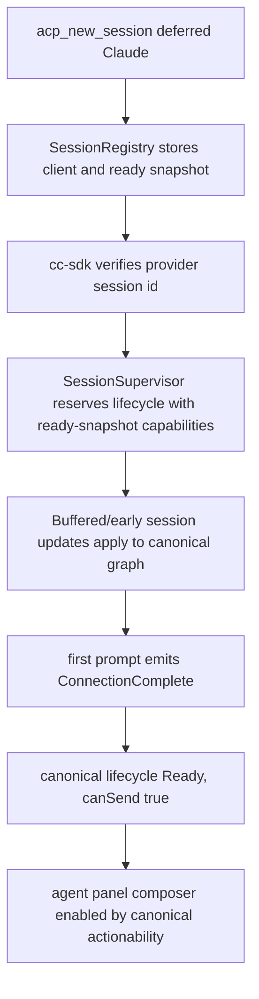

# fix: Repair deferred agent panel send readiness

## Overview

Fix the Claude Code deferred-session path where a panel can stream tool calls but stay stuck in a non-ready lifecycle, disabling follow-up sends. Also fix the pending user bubble ordering so the sent prompt remains above tool calls when tool deltas race ahead of the canonical user transcript entry.

## Problem Frame

Live Tauri MCP debugging showed a Claude Code session receiving tool-call and turn-complete events while the frontend never observed a canonical `Ready` lifecycle for that session. Since `canSend` is canonical-owned, the UI correctly stayed disabled; the bug is that the Rust deferred-session path failed to establish and promote the canonical lifecycle at the right seam. The same race exposed a UI ordering defect: pending user rows are appended after canonical entries, so early tool-call rows can appear above the user's prompt.

## Requirements Trace

- R1. Deferred Claude Code sessions must create or promote backend lifecycle authority before session updates are applied.
- R2. A successful first prompt for a reserved deferred session must emit a canonical ready lifecycle with real capabilities, making `actionability.canSend` true through canonical selectors only.
- R3. Session-state graph updates must not be dropped because they arrive before a lifecycle checkpoint exists.
- R4. Pending optimistic user rows must render before same-turn tool-call rows when the canonical user entry has not arrived yet.
- R5. No frontend hot-state fallback may be added for lifecycle, turn state, activity, capabilities, or `canSend`.
- R6. Non-deferred sessions must retain their current open/reserve behavior.

## Scope Boundaries

- No visual redesign of the agent panel.
- No new dual-read fallback in TypeScript for sendability or lifecycle.
- No broad transcript authority migration beyond the ordering guard needed for this bug.
- No multi-send queue behavior; existing one-in-flight send semantics remain.

## Context & Research

### Relevant Code and Patterns

- `packages/desktop/src-tauri/src/acp/commands/session_commands.rs` creates sessions and skips the normal reserve path when `provider_uses_deferred_creation` is true.
- `packages/desktop/src-tauri/src/acp/client/cc_sdk_client.rs` promotes verified pending Claude creation attempts and currently reserves promoted sessions with empty capabilities.
- `packages/desktop/src-tauri/src/acp/commands/interaction_commands.rs` emits `ConnectionComplete` for reserved first-send activation, but currently uses default models/modes.
- `packages/desktop/src-tauri/src/acp/session_state_engine/runtime_registry.rs` intentionally skips graph updates when no lifecycle checkpoint exists.
- `packages/desktop/src-tauri/src/acp/lifecycle/supervisor.rs` owns lifecycle checkpoints and actionability authority.
- `packages/desktop/src/lib/acp/session-state/agent-panel-graph-materializer.ts` and `packages/desktop/src/lib/acp/components/agent-panel/logic/agent-panel-display-model.ts` currently append pending user rows at the tail.
- `packages/desktop/src/lib/acp/session-state/__tests__/agent-panel-graph-materializer.test.ts` and `packages/desktop/src/lib/acp/components/agent-panel/logic/__tests__/agent-panel-display-model.test.ts` provide pure test seams for ordering.

### Institutional Learnings

- `docs/brainstorms/2026-04-25-final-god-architecture-requirements.md`: lifecycle, activity, capabilities, and send enablement derive only from canonical selectors.
- `docs/plans/2026-05-03-002-refactor-canonical-entries-optimistic-user-bubble-plan.md`: optimistic user bubbles are local presentation overlays and must disappear when canonical transcript catches up.
- `docs/plans/2026-05-06-002-refactor-canonical-transcript-event-authority-plan.md`: raw session updates may not become transcript or lifecycle authority.

## Key Technical Decisions

- Fix lifecycle upstream in Rust, not by adding TypeScript fallback sendability.
- Preserve the existing deferred Claude creation integrity check: provider identity must be verified before persistent promotion.
- Reserve the supervisor checkpoint at the promotion seam with real capabilities from the deferred new-session response.
- Emit reserved-first-send `ConnectionComplete` with supervisor checkpoint capabilities, not default empty models/modes or a second registry read.
- Insert pending user rows at the current-turn boundary before tool/tool-call rows when no canonical leading user row exists.

## High-Level Technical Design

> This illustrates the intended approach and is directional guidance for review, not implementation specification. The implementing agent should treat it as context, not code to reproduce.

## Implementation Units

- [x] **Unit 1: Prove deferred lifecycle promotion**

**Goal:** Capture the missing lifecycle authority for promoted Claude deferred sessions before changing Rust behavior.

**Requirements:** R1, R2, R3, R5

**Dependencies:** None

**Files:**
- Modify/Test: `packages/desktop/src-tauri/src/acp/client/cc_sdk_client.rs`
- Test: `packages/desktop/src-tauri/src/acp/session_state_engine/runtime_registry.rs`

**Approach:**
- Add or adjust Rust tests around promoted Claude session reservation so the checkpoint carries the new-session capabilities.
- Add graph-update coverage showing updates are skipped without a checkpoint. The post-promotion drain proof belongs to Unit 2.

**Execution note:** Test-first; the first test should fail against the current missing/empty-capability lifecycle path.

**Test scenarios:**
- Happy path: promoted Claude deferred session gets a `Reserved` supervisor checkpoint.
- Happy path: the checkpoint capabilities preserve the ready snapshot models/modes.
- Edge case: a duplicate promotion for an already reserved session remains idempotent when lifecycle is still `Reserved`.
- Error path: a promotion encountering a non-Reserved checkpoint still fails loudly.

**Verification:**
- Deferred-session lifecycle tests prove a canonical checkpoint exists before graph updates need it.

- [x] **Unit 2: Promote deferred sessions with canonical capabilities**

**Goal:** Make the Rust deferred Claude path reserve lifecycle authority with real capabilities at the provider identity promotion seam.

**Requirements:** R1, R2, R3, R5, R6

**Dependencies:** Unit 1

**Files:**
- Modify: `packages/desktop/src-tauri/src/acp/client/cc_sdk_client.rs`
- Modify as needed: `packages/desktop/src-tauri/src/acp/commands/session_commands.rs`
- Test: `packages/desktop/src-tauri/src/acp/client/cc_sdk_client.rs`

**Approach:**
- Reuse the ready snapshot cached from `NewSessionResponse` at the promotion seam instead of inventing frontend state.
- Thread `SessionRegistry` access through the existing `AppHandle` state lookup in the Claude promotion path.
- Keep non-deferred `reserve_with_capabilities` flow unchanged.
- Ensure pending creation buffering drains only after promotion has a lifecycle checkpoint.

**Patterns to follow:**
- Existing `reserve_promoted_claude_session` integrity guard.
- Existing `SessionGraphCapabilities` conversion from model/mode/command/config data.

**Test scenarios:**
- Happy path: deferred Claude promotion reserves the session and preserves model/mode capabilities.
- Integration: buffered pending updates dispatch after lifecycle reservation and can apply to the graph.
- Regression: non-deferred provider creation still follows the existing `provider_uses_deferred_creation == false` path.

**Verification:**
- A promoted deferred session has canonical lifecycle state and is eligible for reserved-first-send activation.

- [x] **Unit 3: Emit ready lifecycle with cached capabilities**

**Goal:** Ensure the reserved first-send activation event materializes `Ready` with complete capabilities so frontend connection waiters and `canSend` resolve canonically.

**Requirements:** R2, R5

**Dependencies:** Unit 2

**Files:**
- Modify: `packages/desktop/src-tauri/src/acp/commands/interaction_commands.rs`
- Test: Rust command/session tests covering `send_prompt_with_app_handle`
- Test: `packages/desktop/src/lib/acp/store/__tests__/session-event-service-streaming.vitest.ts` if frontend waiter coverage needs a regression guard

**Approach:**
- Build `ConnectionComplete` from the current supervisor checkpoint capabilities for the session when available.
- Fall back to defaults only as a logged degraded path, not as normal deferred behavior.
- Preserve canonical-only sendability in TypeScript.

**Test scenarios:**
- Happy path: reserved deferred first send emits `ConnectionComplete` with supervisor checkpoint models/modes.
- Edge case: missing ready snapshot still produces an explicit degraded path without crashing.
- Integration: frontend materialization waiter resolves when ready lifecycle includes models/modes.
- Regression: non-deferred reserved-first-send behavior remains unchanged where no deferred checkpoint capabilities are involved.

**Verification:**
- `lifecycle.status === Ready` and `actionability.canSend === true` are produced from canonical envelopes after the first successful send.

- [x] **Unit 4: Anchor pending user rows before tool calls**

**Goal:** Prevent early tool-call deltas from appearing above the pending user prompt in the agent panel.

**Requirements:** R4, R5

**Dependencies:** None

**Files:**
- Modify: `packages/desktop/src/lib/acp/session-state/agent-panel-graph-materializer.ts`
- Modify: `packages/desktop/src/lib/acp/components/agent-panel/logic/agent-panel-display-model.ts`
- Test: `packages/desktop/src/lib/acp/session-state/__tests__/agent-panel-graph-materializer.test.ts`
- Test: `packages/desktop/src/lib/acp/components/agent-panel/logic/__tests__/agent-panel-display-model.test.ts`

**Approach:**
- Replace tail append with a deterministic insertion helper that places a pending user row before tool/tool-call rows when no canonical user row for the active turn is present.
- Keep duplicate suppression delegated to the existing canonical-user detection path.
- Do not mutate canonical transcript entries; this remains a local display overlay.

**Test scenarios:**
- Happy path: graph with only tool-call rows plus pending user renders pending user first.
- Happy path: display model rows with tool rows plus pending user place pending user first.
- Edge case: when a canonical user row already exists, no duplicate pending row is rendered.
- Regression: graph-null pre-session pending still renders one user row.

**Verification:**
- The user's message stays visually above same-turn tool calls during first-send races.

## System-Wide Impact

- **Interaction graph:** Rust lifecycle supervisor, session registry, cc-sdk bridge promotion, session-update dispatch, frontend graph materializer, display model, and composer actionability are affected.
- **Error propagation:** Provider identity promotion failures remain fatal and explicit; missing capability snapshots should be logged/degraded rather than hidden by frontend defaults.
- **State lifecycle risks:** The main risk is creating a second lifecycle authority. The plan avoids this by reserving supervisor state and consuming canonical envelopes only.
- **API surface parity:** Non-deferred provider creation must keep its current lifecycle/open behavior.
- **Integration coverage:** Tests must span Rust lifecycle promotion plus frontend ordering; unit tests alone for UI ordering do not prove canonical readiness.
- **Unchanged invariants:** `canSend` remains canonical-owned; pending user rows remain local presentation overlays, not canonical transcript writes.

## Risks & Dependencies

| Risk | Mitigation |
|------|------------|
| Deferred promotion races with early stream updates | Reserve lifecycle at promotion before draining buffered updates; test the buffered path. |
| Ready event carries empty capabilities | Read cached ready snapshot in reserved-first-send `ConnectionComplete`; add regression coverage. |
| UI ordering fix creates duplicates | Keep existing canonical user detection and only change insertion position. |
| Non-deferred providers regress | Leave the existing non-deferred reserve path unchanged and cover with regression tests where practical. |

## Documentation / Operational Notes

- No user-facing documentation change is expected.
- If implementation discovers raw session updates are still required for visible lifecycle/actionability, stop and widen canonical instead of adding frontend fallback.

## Sources & References

- Origin document: `docs/brainstorms/2026-04-25-final-god-architecture-requirements.md`
- Origin document: `docs/brainstorms/2026-05-01-agent-panel-content-reliability-rewrite-requirements.md`
- Related plan: `docs/plans/2026-05-03-002-refactor-canonical-entries-optimistic-user-bubble-plan.md`
- Related plan: `docs/plans/2026-05-06-002-refactor-canonical-transcript-event-authority-plan.md`
- Related code: `packages/desktop/src-tauri/src/acp/client/cc_sdk_client.rs`
- Related code: `packages/desktop/src-tauri/src/acp/commands/interaction_commands.rs`
- Related code: `packages/desktop/src/lib/acp/session-state/agent-panel-graph-materializer.ts`
- Related code: `packages/desktop/src/lib/acp/components/agent-panel/logic/agent-panel-display-model.ts`
