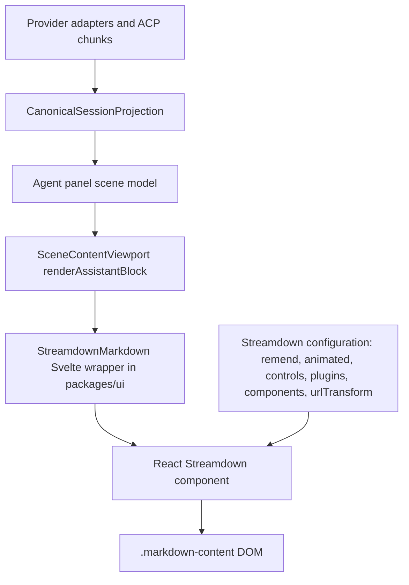
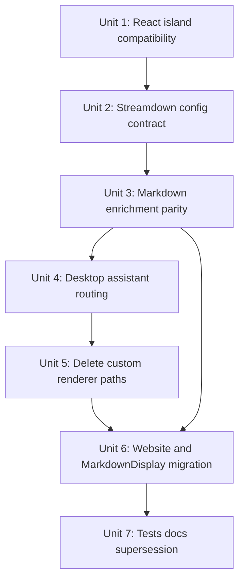

# refactor: Replace custom streaming markdown with Streamdown

## Overview

Acepe should stop maintaining a bespoke streaming markdown renderer and move assistant-message markdown presentation to Streamdown's configuration model. Streamdown becomes the markdown/streaming presentation authority; Acepe's provider adapters, canonical session graph, scene materialization, and viewport remain the text/state authority.

The plan supersedes the custom-renderer parts of `docs/plans/2026-05-09-002-refactor-streaming-token-stream-architecture-plan.md`. Keep that plan's canonical-authority direction where it protects GOD compliance, but replace the custom `markdown-it` word wrapping, bespoke partial-render gates, custom block parsing, and token reveal renderer with a Streamdown integration.

Because Streamdown 2.5.0 is React-based (`react`/`react-dom` peer dependencies) and Acepe is Svelte 5, the first implementation unit is a compatibility spike that proves a presentational React island can live inside `@acepe/ui` without store, Tauri, or desktop coupling. The spike has explicit pass/fail gates: Streamdown must mount, update, unmount, bundle, and render in DOM tests without console lifecycle errors, duplicate React instances, or Tauri/Node shims. If those gates fail, implementation pauses rather than recreating Streamdown in Svelte.

## Problem Frame

Acepe currently has several overlapping markdown and streaming presentation systems:

- `@acepe/ui` owns a custom `markdown-it` + Shiki renderer with an LRU cache and custom plugins.
- Desktop wraps that renderer in `markdown-text.svelte`, adding sync/async rendering, partial streaming gates, placeholder hydration, click handling, git status enrichment, and token-reveal CSS variables.
- Streaming markdown behavior still includes custom reveal state such as `tokenWordWrapPlugin`, `TokenRevealCss`, `isRenderingPartialText`, `{#key streamingHtml}`, and block extraction through `parseContentBlocks`.
- Active planning already identified custom reveal logic as fragile and slated for deletion, but that plan still replaces one custom renderer with another custom token-stream renderer.

The user request changes the target: replace the custom streaming logic with Streamdown's configuration model instead of continuing to deepen Acepe-owned markdown/reveal logic.

## Requirements Trace

- R1. Streamdown must replace Acepe's custom streaming markdown presentation for assistant text in the agent panel.
- R2. The replacement must preserve canonical state authority: provider/event ingestion, `CanonicalSessionProjection`, scene models, and display rows still decide what text exists and when rows are streaming.
- R3. The Streamdown integration must live behind presentational package boundaries: `packages/ui` may render markdown, but must not import desktop stores, Tauri APIs, or session services.
- R4. The current user-visible markdown feature set must either be preserved through Streamdown configuration/components or explicitly retired by product decision before merge.
- R5. Existing streaming animation modes must remain honored at the product boundary, especially instant/no-animation behavior.
- R6. Custom streaming/reveal paths must be removed in the same cutover; no long-lived dual markdown renderer or feature flag.
- R7. Website/demo rendering must keep working with the same shared UI renderer so `packages/website` continues to prove the view layer independently.
- R8. The replacement must stay safe for untrusted model output by preserving sanitization, URL handling, and external-link behavior.
- R9. Streaming visual quality must be accepted explicitly: smooth mode should remain progressive and calm, instant mode must not animate, settled history must not reanimate, streaming-to-settled handoff must not flash/reflow visibly, and partially complete markdown must not show raw syntax more aggressively than the current renderer.
- R10. All production markdown surfaces that currently depend on `renderMarkdownSync`, `renderMarkdown`, `TokenRevealCss`, `countWordsInMarkdown`, or `parseContentBlocks` must be migrated or intentionally retired before the old renderer is removed.

## Scope Boundaries

- In scope: assistant/user markdown rendering surfaces, Streamdown dependency/configuration, React island compatibility, Streamdown plugin/component mapping, deletion of Acepe-owned streaming markdown logic, related tests and docs.
- In scope: `packages/desktop`, `packages/ui`, and `packages/website` changes needed for one shared markdown presentation path.
- Out of scope: provider-side ACP chunk semantics, Rust canonical session envelope design, tool-call streaming visuals, viewport reliability rewrites unrelated to markdown presentation, and redesigning the visual theme of all markdown content.
- Out of scope: preserving the old `markdown-it` renderer as a fallback after the cutover.

## Markdown Feature Inventory

This inventory is the product gate for R4. Unit 3 may refine implementation details, but it must not discover these dispositions for the first time during deletion work.

| Current capability | Cutover disposition |
|---|---|
| Paragraphs, headings, lists, blockquotes, emphasis, inline code, links | Preserve through Streamdown default markdown/GFM support and component overrides where needed. |
| GFM tables and scrollable table styling | Preserve through Streamdown GFM/table controls with Acepe styling parity. |
| Fenced code blocks, syntax highlighting, copy controls, large-code fallback | Preserve through Streamdown code support or a custom code component. Copy feedback and accessible labels must match Acepe's current behavior or be intentionally replaced. |
| Mermaid fences | Preserve through Streamdown Mermaid with `securityLevel: "strict"` and `htmlLabels: false`; a placeholder is acceptable only as a loading/error state, not as a parity substitute. |
| File path badges and GitHub reference badges | Preserve as required-for-cutover. If Svelte badge reuse from React is not viable, use bounded React equivalents for these two badge types only. |
| Color badges and checkbox/task-list badges | Preserve or record an explicit retirement decision before Unit 5. Tests must cover the chosen disposition. |
| `pierre_file` / large file preview blocks from `parseContentBlocks` | Resolve before Unit 5. Choose one explicit path: Streamdown component override, pre-pass transform before Streamdown, or intentional degradation to standard code blocks recorded in Unit 7. |
| External links and file-opening interactions | Preserve with typed host callbacks plus independent protocol allowlist validation at click time. |
| Token word reveal spans, `TokenRevealCss`, and Acepe-owned animation span markup | Retire from production after Streamdown animation/static behavior is wired and canonical dependencies are resolved. |

## Context & Research

### Relevant Code and Patterns

- `packages/ui/src/lib/markdown/create-renderer.ts` defines the current renderer API: `renderMarkdown`, `renderMarkdownSync`, cache stats, async initialization, Shiki setup, and plugin application.
- `packages/ui/src/lib/markdown/plugins/registry.ts` wires custom plugins: fence handling, table wrapper, checkbox/color/file/GitHub badges, and token word wrapping.
- `packages/ui/src/lib/markdown/plugins/token-word-wrap.ts` is Acepe-owned streaming animation markup and should be removed or retired from production use.
- `packages/ui/src/components/markdown/markdown-display.svelte` is the shared website/demo markdown component and currently uses `$effect`-driven async rendering plus post-render Svelte badge mounting.
- `packages/desktop/src/lib/acp/components/messages/markdown-text.svelte` is the main desktop streaming markdown surface and currently owns rendering, partial-text gates, placeholder hydration, file/GitHub interactions, and token reveal CSS.
- `packages/desktop/src/lib/acp/components/agent-panel/components/scene-content-viewport.svelte` injects `renderAssistantBlock`; this is the correct controller-to-view seam for assistant text rendering.
- `packages/ui/src/components/agent-panel/types.ts` exposes presentational assistant rendering context, including `TokenRevealCss` and `AssistantRenderBlockContext`.
- `packages/desktop/src/lib/acp/store/session-store.svelte.ts` currently imports `countWordsInMarkdown` for canonical token-stream state. Deleting `token-word-wrap.ts` requires resolving this canonical dependency; it cannot be treated as a presentation-only cleanup.
- `packages/desktop/src/lib/acp/components/file-explorer-preview-pane.svelte` and `packages/desktop/src/lib/acp/components/pr-status-card.svelte` use markdown rendering outside assistant rows and must be included in the cutover.
- `packages/desktop/src/app.css` and `packages/website/src/routes/layout.css` already use Tailwind v4 `@source`; Streamdown requires additional `@source` entries for hoisted monorepo dependencies.

### Institutional Learnings

- `docs/solutions/architectural/final-god-architecture-2026-04-25.md`: provider adapter to canonical session graph to materialized UI DTOs is the only legal authority chain.
- `docs/solutions/architectural/canonical-projection-widening-2026-04-28.md`: do not add `canonical ?? hotState` fallbacks; widen canonical projection when a state field is truly canonical.
- `docs/solutions/best-practices/canonical-session-projection-ui-derivation-2026-05-01.md`: streaming text/reveal data must not move into transient hot state.
- `docs/solutions/ui-bugs/assistant-text-reveal-streaming-block.md`: `MarkdownText` must stay passive and must not own pacing, target text, remount recovery, or reveal lifecycle.
- `docs/solutions/best-practices/agent-panel-content-viewport-reactivity-renderer-2026-05-01.md`: the viewport is layout-only and must not become a reveal authority.
- `docs/solutions/best-practices/svelte5-unconditional-snippet-props-2026-04-12.md`: Svelte snippet props must remain unconditional, with conditions inside snippet bodies.

### External References

- Streamdown configuration docs: `https://streamdown.ai/docs/configuration`
- Streamdown getting-started docs: `https://streamdown.ai/docs/getting-started`
- Streamdown 2.5.0 package metadata: exports `Streamdown`, `createAnimatePlugin`, `defaultRehypePlugins`, `defaultRemarkPlugins`, `parseMarkdownIntoBlocks`, `defaultUrlTransform`, and React components/hooks; peer dependencies are `react` and `react-dom`.
- Streamdown configuration surfaces relevant to Acepe: `mode`, `parseIncompleteMarkdown`, `remend`, `animated`, `controls`, `components`, `plugins`, `shikiTheme`, `mermaid`, `allowedElements`/`disallowedElements`, `allowElement`, `urlTransform`, `linkSafety`, `allowedTags`, `literalTagContent`, `translations`, and `prefix`.
- Streamdown defaults include `remark-gfm`, `rehype-raw`, `rehype-sanitize`, and `rehype-harden`; math and CJK require optional plugins.

## Key Technical Decisions

| Decision | Rationale |
|---|---|
| Use a React island inside `@acepe/ui` as the primary Streamdown integration strategy. | Streamdown's public API is React-based. A wrapper keeps Acepe from reimplementing Streamdown and preserves the user request. |
| Keep canonical session/scene state as the only text authority. | Streamdown should render the string it is given; it must not ingest raw ACP chunks or become a session lifecycle system. |
| Replace `markdown-it` production rendering rather than wrapping Streamdown around generated HTML. | Wrapping Streamdown around Acepe-rendered HTML would preserve most custom logic and fail the core request. |
| Map Acepe enrichments to Streamdown `components`, `plugins`, `controls`, `urlTransform`, and `linkSafety`. | These are the supported Streamdown configuration seams and match its react-markdown-compatible API. |
| Prefer Streamdown `animated`/`createAnimatePlugin` over Acepe `tokenWordWrapPlugin`. | Animation should come from Streamdown's streaming support, not Acepe's bespoke word-span system. |
| Preserve `.markdown-content` as a stable wrapper class for this cutover. | Existing prose CSS and thinking viewport follow code depend on this selector; changing that selector is a separate refactor, not an implicit follow-up. |
| Import Streamdown CSS from app shells, not the shared wrapper. | `@acepe/ui` should avoid global CSS side effects; desktop and website own global CSS imports and Tailwind `@source` entries. |
| Use one React root per mounted markdown component during the spike, with a performance gate. | This is the smallest Svelte/React interop shape. Virtualization bounds live rows, but Unit 1/4 must prove 50 settled messages stay within acceptable render/scroll behavior before deletion. |
| Hard cutover after compatibility and parity tests pass. | A long-lived dual renderer would keep the current complexity and split authority alive. |

## Open Questions

### Resolved During Planning

- Should the plan proceed without user input on React/Svelte integration? Yes. Autopilot selected the conservative path: prove a React island first, then cut over if viable.
- Should Streamdown replace canonical streaming state? No. Streamdown replaces markdown/streaming presentation only. Canonical graph state remains Acepe-owned.
- Should the active token-stream architecture plan remain authoritative? Only for canonical-authority constraints. Its custom renderer/reveal units are superseded by this plan.

### Deferred to Implementation

- Exact React root lifecycle details in Svelte: validate during the compatibility spike against Svelte 5 lifecycle constraints and cleanup behavior.
- Exact Streamdown component overrides for Acepe file/GitHub/color badges: choose the smallest configuration/plugin surface after testing Streamdown's AST/component behavior with Acepe markdown fixtures, bounded by the feature inventory above.
- Exact replacement for `renderMarkdownSync` cache semantics: determine whether Streamdown render cost makes the old cache unnecessary or whether block-level memoization is needed around the React island.

## High-Level Technical Design

> This illustrates the intended approach and is directional guidance for review, not implementation specification. The implementing agent should treat it as context, not code to reproduce.

The graph preserves Acepe's state authority and moves only markdown presentation into Streamdown.

## Implementation Units

- [ ] **Unit 1: Prove Streamdown React island compatibility**

**Goal:** Establish that Streamdown can be mounted from a Svelte 5 component in `@acepe/ui` without violating package boundaries or lifecycle cleanup.

**Requirements:** R1, R3, R7, R8

**Dependencies:** None

**Files:**
- Modify: `packages/ui/package.json`
- Modify: `packages/ui/tsconfig.json`
- Modify: `packages/desktop/package.json`
- Modify: `packages/website/package.json`
- Modify: `package.json`
- Modify: `bun.lock`
- Modify: `packages/desktop/vite.config.js`
- Modify: `packages/website/vite.config.ts`
- Modify: `packages/desktop/src/app.css`
- Modify: `packages/website/src/routes/layout.css`
- Create: `packages/ui/src/components/streamdown-markdown/streamdown-markdown.svelte`
- Create: `packages/ui/src/components/streamdown-markdown/index.ts`
- Create or modify: `packages/ui/vitest.config.ts`
- Test: `packages/ui/src/components/streamdown-markdown/streamdown-markdown.svelte.vitest.ts`

**Approach:**
- Add `streamdown` pinned exactly to `2.5.0` and align `react`/`react-dom` to one explicit major/version range across the workspace. Add a workspace resolution if needed to prevent duplicate React instances.
- Add the `@acepe/ui` export map entry `./streamdown-markdown` pointing to `./src/components/streamdown-markdown/index.ts`.
- Add JSX support for the React bridge (`jsx: "react-jsx"` and `jsxImportSource: "react"`) in `packages/ui/tsconfig.json`, and add React Vite plugin support to desktop/website if `.tsx` files require it in consumer bundling.
- Add Tailwind v4 `@source` entries for the actual hoisted `streamdown/dist/*.js` path in desktop and website CSS after `bun install` confirms the path. Verify generated CSS includes Streamdown control classes.
- Import `streamdown/styles.css` from desktop and website app shells, not from the shared `@acepe/ui` wrapper.
- Inspect `streamdown@2.5.0` `dist/index.d.ts` during the spike and verify the plan's named API assumptions (`Streamdown`, `createAnimatePlugin`, `defaultRehypePlugins`, `defaultRemarkPlugins`, `parseMarkdownIntoBlocks`, `defaultUrlTransform`) before Unit 2 depends on them.
- Build a presentational Svelte wrapper that accepts markdown text and a typed configuration object, mounts a React root into a local element, updates it when props change, and unmounts on destroy.
- Keep the wrapper free of Tauri, stores, session services, and desktop imports.
- Run the package audit after adding dependencies and resolve high/critical advisories before continuing.

**Execution note:** Start with a failing component test that mounts, updates content, and unmounts the wrapper.

**Patterns to follow:**
- `packages/ui/src/components/markdown/markdown-display.svelte` for shared UI packaging and wrapper exports.
- `packages/ui/package.json` export map conventions.
- `packages/desktop/src/app.css` and `packages/website/src/routes/layout.css` Tailwind `@source` patterns.

**Test scenarios:**
- Happy path: render markdown `# Hello\n\n- one` through the wrapper and assert heading/list content is visible.
- Happy path: update wrapper content from `first` to `second` and assert stale content is removed.
- Error path: unmount the wrapper and assert React cleanup leaves no duplicate rendered content or console errors from a second mount.
- Integration: render the wrapper with `mode="streaming"` and `parseIncompleteMarkdown=true` for an incomplete fence and assert it shows a stable partial block instead of raw broken markup.
- Integration: render a fixture of 50 settled markdown messages and verify no duplicate React roots, obvious scroll jank, or lifecycle warnings.
- Build/setup: verify exactly one React instance is bundled and Streamdown control styles are present in desktop and website CSS.
- Performance gate: record production bundle delta after adding Streamdown/React and after removing markdown-it/Shiki. If net compressed desktop JS grows by more than 250 KB after Unit 5, pause and evaluate tree-shaking, dynamic import, or abandoning the React-island strategy before merge.

**Verification:**
- PASS: Streamdown renders from a Svelte component in `@acepe/ui`, updates predictably, cleans up cleanly, bundles in desktop and website, runs DOM tests, and introduces no high/critical audit findings.
- FAIL and pause: React root cleanup fails, duplicate React instances appear, Streamdown cannot bundle without forbidden shims, DOM tests cannot run in `@acepe/ui`, or app-shell CSS cannot load Streamdown styles without global collisions.

- [ ] **Unit 2: Define Acepe's Streamdown configuration contract**

**Goal:** Replace implicit markdown renderer behavior with a typed Streamdown configuration that preserves Acepe's safety, styling, animation, and control decisions.

**Requirements:** R1, R3, R4, R5, R8

**Dependencies:** Unit 1

**Files:**
- Create: `packages/ui/src/components/streamdown-markdown/streamdown-config.ts`
- Modify: `packages/ui/src/components/streamdown-markdown/streamdown-markdown.svelte`
- Modify: `packages/ui/src/components/markdown/markdown-prose.css`
- Create: `packages/ui/src/components/streamdown-markdown/security-regression.svelte.vitest.ts`
- Test: `packages/ui/src/components/streamdown-markdown/streamdown-config.test.ts`

**Approach:**
- Define a narrow Acepe-facing config type instead of passing all Streamdown props through every caller.
- Map Acepe modes to Streamdown:
  - active stream: `mode="streaming"`, `parseIncompleteMarkdown=true`, `remend` enabled by default.
  - settled history: `mode="static"`, `parseIncompleteMarkdown=false`.
  - instant mode: disable Streamdown animation while preserving markdown parsing.
- Add an explicit mode table for every current `StreamingAnimationMode` value and its Streamdown equivalent. If Streamdown cannot represent a mode, record an explicit product decision before Unit 4.
- Document `remend`'s user-visible effect: it completes incomplete streaming markdown constructs to keep partial content readable. Tests must prove this does not create a visible settle jump for common partial links/code fences.
- Use Streamdown defaults for GFM and sanitization as the minimum security posture. Start with no custom `allowedTags`, `allowedElements`, or `literalTagContent`; any relaxation requires a security note and regression test.
- When adding custom plugins, compose with `defaultRehypePlugins`/`defaultRemarkPlugins` rather than replacing Streamdown's sanitization and hardening defaults.
- Configure `urlTransform` and/or `linkSafety` so external links keep Acepe's safe-open behavior and unsafe protocols remain blocked. The host click callback must repeat protocol validation before calling native open APIs.
- Configure `controls` for code, table, and Mermaid controls only when they match or intentionally replace existing Acepe controls.
- Preserve `.markdown-content` on the outer wrapper so existing CSS and viewport-follow selectors continue to work during the cutover.
- Map active Acepe theme to Streamdown `shikiTheme` as a reactive prop; theme switching must update code-block colors without remounting the whole wrapper.

**Patterns to follow:**
- `packages/ui/src/components/agent-panel/types.ts` for presentational type ownership.
- Streamdown docs for `remend`, `controls`, `allowedElements`, `urlTransform`, `animated`, `mode`, and plugin options.

**Test scenarios:**
- Happy path: streaming config enables incomplete markdown parsing and remend defaults for partial links/code fences.
- Happy path: settled config uses static mode and does not report active animation.
- Edge case: instant mode disables animation without disabling markdown formatting.
- Edge case: streaming-to-settled handoff with remend does not visibly flash, reflow, or reanimate the whole message.
- Error path: unsafe URL input is transformed/rejected according to Streamdown safe URL handling and rejected again by the host callback.
- Security regression: `<script>`, event attributes, `javascript:`, `data:`, `file:`, `blob:`, raw `<iframe>`, and SVG script payloads are absent from rendered output or blocked before native open.

**Verification:**
- Callers can choose streaming/static and animation behavior through Acepe's wrapper type without knowing Streamdown's full prop surface.

- [ ] **Unit 3: Port Acepe markdown enrichments to Streamdown seams**

**Goal:** Preserve current markdown capabilities by moving custom renderer plugins and post-render hydration into Streamdown-compatible components/plugins.

**Requirements:** R4, R7, R8

**Dependencies:** Unit 2

**Files:**
- Modify: `packages/ui/src/components/streamdown-markdown/streamdown-config.ts`
- Create: `packages/ui/src/components/streamdown-markdown/streamdown-components.tsx`
- Create: `packages/ui/src/components/streamdown-markdown/streamdown-plugins.ts`
- Modify: `packages/ui/src/components/file-path-badge/file-path-badge.svelte`
- Modify: `packages/ui/src/components/github-badge/github-badge.svelte`
- Test: `packages/ui/src/components/streamdown-markdown/streamdown-components.svelte.vitest.ts`
- Test: `packages/ui/src/components/streamdown-markdown/streamdown-markdown.svelte.vitest.ts`

**Approach:**
- Apply the Markdown Feature Inventory above as the starting disposition; Unit 3 verifies and implements, not discovers, the product set.
- Split implementation internally into required-for-cutover parity and enrichment parity:
  - Native Streamdown support: GFM tables, basic code blocks, safe HTML sanitization.
  - Streamdown component override: code blocks, tables, links, inline code, images if needed.
  - Required custom parity: file path badges, GitHub refs, external-link callbacks, code controls, Mermaid security/loading/error states, and `pierre_file` disposition.
  - Enrichment parity or explicit retirement: color badges and checkbox/task-list badges.
- Prefer Streamdown `components` for React-rendered replacements and small remark/rehype transforms for tokenization.
- Avoid imperative Svelte `mount()` placeholder hydration in the new path. If Svelte badge components cannot be reused from React, introduce bounded presentational React equivalents only for required badge types and document whether they are transitional or permanent.
- Preserve Shiki/theming via Streamdown `shikiTheme` or `plugins.code` if it meets current code-block requirements.
- Configure Mermaid through Streamdown `mermaid` and `controls.mermaid` instead of `parseContentBlocks`; use `securityLevel: "strict"` and `htmlLabels: false`.
- Define Mermaid loading/error UX: labelled loading skeleton while rendering, and styled parse error with raw source in a collapsible details block.
- Define `pierre_file` behavior explicitly before Unit 5: Streamdown override, pre-pass transform, or intentional degradation to standard code blocks.
- `streamdown-components.tsx` must not use `dangerouslySetInnerHTML`; model-controlled content must flow through React props/children.
- `literalTagContent`, if used, may only target Acepe-authored tags produced by Acepe plugins, never model-authored raw HTML tags.
- Pause before Unit 5 if any required-for-cutover capability cannot be mapped to Streamdown without rebuilding the old renderer.

**Execution note:** Characterize parity before deleting old plugins.

**Patterns to follow:**
- Current plugin behavior in `packages/ui/src/lib/markdown/plugins/*.ts`.
- Current badge components under `packages/ui/src/components/file-path-badge/` and `packages/ui/src/components/github-badge/`.
- Streamdown `components`, `plugins`, `controls`, `allowedTags`, and `literalTagContent` APIs.

**Test scenarios:**
- Happy path: fenced code renders highlighted code and copy controls with Acepe styling.
- Happy path: GFM table renders scrollably and table controls match the selected Streamdown controls config.
- Happy path: file paths and GitHub references render as styled badges or accepted equivalent links.
- Happy path: inline color token renders as a styled color badge or a documented equivalent.
- Happy path: GFM task list / checkbox renders as an interactive or styled checkbox badge consistent with the chosen disposition.
- Happy path: Mermaid fence renders through Streamdown's Mermaid path; loading and parse-error states are styled and accessible.
- Happy path: `pierre_file` / large file preview input follows the chosen disposition.
- Accessibility: file/GitHub badge controls are keyboard reachable with appropriate roles/labels; code copy controls have accessible labels and visible focus; table scroll containers are identifiable to assistive technology.
- Edge case: large code block does not freeze the UI and still has a safe fallback/presentation.
- Error path: raw HTML from model output is sanitized and does not execute scripts or event handlers.
- Error path: Mermaid HTML labels or script payloads render as escaped/sanitized content, not executable HTML.
- Integration: markdown containing a heading, list, table, code fence, file path, GitHub ref, color token, and external link renders without falling back to raw text.

**Verification:**
- Acepe's current markdown fixture set has a Streamdown-backed equivalent, and any intentional visual/feature changes are documented before deletion.

- [ ] **Unit 4: Route desktop assistant text through Streamdown**

**Goal:** Replace desktop assistant markdown rendering with the shared Streamdown wrapper at the scene/controller seam.

**Requirements:** R1, R2, R3, R5, R6

**Dependencies:** Units 1, 2, 3

**Files:**
- Modify: `packages/desktop/src/lib/acp/components/agent-panel/components/scene-content-viewport.svelte`
- Modify: `packages/desktop/src/lib/acp/components/messages/content-block-router.svelte`
- Modify: `packages/desktop/src/lib/acp/components/messages/acp-block-types/text-block.svelte`
- Modify: `packages/desktop/src/lib/acp/components/messages/markdown-text.svelte`
- Modify: `packages/desktop/src/lib/acp/components/file-explorer-preview-pane.svelte`
- Modify: `packages/desktop/src/lib/acp/components/pr-status-card.svelte`
- Modify: `packages/ui/src/components/agent-panel/types.ts`
- Test: `packages/desktop/src/lib/acp/components/agent-panel/components/__tests__/scene-content-viewport-streaming-regression.svelte.vitest.ts`
- Test: `packages/desktop/src/lib/acp/components/messages/markdown-text-streamdown.svelte.vitest.ts`

**Approach:**
- Keep `scene-content-viewport.svelte` as the injected rendering seam, but swap the text block renderer to the Streamdown wrapper.
- Derive Streamdown mode from existing scene context: active assistant text gets streaming mode; historical/settled text gets static mode.
- Preserve the user streaming animation setting by mapping `StreamingAnimationMode` to Streamdown `animated` config. Instant mode disables animation.
- Keep link opening and file opening behavior in typed host-provided callbacks or presentational props, not inside `@acepe/ui` store imports. The callback contract must classify at least external, file/path, and anchor links.
- Validate hrefs at click time with a strict allowlist before native open calls: only `http:` and `https:` may call `openUrl`; unsafe protocols emit a warning and do not call native APIs.
- Ensure Streamdown receives exactly the text already selected by the scene/model path. Do not subscribe to raw streaming stores or chunk aggregators in the renderer.
- Decide the replacement for progressive content-group visibility currently driven by `tokenRevealCss.revealedCharCount` in `agent-assistant-message-visible-groups.ts`. Preserve it with a scene-derived signal or document intentional retirement before removing `TokenRevealCss`.

**Patterns to follow:**
- `renderAssistantBlock` snippet in `packages/desktop/src/lib/acp/components/agent-panel/components/scene-content-viewport.svelte`.
- `AssistantRenderBlockContext` in `packages/ui/src/components/agent-panel/types.ts`.
- Existing `ContentBlockRouter` prop forwarding pattern.

**Test scenarios:**
- Happy path: active assistant text renders through Streamdown in streaming mode.
- Happy path: completed assistant history renders through Streamdown in static mode with no active animation.
- Edge case: switching from streaming to completed does not duplicate text, remount an unrelated row, or reanimate the whole message.
- Edge case: streaming-to-completed transition shows no visible flash, one-frame blank, or major content reflow.
- Edge case: instant mode shows the latest streamed content without Streamdown animation.
- Edge case: tokens arriving at a realistic streaming cadence render progressively without exposing raw markdown syntax more aggressively than the current renderer.
- Error path: Streamdown render failure falls back to a non-empty, accessible raw-markdown fallback block and logs through the existing desktop logger pattern.
- Error path: `javascript:`, `file:`, `vbscript:`, `data:`, and `blob:` hrefs do not call `openUrl`.
- Integration: viewport renders user, assistant, tool, and thinking rows while assistant text uses Streamdown and viewport layout remains stable.

**Verification:**
- Desktop assistant rows no longer depend on the old markdown renderer for normal text display.

- [ ] **Unit 5: Remove custom streaming markdown renderer paths**

**Goal:** Delete the obsolete custom markdown/reveal logic after Streamdown is the production rendering path.

**Requirements:** R1, R6

**Dependencies:** Units 3 and 4

**Files:**
- Delete or retire from production: `packages/ui/src/lib/markdown/plugins/token-word-wrap.ts`
- Modify: `packages/ui/src/lib/markdown/plugins/registry.ts`
- Modify: `packages/ui/src/lib/markdown/create-renderer.ts`
- Modify: `packages/ui/src/lib/markdown/index.ts`
- Modify: `packages/desktop/src/lib/acp/utils/markdown-renderer.ts`
- Modify: `packages/desktop/src/lib/acp/store/session-store.svelte.ts`
- Modify: `packages/desktop/src/lib/acp/components/agent-panel/components/agent-panel.svelte`
- Modify: `packages/desktop/src/lib/acp/components/agent-panel/logic/virtualized-entry-display.ts`
- Modify: `packages/desktop/src/lib/acp/components/agent-panel/logic/agent-panel-display-model.ts`
- Modify: `packages/desktop/src/lib/acp/components/agent-panel/logic/desktop-agent-panel-scene.ts`
- Modify: `packages/desktop/src/lib/acp/components/agent-panel/logic/backfill-scene-entry-timestamps.ts`
- Modify: `packages/ui/src/components/agent-panel/agent-assistant-message.svelte`
- Modify: `packages/ui/src/components/agent-panel/agent-assistant-message-visible-groups.ts`
- Modify: `packages/desktop/src/lib/acp/components/debug-panel/streaming-repro-token-reveal.ts`
- Modify: `packages/desktop/src/lib/acp/components/debug-panel/streaming-repro-graph-fixtures.ts`
- Modify: `packages/desktop/src/lib/acp/components/messages/markdown-text.svelte`
- Modify: `packages/desktop/src/lib/acp/components/messages/logic/parse-content-blocks.ts`
- Modify: `packages/desktop/src/lib/acp/components/messages/logic/mount-file-badges.ts`
- Modify: `packages/desktop/src/lib/acp/components/messages/logic/mount-github-badges.ts`
- Modify: `packages/ui/src/components/markdown/markdown-display.svelte`
- Test: `packages/ui/src/lib/markdown/plugins/__tests__/token-word-wrap.test.ts`
- Test: `packages/desktop/src/lib/acp/utils/__tests__/markdown-renderer.test.ts`

**Approach:**
- Resolve the canonical `countWordsInMarkdown` dependency before deleting `token-word-wrap.ts`. Either move the word-count utility to a non-renderer helper that does not register markdown-it animation plugins, or remove/rework the canonical token-stream word-count fields under GOD review.
- Remove `tokenWordWrapPlugin`, `TokenRevealCss` production dependencies, and token-reveal CSS once Streamdown animation is active and progressive group visibility has a replacement or an explicit retirement decision.
- Remove `isRenderingPartialText`, `shouldDeferSettledRender`, streaming sync result branches, `{#key streamingHtml}`, and bespoke partial markdown paths.
- Remove `parseContentBlocks` only after Mermaid, `pierre_file`, file/GitHub badge, and special block behavior is represented through Streamdown or intentionally retired.
- Retire `createMarkdownRenderer` as a production renderer. Do not keep a compatibility shim; convert tests/tooling to Streamdown-backed equivalents before deletion.
- Remove markdown-it/Shiki dependencies from packages once no production or test imports remain.

**Execution note:** Use characterization tests from Units 3 and 4 as the safety net before deletion.

**Patterns to follow:**
- Deletion list from `docs/plans/2026-05-09-002-refactor-streaming-token-stream-architecture-plan.md`.
- `scripts/forbid-structural-tests.ts` rule: tests must assert behavior, not source strings.

**Test scenarios:**
- Happy path: no production assistant rendering path imports `renderMarkdownSync`, `renderMarkdown`, or `tokenWordWrapPlugin`.
- Happy path: old renderer tests are replaced by Streamdown behavior tests rather than source-structure assertions.
- Happy path: no production file imports `TokenRevealCss`, `countWordsInMarkdown`, `renderMarkdownSync`, or `renderMarkdown` unless explicitly retained as a non-renderer utility with documented ownership.
- Edge case: long historical markdown message renders without the old async renderer/cache path.
- Integration: desktop and website both use the same Streamdown-backed shared renderer.
- Performance gate: final production bundle size satisfies the Unit 1 delta threshold after old renderer dependencies are removed.

**Verification:**
- There is one production markdown presentation path for assistant/user text, and it is Streamdown-backed.

- [ ] **Unit 6: Migrate shared website and MarkdownDisplay usage**

**Goal:** Ensure every shared markdown surface that demonstrated the old renderer now demonstrates the Streamdown renderer.

**Requirements:** R1, R3, R7

**Dependencies:** Units 1, 2, 3, 4, 5

**Files:**
- Modify: `packages/ui/src/components/markdown/markdown-display.svelte`
- Modify: `packages/ui/src/components/markdown/index.ts`
- Modify: `packages/website/src/lib/markdown-renderer.ts`
- Modify: `packages/website/src/routes/layout.css`
- Test: `packages/website/src/lib/markdown-renderer.test.ts`
- Test: `packages/ui/src/components/markdown/markdown-display.svelte.vitest.ts`

**Approach:**
- Make `MarkdownDisplay` render through the same Streamdown wrapper used by agent-panel text.
- Remove website's standalone markdown renderer instance.
- Keep website mock/demo inputs representative of desktop behavior, including streaming/static variants where the website showcases agent-panel components.
- Ensure Tailwind `@source` includes Streamdown's compiled files from the monorepo root.
- Do not leave `markdown-display.svelte` in an intermediate broken state: if Unit 5 touches it, the Streamdown wiring must be complete in the same unit or Unit 6 must be merged atomically with Unit 5.

**Patterns to follow:**
- Website's existing use of `@acepe/ui` components as package-boundary proof.
- `packages/website/src/routes/layout.css` Tailwind source pattern.

**Test scenarios:**
- Happy path: website markdown fixtures render with Streamdown-backed output.
- Edge case: website render does not require Tauri, desktop stores, or project paths.
- Integration: `AgentAssistantMessage` website demo renders assistant markdown through the same shared wrapper as desktop.

**Verification:**
- `packages/website` remains an independent proof that the shared view layer works without desktop runtime dependencies.

- [ ] **Unit 7: Update tests, docs, and supersession notes**

**Goal:** Lock the cutover down with behavior tests, package checks, and durable documentation that explains Streamdown as the new renderer boundary.

**Requirements:** R1 through R8

**Dependencies:** Units 1 through 6

**Files:**
- Modify: `docs/plans/2026-05-09-002-refactor-streaming-token-stream-architecture-plan.md`
- Create: `docs/solutions/architectural/streamdown-renderer-boundary.md`
- Create: `packages/ui/src/components/agent-panel/agent-panel-architecture.test.ts`
- Modify: `packages/desktop/src/lib/acp/components/agent-panel/components/__tests__/scene-content-viewport-streaming-regression.svelte.vitest.ts`
- Modify: `packages/desktop/src/lib/acp/store/__tests__/session-store-token-stream.vitest.ts`

**Approach:**
- Mark the old active token-stream plan as superseded for renderer/reveal implementation, while preserving canonical state lessons if still relevant.
- Add a solution note documenting the new boundary: canonical graph owns text state; Streamdown owns markdown presentation; Svelte wrapper owns React lifecycle only.
- Add architecture tests so `@acepe/ui` remains free of desktop/Tauri/store imports even with React and Streamdown dependencies. The test should allow `react`, `react-dom`, and `streamdown`, while rejecting `@tauri-apps/*`, desktop `$lib/acp/store/*`, and desktop-specific paths.
- Adjust token-stream tests only if `TokenRevealCss` or token-specific state is removed from the production contract.
- Ensure no tests rely on old `markdown-it` HTML details except where a user-visible behavior still requires equivalent output.

**Test scenarios:**
- Happy path: architecture test permits Streamdown/React in `@acepe/ui` but still rejects desktop/Tauri/store imports.
- Happy path: session streaming tests prove text still flows through canonical scene state before reaching Streamdown.
- Edge case: cold restored completed history renders static Streamdown output and does not start streaming animation.
- Integration: root test suites cover `packages/ui`, `packages/desktop`, and `packages/website` with the new renderer.

**Verification:**
- The repository documents Streamdown as the single markdown presentation path and tests protect the state/rendering boundary.

## Implementation Unit Dependency Graph

## System-Wide Impact

- **Interaction graph:** Provider adapters, canonical projection, scene materializer, and viewport continue to feed text to the UI. Streamdown replaces only the markdown presentation layer.
- **Error propagation:** Streamdown render failures should surface as a non-empty fallback block that shows raw markdown text with whitespace preservation, wrapping, accessible error copy, and a desktop logger event where the host owns logging. `@acepe/ui` should not silently swallow errors or render an empty row.
- **State lifecycle risks:** React root lifecycle must be tied to Svelte component mount/update/destroy. A stale root across session switches would create duplicate rows or stale markdown.
- **API surface parity:** `@acepe/ui/markdown-display` and `@acepe/ui/agent-panel` should expose one Streamdown-backed path; desktop and website should not maintain separate renderer instances.
- **Integration coverage:** Cross-layer tests must prove canonical streaming text reaches Streamdown through the scene model, not through raw ACP events or hot state.
- **Unchanged invariants:** Streamdown does not become the owner of session state, scroll behavior, provider normalization, or viewport fallback decisions.

## Risks & Dependencies

| Risk | Mitigation |
|------|------------|
| Streamdown is React-based and may not mount cleanly in Svelte 5. | Unit 1 proves lifecycle, update, cleanup, and bundling before any deletion work. |
| React island increases bundle/runtime weight. | Measure bundle impact during implementation, remove old markdown-it/Shiki paths, and pause if the post-deletion compressed delta exceeds 250 KB. |
| Existing Acepe badge/code/Mermaid enrichments may not map 1:1 to Streamdown. | Unit 3 starts from the feature inventory and requires parity tests or explicit product decisions before deletion. |
| Tailwind misses Streamdown classes in desktop or website. | Add monorepo `@source` entries and test rendered controls/styles in both consumers. |
| Sanitization behavior changes. | Use Streamdown defaults plus explicit `urlTransform`, `linkSafety`, and XSS tests for model output. |
| React badge equivalents duplicate Svelte badge components. | Bound React equivalents to required markdown island adapters and document whether they are transitional or permanent in Unit 7. |
| Canonical token-stream fields become dead or broken after renderer cutover. | Resolve `countWordsInMarkdown`, `TokenRevealCss`, and progressive group visibility dependencies before deleting old renderer utilities. |
| Old and new renderers coexist accidentally. | Unit 5 is a hard deletion gate; no feature flag or long-lived fallback. |
| Streamdown animation conflicts with Acepe streaming modes. | Unit 2 maps modes centrally and Unit 4 tests smooth/instant behavior at assistant row level. |

## Documentation / Operational Notes

- Update the superseded active plan so future implementers do not continue building the custom token-stream renderer.
- Add a `docs/solutions/architectural/` note after implementation because this is a durable renderer-boundary decision.
- If the dev app is not running when UI QA is required, start it from `packages/desktop` with `bun run tauri`, then run the QA CLI pass.
- Expected verification during implementation: `bun run --cwd packages/ui test`, `bun run --cwd packages/desktop check:svelte`, `bun run --cwd packages/desktop test`, `bun run --cwd packages/website test`, and root `bun test` as scope warrants.

## Sources & References

- Related plan: `docs/plans/2026-05-09-002-refactor-streaming-token-stream-architecture-plan.md`
- Related requirements: `docs/brainstorms/2026-04-15-streaming-markdown-during-reveal-requirements.md`
- Related requirements: `docs/brainstorms/2026-04-14-streaming-animation-modes-requirements.md`
- Related requirements: `docs/brainstorms/2026-05-01-agent-panel-content-reliability-rewrite-requirements.md`
- Architecture learning: `docs/solutions/architectural/final-god-architecture-2026-04-25.md`
- Architecture learning: `docs/solutions/architectural/canonical-projection-widening-2026-04-28.md`
- Streamdown configuration docs: `https://streamdown.ai/docs/configuration`
- Streamdown getting-started docs: `https://streamdown.ai/docs/getting-started`
- Streamdown npm package: `streamdown@2.5.0`
