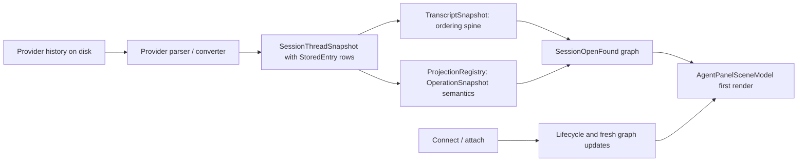

# fix: Resolve restored tool rows before connect

## Overview

Acepe currently can show restored transcript tool rows as orange `Unresolved tool` placeholders until the session connects and richer provider state arrives. The clean fix is to make the restored-open graph complete enough on the first render: every transcript tool row that should render as a tool must already have a matching canonical operation, and provider-internal rows like `report_intent` must not leak into the transcript as unresolved user-facing tools.

This plan fixes the restore boundary, not the Svelte renderer. The UI should continue to render `Unresolved tool` when canonical evidence is truly missing, because that is the honest degraded state.

Implementation update: the provider-agnostic root cause is in `acp_get_session_state`. A disk-open restore can seed runtime lifecycle only, then state lookup treats that runtime checkpoint as enough and skips provider-history projection import. The command still loads provider transcript fallback, so the frontend receives transcript tool rows without matching operations. Attach/resume later imports the projection, which is why the rows resolve only after connect.

## Problem Frame

The agent panel materializer uses transcript rows for ordering and canonical operations for tool semantics. A transcript tool row resolves only when `OperationSnapshot.source_link.kind === "transcript_linked"` and `source_link.entry_id` matches the transcript row `entryId`. If the restored-open payload contains transcript tool rows without matching operations, the first render shows fallback text such as `report_intent`, search query strings, or glob patterns as `Unresolved tool`. After connect, provider replay or a refreshed projection can add the real operations, which makes the same rows look correct later.

That connect-time repair is the problem. Restored-open should already be rich and canonical.

## Requirements Trace

- R1. Restored sessions must not show `Unresolved tool` for tool rows that have valid provider tool evidence on disk.
- R2. The first `SessionOpenFound` graph must contain transcript rows and operation snapshots with matching canonical join keys before attach/connect.
- R3. Provider-internal non-user-facing tool events, especially `report_intent`, must be filtered or represented outside the user transcript so they cannot become unresolved tool rows.
- R4. The fix must preserve the graph authority rule: transcript snapshots stay ordering-only, and rich tool semantics come from `OperationSnapshot`.
- R5. Connect/replay may update lifecycle and live state, but it must not be required to repair historical tool content.
- R6. Missing or unsafe canonical evidence must still render as explicit degraded state instead of being guessed by the UI.

## Scope Boundaries

- Do not add UI string parsing for `report_intent`, glob patterns, search queries, or tool names.
- Do not hydrate `OperationStore` from transcript rows.
- Do not fake joins by tool-call id, title, row position, or provider provenance key.
- Do not remove the `Unresolved tool` fallback; keep it for real missing-operation cases.
- Do not change live streaming tool rendering except where shared restore/projection code must stay consistent.

## Context & Research

### Relevant Code and Patterns

- `packages/desktop/src/lib/acp/session-state/agent-panel-graph-materializer.ts` builds a transcript-entry index from `operation.source_link.entry_id`; unmatched restored tool rows become `Unresolved tool`.
- `packages/desktop/src-tauri/src/acp/session_open_snapshot/mod.rs` builds `SessionOpenFound` from provider-owned history and already contains tests for provider snapshots and normalized transcript ids.
- `packages/desktop/src-tauri/src/acp/projections/mod.rs` owns `ProjectionRegistry::project_thread_snapshot`, operation source links, operation merge behavior, and provider snapshot import tests.
- `packages/desktop/src-tauri/src/acp/transcript_projection/snapshot.rs` owns `TranscriptSnapshot::from_stored_entries`, including tool row id normalization.
- `packages/desktop/src-tauri/src/acp/commands/session_commands.rs` restores transcript and projection state during resume/attach.
- `packages/desktop/src-tauri/src/copilot_history/parser.rs` already treats `report_intent` as an internal runtime tool in tests.
- `packages/desktop/src-tauri/src/codex_history/parser.rs` parses Codex rollout `function_call` and `function_call_output` records into `StoredEntry::ToolCall`.

### Institutional Learnings

- `docs/concepts/operations.md` says transcript rows are not operation authority; rich rendering must join through `source_link.kind === "transcript_linked"` plus matching `entry_id`.
- `docs/solutions/ui-bugs/agent-panel-graph-materialization-rendering-bug-2026-04-28.md` warns that relying on connect/replay to repair restored UI causes the exact minimal-to-rich flicker this issue shows.
- `docs/solutions/integration-issues/2026-04-30-cursor-acp-tool-call-id-normalization-and-enrichment-path.md` shows the same bug family: transcript row ids and operation source links must match in the initial open payload, not after attach refreshes state.
- `docs/solutions/logic-errors/operation-interaction-association-2026-04-07.md` warns not to reintroduce fallback joins by tool-call id, provenance key, title, or position.

### External References

- None. Local architecture and existing project learnings are enough for this fix.

## Key Technical Decisions

- Fix the Rust restore/projection boundary first: The initial graph is the source of truth for restored UI, so the provider-history import must emit aligned transcript and operation evidence before TypeScript renders.
- Add invariant tests before changing logic: The failure is easiest to pin by asserting that restored-open tool transcript rows either have a matching transcript-linked operation or are intentionally filtered.
- Keep the UI fallback strict: `Unresolved tool` should remain a real degraded state for missing canonical evidence. Making UI smarter would hide data bugs.
- Treat provider-internal tools as parser responsibility: Internal runtime events like `report_intent` should not become user-facing transcript tool rows unless the product explicitly decides to show them.
- Verify connect is content-inert for restored history: Attach may change lifecycle/capabilities, but it should not be the step that makes old tool rows understandable.

## Open Questions

### Resolved During Planning

- Should the fix be in Svelte or Rust? Rust. The Svelte materializer is doing the correct strict join and fallback behavior.
- Should unresolved rows be hidden? No. Real missing evidence should remain visible as degraded state.
- Should connect/replay be allowed to repair old tool rows? No. It may refresh graph state, but first restored-open content should already be correct.

### Deferred to Implementation

- Which provider path is the active reproducer for the pasted rows: The observed `report_intent` points toward Copilot history, while the search/glob-looking strings may come from Codex or Copilot tool arguments. Implementation should start by adding narrow fixtures for both likely paths and keep only the fixture that reproduces the failure.
- Whether the final change is parser filtering, id normalization, projection source-link correction, or resume ordering: The failing invariant test should identify the exact broken boundary.

## High-Level Technical Design

> *This illustrates the intended approach and is directional guidance for review, not implementation specification. The implementing agent should treat it as context, not code to reproduce.*

The first render should be complete because `D` and `E` agree on transcript tool row ids before `F` leaves Rust. `H` must not be required for historical tool rows to resolve.

## Implementation Units

- [ ] **Unit 1: Add restored-open resolution invariant tests**

**Goal:** Capture the bug before fixing it by proving restored-open creates unresolved tool rows when valid disk evidence exists.

**Requirements:** R1, R2, R3, R5

**Dependencies:** None

**Files:**
- Modify: `packages/desktop/src-tauri/src/acp/session_open_snapshot/mod.rs`
- Modify: `packages/desktop/src-tauri/src/acp/projections/mod.rs`
- Modify: `packages/desktop/src-tauri/src/copilot_history/parser.rs`
- Modify: `packages/desktop/src-tauri/src/codex_history/parser.rs`
- Test: `packages/desktop/src-tauri/src/acp/session_open_snapshot/mod.rs`
- Test: `packages/desktop/src-tauri/src/acp/projections/mod.rs`
- Test: `packages/desktop/src-tauri/src/copilot_history/parser.rs`
- Test: `packages/desktop/src-tauri/src/codex_history/parser.rs`
- Test: `packages/desktop/src/lib/acp/session-state/__tests__/agent-panel-graph-materializer.test.ts`

**Approach:**
- Add a small Rust test helper that checks every transcript tool row in `SessionOpenFound.transcript_snapshot.entries` has a matching operation whose `source_link` is `TranscriptLinked { entry_id }`, unless the row is intentionally filtered before transcript creation.
- Add a fixture based on the observed failure shape: an internal `report_intent` tool plus a real side-effectful/search-style tool with arguments that previously appeared as fallback subtitle text.
- Add a TypeScript materializer test that consumes a graph shaped like the fixed open payload and asserts no entry title is `Unresolved tool` for valid tool evidence.
- Keep the existing materializer test that verifies missing operations still render as `Unresolved tool`.

**Execution note:** Start test-first. The first failing test should prove the restored-open graph is missing or mismatching canonical operation evidence before connect.

**Patterns to follow:**
- Existing `provider_thread_snapshot_open_normalizes_tool_transcript_ids_to_match_operations` in `packages/desktop/src-tauri/src/acp/session_open_snapshot/mod.rs`.
- Existing `project_thread_snapshot_imports_operations_and_answered_questions` in `packages/desktop/src-tauri/src/acp/projections/mod.rs`.
- Existing `filters_internal_report_intent_but_preserves_side_effectful_tools` in `packages/desktop/src-tauri/src/copilot_history/parser.rs`.
- Existing missing-operation materializer coverage in `packages/desktop/src/lib/acp/session-state/__tests__/agent-panel-graph-materializer.test.ts`.

**Test scenarios:**
- Happy path: restored provider snapshot with a real search/read/execute tool -> transcript tool row has matching transcript-linked operation before connect.
- Happy path: restored graph materializes to a rich tool scene entry -> title is provider/tool-specific, not `Unresolved tool`.
- Edge case: internal `report_intent` start/complete events with no user-facing side effect -> no transcript tool row is emitted.
- Edge case: internal `report_intent` adjacent to a real tool -> real tool is preserved and linked.
- Error path: intentionally missing operation for a transcript tool row -> materializer still renders `Unresolved tool`.
- Integration: `SessionOpenFound` from provider snapshot -> `materializeAgentPanelSceneFromGraph` shows no unresolved row for valid disk evidence.

**Verification:**
- Failing tests identify the exact restore boundary causing the initial unresolved rows.
- Existing degraded fallback tests still pass.

- [ ] **Unit 2: Align provider history rows with canonical operation projection**

**Goal:** Ensure provider-owned history import emits one consistent identity for transcript rows and operation source links.

**Requirements:** R1, R2, R4, R6

**Dependencies:** Unit 1

**Files:**
- Modify: `packages/desktop/src-tauri/src/acp/projections/mod.rs`
- Modify: `packages/desktop/src-tauri/src/acp/transcript_projection/snapshot.rs`
- Modify: `packages/desktop/src-tauri/src/copilot_history/parser.rs`
- Modify: `packages/desktop/src-tauri/src/codex_history/parser.rs`
- Test: `packages/desktop/src-tauri/src/acp/projections/mod.rs`
- Test: `packages/desktop/src-tauri/src/acp/transcript_projection/snapshot.rs`
- Test: `packages/desktop/src-tauri/src/copilot_history/parser.rs`
- Test: `packages/desktop/src-tauri/src/codex_history/parser.rs`

**Approach:**
- Audit each provider parser that can produce the observed rows and verify `StoredEntry::ToolCall.id` is the transcript row id and `ToolCallData.id` is the provider tool-call id.
- Keep `ProjectionRegistry::project_thread_snapshot` linking operations to the `StoredEntry::ToolCall.id`, because that is what `TranscriptSnapshot::from_stored_entries` uses for row identity.
- Normalize ids only at provider/parser boundaries or through existing idempotent helpers, avoiding double normalization.
- Filter provider-internal tools before transcript/projection creation, not inside the UI materializer.
- If a parser currently converts a real tool into assistant text instead of `StoredEntry::ToolCall`, move that conversion back to a proper stored tool call so projection can create an operation.

**Patterns to follow:**
- `OperationSourceLink::transcript_linked` usage in `packages/desktop/src-tauri/src/acp/projections/mod.rs`.
- Tool row normalization test in `packages/desktop/src-tauri/src/acp/transcript_projection/snapshot.rs`.
- Cursor id-normalization learning in `docs/solutions/integration-issues/2026-04-30-cursor-acp-tool-call-id-normalization-and-enrichment-path.md`.

**Test scenarios:**
- Happy path: `StoredEntry::ToolCall.id` differs from `ToolCallData.id` -> operation `source_link.entry_id` matches the stored entry id.
- Happy path: Codex `function_call` followed by `function_call_output` -> one completed operation is projected with typed arguments/result.
- Edge case: provider id contains control characters or already-normalized escape text -> transcript row id and operation source link remain identical.
- Edge case: provider-internal tool appears between assistant chunks -> transcript ordering remains stable after filtering.
- Error path: unsafe or unclassifiable real tool evidence -> operation may degrade, but it still joins to its transcript row with an explicit degradation reason.

**Verification:**
- The Rust open/projection tests show no valid restored tool row is left without a transcript-linked operation.
- No TypeScript UI changes are needed to resolve valid restored tools.

- [ ] **Unit 3: Make resume/attach projection ordering content-safe**

**Goal:** Prevent attach from briefly publishing graph state that has transcript rows restored but projection operations not yet restored.

**Requirements:** R2, R5

**Dependencies:** Unit 2

**Files:**
- Modify: `packages/desktop/src-tauri/src/acp/commands/session_commands.rs`
- Modify: `packages/desktop/src-tauri/src/acp/session_state_engine/runtime_registry.rs`
- Test: `packages/desktop/src-tauri/src/acp/commands/session_commands.rs`
- Test: `packages/desktop/src-tauri/src/acp/session_state_engine/runtime_registry.rs`

**Approach:**
- Review the resume sequence around transcript restoration, projection restoration, open-token claim, and buffered event replay.
- Ensure provider projection is restored before any buffered session-state snapshot or connection materialization event can publish a graph for that session.
- Keep lifecycle restoration separate from content restoration: a detached/restored lifecycle can be replaced by connect state, but historical tool content should not downgrade during that transition.
- If event replay must happen before projection restore for another reason, add a guarded snapshot refresh after projection restore that includes both transcript and operations before the frontend connection waiter resolves.

**Patterns to follow:**
- Open-token reservation and replay handling in `packages/desktop/src-tauri/src/acp/session_open_snapshot/mod.rs`.
- Runtime snapshot construction in `packages/desktop/src-tauri/src/acp/session_state_engine/runtime_registry.rs`.

**Test scenarios:**
- Integration: resume with restored provider snapshot and buffered connection events -> first graph snapshot observed by the frontend contains operations for transcript tool rows.
- Edge case: projection restore succeeds but lifecycle connect event arrives quickly -> historical tool content stays resolved.
- Error path: provider snapshot is unavailable -> lifecycle failure/missing state is emitted without inventing tool operations.
- Regression: attach does not replace a rich restored operation with a sparse/missing operation patch.

**Verification:**
- Connection materialization cannot produce a "transcript-only, no operations" historical graph for restored sessions with valid provider evidence.

- [ ] **Unit 4: Add frontend guard coverage for first-render scene behavior**

**Goal:** Prove the graph-to-scene boundary renders restored tool evidence correctly before connect and keeps degraded fallback behavior for true missing evidence.

**Requirements:** R1, R4, R5, R6

**Dependencies:** Unit 2

**Files:**
- Modify: `packages/desktop/src/lib/acp/session-state/__tests__/agent-panel-graph-materializer.test.ts`
- Modify: `packages/desktop/src/lib/acp/store/__tests__/session-store-projection-state.vitest.ts`
- Modify: `packages/desktop/src/lib/acp/store/services/__tests__/session-open-hydrator.test.ts`
- Test: `packages/desktop/src/lib/acp/session-state/__tests__/agent-panel-graph-materializer.test.ts`
- Test: `packages/desktop/src/lib/acp/store/__tests__/session-store-projection-state.vitest.ts`
- Test: `packages/desktop/src/lib/acp/store/services/__tests__/session-open-hydrator.test.ts`

**Approach:**
- Add a scene materializer test using a restored graph with real operations for the observed tool shapes.
- Add a session-open hydrator/store test that applies a found result with operations and verifies the live graph consumer receives those operations exactly once.
- Add a projection-state regression where a later lifecycle/capabilities update does not remove or downgrade existing restored operations.
- Do not add UI fallback parsing; assertions should fail if operations are missing.

**Patterns to follow:**
- Existing materializer tests for missing operations, degraded operations, and valid unclassified operations.
- Existing session-open hydrator tests that assert operation payloads are preserved.

**Test scenarios:**
- Happy path: restored-open graph with valid operation -> scene entry title is resolved and `presentationState` is `resolved`.
- Happy path: valid unclassified operation -> named tool card renders without degraded warning styling.
- Edge case: lifecycle-only update after hydration -> existing operation-backed scene content remains unchanged.
- Error path: transcript tool row with no operation -> scene entry remains `Unresolved tool`.
- Integration: `hydrateFound` applies `SessionOpenFound.operations` to the graph consumer before any connect completion.

**Verification:**
- The TypeScript project check passes after TypeScript changes.
- Targeted Vitest coverage proves the UI remains strict and data-driven.

- [ ] **Unit 5: Add diagnostics for future restore gaps**

**Goal:** Make future provider restore misses easy to debug without weakening the rendering contract.

**Requirements:** R2, R6

**Dependencies:** Units 2 and 3

**Files:**
- Modify: `packages/desktop/src-tauri/src/acp/session_open_snapshot/mod.rs`
- Modify: `packages/desktop/src-tauri/src/acp/projections/mod.rs`
- Modify: `packages/desktop/src/lib/acp/session-state/agent-panel-graph-materializer.ts`
- Test: `packages/desktop/src-tauri/src/acp/session_open_snapshot/mod.rs`
- Test: `packages/desktop/src/lib/acp/session-state/__tests__/agent-panel-graph-materializer.test.ts`

**Approach:**
- Add Rust-side debug logging or counters when a `SessionOpenFound` contains transcript tool rows without matching transcript-linked operations.
- Keep logs diagnostic-only; do not mutate graph state or synthesize joins from diagnostics.
- Include enough provider/session context to tell whether the miss came from parser filtering, projection import, id normalization, or stale provider history.
- If TypeScript logging is useful, log only when the materializer sees a restored completed graph with missing operation evidence, and keep user-facing UI unchanged.

**Patterns to follow:**
- Existing degraded reason style in `agent-panel-graph-materializer.ts`.
- Existing projection diagnostic posture in `docs/solutions/best-practices/deterministic-tool-call-reconciler-2026-04-18.md`.

**Test scenarios:**
- Happy path: fully linked restored graph -> no missing-operation diagnostic is emitted.
- Error path: restored graph with unmatched tool row -> diagnostic identifies missing transcript-linked operation.
- Edge case: live running graph with transcript-before-operation race -> remains pending and does not use the restored-session diagnostic path.

**Verification:**
- Future regressions leave a clear trail in logs while preserving strict UI behavior.

## System-Wide Impact

- **Interaction graph:** Provider history import, transcript projection, operation projection, session-open hydration, resume attach, and graph materialization all depend on stable row identity.
- **Error propagation:** Missing provider history should remain a lifecycle/error outcome. Missing operation evidence for a specific row should remain degraded scene state.
- **State lifecycle risks:** Resume can race with buffered connection events. The plan explicitly checks ordering so a transcript-only graph is not published before projection restore.
- **API surface parity:** `SessionOpenFound`, `SessionStateGraph`, and `OperationSnapshot.source_link` remain the same contract. The fix changes data correctness, not the public shape.
- **Integration coverage:** Rust restore tests and TypeScript graph materializer tests are both needed, because either side can reintroduce the flicker.
- **Unchanged invariants:** Transcript snapshots remain spine-only. Operations remain canonical authority. `Unresolved tool` remains valid when evidence is truly missing.

## Risks & Dependencies

| Risk | Mitigation |
|------|------------|
| The observed rows come from more than one provider path | Start with provider-specific fixtures for Copilot and Codex, then keep the smallest reproducing set. |
| Parser filtering removes a real user-visible tool | Filter only known internal runtime tools such as `report_intent`; preserve side-effectful tools with tests. |
| Reordering resume restoration changes event delivery | Add integration coverage around open-token claim, buffered replay, and first graph snapshot content. |
| A sparse replay patch overwrites richer restored evidence | Verify projection merge behavior remains monotonic and does not downgrade resolved historical operations. |
| Diagnostics become a second authority path | Keep diagnostics read-only and assert they do not synthesize joins or alter scene content. |

## Documentation / Operational Notes

- If implementation changes provider restore rules, update or add a `docs/solutions/` learning after the fix lands.
- No user-facing documentation change is expected.
- No migration is expected; existing sessions should render better after the restore path is corrected.

## Sources & References

- Related concept: `docs/concepts/operations.md`
- Related learning: `docs/solutions/ui-bugs/agent-panel-graph-materialization-rendering-bug-2026-04-28.md`
- Related learning: `docs/solutions/integration-issues/2026-04-30-cursor-acp-tool-call-id-normalization-and-enrichment-path.md`
- Related learning: `docs/solutions/logic-errors/operation-interaction-association-2026-04-07.md`
- Related code: `packages/desktop/src/lib/acp/session-state/agent-panel-graph-materializer.ts`
- Related code: `packages/desktop/src-tauri/src/acp/session_open_snapshot/mod.rs`
- Related code: `packages/desktop/src-tauri/src/acp/projections/mod.rs`
- Related code: `packages/desktop/src-tauri/src/acp/commands/session_commands.rs`
- Related code: `packages/desktop/src-tauri/src/copilot_history/parser.rs`
- Related code: `packages/desktop/src-tauri/src/codex_history/parser.rs`
