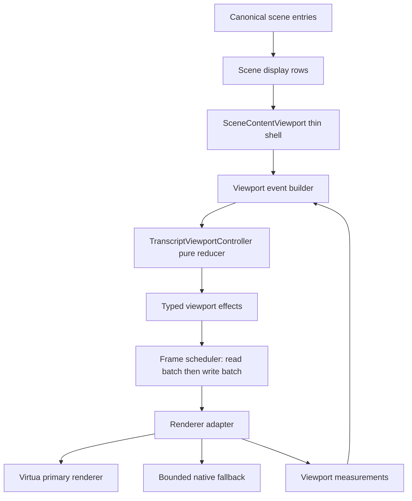
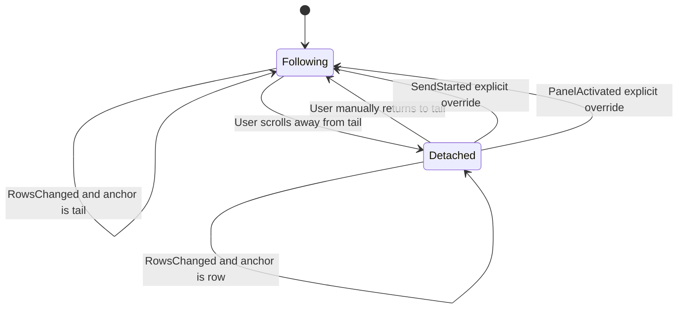

# refactor: Build deterministic transcript viewport controller

## Overview

Replace the current effect-driven transcript scroll architecture with a deterministic viewport controller. The controller becomes the only authority that can decide scroll mechanics for the main agent conversation: follow state, anchor state, renderer mode, and emitted scroll effects.

The target shape is:

```text
canonical scene entries
  -> scene display rows
  -> pure transcript viewport controller
  -> typed effects
  -> one DOM scheduler
  -> primary renderer adapter or bounded fallback adapter
```

This is a clean replacement architecture, not another patch on the existing scroll/fallback booleans. `SceneContentViewport` should become a thin shell that renders rows, forwards measured facts, and executes controller effects. It should not own follow state, fallback state, send-time reveal state, or ad hoc `requestAnimationFrame` scroll decisions.

Important boundary: upstream product code owns semantic reveal intent and target choice. The viewport controller owns only scroll mechanics. For example, the controller may receive an explicit "follow this target because send started" event, but it must not infer product truth from provider-specific message meaning or row content.

## Problem Frame

The current scroll system can jump to the top when sending a message because multiple owners affect the same physical scroll position:

- `SceneContentViewport` switches between Virtua and native fallback.
- `AutoScrollLogic` decides follow and detach.
- `ThreadFollowController` queues reveal targets.
- Historical load logic forces tail reveal.
- Session-switch logic resets scroll and fallback state.
- Native fallback handoff code captures and restores offsets.
- Resize observers and reveal registration can schedule more reveals.

The worst current edge is send-time rendering. `isWaitingForResponse` contributes to `hasActiveLiveTail`, which contributes to `shouldUseNativeList`, so sending can swap from Virtua to a newly mounted native scroll container. A fresh native scroll container starts at `scrollTop = 0`, then a later RAF tries to scroll it down. That creates the visible "teleport to top" class of bugs.

The deeper problem is not one bad condition. The deeper problem is that scroll is a side effect controlled by scattered component effects instead of one replayable state machine.

## Requirements Trace

- R1. The main agent transcript must have exactly one scroll authority.
- R2. Every user-visible scroll movement must be explainable by one typed controller effect.
- R3. Sending a message must not swap the scroll container solely because the UI is waiting for a response.
- R4. Native fallback must be a bounded recovery renderer for confirmed primary renderer failure or an explicit controller-selected safety mode, not the normal live-tail renderer.
- R5. Detached versus following must be explicit state, not an incidental result of near-bottom geometry.
- R6. While detached, assistant output, tool output, thinking rows, streaming growth, and layout remeasurement must not move the viewport.
- R7. Explicit override events, including send and panel activation, must be represented as typed events with deterministic results.
- R8. The controller must preserve a row anchor when rows change, and preserve the tail anchor only when following.
- R9. Scroll work must be bounded: one read/write batch per frame, no full transcript scans on ordinary scroll or reveal ticks.
- R10. The viewport must be testable without the DOM for policy decisions, and testable with renderer adapters for integration behavior.
- R11. Canonical session lifecycle, turn state, activity, and capabilities remain graph-owned. The viewport controller must not add hot-state fallback or synthetic canonical state.
- R12. The implementation must be characterization-first because this area is historically fragile.
- R13. Same-frame event ordering must be explicit and deterministic.
- R14. Public scroll commands, including scroll to top, scroll to bottom, and follow-button actions, must route through typed controller events rather than direct DOM writes.

## Scope Boundaries

- In scope: main agent conversation transcript viewport, follow/detach behavior, send-time reveal behavior, primary/fallback renderer selection, anchor preservation, adapter boundary, tests, and diagnostics.
- Out of scope: review diff scrolling, project sidebar scrolling, file picker scrolling, inline thinking-box scrolling, or unrelated scrollable controls.
- Out of scope: provider protocol changes or Rust session graph changes.
- Out of scope: replacing Virtua in this plan. If adapter tests prove Virtua cannot satisfy the deterministic contract, stop, record the blocker, and create a separate reviewed plan for renderer replacement.
- Out of scope: adding user preferences for follow behavior.
- Out of scope: preserving the current boolean-driven scroll architecture as a compatibility path.

## Context & Research

### Relevant Code and Patterns

- `packages/desktop/src/lib/acp/components/agent-panel/components/scene-content-viewport.svelte`
  - Current overgrown viewport shell. It owns renderer mode, fallback, follow wiring, hydration, native handoff, session reset, historical scroll, row rendering, and scroll commands.
- `packages/desktop/src/lib/acp/components/agent-panel/logic/create-auto-scroll.svelte.ts`
  - Existing follow/detach logic. Useful behavior exists here, but it is not the right final owner boundary by itself.
- `packages/desktop/src/lib/acp/components/agent-panel/logic/thread-follow-controller.svelte.ts`
  - Existing reveal-target controller. It separates target registration from list reveal, but it still participates in a multi-owner scroll system.
- `packages/desktop/src/lib/acp/components/agent-panel/logic/scene-display-rows.ts`
  - Current display-row construction path. This should remain the data input to viewport policy.
- `packages/desktop/src/lib/acp/components/agent-panel/logic/viewport-fallback-controller.svelte.ts`
  - Existing bounded fallback helpers. The bounded behavior is useful, but fallback entry should be controller-owned and reasoned.
- `packages/desktop/src/lib/acp/components/messages/message-wrapper.svelte`
  - Current row target registration layer. The target registration role should become an adapter event source, not a scroll authority.
- `packages/desktop/src/lib/acp/components/agent-input/agent-input-controller.ts`
  - Send path calls `onWillSend`, which currently primes reveal behavior before the message is submitted.
- `packages/desktop/src/lib/acp/components/agent-panel/components/agent-panel.svelte`
  - Calls `contentRef?.scrollToTop()`, `contentRef?.scrollToBottom({ force: true })`, and `contentRef?.prepareForNextUserReveal()`. These are public scroll/reveal commands and must become typed controller events, not direct scroll writes.
- `packages/desktop/src/lib/acp/components/agent-panel/components/agent-panel-content.svelte`
  - Forwards public scroll commands to `SceneContentViewport`. This should remain a thin forwarding layer, but the final forwarded operation must dispatch controller intent rather than mutate renderer state directly.
- `packages/desktop/src/lib/acp/components/agent-panel/components/__tests__/fixtures/vlist-stub.svelte`
  - Existing Virtua test seam. It already exposes the measurement and scroll methods needed to validate a renderer adapter without depending on real Virtua timing.

### Implementation Constraints

- TypeScript changes must follow `.agent-guides/typescript.md`: no `try/catch`, no `any` or `unknown`, and no broad spread-based object merging.
- Svelte changes must follow `.agent-guides/svelte.md`: prefer `$derived` and event handlers over `$effect`; when `$effect` is needed for DOM lifecycle, keep it thin and guarded.
- New viewport policy should live in ordinary `.ts` pure modules whenever it does not need Svelte reactivity.
- New DOM-bound lifecycle, observer, and scheduling logic may live in `.svelte.ts` classes when it needs Svelte runes, following the public Svelte library pattern used by Bits UI and Runed.
- The controller and diagnostics must not store full message text. Store row keys, counts, scalar measurements, event names, and effect names only.

### Institutional Learnings

- `docs/brainstorms/2026-03-31-agent-thread-follow-redesign-requirements.md`
  - Follow state must be explicit. Auto-follow decisions must not depend on timing races between scroll handlers, resize observers, and deferred reveal scheduling.
- `docs/brainstorms/2026-05-01-agent-panel-content-reliability-rewrite-requirements.md`
  - The viewport should have a narrow responsibility and must not remain blank when scene entries exist.
- `docs/plans/2026-05-01-004-refactor-agent-panel-content-viewport-plan.md`
  - Keep graph-to-scene materialization. Replace the brittle viewport adapter around tested behavior.
- `docs/plans/2026-05-02-003-fix-agent-panel-send-reveal-regression-plan.md`
  - Local pending send must not force native fallback or rewindow previous rows.
- `docs/solutions/logic-errors/thinking-indicator-scroll-handoff-2026-04-07.md`
  - Reveal targeting and resize/growth tracking are different concerns.
- `docs/solutions/best-practices/agent-panel-content-viewport-reactivity-renderer-2026-05-01.md`
  - Viewport owns layout, scroll, virtualization, and fallback only.
- `docs/plans/2026-05-07-001-refactor-cosmetic-reveal-projector-plan.md`
  - Reveal authority should live outside the viewport. The viewport may consume layout hints, but it must not create reveal truth.

### External References

- Official Svelte `$effect` docs:
  - `$effect` is for side effects such as third-party libraries, canvas, network requests, and direct DOM work.
  - The docs warn against using `$effect` to synchronize state because it makes code more complex and can create update loops.
  - Implication: scroll policy must not live in reactive effects. Effects should only subscribe, measure, schedule, and clean up.
- Official Svelte `$derived` docs:
  - Derived expressions must be side-effect free.
  - Implication: renderer mode labels, visible UI flags, and compact row summaries can be derived; scroll movement cannot be derived.
- Public Svelte 5 library patterns:
  - Bits UI uses `.svelte.ts` state classes for component behavior and small imperative methods, while child parts call the owning root state.
  - Runed wraps browser primitives such as `requestAnimationFrame` and `ResizeObserver` behind small lifecycle utilities.
  - Implication: Acepe should use `.svelte.ts` at the DOM boundary, but keep the core scroll reducer pure TypeScript.
- Virtua Svelte public handle:
  - `VListHandle` exposes `getScrollOffset`, `getScrollSize`, `getViewportSize`, `findItemIndex`, `getItemOffset`, `getItemSize`, `scrollToIndex`, `scrollTo`, and `scrollBy`.
  - Implication: keeping Virtua behind an Acepe adapter is the right first-class design. Replacing Virtua is not part of this plan.

### GOD Architecture Check

This work does not need new canonical session fields. Scroll anchor, follow state, renderer mode, pending measurement, and fallback reason are local viewport state. They are not session lifecycle, activity, turn state, capabilities, current model, or current mode.

Blocked patterns:

- No `canonical ?? hotState` reader fallback.
- No client-side canonical projection synthesis.
- No provider-specific branching in the viewport.
- No `packages/ui` import of desktop stores or Tauri APIs.

## Key Technical Decisions

- **One scroll authority.** A single transcript viewport controller owns follow state, anchor state, renderer mode, and scroll mechanics.
- **Reveal intent stays upstream.** Product code decides why and what to reveal. The controller receives typed intent, then decides how to preserve or move the viewport.
- **Pure policy, imperative executor.** The controller is pure TypeScript. It receives events and returns state plus typed effects. A small Svelte executor performs DOM reads/writes.
- **Typed events, typed effects.** Component lifecycle, scroll events, resize events, row changes, sends, and renderer failures become explicit events. Scroll commands become explicit effects.
- **Anchor first, bottom second.** The controller stores either a tail anchor or a row anchor. It does not guess user intent only from `distanceFromBottom`.
- **Native fallback is not live-tail mode.** Waiting, sending, or thinking-row rendering must not by itself switch to native fallback.
- **Renderer adapters are thin.** Virtua and native fallback expose the same small measurement/reveal interface. They do not own product policy.
- **Scheduling is centralized.** One frame scheduler batches DOM reads before writes. No scattered scroll RAFs.
- **Debugging is replayable.** Development diagnostics should record controller events, measurement inputs, adapter outcomes, scheduler frame/generation ids, previous state, next state, emitted effects, and effect results for the latest frames.
- **Event volume is bounded.** The controller accepts row-key summaries and scalar measurements, not per-token events, full row payloads, or message text.
- **Old scroll controllers are removed from the production path.** `AutoScrollLogic` and `ThreadFollowController` may donate tested behavior, but the final code must not keep them as active parallel authorities.

### Decision Rationale

| Decision | Why this is the clean architecture | Why alternatives lose |
|---|---|---|
| Pure TypeScript controller | It gives deterministic reducer tests, replayable diagnostics, and no Svelte lifecycle timing in policy decisions. | A `.svelte.ts` controller would make reactivity and microtask timing part of policy behavior. |
| `.svelte.ts` scheduler/adapter | Public Svelte libraries use `.svelte.ts` well for DOM lifecycle and reusable reactive behavior. This keeps browser primitives close to Svelte cleanup rules. | Putting observer/RAF cleanup in the pure reducer would fake determinism and hide browser work in test doubles. |
| Virtua adapter, not Virtua replacement | Virtua already exposes the measurement and scroll handle surface needed by the plan. The risk is ownership, not the library itself. | Replacing the virtualizer expands the surface area before proving Virtua cannot satisfy the contract. |
| Explicit upstream reveal intent | Prior Acepe learnings already separate reveal truth from viewport layout. The viewport should not learn provider/message semantics. | Letting the viewport infer target meaning recreates the same mixed-responsibility bug in a cleaner-looking module. |
| Event queue with fixed priority | Svelte effects, scroll events, ResizeObserver, and virtualizer measurements can arrive in surprising order. Fixed ordering makes the result testable. | "Whatever event arrives first" is easy to implement but keeps the race as architecture. |

### Non-Negotiable Invariants

- No production code outside the controller/scheduler pair may decide to mutate the main transcript scroll position.
- No public main-transcript method may directly call `scrollTo`, `scrollBy`, `scrollToIndex`, or assign `scrollTop`; public methods only dispatch typed intent.
- No `isWaitingForResponse`, thinking row, or local pending send flag may select native fallback by itself.
- No controller event or diagnostic may contain message text.
- No adapter may decide follow, detach, reveal target, or fallback policy.
- No effect scheduled for an old session/generation may write to the current viewport.

## Alternative Approaches Considered

| Option | Shape | Strengths | Weaknesses | Decision |
|---|---|---|---|---|
| Patch current code | Remove `isWaitingForResponse` or `hasActiveLiveTail` from fallback decisions and add tests | Fast and likely fixes the immediate top jump | Leaves multiple scroll owners, RAF timing risk, and boolean soup | Reject as final architecture |
| Smaller `SceneContentViewport` helpers | Extract current effects into helper modules | Easier to read than today | Still effect-driven; state remains split across helpers | Reject as final architecture |
| Controller plus renderer adapters | One controller owns policy; adapters bridge Virtua/native | Strong separation and testability | If controller is not event-sourced, debugging still depends on call order | Accept only as a step toward the chosen design |
| Event-sourced viewport controller | Pure reducer consumes typed events and emits effects | Deterministic, replayable, testable, clear ownership | Larger refactor; needs careful adapter design | Chosen |
| Custom virtualizer | Own all virtualization math | Maximum control and byte-level tuning | Large new surface area and high bug risk | Reject unless Virtua adapter cannot meet contract |

## Open Questions

### Resolved During Planning

- **Should this be another narrow send-scroll fix?** No. There is already a narrow May 2 plan. This plan targets the clean end-state architecture.
- **Should native fallback stay active during normal waiting/streaming?** No. It may be selected only for confirmed renderer failure or explicit controller safety decisions with a recorded reason.
- **Should `AutoScrollLogic` and `ThreadFollowController` remain as final authorities?** No. Their tested behavior can be ported, but final authority should be one controller.
- **Should scroll state become canonical graph state?** No. It is local viewport state.
- **Should send while detached follow the new turn?** Yes, matching the March 31 requirements. It should happen through a typed `SendStarted` or equivalent event, not through renderer remount side effects.
- **What are the adapter capability names?** Use the Acepe-owned contract names in the Adapter Contract section: `measureViewport`, `captureAnchor`, `measureAnchor`, `revealRow`, `revealTail`, `applyScrollOffset`, `probeRendererHealth`, and `reportEffectOutcome`.
- **What large transcript size proves the bug class?** Runtime acceptance uses a 1,200 display-row fixture with mixed user, assistant, tool, thinking, edited, and variable-height markdown rows. A separate non-visual stress test uses 5,000 synthetic row summaries for reducer performance.
- **How do we handle Virtua timing differences from the test stub?** Stub tests are not sufficient. Completion requires a real runtime probe against the Tauri app or equivalent real Virtua mount path.
- **What happens when the anchored row disappears?** Recover to the nearest surviving anchor-eligible row in the changed range. If none exists, preserve the closest measured scroll offset and emit a diagnostic; do not reveal tail unless follow state is `following`.
- **What is the runtime probe design?** Capture visible row keys and scroll offset for two animation frames before send, the first eight animation frames after send, and the frame after the first live response row appears. Screenshots may be captured too, but visible row keys are the primary proof.
- **How does reconnect status affect anchoring?** Reconnect/disconnect/recovered status is panel chrome, not transcript content. If implementation must render it inside the row list for layout reasons, mark it non-anchor-eligible so it cannot become the preserved row anchor.
- **What accessibility behavior is required?** Sending keeps composer focus unless the user moved it; controller scroll effects never call focus; keyboard scroll uses the same follow/detach model as pointer scroll; fallback/recovery exposes status without stealing focus.

### Deferred to Implementation

- None. Execution may still discover bugs, but every known planning uncertainty has a decision or proof gate above.

## High-Level Technical Design

> *This is the architecture contract for review. It defines ownership, data flow, and invariants, but it is not code to copy.*

### Data Flow



### Layer Ownership

| Layer | Owns | Must not own |
|---|---|---|
| Scene/display rows | Ordered row identity, row kind, compact target metadata | Scroll policy, renderer fallback, DOM measurement |
| Product intent builder | Explicit reveal reasons and targets from send, activation, or user command | Physical scroll execution or virtualizer-specific behavior |
| Pure viewport controller | Follow/detach state, anchor state, renderer mode, event ordering, typed effects | DOM reads/writes, Svelte lifecycle, provider-specific semantics |
| Scheduler | One-frame batching, session/generation guards, read-before-write execution | Follow policy, fallback policy, target choice |
| Renderer adapter | Virtua/native measurement and scroll primitive execution | Product policy, recovery policy, diagnostics interpretation |
| Diagnostics | Bounded text-free facts, replay input/output summaries | User message content, canonical session state |

### Adapter Contract

The adapter is an Acepe-owned interface over Virtua/native fallback, not a re-export of the Virtua API. It should be small enough that the native fallback adapter and test adapter can implement it without knowing product policy.

| Contract capability | Virtua source | Native fallback source | Controller use |
|---|---|---|---|
| `measureViewport` | `getScrollOffset`, `getScrollSize`, `getViewportSize` | container `scrollTop`, `scrollHeight`, `clientHeight` | Build `ScrollMeasured` facts |
| `captureAnchor` | `findItemIndex` plus row keys | DOM row lookup | Capture detached anchor |
| `measureAnchor` | `getItemOffset`, `getItemSize` | row bounding rects | Preserve row anchor through changes |
| `revealRow` | `scrollToIndex` or `scrollTo` | container scroll write | Execute explicit row reveal effects |
| `revealTail` | `scrollToIndex(last)` or `scrollTo` | container scroll write | Execute tail reveal effects only while following |
| `applyScrollOffset` | `scrollTo` | container `scrollTop` | Preserve measured offset during recovery when no row anchor survives |
| `probeRendererHealth` | viewport/item measurements | container and row measurements | Confirm primary/fallback health |
| `reportEffectOutcome` | adapter/scheduler result | adapter/scheduler result | Feed `EffectApplied`, `EffectSkipped`, or failure facts back to diagnostics/replay |

If Virtua lacks a needed fact at runtime, the adapter reports an outcome event. It must not invent fallback behavior or write a compensating scroll by itself.

These names are the planning contract. The implementation may choose exact TypeScript shapes that fit the existing codebase, but it should not introduce extra adapter capabilities unless tests prove the contract is incomplete.

### Controller State Shape

```text
ViewportState
  renderer:
    primary
    fallback(reason)
  follow:
    following
    detached
  anchor:
    tail
    row(rowKey, edge, offsetPx)
  rows:
    count
    firstKey
    lastKey
    latestUserKey
    changedRangeOrVersion
  pending:
    measurementRequest
    revealRequest
    rendererHealthProbe
```

### Event and Effect Model

```text
Events:
  RowsChanged
  ScrollMeasured
  UserWheel
  UserScroll
  UserNavigationScroll
  PublicScrollCommand
  ExplicitRevealRequested
  SendStarted
  PanelActivated
  RendererMounted
  RendererFailed
  RendererRecovered
  RowResized
  ViewportResized
  AdapterAnchorMissing
  EffectApplied
  EffectSkipped
  RendererHealthProbeReported
  SessionChanged

Effects:
  MeasureViewport
  RevealRow
  RevealTail
  PreserveAnchor
  SwitchRenderer
  ProbeRendererHealth
  ReportDiagnostic
```

`SendStarted` and `PanelActivated` may carry explicit upstream reveal targets, but the controller must not invent reveal truth from message text, provider type, or row internals.

### Event Payload Rules

- `RowsChanged` carries compact row summaries: count, first key, last key, latest user key, changed range or version, and anchor lookup facts. It does not carry full row objects.
- `PublicScrollCommand` carries command intent such as top, bottom, or follow. It does not execute the command.
- `ExplicitRevealRequested` carries a target row key and reason produced upstream. It does not ask the controller to discover a target.
- `ScrollMeasured`, `ViewportResized`, and `RowResized` carry scalar measurements with session/generation ids.
- `EffectApplied`, `EffectSkipped`, and `RendererHealthProbeReported` turn adapter/scheduler outcomes back into controller facts so replay includes real DOM-bound outcomes.

### Event Ordering Policy

Each animation frame must process events in a stable order:

1. Session or renderer lifecycle: `SessionChanged`, `RendererMounted`, `RendererRecovered`, `RendererFailed`.
2. User intent: `UserWheel`, `UserScroll`, `UserNavigationScroll`, `PublicScrollCommand`, `ExplicitRevealRequested`, `SendStarted`, `PanelActivated`.
3. Row and layout facts: `RowsChanged`, `RowResized`, `ViewportResized`, `ScrollMeasured`.
4. Adapter recovery facts: `AdapterAnchorMissing`.

User intent wins over stale measurement. Measurements and scheduled effects must carry session and generation ids. If ids do not match the current state, the controller drops them and reports a diagnostic instead of applying recovery behavior.

### Anchor Contract

The adapter/controller contract must define anchor semantics before integration:

- Capture the nearest stable anchor-eligible visible row key plus `edge` and `offsetPx`.
- Prefer the first visible stable anchor-eligible row when detached; use the tail anchor only while following.
- Treat reconnect/disconnect/recovered status rows as non-anchor-eligible if they must appear in the transcript row list.
- If the captured row is removed, recover to the nearest surviving anchor-eligible row in the same changed range.
- If no anchor-eligible row survives, preserve the closest measured scroll offset with `applyScrollOffset` and emit a diagnostic. Do not reveal tail unless follow state is `following`.
- If the adapter cannot measure the row because it is not mounted, it must return an `AdapterAnchorMissing` fact; only the controller may choose the recovery effect.
- Tests must cover insertion above anchor, removal of the anchor row, row height growth above anchor, collapsed thinking/tool rows, and virtualizer missing-row cases.

### Runtime Proof Contract

The runtime probe is a required proof gate, not optional manual QA:

- Fixture: 1,200 display rows, mixing user rows, assistant markdown rows, tool output rows, thinking rows, edited rows, and variable-height content.
- Reducer stress fixture: 5,000 synthetic row summaries, used to prove row-change processing does not scan full row content per streaming tick.
- Send probe window: capture visible row keys and scroll offset for two animation frames before send, the first eight animation frames after send, and the frame after the first live response row appears.
- Resize probe window: capture visible row keys and scroll offset before resize, during resize, and after layout settles.
- Reconnect probe window: capture visible row keys and scroll offset before reconnect status appears, while reconnecting, and after recovery.
- Pass condition: no captured frame shows the first transcript rows during send, no blank viewport frame appears, and the visible anchor remains continuous until the explicit reveal target is shown.

### Accessibility Contract

- Sending keeps composer focus unless the user explicitly moved focus.
- Controller scroll effects never call focus as a side effect.
- Keyboard scrolling uses the same follow/detach transitions as wheel/pointer scrolling.
- Reconnect/fallback/recovery status is exposed as stable status information without trapping focus or forcing transcript focus.
- Existing transcript ARIA/live-region behavior must be preserved; this plan does not invent a new screen-reader announcement model.

### Follow State



### Renderer Selection

| Input condition | Renderer decision | Scroll rule |
|---|---|---|
| Primary renderer healthy, following tail | Primary | Preserve tail anchor |
| Primary renderer healthy, detached | Primary | Preserve row anchor |
| Local send started | Primary unless another explicit failure exists | Follow new live turn by controller effect |
| Waiting/thinking row appended | Primary unless another explicit failure exists | Treat as row change, not renderer switch |
| Primary renderer confirmed blank/zero viewport after health protocol passes | Bounded fallback with reason | Preserve anchor or reveal tail based on follow state |
| Fallback recovery confirmed | Primary | Preserve anchor through adapter handoff |

Renderer failure is confirmed only after the renderer is mounted, the panel is visible, the container has nonzero size, rows are present, and repeated health probes across elapsed frames fail. Hidden panels, zero-height mounts, delayed Virtua measurements, and session switches are not renderer failure by themselves. Recovery must use hysteresis so the app does not bounce between primary and fallback.

## Implementation Units

- [x] **Unit 1: Characterize current scroll ownership and send teleport behavior**

**Goal:** Add failing or characterization tests that prove the current top-jump class and capture the current multi-owner behavior before replacing it.

**Requirements:** R1, R2, R3, R4, R12

**Dependencies:** None

**Files:**
- Modify: `packages/desktop/src/lib/acp/components/agent-panel/components/__tests__/scene-content-viewport.svelte.vitest.ts`
- Modify: `packages/desktop/src/lib/acp/components/agent-panel/logic/__tests__/create-auto-scroll.test.ts`
- Modify: `packages/desktop/src/lib/acp/components/agent-panel/logic/__tests__/thread-follow-controller.test.ts`
- Inspect: `packages/desktop/src/lib/acp/components/agent-panel/components/scene-content-viewport.svelte`
- Inspect: `packages/desktop/src/lib/acp/components/agent-input/agent-input-controller.ts`

**Approach:**
- Add a test that simulates a long healthy primary-renderer session, sends a message, sets waiting true, and asserts waiting alone must not select native fallback.
- Add a test that captures current behavior if the fallback scroll container mounts at `scrollTop = 0` before reveal.
- Keep Unit 1 focused on current behavior: send primes reveal behavior, waiting can currently influence fallback, and detached growth behaves as observed.
- Record the current scroll owners in test names or comments so later units remove each owner intentionally.

**Execution note:** Characterization-first. At the end of Unit 1, characterization tests that document current behavior must pass. Target-behavior tests may be introduced as failing TDD tests only if execution immediately continues into Unit 2; do not treat Unit 1 alone as a green checkpoint when failing target tests remain.

**Patterns to follow:**
- Existing viewport tests using `scrollToIndexCalls`, native fallback test ids, and render stubs.
- Existing follow-controller tests for pending reveal behavior.

**Test scenarios:**
- Integration: healthy primary renderer + `isWaitingForResponse=true` -> native fallback is not selected solely because of waiting.
- Integration: send from bottom -> current path makes the top-flash risk observable.
- Edge case: send while detached -> current reveal/follow behavior is characterized before replacement.
- Edge case: ordinary row growth while detached -> no reveal or scroll effect is emitted.
- Regression: panel activation remains an explicit follow override.
- Regression: `agent-panel.svelte` public commands reach the viewport through `contentRef`, proving every external scroll entry point is known before replacement.

**Verification:**
- Tests make the current bug observable and define the target behavior before production logic changes.
- The characterization notes identify every current production scroll writer in the main transcript path.

- [x] **Unit 2: Introduce pure viewport event, state, and effect model**

**Goal:** Create the pure controller types and reducer that own viewport policy without touching DOM or Svelte.

**Requirements:** R1, R2, R5, R6, R7, R8, R9, R10, R11, R13, R14

**Dependencies:** Unit 1

**Files:**
- Create: `packages/desktop/src/lib/acp/components/agent-panel/logic/transcript-viewport-controller.ts`
- Create: `packages/desktop/src/lib/acp/components/agent-panel/logic/transcript-viewport-events.ts`
- Create: `packages/desktop/src/lib/acp/components/agent-panel/logic/transcript-viewport-effects.ts`
- Create: `packages/desktop/src/lib/acp/components/agent-panel/logic/viewport-anchor.ts`
- Create: `packages/desktop/src/lib/acp/components/agent-panel/logic/transcript-viewport-row-summary.ts`
- Test: `packages/desktop/src/lib/acp/components/agent-panel/logic/__tests__/transcript-viewport-controller.test.ts`
- Modify: `packages/desktop/src/lib/acp/components/agent-panel/logic/index.ts`

**Approach:**
- Define a closed event union and a closed effect union.
- Model follow state and anchor state explicitly.
- Model renderer mode with reasoned fallback, not booleans.
- Handle `RowsChanged`, `UserScroll`, `UserWheel`, `UserNavigationScroll`, `PublicScrollCommand`, `ExplicitRevealRequested`, `SendStarted`, `PanelActivated`, `RendererFailed`, `RendererRecovered`, `ViewportResized`, `AdapterAnchorMissing`, and `SessionChanged`.
- Effects must be declarative. The reducer may say "measure viewport" or "reveal row"; it must not read DOM.
- Include a small diagnostic record with event name, previous state summary, next state summary, and effect names.
- Keep data compact: row counts, first/last keys, latest user key, changed range or version, anchor lookup data, and scalar measurements, not full row objects.
- Route public scroll commands through controller events: scroll to top, scroll to bottom, follow button, and any existing `contentRef` scroll commands from `agent-panel.svelte`.
- Keep product reveal truth outside the controller. Use explicit target events from upstream instead of making the controller infer the latest live target from row meaning.
- Define a reducer-level event ordering function that sorts same-frame batches before state transition. Tests should cover the ordering function directly.
- Define effect ids or deterministic effect ordering so diagnostics and replay do not depend on array construction accidents.

**Technical design:** Reducer contract shape:

```text
nextViewportStep(state, event) -> {
  state,
  effects,
  diagnostics
}
```

Effects are values. The Svelte layer executes them later.

**Patterns to follow:**
- Pure logic style from `agent-panel-display-model.ts`.
- Current geometry tests in `create-auto-scroll.test.ts`.
- Generation/reset ideas from `thread-follow-controller.svelte.ts`, but without keeping it as a parallel authority.

**Test scenarios:**
- Happy path: initial rows + primary renderer mounted -> state follows tail and emits tail measurement/reveal only when needed.
- Happy path: `RowsChanged` while following -> emits tail preservation/reveal effect.
- Happy path: `RowsChanged` while detached -> emits preserve-row-anchor effect, not reveal-tail.
- Happy path: `SendStarted` or `ExplicitRevealRequested` while detached -> changes to following and emits reveal effect for the upstream target.
- Happy path: `PanelActivated` while detached -> changes to following and emits reveal tail.
- Happy path: `PublicScrollCommand(scrollToTop)` emits a typed effect and no DOM write happens outside the scheduler.
- Happy path: keyboard navigation that moves away from tail detaches through `UserNavigationScroll`.
- Edge case: waiting/thinking row appended -> no fallback switch.
- Edge case: renderer failure -> switches to fallback with explicit reason and emits preserve-anchor effect.
- Edge case: renderer recovery -> switches back to primary and emits preserve-anchor effect.
- Edge case: session changed -> resets state and invalidates pending effects.
- Edge case: same-frame `SendStarted` plus `RowsChanged` uses the event ordering policy.
- Edge case: same-frame user scroll plus programmatic reveal keeps user intent deterministic.
- Edge case: stale measurement from a previous generation is ignored and emits a diagnostic effect only.
- Edge case: adapter reports `EffectSkipped` after session switch -> state remains unchanged except diagnostics.
- Performance: row changes use compact summaries and do not scan the full row list per streaming tick.

**Verification:**
- Pure controller tests prove scroll policy without mounting Svelte.

- [x] **Unit 3: Build renderer adapter and frame scheduler boundary**

**Goal:** Isolate DOM reads/writes behind one adapter interface and one scheduler that batches all viewport effects.

**Requirements:** R2, R4, R8, R9, R10, R13

**Dependencies:** Unit 2

**Files:**
- Create: `packages/desktop/src/lib/acp/components/agent-panel/logic/transcript-renderer-adapter.ts`
- Create: `packages/desktop/src/lib/acp/components/agent-panel/logic/transcript-viewport-scheduler.svelte.ts`
- Create: `packages/desktop/src/lib/acp/components/agent-panel/logic/virtua-transcript-renderer-adapter.svelte.ts`
- Create: `packages/desktop/src/lib/acp/components/agent-panel/logic/native-transcript-renderer-adapter.svelte.ts`
- Test: `packages/desktop/src/lib/acp/components/agent-panel/logic/__tests__/transcript-viewport-scheduler.test.ts`
- Test: `packages/desktop/src/lib/acp/components/agent-panel/logic/__tests__/transcript-renderer-adapter.test.ts`
- Modify: `packages/desktop/src/lib/acp/components/agent-panel/components/__tests__/fixtures/vlist-stub.svelte`
- Modify: `packages/desktop/src/lib/acp/components/agent-panel/components/__tests__/fixtures/vlist-stub-state.ts`

**Approach:**
- Define the smallest adapter API needed by effects:
  - `measureViewport`,
  - `captureAnchor`,
  - `measureAnchor`,
  - `revealRow`,
  - `revealTail`,
  - `applyScrollOffset`,
  - `probeRendererHealth`,
  - `reportEffectOutcome`.
- Implement the scheduler so all reads happen before writes in a single frame.
- Make stale scheduled work session/generation-bound.
- Add instrumentation counters for reads, writes, and emitted scroll operations in tests.
- Do not let adapters decide follow, detach, fallback, or send behavior.
- Adapters must report operation outcomes back to the controller as facts: measurement available, anchor missing, renderer health probe passed/failed, effect applied, or effect skipped because generation changed.
- Keep Virtua methods behind the Acepe adapter. Production viewport code should not directly reason about `getScrollOffset`, `findItemIndex`, `scrollToIndex`, or native `scrollTop`.

**Patterns to follow:**
- Existing VList test stub and `scrollToIndexCalls`.
- Existing RAF cancellation patterns in `SceneContentViewport`.

**Test scenarios:**
- Happy path: three effects scheduled in one tick produce one read batch and one write batch.
- Edge case: session generation changes before RAF flush -> stale effects do not run.
- Edge case: adapter missing a row for a row-anchor effect -> scheduler reports a diagnostic and dispatches typed `AdapterAnchorMissing` back to the controller; only the controller may emit the recovery effect.
- Edge case: `RendererMounted` plus `ScrollMeasured` in the same frame follows the event ordering policy.
- Edge case: `RowResized` plus detached anchor preservation in the same frame preserves the row anchor.
- Edge case: fallback adapter reveal-tail uses bounded fallback rows only.
- Edge case: Virtua adapter reports missing measurement instead of throwing or silently writing a fallback scroll.
- Edge case: native adapter and Virtua adapter produce the same normalized measurement shape for equivalent geometry.
- Edge case: removed anchor row recovers to nearest surviving anchor-eligible row.
- Edge case: no anchor-eligible row survives -> preserves closest measured offset and emits a diagnostic, without revealing tail while detached.
- Performance: repeated row-resize events coalesce into one measure pass per frame.

**Verification:**
- Scheduler tests prove no scattered scroll RAFs are needed for the main transcript viewport.

- [x] **Unit 4: Replace `SceneContentViewport` scroll ownership with controller integration**

**Goal:** Make `SceneContentViewport` a thin shell that sends events to the controller and executes returned effects through the scheduler.

**Requirements:** R1, R2, R3, R4, R5, R6, R7, R8, R9, R10, R11, R13, R14

**Dependencies:** Units 2 and 3

**Files:**
- Modify: `packages/desktop/src/lib/acp/components/agent-panel/components/scene-content-viewport.svelte`
- Modify: `packages/desktop/src/lib/acp/components/messages/message-wrapper.svelte`
- Modify: `packages/desktop/src/lib/acp/components/agent-panel/components/agent-panel-content.svelte`
- Modify: `packages/desktop/src/lib/acp/components/agent-panel/components/agent-panel.svelte`
- Test: `packages/desktop/src/lib/acp/components/agent-panel/components/__tests__/scene-content-viewport.svelte.vitest.ts`
- Test: `packages/desktop/src/lib/acp/components/agent-panel/components/__tests__/scene-content-viewport-streaming-regression.svelte.vitest.ts`
- Test: `packages/desktop/src/lib/acp/components/agent-panel/components/__tests__/agent-panel-content.svelte.vitest.ts`

**Approach:**
- Replace `shouldUseNativeList` boolean derivation with controller-owned renderer mode.
- Remove waiting/live-tail as automatic native fallback reasons.
- Convert row mount, row resize, viewport resize, wheel, scroll, keyboard navigation, public scroll commands, session change, send-start, panel activation, and reconnect/recovery changes into controller events.
- Replace direct calls to `autoScroll.revealLatest`, `autoScroll.revealIndex`, and fallback scroll writes with emitted effects.
- Replace `contentRef` public scroll methods with typed controller events. Public methods may dispatch events, but must not write scroll position directly.
- Keep row rendering through `AgentPanelConversationEntry`.
- Keep bounded native fallback rendering, but enter it only through controller renderer mode.
- Preserve current explicit user-facing behavior from the March 31 requirements: send and panel activation re-follow; normal background growth does not.
- Preserve composer focus after send unless the user moved focus. Controller scroll effects must not call `focus` as a side effect.
- Keep Svelte effects thin: wire observers, build events from reactive facts, schedule effect execution, and cleanup. Do not compute follow/fallback state inside `$effect`.
- Use `$derived` only for side-effect-free display facts such as row summaries, renderer labels, and whether UI controls should appear.

**Execution note:** Do this as a clean replacement of viewport scroll ownership. Do not preserve the old controllers as a second active path.

**Patterns to follow:**
- Existing scene row rendering in `SceneContentViewport`.
- Existing bounded fallback helper.
- Prior tests around native fallback entry/recovery and send reveal.

**Test scenarios:**
- Happy path: healthy primary renderer + send -> primary stays mounted and controller emits reveal effect.
- Happy path: healthy primary renderer + waiting row -> primary stays mounted.
- Happy path: following tail + assistant/tool growth -> tail remains visible through controller effects.
- Edge case: detached + assistant/tool growth -> no scroll write.
- Edge case: detached + send -> follow override and reveal the explicit upstream target.
- Edge case: scroll to top, scroll to bottom, and follow button all route through typed controller events.
- Edge case: PageUp/PageDown or equivalent keyboard scroll detaches; End or explicit follow returns to following.
- Edge case: reconnecting/disconnected/recovered state does not force fallback and does not move a detached viewport.
- Edge case: panel/window resize preserves detached row anchor and tail following behavior.
- Edge case: reconnect status appears outside transcript anchoring, or is marked non-anchor-eligible if rendered in the row list.
- Edge case: primary renderer confirmed failure -> fallback mounts with explicit reason and bounded rows.
- Edge case: hidden panel, zero-height mount, delayed Virtua measurement, and session switch during health probe do not count as confirmed renderer failure.
- Edge case: fallback recovery -> primary remounts and preserves row or tail anchor.
- Edge case: session switch while RAF pending -> stale effects are ignored.
- Integration: thinking indicator reveal target and resize/growth target remain separate.

**Verification:**
- Viewport tests show all scroll movement comes from controller effects.
- `SceneContentViewport` no longer computes native fallback from `isWaitingForResponse` or live-tail booleans.
- `agent-panel-content.svelte` and `agent-panel.svelte` tests show public scroll/reveal commands dispatch controller intent.

- [x] **Unit 5: Remove old parallel scroll authorities**

**Goal:** Delete old active scroll controllers from the main transcript path so there is no second source of scroll truth.

**Requirements:** R1, R2, R5, R6, R7, R8, R9

**Dependencies:** Unit 4

**Files:**
- Delete or extract pure helpers from: `packages/desktop/src/lib/acp/components/agent-panel/logic/create-auto-scroll.svelte.ts`
- Delete or extract pure helpers from: `packages/desktop/src/lib/acp/components/agent-panel/logic/thread-follow-controller.svelte.ts`
- Modify: `packages/desktop/src/lib/acp/components/agent-panel/logic/index.ts`
- Modify: `packages/desktop/src/lib/acp/components/agent-panel/logic/__tests__/create-auto-scroll.test.ts`
- Modify: `packages/desktop/src/lib/acp/components/agent-panel/logic/__tests__/thread-follow-controller.test.ts`
- Test: `packages/desktop/src/lib/acp/components/agent-panel/logic/__tests__/transcript-viewport-controller.test.ts`

**Approach:**
- Move still-needed behavior coverage into `transcript-viewport-controller.test.ts`.
- Delete old tests only after equivalent behavior exists under the new controller.
- If a small helper remains, it must sit under the new controller boundary. It must be pure, must not schedule DOM work, must not own follow state, and must not write production scroll position.
- Search production code for direct scroll writes in the main transcript path and remove them.
- Preserve review/diff scroll behavior outside this deletion. The single-scroll-authority invariant applies to the main transcript path only.

**Patterns to follow:**
- Existing tests for nested scroll wheel handling and programmatic scroll suppression. Preserve behavior, not file shape.

**Test scenarios:**
- Regression: nested scrollable wheel events do not detach the main transcript when the nested element can consume the wheel.
- Regression: programmatic reveal does not get misclassified as user detach.
- Regression: small user scroll away detaches.
- Regression: manual return to bottom re-follows.
- Regression: scroll-to-bottom button emits explicit follow/reveal event.
- Regression: no public main-transcript method writes scroll position directly.

**Verification:**
- There is one production path for transcript scroll policy.
- Search confirms no old main transcript scroll owner remains active.
- Search confirms main transcript direct usage of Virtua/native scroll primitives exists only inside renderer adapters.

- [x] **Unit 6: Add deterministic diagnostics and replay tooling**

**Goal:** Make future scroll bugs explainable from recent event/effect history instead of screenshots and guesswork.

**Requirements:** R2, R9, R10, R12, R13

**Dependencies:** Units 2-4

**Files:**
- Create: `packages/desktop/src/lib/acp/components/agent-panel/logic/transcript-viewport-diagnostics.ts`
- Create: `packages/desktop/src/lib/acp/components/agent-panel/logic/transcript-viewport-replay.ts`
- Modify: `packages/desktop/src/lib/acp/components/agent-panel/components/scene-content-viewport.svelte`
- Modify: `packages/desktop/src/lib/acp/components/debug-panel/streaming-repro-lab.svelte`
- Test: `packages/desktop/src/lib/acp/components/agent-panel/logic/__tests__/transcript-viewport-diagnostics.test.ts`
- Test: `packages/desktop/src/lib/acp/components/agent-panel/logic/__tests__/transcript-viewport-replay.test.ts`

**Approach:**
- Keep a bounded ring buffer of recent controller events, normalized measurement facts, adapter outcomes, scheduler frame/generation ids, state summaries, effect summaries, and effect results in development/test builds.
- Do not store full transcript text in diagnostics. Store row counts, row keys, renderer mode, anchor summary, follow state, measurement scalars, effect names, effect outcomes, and renderer health probe results.
- Add repro-lab visibility for renderer mode, anchor type, follow state, last event, and last effects.
- Add a replay test helper that feeds recorded events plus normalized measurement and adapter outcome facts into the controller and asserts final state/effects.
- Add a diagnostic schema/version field so future changes can tell when a replay record is stale.

**Test scenarios:**
- Happy path: bounded ring buffer drops old entries after the configured limit.
- Happy path: replaying a send sequence with measurement snapshots produces the same final follow state and effects.
- Edge case: diagnostics omit full message text.
- Edge case: renderer failure/recovery sequence is visible with reasons.
- Edge case: adapter anchor-missing and failed effect outcomes are replayable.

**Verification:**
- A future "why did scroll move?" report can be answered from controller diagnostics.

- [x] **Unit 7: End-to-end proof and documentation**

**Goal:** Prove the replacement against the reported bug class and document the new ownership model.

**Requirements:** R1-R14

**Dependencies:** Units 1-6

**Files:**
- Modify: `docs/solutions/best-practices/agent-panel-content-viewport-reactivity-renderer-2026-05-01.md`
- Create: `docs/solutions/architectural/deterministic-transcript-viewport-controller-2026-05-13.md`
- Test: `packages/desktop/src/lib/acp/components/agent-panel/components/__tests__/scene-content-viewport.svelte.vitest.ts`
- Test: `packages/desktop/src/lib/acp/components/agent-panel/logic/__tests__/transcript-viewport-controller.test.ts`

**Approach:**
- Use the Tauri dev app or equivalent automated/semi-automated runtime probe to capture visible row keys or screenshots before send, during the first frames after send, and after reveal. Verify:
  - 1,200-row mixed transcript fixture at bottom,
  - send prompt,
  - no frame renders the first transcript rows during send,
  - no blank viewport frame appears,
  - no native fallback switch solely due to waiting,
  - visible row continuity before reveal,
  - detached growth does not pull viewport,
  - resize and reconnect cases preserve the same controller invariants.
- Use a 5,000-row synthetic reducer stress fixture to prove compact row summaries avoid full row-content scans during streaming updates.
- Keep manual QA as backup evidence, not the only proof.
- Document the new invariant: main transcript scroll movement can only happen through viewport controller effects.
- Document what remains out of scope: inline thinking-box scroll, review diff scroll, and unrelated scrollable controls.

**Test scenarios:**
- Manual/E2E: long existing session at bottom -> send -> no top teleport and latest live turn is revealed.
- Manual/E2E: long existing session detached mid-history -> assistant/tool growth -> viewport stays anchored.
- Manual/E2E: detached mid-history -> send -> viewport follows the new live turn by explicit send override.
- Manual/E2E: confirmed primary renderer failure -> bounded fallback appears with reason and recovers without losing anchor.
- Manual/E2E: keyboard scroll away detaches; explicit follow returns to tail.
- Manual/E2E: panel/window resize while detached preserves the visible row.
- Manual/E2E: reconnecting/disconnected/recovered state does not force fallback or move a detached viewport.
- Accessibility: sending preserves composer focus unless the user moved it, scroll effects never focus transcript rows as a side effect, fallback/blank recovery exposes a stable accessible state, and live transcript updates keep existing ARIA/live-region expectations.

**Delivery checkpoint:**
- After Unit 4, the send-time top teleport must be fixed in component tests and visible in runtime probing.
- After Unit 5, cleanup must prove the old scroll authorities no longer remain active.
- Units 6 and 7 may improve diagnostics and documentation, but they must not delay proving the user-visible send fix.

**Verification:**
- `cd packages/desktop && bun run check`.
- Focused viewport/controller tests pass.
- Streaming regression tests pass.
- Relevant agent-panel content tests pass if props or panel wiring changed.
- Runtime probe confirms the reported teleport class is gone using the 1,200-row mixed fixture and the defined capture window.
- Reducer stress test confirms 5,000 row summaries do not cause per-tick full row-content scans.
- Architecture doc explains ownership clearly enough for future contributors.

## System-Wide Impact

- **Interaction graph:** Agent input send path, panel activation, public panel controls, scene row building, viewport shell, row wrapper lifecycle, Virtua adapter, native fallback adapter, and debug panel are affected.
- **Error propagation:** Renderer failures become controller events with explicit reasons. They should not become user-facing session errors unless the transcript truly cannot render. Adapter failures should become diagnostic facts first, controller fallback decisions second.
- **State lifecycle risks:** Stale RAF/effect work must be session/generation-bound. Session switch resets local viewport state without mutating canonical session state. ResizeObserver, scroll, and health-probe events must be dropped when they belong to an old generation.
- **API surface parity:** `packages/ui` remains presentational. Renderer adapters live in desktop because they touch Virtua and DOM measurement. Public transcript scroll commands remain available to callers, but their implementation changes from direct scroll writes to controller intent dispatch.
- **Performance:** Ordinary streaming updates must not rescan full rows or schedule more than one read/write batch per frame. Row summaries and changed ranges carry the minimum data needed for anchor preservation.
- **Accessibility:** Composer focus must survive send and reveal. Keyboard scrolling must use the same follow/detach model as pointer scrolling. Recovery/fallback state must not trap focus or hide transcript status from assistive technology.
- **Integration coverage:** Unit tests cover pure policy. Scheduler and adapter tests cover DOM-bound contracts. Svelte component tests cover public command wiring. Runtime QA covers real scroll geometry and visible-frame stability.
- **Unchanged invariants:** Canonical graph remains content and session authority. Display rows remain layout projections. Reveal projector remains cosmetic. Native fallback remains bounded.

## Success Metrics

- Sending in a long healthy transcript does not mount native fallback solely because waiting is true.
- Every transcript scroll write in tests is attributable to one typed controller effect.
- Detached row growth produces zero reveal-tail effects.
- Controller scroll policy tests run without DOM.
- Component tests prove adapter integration without relying on source-code string assertions.
- Runtime QA reproduces the old send path and shows no visible top jump.
- During send in a long transcript, no rendered frame shows the first transcript rows.
- The visible anchor before send remains continuous until the new live turn is revealed.
- No blank viewport frame appears during send, resize, reconnect, or renderer recovery.
- Runtime probe records scroll position or visible row keys across animation frames.
- Runtime probe uses the defined capture windows for send, resize, and reconnect.
- Acceptance fixture includes at least 1,200 mixed display rows; reducer stress fixture includes 5,000 row summaries.
- Ordinary scroll/reveal work performs at most one read batch and one write batch per animation frame.
- Row-change processing does not scan the full row list on each streaming tick.
- Diagnostics stay bounded, replayable, and text-free.

## Risks & Dependencies

| Risk | Likelihood | Impact | Mitigation |
|---|---:|---:|---|
| Controller becomes a new monolith | Medium | High | Keep events/effects small, pure, and tested; keep adapters separate |
| Adapter measurement is not precise enough to preserve row anchors | Medium | High | Use the explicit anchor contract and require adapter missing-row facts instead of ad hoc recovery |
| Removing old controllers drops subtle nested-scroll behavior | Medium | Medium | Port nested-scroll and suppression tests into the new controller suite |
| Virtua behavior differs from test stub | Medium | High | Runtime QA and adapter-focused tests must cover actual handoff behavior |
| Diagnostics leak message text | Low | Medium | Store row keys/counts/effect names only |
| Event-sourced design becomes too chatty | Medium | Medium | Coalesce noisy DOM signals, store row-key summaries only, and assert one read/write batch per frame |
| Team keeps adding direct scroll writes later | Medium | High | Document invariant and add tests around controller-only scroll effects |
| Svelte effects regain policy ownership during integration | Medium | High | Treat `$effect` as DOM lifecycle only; controller tests must fail if follow/fallback decisions move into component effects |
| Runtime replay misses real DOM outcome | Medium | High | Diagnostics include measurement facts, adapter outcomes, scheduler frame/generation ids, and effect result facts |

## Documentation / Operational Notes

- Do not run `bun dev`; the user owns the dev server.
- Use Tauri MCP/runtime QA only after implementation units have test coverage.
- Add the final architecture learning to `docs/solutions/architectural/`.
- PR description should include a before/after explanation of the single-scroll-authority invariant and the send-time no-fallback proof.

## Sources & References

- Origin requirements: `docs/brainstorms/2026-03-31-agent-thread-follow-redesign-requirements.md`
- Origin requirements: `docs/brainstorms/2026-05-01-agent-panel-content-reliability-rewrite-requirements.md`
- Prior viewport plan: `docs/plans/2026-05-01-004-refactor-agent-panel-content-viewport-plan.md`
- Prior send/reveal plan: `docs/plans/2026-05-02-003-fix-agent-panel-send-reveal-regression-plan.md`
- Reveal projector plan: `docs/plans/2026-05-07-001-refactor-cosmetic-reveal-projector-plan.md`
- Learning: `docs/solutions/logic-errors/thinking-indicator-scroll-handoff-2026-04-07.md`
- Learning: `docs/solutions/best-practices/agent-panel-content-viewport-reactivity-renderer-2026-05-01.md`
- Related code: `packages/desktop/src/lib/acp/components/agent-panel/components/scene-content-viewport.svelte`
- Related code: `packages/desktop/src/lib/acp/components/agent-panel/logic/create-auto-scroll.svelte.ts`
- Related code: `packages/desktop/src/lib/acp/components/agent-panel/logic/thread-follow-controller.svelte.ts`
- Related code: `packages/desktop/src/lib/acp/components/agent-panel/logic/viewport-fallback-controller.svelte.ts`
- Related code: `packages/desktop/src/lib/acp/components/agent-input/agent-input-controller.ts`
- External docs: Svelte `$effect` docs, `https://svelte.dev/docs/svelte/$effect`
- External docs: Svelte `$derived` docs, `https://svelte.dev/docs/svelte/$derived`
- External pattern: Bits UI Svelte 5 state classes, `https://github.com/huntabyte/bits-ui`
- External pattern: Runed lifecycle utilities, `https://github.com/svecosystem/runed`
- External pattern: Virtua Svelte `VListHandle`, `https://github.com/inokawa/virtua`
