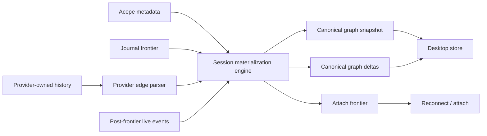

# Refactor: Single Session Materialization Engine

## Goal

Replace Acepe's current multi-path session reconstruction with one backend-owned materialization engine.

The engine must produce the same canonical session graph for every entry point:

- opening a historical session
- reconnecting that historical session
- resuming a live provider session
- answering `acp_get_session_state`
- recovering after app restart
- receiving post-open live events

The UI should render the graph. It must not repair missing tool links, guess operation identity, or replay history to make a session look valid.

## Why This Exists

We are seeing `Unresolved tool` rows in historical sessions because session truth is currently assembled by several competing systems:

- `session_open_snapshot` builds an open graph and arms an open token.
- `async_resume_session_work` reloads provider-owned history, restores projections, and replays buffered events.
- `acp_get_session_state` reloads provider history as a repair path when unresolved tool rows are detected.
- `replay_buffered_session_state_events` reconciles buffered snapshots with restored projections.
- `agent-panel-graph-materializer.ts` has a UI-side fallback from transcript row to operation by `tool_call_id`.

That is the architecture violation. The backend is not acting as one source of truth. Instead, different paths can rebuild the same session differently.

## Requirements Trace

This plan implements the final GOD architecture requirements from:

- `docs/brainstorms/2026-04-25-final-god-architecture-requirements.md`

| Requirement | Meaning For This Plan |
| --- | --- |
| R1 | One backend authority owns session truth. |
| R4 | Materialization always produces one canonical graph. |
| R15 | Provider-owned history stays provider-owned; Acepe stores derived state only. |
| R20 | Open, refresh, reconnect, resume, live, provider-history, and crash recovery all use the same graph and revision model. |
| R21 | Stale lineage is fixed by a fresh canonical snapshot, not local repair. |
| R22 | Tokens and watermarks are delivery mechanics, not semantic truth. |
| R23 | Desktop stores consume snapshots and deltas; they do not repair them. |
| R28 | Tests must prove the full session lifecycle. |

Local requirements for this refactor:

- P1: historical session open must hydrate a complete graph, then reconnect after that graph is applied.
- P2: every transcript tool row must point to a backend operation, or to a typed degraded operation created by the backend.
- P3: reconnect must deliver only post-frontier live events. It must not replay historical content.
- P4: `acp_get_session_state` must not repair unresolved rows by reloading provider history after the fact.
- P5: UI graph materialization must not infer missing tool links from display text or fallback ids.
- P6: the unresolved-tool sessions that reproduced this bug must become test fixtures or reduced corpus cases.

## Scope

In scope:

- Rust backend session materialization.
- Historical open and reconnect.
- Session resume and buffered live event handling.
- `acp_get_session_state`.
- Projection restore semantics.
- UI graph materializer cleanup where it currently repairs backend gaps.
- Tests that prove the invariant end to end.

Out of scope:

- Making historical sessions read-only.
- Removing reconnect for historical sessions.
- Hiding unresolved tools in the UI.
- Adding a new provider-history cache.
- Redesigning provider JSONL formats.
- Visual redesign of tool cards.

## Current Evidence

Important files:

- `packages/desktop/src-tauri/src/acp/session_open_snapshot/mod.rs`
  - Builds the open graph.
  - Arms an open token.
  - Logs unresolved tool rows in the open graph.
- `packages/desktop/src-tauri/src/acp/commands/session_commands.rs`
  - `acp_get_session_state` currently has a repair path that reloads provider-owned history when unresolved tools exist.
  - `async_resume_session_work` currently loads provider-owned snapshots, restores projection state, then replays buffered events.
  - `replay_buffered_session_state_events` reconciles buffered events with restored projection state.
- `packages/desktop/src-tauri/src/acp/projections/mod.rs`
  - `restore_session_projection` removes then recreates projection state for a session.
  - Merge helpers preserve some source links, but deletion before restore still makes the path dangerous.
- `packages/desktop/src/lib/acp/session-state/agent-panel-graph-materializer.ts`
  - Builds an operation index by `operation.source_link.entry_id`.
  - Falls back to `tool_call_id`, which means the UI is repairing missing backend identity.
- `packages/desktop/src/lib/acp/store/services/session-open-hydrator.ts`
  - Good direction: applies a backend `SessionOpenFound` snapshot as a consumer.

Older plans already pointed in the same direction:

- `docs/plans/2026-04-15-001-refactor-projection-first-session-startup-plan.md`
- `docs/plans/2026-05-12-002-fix-restored-tool-resolution-plan.md`

The second plan fixed symptoms, but it also preserved repair paths. This plan removes the repair architecture.

## Chosen Architecture

Create one backend materialization engine:

```text
provider history
    +
Acepe metadata
    +
journal frontier
    +
runtime/live frontier
    =
MaterializedSession
```

`MaterializedSession` is the only full snapshot product that open, resume, state lookup, and recovery may publish to the app.

The same module also owns live delta reduction after reconnect. Live deltas are not a second truth builder. They must pass through the same source-linking and invariant checks as snapshots.



The key rule:

```text
Every transcript tool row must already be linked to a backend operation
before the UI receives it.

If provider evidence is incomplete, the backend creates a typed degraded
operation. The UI may render that degraded operation, but it must not guess.
```

## Materialization Contract

The materialization module has two public jobs:

- build a full `MaterializedSession` snapshot
- reduce a post-frontier live event into a canonical graph delta

Both jobs must use the same invariant layer.

The module must be the only code allowed to decide:

- whether a provider row is user-visible
- which operation belongs to a transcript tool row
- whether incomplete provider evidence becomes a typed degraded operation
- which frontier a reconnect may continue from
- which session revision is safe to commit

The module must not persist provider history as a new Acepe cache. Provider history remains provider-owned input.

Open tokens are local delivery capabilities. They must not become semantic session truth, and they must not be persisted as part of the user-visible graph.

## Determinism Contract

For the same provider history and Acepe metadata, materialization must produce the same normalized graph every time.

Rules:

- operation ids are derived from stable provider/source identity
- degraded operation ids are derived from stable source identity plus degradation reason
- transcript row order is derived from provider order plus explicit tie-breakers
- graph revision is derived from normalized graph content and frontier values
- no random ids, wall-clock timestamps, or local load order may change graph identity
- live deltas must be idempotent when the same event is received more than once

This is required so open, resume, recovery, and state lookup can be compared directly in tests.

## Alternatives Considered

| Option | Description | Result | Why |
| --- | --- | --- | --- |
| Patch current guards | Add more checks around unresolved rows and replay ordering. | Rejected | It keeps several truth builders alive. Bugs move instead of disappearing. |
| UI self-healing | Let Svelte map unresolved rows to operations by ids or text. | Rejected | The UI becomes a semantic repair layer. That breaks the source-of-truth rule. |
| Keep `acp_get_session_state` repair | Repair after unresolved rows are detected. | Rejected | State lookup becomes a hidden materializer. It can disagree with open and resume. |
| Provider adapters emit final graph directly | Each adapter returns the finished graph. | Rejected | It duplicates graph rules across providers and makes invariants harder to prove. |
| Single materialization engine | Provider adapters emit normalized evidence; one engine builds the graph. | Chosen | One authority, testable invariants, deterministic reconnect, smaller UI. |

## Implementation Plan

### 1. Add Failing Characterization Tests

Purpose: prove the current failure before changing production logic.

Tests to add or extend:

- Rust tests for historical open and reconnect:
  - `packages/desktop/src-tauri/src/acp/session_open_snapshot/mod.rs`
  - `packages/desktop/src-tauri/src/acp/commands/session_commands.rs`
- Rust projection tests:
  - `packages/desktop/src-tauri/src/acp/projections/mod.rs`
- UI graph tests:
  - `packages/desktop/src/lib/acp/session-state/__tests__/agent-panel-graph-materializer.test.ts`

Required cases:

- A historical provider session with tool rows opens with no unresolved tool rows.
- A historical provider session hydrates first, then reconnects with the exact open token.
- Reconnect delivers only events after the materialized frontier.
- `acp_get_session_state` does not run an unresolved-count repair path.
- A transcript tool row without enough provider evidence becomes a backend degraded operation.
- The UI renders degraded operations but does not guess missing links.
- Historical open, resume, and `acp_get_session_state` produce the same normalized graph for the same provider history.
- Live post-frontier deltas use the same invariant checker as full snapshots.
- Running materialization twice over the same fixture produces the same graph revision and stable operation ids.

Use reduced fixtures from the known bad sessions:

- `b859c458-ca4f-4c31-a3aa-6c606a1c065f`
- `f2197319-e8dd-43fb-af8e-7d4a0ca22ea4`
- `4c6efddf-9d1b-4f9a-a2ef-43a251411cde`

The fixture should be small. Keep only the entries needed to reproduce the broken tool linkage.

### 2. Introduce `session_materialization`

Create:

- `packages/desktop/src-tauri/src/acp/session_materialization/mod.rs`
- `packages/desktop/src-tauri/src/acp/session_materialization/types.rs`
- `packages/desktop/src-tauri/src/acp/session_materialization/invariants.rs`
- `packages/desktop/src-tauri/src/acp/session_materialization/tests.rs`

Expose one main API:

```rust
materialize_session(input) -> Result<MaterializedSession, MaterializationError>
```

Expose one live-delta API from the same module:

```rust
reduce_live_event(input) -> Result<MaterializedSessionDelta, MaterializationError>
```

The real type names can follow local Rust style, but the shape must include:

- session identity
- canonical transcript graph
- canonical operation graph
- source links
- interaction rows
- lifecycle state
- journal frontier
- provider frontier
- attach/reconnect token data
- invariant report
- deterministic graph revision

Engine responsibilities:

- Parse normalized provider evidence.
- Link every transcript tool row to an operation by source identity.
- Create typed degraded operations for incomplete but displayable provider evidence.
- Filter provider-internal rows that should not reach the user transcript.
- Emit invariant failures before data reaches Tauri command responses.
- Emit performance timing and row counts for debugging.
- Reduce live events with the same source-linking rules used for full snapshots.
- Derive stable ids and revisions from source evidence.

Important rule: the engine is allowed to degrade data. It is not allowed to emit an invalid graph.

### 3. Route Historical Open Through The Engine

Modify:

- `packages/desktop/src-tauri/src/acp/session_open_snapshot/mod.rs`
- `packages/desktop/src-tauri/src/history/commands/session_loading.rs`

Desired result:

- Historical open asks the engine for `MaterializedSession`.
- `SessionOpenResult` is built from that materialized output.
- The open token is armed from the materialized frontier.
- Existing open-token reconnect behavior remains.

Remove or demote:

- unresolved warning logic that exists because invalid graphs can still be emitted.

Replace it with:

- invariant counters from the materializer.
- test failure if an invalid graph is emitted.

### 4. Route Resume And Reconnect Through The Same Engine

Modify:

- `packages/desktop/src-tauri/src/acp/commands/session_commands.rs`
- related runtime/open-token registry code used by reconnect

Desired result:

- `async_resume_session_work` does not rebuild the session using a different restore path.
- Resume obtains the same materialized graph shape as historical open.
- Reconnect uses the materialized frontier and token only for delivery.
- Buffered live events are accepted only when they are newer than the materialized frontier.
- Accepted live events are reduced by `session_materialization`, not by a separate projection-specific repair path.

Remove:

- historical snapshot replay as a repair mechanism.
- merge logic that tries to reconcile two full historical graphs.

Keep:

- live post-frontier delivery.
- idempotent duplicate-open behavior.
- reconnect after historical open.

### 5. Remove `acp_get_session_state` Repair

Modify:

- `packages/desktop/src-tauri/src/acp/commands/session_commands.rs`

Current smell:

- `acp_get_session_state` detects unresolved tool rows.
- It reloads provider-owned session history.
- It replaces the stored graph if unresolved count improves.

Desired result:

- `acp_get_session_state` returns the already committed materialized graph.
- If no committed graph exists, it may call the materializer once to create one.
- It must not inspect unresolved counts and choose a better graph after the fact.

This keeps state lookup as a read path, not a hidden repair writer.

### 6. Simplify Projection Restore Semantics

Modify:

- `packages/desktop/src-tauri/src/acp/projections/mod.rs`

Desired result:

- Projection restore accepts a complete materialized graph.
- It does not delete then rebuild from partial evidence while another path may still hold older graph state.
- Restore is revision-aware and idempotent.
- Source links are preserved because the engine authored them, not because a later merge patched them back.

This step may require a small projection API change:

- from "restore this provider snapshot"
- to "commit this materialized session revision"

### 7. Remove UI Semantic Repair

Modify:

- `packages/desktop/src/lib/acp/session-state/agent-panel-graph-materializer.ts`
- related tests under `packages/desktop/src/lib/acp/session-state/__tests__/`

Remove:

- fallback operation lookup by `tool_call_id`.
- any logic that repairs missing backend links.

Keep:

- pure rendering transformation from canonical graph to UI rows.
- display handling for backend degraded operations.

Desired UI invariant:

```text
If the UI receives a tool transcript row, it either has a source-linked
operation or a backend degraded operation.
```

### 8. Delete Old Paths And Add Guard Tests

Search for and remove or rewrite:

- unresolved-count repair branches
- replay reconciliation that accepts full historical snapshots after open
- UI fallback identity matching
- duplicated provider-owned snapshot loads in state lookup and resume

Add guard tests:

- `acp_get_session_state` cannot improve unresolved counts by loading provider history.
- UI graph materializer cannot resolve a tool row unless the backend source link exists.
- historical open and resumed state produce the same graph revision for the same provider history.

## Verification Plan

Run focused checks first:

```bash
cd packages/desktop
bun test src/lib/acp/session-state/__tests__/agent-panel-graph-materializer.test.ts
bun run check
```

Run Rust tests for touched modules:

```bash
cd packages/desktop/src-tauri
cargo test acp::session_materialization
cargo test acp::session_open_snapshot
cargo test acp::commands::session_commands
cargo test acp::projections
```

Manual QA in the dev app:

- Open a historical session that used to show `Unresolved tool`.
- Confirm no replay-like loading happens on open.
- Confirm it reconnects after hydration.
- Confirm sending a new message works after reconnect.
- Confirm stop/model controls reflect real running state.
- Confirm session title still comes from backend-derived first user message unless renamed.
- Confirm long sessions do not create new scroll or flicker regressions.

## Performance Requirements

The materializer must be measured, not guessed.

Record:

- provider rows read
- rows accepted
- rows filtered
- operations emitted
- degraded operations emitted
- materialization duration
- graph byte size
- frontier values

Target behavior:

- one provider-history scan per materialization
- no UI-side repair scan
- no duplicate provider-history reload in `acp_get_session_state`
- no historical replay over the live event path

## Risks

| Risk | Mitigation |
| --- | --- |
| The new engine becomes too large. | Keep provider parsing, invariant checks, and commit/publish steps in separate files. |
| Provider formats contain messy edge cases. | Convert messy cases into typed degraded operations with tests. |
| We accidentally remove historical reconnect again. | Guard test: historical open must arm and claim a reconnect token. |
| Hidden repair paths remain. | Add search-based review checklist and behavior tests for state lookup and UI fallback removal. |
| Performance regresses on long sessions. | Add timing counters and reduced long-session fixtures. |
| Degraded operations become a dumping ground. | Count them, log source reason, and test exact degradation cases. |

## Done Criteria

- One materialization engine owns session graph construction.
- Historical open, resume, reconnect, state lookup, and recovery all use the engine.
- Historical sessions still reconnect after hydration.
- `acp_get_session_state` no longer repairs unresolved rows by reloading provider history.
- UI graph materializer no longer guesses missing tool links.
- Known bad historical sessions do not render `Unresolved tool`.
- Focused TypeScript and Rust tests pass.
- `bun run check` passes.
- The plan has passed document review before implementation starts.

## Review Checklist

Before coding, verify:

- Does every entry point use the same canonical materialization output?
- Is reconnect preserved for historical sessions?
- Are tokens described only as delivery mechanics?
- Is replay limited to post-frontier live events?
- Is the UI forbidden from semantic repair?
- Are degraded operations backend-authored and typed?
- Are tests behavior-based rather than source-string tests?
