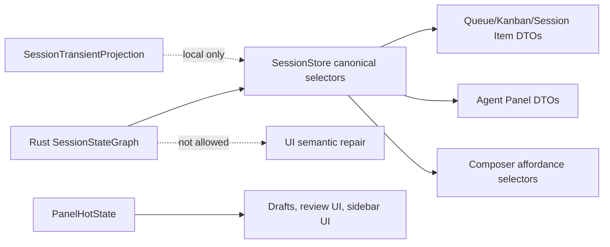

# Refactor: Canonical UI Session Projections

## Overview

This plan continues the GOD architecture cleanup after the operation-store escape hatch was removed. The next work removes remaining UI/session presentation reads from broad session-local state and replaces them with narrow canonical selectors.

The user asked whether this is "clean" or "refactor." The decision is: this is a **refactor**. "Clean" describes the quality bar and style: delete dead doors, simplify names, and reduce surface area. The work itself changes ownership boundaries and public store APIs, so it belongs under `refactor`.

## Problem Frame

The final GOD architecture requires one product-state path: provider facts go to Rust-owned canonical session graph, then TypeScript stores/selectors project that graph for UI. Recent work removed direct `OperationStore` ownership from UI code, but several UI and store surfaces still read broad `SessionTransientProjection` or `SessionRuntimeState` objects.

Those broad reads are risky because they make it easy for future code to pull lifecycle, activity, sendability, or failure state from local hot state instead of canonical projection. Even when current usage is harmless, the API shape still invites split authority.

## Requirements Trace

- R1. Product session truth must flow from provider edge to canonical graph to desktop selectors to UI. (see origin: `docs/brainstorms/2026-04-25-final-god-architecture-requirements.md`)
- R12. Lifecycle, actionability, model/mode availability, send enablement, retry/resume/archive affordances, status copy, and recovery UI must derive from canonical lifecycle/actionability/capability/activity selectors.
- R13. `SessionHotState` must not own lifecycle truth or CTA behavior.
- R13a. True local fields near hot-state must move behind explicit selectors rather than staying as hidden authority.
- R23. Desktop stores must consume and project canonical state, not repair it.
- R24. Agent panel, tab bar, queue, kanban, status cells, and composer presentation models must derive from canonical session/operation/lifecycle selectors.
- R27. Deletion proof must show old authorities are gone or diagnostic/local-only.

## Scope Boundaries

- This plan does not remove `PanelHotState`; panel UI state like drafts, review drawer state, sidebar expansion, and pending pre-session visuals is local UI state.
- This plan does not redesign queue, kanban, agent panel, or composer UI.
- This plan does not remove every use of the word `fallback`; many are UI rendering, browser, file preview, or text-selection fallbacks, not GOD violations.
- This plan does not change Rust graph semantics unless a missing selector exposes a real canonical model gap.
- This plan does not implement a new durable cache or restore path.

## Context & Research

### Relevant Code and Patterns

- `packages/desktop/src/lib/acp/store/session-store.svelte.ts` already exposes narrow canonical accessors such as `getSessionCanSend`, `getSessionLifecycleStatus`, `getSessionCurrentModeId`, `getSessionToolCalls`, and `getSessionOperationInteractionSnapshot`.
- `packages/desktop/src/lib/acp/store/live-session-work.ts`, `session-work-projection.ts`, `tab-bar-utils.ts`, and `queue/utils.ts` centralize session presentation mapping.
- `packages/desktop/src/lib/components/main-app-view/components/app-queue-row.svelte`, `content/kanban-view.svelte`, `components/ui/session-item/session-item.svelte`, `acp/components/agent-panel/components/agent-panel.svelte`, and `acp/components/agent-input/agent-input-ui.svelte` still read `getSessionRuntimeState` or `getHotState` directly.
- `packages/desktop/src/lib/acp/store/session-entry-store.svelte.ts` still exposes compatibility writer methods such as `storeEntriesAndBuildIndex`, `aggregateAssistantChunk`, `recordToolCallTranscriptEntry`, and `updateToolCallTranscriptEntry`.
- `packages/desktop/src/lib/acp/store/tab-bar-store.svelte.ts` and `urgency-tabs-store.svelte.ts` still receive broad hot state while building tab/urgency data.

### Institutional Learnings

- `docs/solutions/architectural/canonical-projection-widening-2026-04-28.md` defines the residual hot-state allowlist and warns against `canonical ?? hotState` fallback.
- `docs/solutions/best-practices/canonical-session-projection-ui-derivation-2026-05-01.md` says UI-visible lifecycle, connection, streaming, pause, and error state must come from canonical projection helpers.
- `docs/solutions/architectural/revisioned-session-graph-authority-2026-04-20.md` says raw frames and local runtime state may coordinate optimistic UX but cannot own durable transcript, runtime, tool, or telemetry truth.

### External References

- External research skipped. This is codebase-specific architecture cleanup with strong local patterns and existing requirements.

## Planning Inventory

This inventory was collected before implementation planning. It is the input that shapes the implementation units below.

### Session-Semantic Broad Reads To Replace

These reads expose broad session runtime or session hot-state objects to UI/store presentation code. They should move to narrow selectors.

- `packages/desktop/src/lib/components/ui/session-item/session-item.svelte`
  - Reads `getSessionRuntimeState`.
  - Risk: session item can depend on broad runtime shape instead of canonical presentation selectors.
- `packages/desktop/src/lib/components/main-app-view/components/app-queue-row.svelte`
  - Reads `getSessionRuntimeState` and `getHotState`.
  - Risk: queue rows can mix local pending state with canonical session presentation.
- `packages/desktop/src/lib/components/main-app-view/components/content/kanban-view.svelte`
  - Reads `getSessionRuntimeState`.
  - Risk: kanban cards can depend on broad runtime shape instead of shared canonical selectors.
- `packages/desktop/src/lib/acp/components/agent-panel/components/agent-panel.svelte`
  - Reads `sessionStore.getHotState` and `getSessionRuntimeState`.
  - Risk: agent panel can keep receiving broad session-local state for semantic rendering.
- `packages/desktop/src/lib/acp/components/agent-input/agent-input-ui.svelte`
  - Reads `sessionStore.getHotState` and `getSessionRuntimeState`.
  - Risk: composer can mix canonical actionability with broad local state.
- `packages/desktop/src/lib/acp/components/model-selector.metrics-chip.svelte`
  - Reads `sessionStore.getHotState(sessionId).usageTelemetry`.
  - Risk: telemetry has an allowed local snapshot today, but the component should still receive it through an explicit selector.
- `packages/desktop/src/lib/acp/store/tab-bar-store.svelte.ts`
  - Reads session hot state while building tab data.
  - Risk: tab presentation can keep broad hot-state access even when only stable timing/local fields are intended.
- `packages/desktop/src/lib/acp/store/urgency-tabs-store.svelte.ts`
  - Reads session hot state for urgency data.
  - Risk: urgency display can accidentally use hot state as lifecycle/activity authority.

### Legal Panel-Local Hot State To Keep Local

These reads are panel UI state, not session product truth. They should remain local, but can become narrower panel selectors if useful.

- `packages/desktop/src/lib/components/main-app-view/components/content/agent-panel-host.svelte`
  - Reads `panelStore.getHotState` for panel-local UI.
- `packages/desktop/src/lib/components/main-app-view/components/content/kanban-thread-dialog.svelte`
  - Reads panel review mode, review files state, and review file index.
- `packages/desktop/src/lib/components/main-app-view/components/content/kanban-view.svelte`
  - Reads panel pending user entry, pending worktree setup, and provisional autonomous state for optimistic/pre-session cards.
- `packages/desktop/src/lib/acp/components/agent-panel/components/agent-panel.svelte`
  - Reads panel drafts, browser/sidebar UI state, and pending-user-entry presence.
- `packages/desktop/src/lib/acp/components/agent-input/agent-input-ui.svelte`
  - Reads panel-local draft/provisional launch state.
- `packages/desktop/src/lib/acp/components/agent-input/state/agent-input-state.svelte.ts`
  - Reads panel pending user entry for composer-local behavior.
- `packages/desktop/src/lib/acp/store/workspace-store.svelte.ts`
  - Persists panel UI fields such as draft, review mode, review file index, and drawer state.
- `packages/desktop/src/lib/acp/store/panel-store.svelte.ts`
  - Owns panel hot state and can keep local UI state there.

### Internal Store/Service Reads To Narrow Later

These are not direct UI leaks, but they should stay inside explicit boundaries and remain on the residual hot-state allowlist.

- `packages/desktop/src/lib/acp/store/session-store.svelte.ts`
  - Uses hot state for `capabilityMutationState`, pending-send intent, `acpSessionId`, telemetry snapshots, and canonical envelope carry-forward.
- `packages/desktop/src/lib/acp/store/services/session-connection-manager.ts`
  - Reads `acpSessionId` and `autonomousTransition`.
- `packages/desktop/src/lib/acp/store/services/interfaces/session-state-reader.ts`
  - Still exposes `getHotState`.
- `packages/desktop/src/lib/acp/store/services/interfaces/transient-projection-manager.ts`
  - Owns transient projection mutation.
- `packages/desktop/src/lib/acp/store/session-event-handler.ts`
  - Still includes `getHotState` in the event-handler surface.

### Compatibility Entry Writer Doors

These are separate from hot-state reads but still matter for deletion proof.

- `packages/desktop/src/lib/acp/store/session-entry-store.svelte.ts`
  - Still exposes `storeEntriesAndBuildIndex`, `aggregateAssistantChunk`, `recordToolCallTranscriptEntry`, and `updateToolCallTranscriptEntry`.
- `packages/desktop/src/lib/acp/store/services/chunk-aggregator.ts`
  - Still writes compatibility display rows through the internal entry-store interface.
- `packages/desktop/src/lib/acp/store/services/transcript-tool-call-buffer.svelte.ts`
  - Still writes compatibility tool rows through the internal entry-store interface.

## Key Technical Decisions

- **Treat this as refactor, not cosmetic cleaning:** The public API shape changes who is allowed to see session truth.
- **Prefer narrow selectors over broad object reads:** UI should ask for exactly the value it needs, not receive `SessionTransientProjection` or `SessionRuntimeState`.
- **Keep local state local:** Panel state and local send-click affordances may remain local, but their selectors should make that explicit.
- **Delete wrapper doors once callers move:** Do not keep broad getters for convenience after narrow selectors exist.
- **Use characterization tests first:** Existing behavior should not drift while the ownership boundary changes.

## Open Questions

### Resolved During Planning

- **Clean or refactor?** Refactor. "Clean" is the execution style; the work changes API boundaries and authority ownership.
- **Update the completed GOD plan or create a follow-on?** Create a follow-on. The existing `2026-05-18-001` plan is marked completed and already contains many executed units. A new active plan gives the remaining work a cleaner review boundary.

### Deferred to Implementation

- **Exact selector names:** Defer to implementation so names can follow nearby store conventions.
- **Whether every internal store/service hot-state read should remain on the allowlist:** Defer per unit; keep only `acpSessionId`, `autonomousTransition`, `statusChangedAt`, `modelPerMode`, `usageTelemetry`, `pendingSendIntent`, and `capabilityMutationState` unless a new canonical gap is proven.
- **Whether compatibility entry writer doors can be fully deleted now:** Defer until test seams prove no production caller still needs them.

## High-Level Technical Design

> *This illustrates the intended approach and is directional guidance for review, not implementation specification. The implementing agent should treat it as context, not code to reproduce.*



The target shape is simple: UI surfaces receive presentation-safe values from `SessionStore` or panel-local selectors. They do not inspect broad session hot state or runtime objects.

## Implementation Units

- [x] **Unit 1: Lock The Inventory With Characterization Tests**

**Goal:** Convert the planning inventory into guardrails before changing behavior.

**Requirements:** R12, R13, R13a, R23, R27

**Dependencies:** Completed `2026-05-18-001` operation-store escape-hatch removal.

**Files:**
- Modify: `docs/plans/2026-05-18-002-refactor-canonical-ui-session-projections-plan.md`
- Test: `packages/desktop/src/lib/acp/store/__tests__/session-store-projection-state.vitest.ts`
- Test: `packages/desktop/src/lib/acp/store/__tests__/tab-bar-store.test.ts`
- Test: `packages/desktop/src/lib/acp/store/queue/__tests__/queue-utils.test.ts`

**Approach:**
- Use the Planning Inventory above as the starting point.
- Add or confirm characterization tests for queue, tab, urgency, and session-store projection behavior before selector migration.
- If implementation discovers a missed broad read, update the inventory before changing that area.
- Treat missed inventory as a planning correction, not as an excuse for ad hoc code changes.

**Execution note:** Characterization-first. Do not change behavior in this unit except plan/inventory updates.

**Patterns to follow:**
- `docs/solutions/architectural/canonical-projection-widening-2026-04-28.md`
- `docs/solutions/best-practices/canonical-session-projection-ui-derivation-2026-05-01.md`

**Test scenarios:**
- Happy path: ready canonical session displays ready/idle state in queue and tab surfaces before selector migration.
- Edge case: stale local hot state does not override canonical failed lifecycle in existing projection tests.
- Integration: pending interaction presentation remains operation-backed before selector migration.

**Verification:**
- The planning inventory is explicit, and tests protect the current behavior that later units will preserve.

- [x] **Unit 2: Add Narrow Session Presentation Selectors**

**Goal:** Add selectors that replace UI reads of broad runtime/hot-state objects with specific values.

**Requirements:** R12, R13a, R23, R24

**Dependencies:** Planning Inventory and Unit 1 guardrail coverage.

**Files:**
- Modify: `packages/desktop/src/lib/acp/store/session-store.svelte.ts`
- Modify: `packages/desktop/src/lib/acp/store/session-work-projection.ts`
- Modify: `packages/desktop/src/lib/acp/store/live-session-work.ts`
- Test: `packages/desktop/src/lib/acp/store/__tests__/session-store-projection-state.vitest.ts`
- Test: `packages/desktop/src/lib/acp/store/__tests__/live-session-work.test.ts`

**Approach:**
- Introduce selectors only for values that UI surfaces actually need.
- Prefer existing canonical projection fields over local runtime state.
- Keep local-only values visibly named as local, for example pending-send, telemetry snapshot, or stable status timing.
- Avoid returning full `SessionTransientProjection` or full `SessionRuntimeState` to components.

**Execution note:** Test-first for every selector that replaces a semantic UI decision.

**Patterns to follow:**
- Existing narrow methods in `session-store.svelte.ts`, such as `getSessionCanSend`, `getSessionCurrentModeId`, and `getSessionOperationInteractionSnapshot`.
- Existing projection tests in `session-store-projection-state.vitest.ts`.

**Test scenarios:**
- Happy path: canonical ready session -> selectors report sendable/ready presentation values without reading hot state.
- Edge case: missing canonical projection -> selectors fail closed or return neutral values defined by existing projection helpers.
- Edge case: pending local send intent -> selector exposes only the local disablement affordance, not a fake running lifecycle.
- Integration: graph snapshot and lifecycle-only envelope produce the same selector output for the same canonical state.

**Verification:**
- New selectors cover the UI reads identified in the Planning Inventory without exposing broad state objects.

- [x] **Unit 3: Migrate Queue, Kanban, And Session Item Surfaces**

**Goal:** Move list-like and board-like session surfaces to narrow selectors.

**Requirements:** R12, R14, R24

**Dependencies:** Unit 2 selectors.

**Files:**
- Modify: `packages/desktop/src/lib/components/main-app-view/components/app-queue-row.svelte`
- Modify: `packages/desktop/src/lib/components/main-app-view/components/content/kanban-view.svelte`
- Modify: `packages/desktop/src/lib/components/ui/session-item/session-item.svelte`
- Modify: `packages/desktop/src/lib/acp/store/tab-bar-store.svelte.ts`
- Modify: `packages/desktop/src/lib/acp/store/urgency-tabs-store.svelte.ts`
- Test: `packages/desktop/src/lib/acp/store/queue/__tests__/queue-utils.test.ts`
- Test: `packages/desktop/src/lib/acp/store/__tests__/tab-bar-store.test.ts`
- Test: `packages/desktop/src/lib/acp/store/__tests__/urgency-tabs-store.test.ts`

**Approach:**
- Replace broad runtime/hot-state reads with selector calls.
- Keep queue/kanban DTO builders focused on presentation, not session truth.
- Preserve current UI behavior by comparing existing tests before and after each migration.

**Execution note:** Characterization-first for queue and tab/urgency behavior.

**Patterns to follow:**
- `packages/desktop/src/lib/acp/store/tab-bar-utils.ts`
- `packages/desktop/src/lib/acp/store/queue/utils.ts`
- `packages/desktop/src/lib/acp/store/session-work-projection.ts`

**Test scenarios:**
- Happy path: ready canonical session appears connected and idle across queue, kanban, and session item.
- Happy path: canonical awaiting-model or running-operation activity appears active consistently across surfaces.
- Edge case: stale local hot state says something different from canonical state -> canonical state wins.
- Error path: canonical failed lifecycle surfaces error consistently across all migrated views.
- Integration: pending permission/question/plan approval still appears through operation/interaction snapshot selectors after migration.

**Verification:**
- No production code in these surfaces calls `getSessionRuntimeState` or reads session hot state directly for session semantics.

- [x] **Unit 4: Migrate Agent Panel And Composer Session Semantics**

**Goal:** Keep agent panel and composer reads to canonical selectors for session semantics and panel selectors for local UI state.

**Requirements:** R12, R13, R23, R24, R26

**Dependencies:** Unit 2 selectors.

**Files:**
- Modify: `packages/desktop/src/lib/acp/components/agent-panel/components/agent-panel.svelte`
- Modify: `packages/desktop/src/lib/acp/components/agent-panel/components/agent-panel-content.svelte`
- Modify: `packages/desktop/src/lib/acp/components/agent-input/agent-input-ui.svelte`
- Modify: `packages/desktop/src/lib/acp/components/model-selector.metrics-chip.svelte`
- Test: `packages/desktop/src/lib/acp/components/agent-panel/components/__tests__/agent-panel-content.svelte.vitest.ts`
- Test: `packages/desktop/src/lib/acp/store/__tests__/session-store-projection-state.vitest.ts`

**Approach:**
- Separate panel-local state from session truth in the component code.
- Leave panel hot state for drafts, review mode, local browser/sidebar UI, and provisional local launch UI.
- Move usage telemetry and current-mode/model display through explicit session selectors.
- Keep teardown guards defensive only; they must not invent session semantic values.

**Execution note:** Characterization-first for panel render safety and composer send enablement.

**Patterns to follow:**
- `docs/solutions/best-practices/agent-panel-content-viewport-reactivity-renderer-2026-05-01.md`
- `docs/solutions/ui-bugs/agent-panel-composer-split-brain-canonical-actionability-2026-04-30.md`

**Test scenarios:**
- Happy path: composer enablement follows canonical actionability and local pending-send disablement only.
- Edge case: component mounts before canonical projection exists -> no crash and send controls fail closed.
- Edge case: telemetry display reads a telemetry selector, not full hot state.
- Error path: canonical active turn failure displays through existing error presentation without hot-state fallback.
- Integration: agent panel render tests still pass when `getHotState` is unavailable from the mocked session store except for explicit local selectors.

**Verification:**
- Agent panel and composer no longer receive broad session hot/runtime objects for semantic rendering.

- [x] **Unit 5: Quarantine Or Delete Compatibility Entry Writer Doors**

**Goal:** Make remaining transcript compatibility writer APIs impossible to use as product truth outside their intended legacy/internal boundary.

**Requirements:** R1, R3, R23, R27

**Dependencies:** Units 2-4 reduce frontend dependence on compatibility rows.

**Files:**
- Modify: `packages/desktop/src/lib/acp/store/session-entry-store.svelte.ts`
- Modify: `packages/desktop/src/lib/acp/store/services/chunk-aggregator.ts`
- Modify: `packages/desktop/src/lib/acp/store/services/transcript-tool-call-buffer.svelte.ts`
- Modify: `packages/desktop/src/lib/acp/store/services/interfaces/chunk-aggregator-interface.ts`
- Test: `packages/desktop/src/lib/acp/store/__tests__/session-entry-store-streaming.vitest.ts`
- Test: `packages/desktop/src/lib/acp/store/services/__tests__/chunk-aggregator.test.ts`
- Test: `packages/desktop/src/lib/acp/store/services/__tests__/transcript-tool-call-buffer.test.ts`

**Approach:**
- Re-check production callers for `storeEntriesAndBuildIndex`, `aggregateAssistantChunk`, `recordToolCallTranscriptEntry`, and `updateToolCallTranscriptEntry`.
- Delete methods with no production caller.
- For methods still needed internally, move them behind narrower internal interfaces and name them as compatibility-only.
- Do not remove canonical `replaceTranscriptSnapshot` or `applyTranscriptDelta`.

**Execution note:** Test-first deletion. First prove no production path uses the old door, then remove or narrow it.

**Patterns to follow:**
- The completed `IEntryManager` narrowing in `2026-05-18-001`.
- `packages/desktop/src/lib/acp/store/services/interfaces/entry-store-internal.ts`

**Test scenarios:**
- Happy path: canonical transcript snapshot and delta still materialize display rows.
- Edge case: duplicate provider tool ids in preloaded compatibility rows still collapse only where documented.
- Error path: missing canonical tool row update is ignored/degraded exactly as current tests specify.
- Integration: raw assistant chunk mutation is unavailable through public service/session-store APIs.

**Verification:**
- Production scans show no broad compatibility writer door outside the internal compatibility boundary.

- [x] **Unit 6: Add Deletion-Proof Scans And Documentation**

**Goal:** Record durable proof that remaining UI/session paths follow the GOD authority boundary.

**Requirements:** R27, R28, R29, R30

**Dependencies:** Units 1-5.

**Files:**
- Modify: `docs/plans/2026-05-18-002-refactor-canonical-ui-session-projections-plan.md`
- Modify: `docs/solutions/architectural/final-god-architecture-2026-04-25.md`
- Test: `packages/desktop/src/lib/acp/store/__tests__/session-store-projection-state.vitest.ts`

**Approach:**
- Add final scan patterns and expected empty/non-empty results to this plan.
- Update architecture docs only if the refactor clarifies an enduring rule.
- Keep documentation simple: name the allowed local hot-state fields and forbidden UI broad reads.

**Execution note:** Documentation after code is green; do not document aspirational rules that code does not yet enforce.

**Patterns to follow:**
- Completed sweep notes in `docs/plans/2026-05-18-001-refactor-full-god-session-transcript-authority-plan.md`
- `docs/solutions/architectural/canonical-projection-widening-2026-04-28.md`

**Test scenarios:**
- Test expectation: none for docs-only changes. Existing projection tests and scan proof cover behavior.

**Verification:**
- Search results show no UI semantic broad reads remain, except explicitly documented local UI state.

## Unit 6 Deletion-Proof Scan Results

Run from repository root after Units 1-5:

```bash
rg -n "getSessionRuntimeState|getHotState\([^)]*session|sessionStore\.getHotState|sessionHotState|sessionRuntimeState" \
  packages/desktop/src/lib/acp/components/agent-panel/components/agent-panel.svelte \
  packages/desktop/src/lib/acp/components/agent-input/agent-input-ui.svelte \
  packages/desktop/src/lib/acp/components/model-selector.metrics-chip.svelte \
  packages/desktop/src/lib/components/main-app-view/components/app-queue-row.svelte \
  packages/desktop/src/lib/components/main-app-view/components/content/kanban-view.svelte \
  packages/desktop/src/lib/components/ui/session-item/session-item.svelte \
  packages/desktop/src/lib/acp/store/tab-bar-store.svelte.ts \
  packages/desktop/src/lib/acp/store/urgency-tabs-store.svelte.ts
```

Result: no matches. These migrated UI surfaces no longer read broad session hot/runtime objects for session semantics.

```bash
rg -n "\b(storeEntriesAndBuildIndex|recordToolCallTranscriptEntry|updateToolCallTranscriptEntry|aggregateAssistantChunk|aggregateUserChunk)\b" \
  packages/desktop/src/lib/acp/store \
  packages/desktop/src/lib/acp/components \
  packages/desktop/src/lib/services
```

Result: no matches. The old generic compatibility writer names are gone. Remaining legacy writer APIs are explicitly named `*Compatibility*`, and canonical transcript product truth still enters through `replaceTranscriptSnapshot` and `applyTranscriptDelta`.

Allowed local state after this slice:
- `panelStore.getHotState(...)` remains local UI state for drafts, provisional launch controls, browser sidebar, and pre-session optimistic visuals.
- `SessionTransientProjection` remains reachable inside `SessionStore` for residual local selectors such as pending send, telemetry, autonomous toggle busy, and urgency timestamp.
- UI surfaces must consume those residual values through narrow `SessionStore` selectors, not by reading the full transient projection.

## System-Wide Impact

- **Interaction graph:** Interaction snapshots stay operation-backed and should remain the path for questions, permissions, and plan approvals.
- **Error propagation:** Canonical lifecycle and active-turn failure remain the source of error display; local state may only help with pending UI affordances.
- **State lifecycle risks:** Removing broad reads can expose places where code relied on local state accidentally. Characterization tests should catch behavior drift before deletion.
- **API surface parity:** Queue, kanban, tab, urgency, agent panel, and composer should all use the same selector family for session presentation.
- **Integration coverage:** Cross-surface tests are needed because one selector change can affect many visible surfaces.
- **Unchanged invariants:** Panel UI state remains local. The refactor does not make message drafts, review mode, sidebar expansion, or temporary pre-session visuals canonical session graph state.

## Risks & Dependencies

| Risk | Mitigation |
|------|------------|
| Accidentally removing a legal local UI affordance | The Planning Inventory classifies reads before code changes. |
| UI behavior drift across queue/kanban/tab/session item | Characterization tests before migration and shared selectors after migration. |
| Selector API grows too broad again | Prefer one selector per presentation need; do not return whole transient/runtime objects. |
| Compatibility transcript APIs still needed by tests | Separate test helpers from production interfaces; do not keep production doors for test convenience. |
| Missing canonical field discovered during migration | Stop and widen the canonical model or selector boundary; do not patch in UI. |

## Documentation / Operational Notes

- Update `docs/solutions/architectural/canonical-projection-widening-2026-04-28.md` only if the final allowed hot-state list changes.
- No rollout flag is needed; this is an internal authority-boundary refactor.
- No external research is needed unless implementation discovers a missing Svelte 5 or Tauri pattern.

## Sources & References

- **Origin document:** [docs/brainstorms/2026-04-25-final-god-architecture-requirements.md](../brainstorms/2026-04-25-final-god-architecture-requirements.md)
- Related plan: [docs/plans/2026-05-18-001-refactor-full-god-session-transcript-authority-plan.md](2026-05-18-001-refactor-full-god-session-transcript-authority-plan.md)
- Related learning: [docs/solutions/architectural/canonical-projection-widening-2026-04-28.md](../solutions/architectural/canonical-projection-widening-2026-04-28.md)
- Related learning: [docs/solutions/best-practices/canonical-session-projection-ui-derivation-2026-05-01.md](../solutions/best-practices/canonical-session-projection-ui-derivation-2026-05-01.md)
- Related learning: [docs/solutions/architectural/revisioned-session-graph-authority-2026-04-20.md](../solutions/architectural/revisioned-session-graph-authority-2026-04-20.md)
