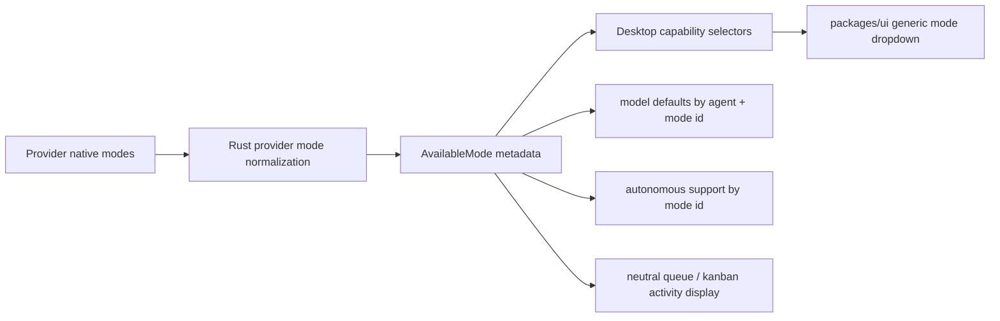

# refactor: Replace Global Plan Build Modes

## Overview

Acepe should stop treating every agent as if it has the same two modes: `Plan` and `Build`. Modes are agent capabilities. The backend should preserve each provider's real mode IDs and expose clear display metadata. The frontend should render those modes in the left composer dropdown, remember model defaults per actual mode ID, and remove generic plan/build grouping from kanban-style surfaces.

This plan is Deep because it touches Rust provider capability truth, Svelte composer UI, shared `packages/ui` components, model preferences, queue/kanban grouping, and tests.

## Problem Frame

The origin document says the current global `Plan` / `Build` choice is too small for Acepe's agent-agnostic goal. Claude Code, Copilot, Cursor, Codex, OpenCode, and future custom agents can expose different modes. The UI should show what the selected agent can actually do, not force every provider into two Acepe-owned labels (see origin: `docs/brainstorms/2026-05-21-agent-specific-modes-requirements.md`).

The GOD architecture rule applies here: provider mode quirks must be normalized in Rust/provider capability data. TypeScript and `packages/ui` should consume canonical mode facts, not repair raw provider IDs downstream.

## Requirements Trace

- R1. Modes are agent-owned capabilities, not a fixed global enum.
- R2. The left composer dropdown shows available modes for the selected agent/session.
- R3. The dropdown uses provider labels and descriptions when clear.
- R4. Low-quality technical IDs may be mapped to clearer agent-specific labels, but unrelated modes must not collapse into `Build`.
- R5. Unknown custom-agent modes remain visible with readable fallback labels.
- R6-R10. Built-in agents get provider-appropriate mode presentation.
- R11-R14. Generic plan/build mode icons, copy, and grouping are removed from shared UI, composer, tabs, queue, and kanban-style surfaces.
- R15. Real provider plan artifacts still use plan wording.
- R16-R18. Model defaults support arbitrary mode IDs while preserving existing saved choices.
- R19-R20. Autonomous support is modeled per agent mode.

## Scope Boundaries

- Do not remove provider plan artifacts such as Claude `ExitPlanMode`, plan approval cards, stored plan documents, or the plan sidebar.
- Do not redesign model discovery.
- Do not add new agent runtimes.
- Do not make all providers expose the same number of modes.

## Context & Research

### Relevant Code and Patterns

- `packages/desktop/src-tauri/src/acp/client_session.rs` owns `AvailableMode`, `SessionModes`, `default_modes`, and `SessionModes::normalize_with_provider`.
- `packages/desktop/src-tauri/src/acp/provider.rs` already has provider hooks for `normalize_mode_id`, `map_outbound_mode_id`, `visible_mode_ids`, and `autonomous_supported_mode_ids`.
- Built-in provider mode behavior lives in:
  - `packages/desktop/src-tauri/src/acp/providers/claude_code.rs`
  - `packages/desktop/src-tauri/src/acp/providers/copilot.rs`
  - `packages/desktop/src-tauri/src/acp/providers/cursor.rs`
  - `packages/desktop/src-tauri/src/acp/providers/codex.rs`
  - `packages/desktop/src-tauri/src/acp/providers/opencode.rs`
  - `packages/desktop/src-tauri/src/acp/opencode/http_client/agent_client_impl.rs`
- `packages/desktop/src/lib/acp/components/agent-input/agent-input-ui.svelte` filters modes through `filterVisibleModes`, resolves the current mode, handles autonomous, and passes modes to `AgentInputComposerToolbar`.
- `packages/ui/src/components/agent-panel/agent-input-mode-pill.svelte` hardcodes the current plan/build pill. `packages/ui/src/components/agent-panel/agent-input-mode-selector.svelte` is closer to the requested dropdown but also hardcodes plan/build icons.
- `packages/desktop/src/lib/acp/store/agent-model-preferences-store.svelte.ts` already stores session model memory as `sessionId -> modeId -> modelId`, but default model preferences are typed as `plan?` and `build?`.
- `packages/desktop/src/lib/acp/store/session-work-projection.ts`, `packages/desktop/src/lib/acp/store/queue/queue-section-utils.ts`, `packages/desktop/src/lib/acp/components/queue/queue-section.svelte`, and `packages/ui/src/components/attention-queue/*` still use `planning` / `working` sections and plan/build icons.
- `packages/desktop/src/lib/acp/components/tab-bar/tab-bar.svelte` maps every non-plan mode to `build`; `packages/ui/src/components/app-layout/types.ts` only allows `AppTabMode = "build" | "plan" | null`.

### Institutional Learnings

- `docs/solutions/best-practices/autonomous-mode-as-rust-side-policy-hook-2026-04-11.md` supports keeping autonomous policy in Rust/provider-owned capability data instead of TypeScript guesses.
- GOD architecture guidance requires canonical session capability facts to come from Rust-owned data and forbids UI repair passes for provider-specific quirks.

### External References

- None. The repo already has strong local provider capability patterns, and the work is mostly internal architecture/UI cleanup.

## Key Technical Decisions

- **Rust owns mode normalization and presentation.** Provider-native IDs should be normalized once at the provider boundary. The UI consumes `AvailableMode` metadata.
- **Stop using `CanonicalModeId` as a two-value app enum.** Existing `plan` and `build` values may remain as legacy mode IDs during migration, but new logic should accept any string mode ID.
- **Replace mode filtering with provider-visible modes.** TypeScript should not filter to `[build, plan]`; it should render the mode list already approved by provider capability data.
- **Use neutral activity buckets for queue/kanban.** Replace global `planning` / `working` grouping with lifecycle/activity names such as `thinking` and `running`, so kanban no longer implies app-wide plan/build phases.
- **Autonomous support follows actual mode IDs.** The current `build`-only assumption moves to provider mode metadata and agent capability lists.

## Open Questions

### Resolved During Planning

- **What should replace plan/build in kanban-like sections?** Use neutral runtime activity labels (`Thinking`, `Running`, `Needs review`, `Input needed`, `Error`) rather than provider mode labels. This removes the app-level planning/building idea while still showing useful status.
- **Should provider plan artifacts keep plan wording?** Yes. They are real provider artifacts, not the old global mode concept.
- **Should model memory be rewritten?** Per-session memory already uses arbitrary mode IDs. Only default model preferences need widening.

### Deferred to Implementation

- **Exact built-in mode labels:** The implementer should choose final labels while editing provider metadata, using provider names when available and readable fallbacks for raw IDs.
- **Exact generic icon set:** The implementer should choose available `phosphor-svelte` or existing UI icons while removing plan/build-only icons.

## High-Level Technical Design

> *This illustrates the intended approach and is directional guidance for review, not implementation specification. The implementing agent should treat it as context, not code to reproduce.*

## Implementation Units

- [ ] **Unit 1: Make Provider Modes First-Class**

**Goal:** Preserve real provider mode IDs and expose enough metadata for generic UI rendering.

**Requirements:** R1-R10, R19-R20

**Dependencies:** None

**Files:**
- Modify: `packages/desktop/src-tauri/src/acp/client_session.rs`
- Modify: `packages/desktop/src-tauri/src/acp/provider.rs`
- Modify: `packages/desktop/src-tauri/src/acp/capability_resolution.rs`
- Modify: `packages/desktop/src-tauri/src/acp/providers/claude_code.rs`
- Modify: `packages/desktop/src-tauri/src/acp/providers/copilot.rs`
- Modify: `packages/desktop/src-tauri/src/acp/providers/cursor.rs`
- Modify: `packages/desktop/src-tauri/src/acp/providers/codex.rs`
- Modify: `packages/desktop/src-tauri/src/acp/providers/opencode.rs`
- Modify: `packages/desktop/src-tauri/src/acp/opencode/http_client/agent_client_impl.rs`
- Test: existing Rust provider and capability tests near the modified files
- Test: `packages/desktop/src-tauri/src/acp/client/tests.rs`

**Approach:**
- Widen `AvailableMode` with optional presentation metadata only if existing `id`, `name`, and `description` are not enough. Keep the contract simple.
- Replace the global `default_modes()` assumption with provider-owned default or fallback modes.
- Change provider normalization so equivalent aliases may normalize together, but distinct modes do not collapse into generic `build`.
- Cursor must preserve `ask` and `agent` as distinct visible modes.
- Copilot should normalize long ACP/legacy URIs into readable Copilot mode IDs while mapping outbound IDs back to provider-native values.
- Claude Code should keep provider-meaningful choices; legacy `build` can map to the correct Claude runtime mode for old saved data.
- Codex and OpenCode fallback modes should not be named `Build` / `Plan` unless the provider really supplied those modes.
- Autonomous-supported mode IDs should match the final visible mode IDs.

**Execution note:** Add characterization coverage for current provider mappings before changing mode normalization.

**Patterns to follow:**
- Provider-owned policy hooks in `packages/desktop/src-tauri/src/acp/provider.rs`.
- Existing provider tests around `normalize_mode_id`, `map_outbound_mode_id`, and `autonomous_supported_mode_ids`.

**Test scenarios:**
- Happy path: Claude Code capabilities expose readable modes and legacy `build` outbound mapping still works.
- Happy path: Copilot ACP/legacy mode URIs normalize into readable mode IDs and map back outbound.
- Happy path: Cursor `ask` and `agent` remain separate modes.
- Happy path: Codex/OpenCode fallback modes use non-plan/build names when provider data is missing.
- Edge case: unknown custom mode ID is preserved and gets a readable fallback label.
- Integration: `resolve_live_capabilities` returns current mode and available modes that include provider metadata and autonomous support.

**Verification:**
- Provider capability tests prove modes are not forced into global `plan` / `build`.
- Existing session creation and resume flows still receive a valid current mode.

- [ ] **Unit 2: Remove Two-Mode Assumptions From Desktop Capability Logic**

**Goal:** Let desktop Svelte logic use the complete provider mode list and arbitrary mode IDs.

**Requirements:** R1-R5, R12, R16-R20

**Dependencies:** Unit 1

**Files:**
- Modify: `packages/desktop/src/lib/acp/types/canonical-mode-id.ts`
- Modify: `packages/desktop/src/lib/acp/constants/mode-mapping.ts`
- Modify: `packages/desktop/src/lib/acp/utils/mode-filter.ts`
- Modify: `packages/desktop/src/lib/acp/components/agent-input/agent-input-ui.svelte`
- Modify: `packages/desktop/src/lib/acp/components/agent-input/logic/toolbar-state.ts`
- Modify: `packages/desktop/src/lib/acp/components/agent-input/logic/mode-menu-state.ts`
- Modify: `packages/desktop/src/lib/acp/components/agent-input/logic/autonomous-support.ts`
- Modify: `packages/desktop/src/lib/acp/components/agent-input/logic/toolbar-loading.ts`
- Test: `packages/desktop/src/lib/acp/components/agent-input/logic/toolbar-state.vitest.ts`
- Test: `packages/desktop/src/lib/acp/components/agent-input/logic/mode-menu-state.test.ts`
- Test: `packages/desktop/src/lib/acp/components/agent-input/logic/autonomous-support.test.ts`
- Test: `packages/desktop/src/lib/acp/components/agent-input/logic/toolbar-loading.vitest.ts`

**Approach:**
- Stop calling a filter that only allows `build` and `plan`.
- Rename local concepts like `visibleModes` only if useful, but make them mean provider-visible modes.
- Resolve the selected mode from live current mode, provisional mode, then the first provider mode.
- Remove `buildModeId` from mode menu action logic. Autonomous should not force mode to `build`; it should use provider-supported mode data.
- Keep keyboard cycling over the full mode list.
- Keep the existing provisional selection flow, but validate against arbitrary mode IDs.

**Execution note:** Implement behavior tests first for arbitrary mode IDs and multi-mode providers.

**Patterns to follow:**
- Pure helper tests in `packages/desktop/src/lib/acp/components/agent-input/logic`.
- Capability source flow in `packages/desktop/src/lib/acp/components/agent-input/logic/capability-source.ts`.

**Test scenarios:**
- Happy path: current mode `ask` remains selected when available modes contain `ask` and `agent`.
- Happy path: provisional mode `autopilot` applies after connection when live mode differs.
- Edge case: stale provisional mode clears when it is not in available modes.
- Edge case: empty mode list returns null and does not crash toolbar loading.
- Integration: autonomous is enabled only when the selected mode is in the agent's supported mode IDs.

**Verification:**
- Desktop checks show no UI logic still maps every non-plan mode to `build`.

- [ ] **Unit 3: Convert The Left Mode Control Into A Generic Dropdown**

**Goal:** The composer's left control becomes a dropdown that displays the selected agent/session modes with generic mode rendering.

**Requirements:** R2-R5, R11-R12

**Dependencies:** Unit 2

**Files:**
- Modify: `packages/ui/src/components/agent-panel/agent-input-composer-toolbar.svelte`
- Modify: `packages/ui/src/components/agent-panel/agent-input-mode-selector.svelte`
- Modify: `packages/ui/src/components/agent-panel/agent-input-mode-pill.svelte`
- Modify: `packages/ui/src/components/agent-panel/index.ts`
- Modify: `packages/desktop/src/lib/acp/components/agent-input/agent-input-ui.svelte`
- Test: add or update component tests for agent input mode selector if present; otherwise add focused logic tests in nearby UI test files

**Approach:**
- Prefer the existing dropdown component shape in `agent-input-mode-selector.svelte`; make it generic.
- Use mode `name`/`label` and `description` from provider metadata.
- Replace `PlanIcon` / `BuildIcon` branches with a generic mode icon resolver or a neutral icon.
- The trigger should show the current mode label or icon and not say `Plan` / `Build` unless the provider mode itself is named that.
- Keep the control compact on the left side of the composer toolbar.
- Remove or deprecate the segmented pill if it is no longer used.

**Patterns to follow:**
- Existing dropdown menu patterns in `packages/ui/src/components/agent-panel/agent-input-mode-selector.svelte`.
- Toolbar composition in `packages/ui/src/components/agent-panel/agent-input-composer-toolbar.svelte`.

**Test scenarios:**
- Happy path: dropdown shows three arbitrary modes with labels and descriptions.
- Happy path: selecting a non-plan/build mode calls `onModeChange` with that exact mode ID.
- Edge case: a mode with no label displays a readable fallback from its ID.
- Accessibility: trigger and options have useful labels for screen readers.

**Verification:**
- The composer no longer imports or uses plan/build icons for the mode selector.

- [ ] **Unit 4: Widen Model Defaults To Agent + Mode ID**

**Goal:** Model defaults support any provider mode ID instead of only `plan` and `build`.

**Requirements:** R16-R18

**Dependencies:** Unit 2

**Files:**
- Modify: `packages/desktop/src/lib/acp/types/agent-model-preferences.ts`
- Modify: `packages/desktop/src/lib/acp/store/agent-model-preferences-store.svelte.ts`
- Modify: `packages/desktop/src/lib/acp/store/services/session-connection-manager.ts`
- Modify: `packages/desktop/src/lib/acp/components/model-selector.svelte`
- Modify: `packages/ui/src/components/agent-panel/agent-input-model-selector-types.ts`
- Modify: `packages/ui/src/components/agent-panel/agent-input-model-selector.svelte`
- Modify: `packages/ui/src/components/agent-panel/agent-input-model-mode-bar.svelte`
- Test: `packages/desktop/src/lib/acp/store/services/session-connection-manager.test.ts`
- Test: add focused tests for `agent-model-preferences-store.svelte.ts` behavior if no direct tests exist

**Approach:**
- Change default model storage shape to `Record<agentId, Record<modeId, modelId>>`.
- Preserve old saved keys `plan` and `build` as normal mode IDs during load.
- Remove helper logic that converts every non-plan mode to `build`.
- The model selector should show default controls for actual available modes, not hardcoded Plan/Build buttons.
- If a model row has many mode-default buttons, use a compact generic menu instead of many tiny icons.

**Execution note:** Start with tests proving `ask`, `agent`, and legacy `build` defaults are read and applied correctly.

**Patterns to follow:**
- Existing persistence pattern in `agent-model-preferences-store.svelte.ts`.
- Existing per-session model memory already supports arbitrary mode IDs.

**Test scenarios:**
- Happy path: setting a default model for `ask` stores and retrieves `defaults[agentId].ask`.
- Happy path: switching to mode `agent` applies the default for `agent`, not a fallback `build` default.
- Edge case: old persisted `plan` and `build` defaults still load and can be used for agents that expose those IDs.
- Edge case: invalid default model ID is ignored when unavailable.
- Integration: new session creation and reconnect use provider mode ID when choosing the default model.

**Verification:**
- No default-model code uses a two-value `ModeType`.

- [ ] **Unit 5: Remove Generic Plan/Build Mode Indicators From Tabs, Queue, And Kanban**

**Goal:** Remove app-wide planning/building language and icons from kanban-style and activity surfaces while preserving real plan approval UI.

**Requirements:** R11-R15

**Dependencies:** Unit 2

**Files:**
- Modify: `packages/desktop/src/lib/acp/store/session-work-projection.ts`
- Modify: `packages/desktop/src/lib/acp/store/queue/queue-section-utils.ts`
- Modify: `packages/desktop/src/lib/acp/store/queue/utils.ts`
- Modify: `packages/desktop/src/lib/acp/store/queue/queue-store.svelte.ts`
- Modify: `packages/desktop/src/lib/acp/components/queue/queue-section.svelte`
- Modify: `packages/desktop/src/lib/acp/components/queue/queue-item.svelte`
- Modify: `packages/desktop/src/lib/acp/components/tab-bar/tab-bar.svelte`
- Modify: `packages/ui/src/components/attention-queue/types.ts`
- Modify: `packages/ui/src/components/attention-queue/attention-queue-entry.svelte`
- Modify: `packages/ui/src/components/attention-queue/feed-section-header.svelte`
- Modify: `packages/ui/src/components/attention-queue/section-color.ts`
- Modify: `packages/ui/src/components/app-layout/types.ts`
- Modify: `packages/ui/src/components/app-layout/app-tab-bar-tab.svelte`
- Modify: `packages/ui/src/components/kanban/kanban-compact-composer.svelte`
- Keep provider artifact wording in: `packages/ui/src/components/kanban/kanban-scene-plan-approval-footer.svelte`
- Keep provider artifact wording in: `packages/ui/src/components/plan-card/plan-card.svelte`
- Test: `packages/desktop/src/lib/acp/store/queue/__tests__/queue-sections.test.ts`
- Test: `packages/desktop/src/lib/acp/store/queue/__tests__/queue-utils.test.ts`
- Test: existing UI tests for attention queue/app layout if present

**Approach:**
- Replace `planning` / `working` buckets with neutral activity buckets such as `thinking` / `running`, or another naming pair chosen during implementation.
- Section labels should be user-facing runtime states, for example `Thinking` and `Running`.
- Use neutral icons such as spinner/brain/activity/file/check icons, not `PlanIcon` or `BuildIcon`.
- Remove `AppTabMode = "build" | "plan" | null`; tabs should not show a generic mode icon. If a mode indicator is still useful later, it should use generic mode metadata in a separate feature.
- `kanban-compact-composer` should not toggle between plan/build icons. It can show no mode icon or a neutral mode menu trigger if the host provides modes.
- Do not change plan approval and ExitPlanMode cards except where their approve button says `Build` only because of the old global mode. For real provider plan approvals, use action text like `Approve` or provider-supplied labels.

**Execution note:** Characterize current section classification before renaming buckets so behavior changes are limited to labels/icons, not queue priority.

**Patterns to follow:**
- Queue classification already routes through pure helpers in `queue-section-utils.ts`.
- UI section rendering is presentational in `packages/ui/src/components/attention-queue`.

**Test scenarios:**
- Happy path: a thinking session is grouped under the neutral thinking section.
- Happy path: a running operation is grouped under the neutral running section.
- Edge case: a session in provider mode `plan` is not grouped differently just because the mode ID is `plan`.
- Edge case: pending input still outranks activity section grouping.
- Integration: queue item and section header render without `PlanIcon` / `BuildIcon`.

**Verification:**
- Repo search for kanban/queue/tab mode UI no longer finds generic plan/build icons or labels, except real provider plan artifacts.

- [ ] **Unit 6: Tests, Generated Types, And Visual QA**

**Goal:** Verify the full change across Rust, TypeScript, Svelte, and user-visible UI.

**Requirements:** All

**Dependencies:** Units 1-5

**Files:**
- Modify generated bindings only through the repo's existing generation path if Rust Specta types change.
- Test: Rust tests near provider/capability changes
- Test: `packages/desktop/src/lib/acp/constants/__tests__/mode-mapping.test.ts`
- Test: `packages/desktop/src/lib/acp/components/agent-input/logic/*.test.ts`
- Test: `packages/desktop/src/lib/acp/store/services/session-connection-manager.test.ts`
- Test: queue and attention UI tests listed above

**Approach:**
- Run the TypeScript check after TS/Svelte changes.
- Run focused Rust tests for provider capability mode behavior.
- If generated TypeScript types change from Rust, regenerate them using the existing project workflow.
- Use the `acepe-dev-app-qa` skill before visual inspection.
- Do not run `bun dev`; attach to the user's running dev app if available.

**Test scenarios:**
- Integration: selected agent with modes `ask` and `agent` shows both in the left dropdown.
- Integration: selecting `ask` sends that exact mode ID through the session mode path.
- Integration: default model preference for a non-plan/build mode applies after mode switch.
- Visual: composer dropdown is compact, readable, and does not show plan/build icons for generic modes.
- Visual: queue/kanban-style surfaces show neutral activity labels and no generic plan/build icons.
- Regression: provider plan approval cards still render plan content and approval/reject actions.

**Verification:**
- `bun run check` passes in `packages/desktop`.
- Relevant `bun test` suites pass.
- Relevant Rust provider/capability tests pass.
- Visual QA confirms the changed composer and queue/kanban surfaces in the dev app or reports exactly why it was blocked.

## System-Wide Impact

- **Canonical capability truth:** Mode IDs, labels, descriptions, and autonomous support must come from Rust/provider capability data.
- **Session lifecycle:** Mode switching still uses existing `set_mode` paths; only the meaning and display of mode IDs changes.
- **Preferences:** Model defaults widen to arbitrary mode IDs. Existing saved `plan` / `build` keys remain valid mode IDs during migration.
- **Queue and kanban:** Section names and icons change, but priority order should remain stable: input needed, active work, needs review, error.
- **Generated contracts:** If Rust `AvailableMode` changes, generated TypeScript bindings must be updated.
- **Unchanged invariants:** Real provider plan artifacts remain supported. Session creation, resume, model switching, and per-session model memory still work.

## Risks & Dependencies

| Risk | Mitigation |
|------|------------|
| Breaking existing saved defaults keyed by `plan` / `build` | Treat old keys as normal mode IDs and only widen the storage type. |
| Accidentally hiding provider modes | Remove frontend plan/build filtering and test unknown/custom modes. |
| UI becomes noisy for providers with many modes | Use a dropdown, descriptions, and readable fallback labels instead of a segmented pill. |
| Autonomous turns on in an unsafe mode | Keep support list in provider capability data and validate before enabling. |
| Plan approval UI loses real provider meaning | Keep plan artifacts in scope as provider-specific UI, not global mode UI. |

## Documentation / Operational Notes

- Update comments that describe mode behavior as `plan/build`.
- If user-facing docs mention Plan/Build as Acepe modes, update them after implementation.
- Mention in final implementation notes that mode defaults are now per actual agent mode ID.

## Sources & References

- **Origin document:** [docs/brainstorms/2026-05-21-agent-specific-modes-requirements.md](../brainstorms/2026-05-21-agent-specific-modes-requirements.md)
- `AGENTS.md`
- `docs/solutions/best-practices/autonomous-mode-as-rust-side-policy-hook-2026-04-11.md`
- `packages/desktop/src-tauri/src/acp/client_session.rs`
- `packages/desktop/src-tauri/src/acp/provider.rs`
- `packages/desktop/src/lib/acp/components/agent-input/agent-input-ui.svelte`
- `packages/ui/src/components/agent-panel/agent-input-mode-selector.svelte`
