# refactor: Move transcript viewport authority to Rust

## Summary

Replace the agent-panel transcript's browser/TanStack-owned viewport authority with a Rust-owned transcript viewport materialization that emits bounded visible-window deltas to a dumb Svelte renderer. The plan keeps DOM rendering for accessibility, but moves row identity, row order, row layout indexing, follow-tail, detached anchors, height confirmation handling, and bounded protocol decisions into the canonical Rust session layer.

---

## Problem Frame

The current transcript viewport is a strong pragmatic design, but it still lets browser layout, Svelte effects, DOM refs, ResizeObservers, and TanStack internal state participate in product-significant viewport truth. The origin requirements set a higher bar: deterministic, canonical-first transcript rendering where WebView code renders a projection rather than reconstructing display truth or deciding scroll semantics.

---

## Requirements

- R1. Rust owns transcript display row identity, order, kind, version, and row-to-operation/interaction joins before the WebView receives data.
- R2. Rust owns viewport semantic state: follow-tail vs detached, anchor row, logical scroll offset, pending reveal requests, and visible range.
- R3. WebView code must not derive, merge, sort, repair, or reinterpret transcript rows from raw session entries, provider IDs, or provider facts.
- R4. Assistant text/thought/tool grouping is resolved before viewport delivery as canonical row facts.
- R5. Scroll position is represented as a logical viewport position, not raw browser `scrollTop` as product truth.
- R6. Rust maintains a row layout index for total height, row offsets, visible range, anchor preservation, and tail position without full transcript scans on hot updates.
- R7. Follow-tail is explicit and deterministic: tail growth reveals newest content only while follow mode is active.
- R8. Detached reading preserves the user's anchor across row insertions, removals, row growth, and height-confirmation corrections.
- R9. Session open and restore emit a bounded visible window.
- R10. Rust-to-WebView protocol is delta-oriented and avoids full transcript or full display-entry snapshots for hot viewport updates.
- R11. WebView-to-Rust scroll/reveal traffic is intent-level, not direct semantic state writes.
- R12. Height confirmations are row-versioned and bounded so stale measurements cannot corrupt canonical layout state.
- R13. Visible-window payload size is proportional to rendered rows plus changed rows, not total transcript length.
- R14. Svelte renders only the current visible-window projection plus bounded overscan/window rows from Rust.
- R15. Svelte may report heights, focus/selection local state, and user input intent, but not canonical follow state, row order, or display identity.
- R16. The final architecture deletes the TanStack transcript virtualizer path and duplicate viewport authority.
- R17. Tests prove follow-tail, detach, anchor preservation, streaming row growth, row insertion/removal, stale height rejection, and bounded visible-window emission.
- R18. Architectural guard tests prevent browser virtualizer imports and WebView reconstruction of display truth.
- R19. Existing agent-panel behavior is preserved for live streaming, historical reading, tool rows, permissions/questions, send reveal, and session switching.
- R20. Budget tests prove hot streaming and long-session open/update payloads are bounded independently of total transcript length.

**Origin actors:** A1 Developer using Acepe; A2 Agent runtime/provider edge; A3 Rust canonical graph/viewport authority; A4 Svelte desktop renderer; A5 Implementing agent.

**Origin flows:** F1 Live streaming follow-tail; F2 User detaches from tail; F3 Session open or restore; F4 Row height confirmation.

**Origin acceptance examples:** AE1 follow-tail streaming bounded delta; AE2 detached anchor stability; AE3 bounded historical open; AE4 stale height confirmation rejection; AE5 provider-id-safe display identity; AE6 no permanent TanStack/Svelte viewport authority.

---

## Scope Boundaries

- In scope: the main agent-panel transcript viewport, canonical display-row materialization needed for viewport rows, Rust layout/anchor/follow state, visible-window protocol, Svelte renderer shell, tests, budget checks, and deletion of the current TanStack transcript virtualizer authority.
- In scope: preserving current transcript UI behavior while changing the authority boundary.
- Out of scope: a full GPUI rewrite, Canvas/WebGL rendering, new transcript visual design, unrelated sidebar/file/review-panel virtualization, generic Differential Dataflow/Salsa adoption, and unrelated long-session performance work.
- Out of scope: keeping TanStack/Svelte viewport authority as a permanent fallback or coexistence endpoint.

### Deferred to Follow-Up Work

- Cross-session sidebar, queue, kanban, and journal replay performance remain governed by separate long-session performance requirements unless implementation exposes a direct dependency.
- A full GPUI desktop rewrite remains governed by the GPUI POC requirements; this plan adapts Zed's owned-list lesson to the existing Tauri/Svelte product.

---

## Context & Research

### Relevant Code and Patterns

- `packages/desktop/src-tauri/src/acp/session_state_engine/graph.rs` already defines `SessionStateGraph`, canonical transcript snapshot, operations, interactions, graph revisions, and `active_streaming_tail`.
- `packages/desktop/src-tauri/src/acp/session_state_engine/protocol.rs` defines `SessionStatePayload`, `SessionStateDelta`, `AssistantTextDeltaPayload`, and the envelope protocol that TypeScript already routes.
- `packages/desktop/src-tauri/src/acp/session_state_engine/envelope.rs` enforces byte budgets per payload kind; a viewport payload must get the same budget discipline.
- `packages/desktop/src-tauri/src/acp/projections/mod.rs` owns `OperationSnapshot` and `InteractionSnapshot`; viewport projection must import these canonical projection types from this module rather than treating them as transcript-projection internals.
- `packages/desktop/src-tauri/src/acp/transcript_projection/canonical_event.rs`, `snapshot.rs`, and `delta.rs` already distinguish provider metadata from Acepe-owned display identity and transcript deltas.
- `packages/desktop/src/lib/acp/session-state/session-state-command-router.ts` routes session-state envelopes and rejects oversized payloads before mutating stores.
- `packages/desktop/src/lib/acp/session-state/session-state-protocol.ts` mirrors Rust graph materialization into TypeScript shape.
- `packages/desktop/src/lib/acp/store/session-store.svelte.ts` is the canonical envelope consumer and already documents that Rust-authored `SessionStateGraph` owns canonical truth.
- `packages/desktop/src/lib/acp/components/agent-panel/components/scene-content-viewport.svelte` is the current oversized renderer/controller shell. It imports `@tanstack/svelte-virtual`, owns virtualizer setup, row refs, ResizeObservers, renderer measurement, and scroll event handling.
- `packages/desktop/src/lib/acp/components/agent-panel/logic/transcript-viewport-controller.ts` is the current pure TypeScript policy controller. Its behavior and tests are valuable characterization input, but it should not remain final product authority.
- `packages/desktop/src/lib/acp/components/agent-panel/logic/transcript-renderer-adapter.ts` is the current WebView-side adapter seam. It shows the needed concepts: viewport measurement, anchor capture, row reveal, tail reveal, scroll offset application, health probe, and outcome reporting.
- `packages/desktop/src/lib/acp/components/agent-panel/logic/transcript-viewport-row-summary.ts` already builds compact row summaries and row-key indexes, but from WebView display rows. In the target architecture, Rust produces this class of summary upstream.

### Institutional Learnings

- `docs/solutions/architectural/revisioned-session-graph-authority-2026-04-20.md`: session graph envelopes are the only product-state authority; frontend consumers apply canonical graph materializations and must not repair from raw update lanes.
- `docs/solutions/architectural/live-transcript-display-identity-boundary-2026-05-18.md`: provider message IDs are metadata and must not drive display identity or grouping; canonical row/display identity is Acepe-owned.
- `docs/solutions/architectural/deterministic-transcript-viewport-controller-2026-05-13.md`: the existing TS controller established one local scroll-policy owner and text-free diagnostics, but the new requirement moves that ownership upstream into Rust.
- `docs/solutions/ui-bugs/transcript-viewport-flicker-finalization-2026-05-14.md`: detached anchor preservation must capture a real visible row and apply measured correction; delayed tail reveals must be generation/follow guarded.
- `docs/solutions/best-practices/canonical-ui-session-selector-boundary-2026-05-18.md`: UI selectors should consume canonical materialization rather than assembling product truth from raw/session-local fallbacks.

### External References

- Zed GPUI prior art from the session research: `crates/gpui/src/elements/list.rs` uses owned `ListState`, `SumTree<ListItem>`, logical `ListOffset`, explicit `FollowMode::Tail`, splice/remeasure APIs, pending scroll adjustment, focused-item rendering, and overdraw. `crates/agent_ui/src/conversation_view.rs` uses that list state for agent conversation updates through explicit `NewEntry`, `EntryUpdated`, and `EntriesRemoved` handling.

---

## Key Technical Decisions

- **Create a Rust transcript viewport domain under ACP:** Implement a dedicated Rust module fed by canonical transcript, operation, interaction, and active-streaming-tail facts. Do not bury viewport semantics inside provider parsers or WebView code.
- **Model row data separately from viewport state:** Row arena/projection owns row identity, kind, content payload, version, estimated/confirmed height, and anchor eligibility. Viewport state owns follow/detach, logical anchor, scroll intent, and visible range.
- **Use an indexed cumulative-height structure first, not a framework dependency:** Start with an owned deterministic layout index with cumulative heights and row counts. If implementation later proves a tree package is needed, it must remain internal to the Rust viewport domain and covered by the same tests.
- **Add a first-class visible-window payload rather than overloading transcript deltas:** `TranscriptDeltaOperation` remains transcript truth. The viewport protocol carries bounded row-window materialization derived from transcript truth.
- **Treat DOM height as subordinate feedback:** Svelte may confirm visible row heights, but Rust accepts only version-matching confirmations and owns the resulting layout correction.
- **Replace, do not coexist:** The end state removes `@tanstack/svelte-virtual` from the transcript viewport production path and replaces the current WebView controller/adapter authority with a renderer that applies Rust visible-window state.
- **Keep presentation components unchanged where possible:** `@acepe/ui` agent-panel row components remain presentational. The migration changes who supplies rows and viewport layout, not the visual design.

---

## Open Questions

### Resolved During Planning

- **Which layer owns display-row projection?** A dedicated Rust ACP transcript viewport domain should own row projection, fed by canonical transcript and operation/interaction snapshots. This keeps viewport semantics close to canonical graph materialization without making provider adapters or Svelte responsible.
- **What cumulative layout structure should be used?** Use an owned layout index first. It must support row count, total height, row offset lookup, visible-range query, row height update, insertion, removal, and nearest-anchor lookup. The exact internal representation is implementation-owned as long as behavior and complexity budgets hold.
- **Should viewport payloads become part of `SessionStatePayload`?** Yes, as a canonical-derived materialization. This keeps routing, byte budgets, revision checks, and TypeScript application aligned with the existing envelope system.
- **Can DOM measurement remain?** Yes, but only as row-versioned feedback. Browser measurement cannot own follow state, identity, row order, or semantic scroll decisions.
- **Can TanStack remain as a fallback?** No. Temporary migration scaffolding may exist inside a unit while tests are being moved, but the final implementation must delete the transcript TanStack production path.

### Deferred to Implementation

- Exact Rust type names and helper names are deferred; the plan fixes module boundaries and contracts, not implementation spelling.
- Exact row-height estimation formula is deferred; it must be deterministic, bounded, and tested against height-confirmation correction behavior.
- Exact manual/visual QA fixture session is deferred; it must cover the origin acceptance examples in a running desktop app.

---

## High-Level Technical Design

> *This illustrates the intended approach and is directional guidance for review, not implementation specification. The implementing agent should treat it as context, not code to reproduce.*

```mermaid
flowchart LR
  Provider["Provider facts / history"] --> Canonical["Canonical transcript + operation + interaction graph"]
  Canonical --> Rows["Rust transcript viewport row arena"]
  Rows --> Layout["Rust layout index"]
  Layout --> FSM["Rust viewport FSM: follow, detached anchor, reveal intent"]
  FSM --> Window["VisibleWindow envelope payload"]
  Window --> Store["TypeScript visible-window store"]
  Store --> Renderer["Svelte dumb transcript renderer"]
  Renderer --> Feedback["Scroll intents + versioned height confirmations"]
  Feedback --> FSM
```



Key boundary: the feedback arrow carries intent and measurements only. It does not carry product truth such as row order, display identity, follow ownership, or provider grouping.

---

## Alternative Approaches Considered

| Approach | Shape | Strengths | Weaknesses | Decision |
|---|---|---|---|---|
| Patch current TanStack path | Consolidate ResizeObservers and improve estimates in `scene-content-viewport.svelte` | Lowest short-term cost | Leaves product-significant viewport truth in WebView/TanStack | Reject |
| Owned TypeScript virtualizer | Replace TanStack with a custom TS virtualizer | Removes third-party opacity | Still browser-owned and effect-timed; does not satisfy GOD authority | Reject |
| Rust viewport authority + DOM renderer | Rust owns rows/layout/follow/window; Svelte renders visible rows | Canonical-first, accessible, testable, bounded | Requires protocol and Rust layout work | Chosen |
| Pure Canvas/WebGL renderer | Rust owns layout and GPU renderer draws everything | Maximum deterministic layout/rendering control | Loses native accessibility/text affordances and broadens rewrite scope | Reject |
| Full GPUI rewrite | Move desktop UI to GPUI list primitives | Closest to Zed | Separate product decision and much larger migration | Defer |

---

## Implementation Units

### U1. Create Rust transcript viewport row model

**Goal:** Introduce canonical-derived Rust row types that represent viewport-renderable transcript rows without provider IDs or WebView display repair.

**Requirements:** R1, R3, R4, R17, R18; F3; AE5.

**Dependencies:** None.

**Files:**
- Create: `packages/desktop/src-tauri/src/acp/transcript_viewport/mod.rs`
- Create: `packages/desktop/src-tauri/src/acp/transcript_viewport/row.rs`
- Create: `packages/desktop/src-tauri/src/acp/transcript_viewport/projection.rs`
- Modify: `packages/desktop/src-tauri/src/acp/mod.rs`
- Test: `packages/desktop/src-tauri/src/acp/transcript_viewport/projection.rs`

**Approach:**
- Define row identity as Acepe-owned canonical row identity derived from `TranscriptEntry.entry_id`, operation IDs, interaction IDs, and row kind as appropriate.
- Preserve provider IDs only as upstream metadata already present in canonical transcript/operation data; do not introduce provider-ID display grouping.
- Include row versioning so content changes and height confirmations can be correlated later.
- Mark anchor eligibility per row kind so transient chrome or non-content status rows cannot become durable reading anchors.
- Project from `TranscriptSnapshot`, `OperationSnapshot`, `InteractionSnapshot`, and `ActiveStreamingTail` rather than from provider-specific inputs.

**Execution note:** Start with characterization tests from the existing canonical transcript projection behavior, including reused provider assistant ID cases.

**Patterns to follow:**
- `packages/desktop/src-tauri/src/acp/transcript_projection/snapshot.rs`
- `packages/desktop/src-tauri/src/acp/session_state_engine/graph.rs`
- `packages/desktop/src-tauri/src/acp/projections/mod.rs`
- `docs/solutions/architectural/live-transcript-display-identity-boundary-2026-05-18.md`

**Test scenarios:**
- Happy path: project user, assistant text, assistant thought, tool, permission/question-linked operation, and error entries into stable viewport rows with row IDs and row versions.
- Edge case: reused provider assistant message IDs do not merge or reorder rows because projection uses canonical entry/display identity.
- Edge case: an operation enrichment patch changes row payload/version without changing the row's canonical identity.
- Error path: a transcript entry with missing/empty canonical identity is omitted or degraded according to existing canonical transcript rules, never repaired in WebView.
- Integration: transcript snapshot plus operation/interaction snapshots produce rows with enough materialized data for existing row components to render without provider lookups.

**Verification:**
- Rust tests prove row projection is provider-agnostic, stable, and canonical-derived.
- No new Rust viewport projection code accepts raw provider history types as input.

### U2. Build Rust layout index and viewport FSM

**Goal:** Add deterministic Rust layout and viewport state that owns follow-tail, detached anchors, visible-range calculation, and row height updates.

**Requirements:** R2, R5, R6, R7, R8, R12, R17; F1, F2, F4; AE1, AE2, AE4.

**Dependencies:** U1.

**Files:**
- Create: `packages/desktop/src-tauri/src/acp/transcript_viewport/layout.rs`
- Create: `packages/desktop/src-tauri/src/acp/transcript_viewport/viewport.rs`
- Test: `packages/desktop/src-tauri/src/acp/transcript_viewport/layout.rs`
- Test: `packages/desktop/src-tauri/src/acp/transcript_viewport/viewport.rs`

**Approach:**
- Implement a layout index that stores row count, estimated/confirmed height, cumulative offsets, total height, and row-version metadata.
- Implement viewport state as explicit follow-tail or detached mode with logical anchor data.
- Accept intent-level events: session opened, rows inserted/removed/patched, viewport resized, user scrolled, reveal latest user/row/tail requested, and height confirmed.
- Reject stale height confirmations by row version.
- Preserve detached anchors by nearest surviving anchor-eligible row when rows are removed or transformed.
- Recompute visible range from logical viewport state and layout index, not from raw DOM scroll state.

**Execution gate:** Complete and verify `layout.rs` tests before starting `viewport.rs`. Layout-index arithmetic and viewport follow/detach transitions have different failure modes; keeping this mid-unit gate preserves diagnosis quality without introducing a separate coexistence phase.

**Technical design:** Directional state shape:

```text
Rows: row_id -> { index, version, estimate_height, confirmed_height?, anchor_eligible }
ViewportState: FollowingTail | Detached { anchor_row_id, offset_px }
Event -> { next_state, visible_window_delta, diagnostics }
```

**Patterns to follow:**
- `docs/solutions/ui-bugs/transcript-viewport-flicker-finalization-2026-05-14.md`
- Zed `ListState` concepts: logical offsets, follow-tail, splice, remeasure, pending scroll adjustment.

**Behavioral characterization input:** Existing `transcript-viewport-controller.ts` tests may be mined for scroll intent, follow, detach, and anchor-preservation scenarios only. Do not model the Rust implementation on TypeScript event-loop or effect-driven patterns.

**Test scenarios:**
- Happy path: while following tail, appending a streaming assistant row emits a visible range ending at the tail.
- Happy path: sending while detached can intentionally re-enter follow mode through an explicit reveal/send intent.
- Edge case: while detached, inserting rows before the anchor preserves the same anchor and relative offset.
- Edge case: removing the anchored row chooses the nearest surviving anchor-eligible row and does not reveal tail.
- Edge case: height correction for a visible row adjusts layout while preserving detached anchor position.
- Error path: stale height confirmation for an old row version is ignored and produces a diagnostic.
- Performance: visible-range query and single-row height update stay bounded under a 5,000-row synthetic layout fixture.

**Verification:**
- Rust unit tests cover follow/detach/anchor/height semantics without DOM or Svelte.
- Layout tests prove no full transcript scan is needed for hot visible-window queries beyond defined setup or rebuild paths.

### U3. Add visible-window envelope payload and byte budgets

**Goal:** Extend the canonical session-state envelope protocol with a bounded viewport payload that carries Rust-derived visible-window deltas to TypeScript.

**Requirements:** R9, R10, R12, R13, R20; F1, F3, F4; AE1, AE3, AE4.

**Dependencies:** U1, U2.

**Files:**
- Modify: `packages/desktop/src-tauri/src/acp/session_state_engine/protocol.rs`
- Modify: `packages/desktop/src-tauri/src/acp/session_state_engine/envelope.rs`
- Modify: `packages/desktop/src-tauri/src/acp/session_state_engine/bridge.rs`
- Modify: `packages/desktop/src-tauri/src/acp/session_state_engine/runtime_registry.rs`
- Test: `packages/desktop/src-tauri/src/acp/session_state_engine/protocol.rs`
- Test: `packages/desktop/src-tauri/src/acp/session_state_engine/envelope.rs`
- Test: `packages/desktop/src-tauri/src/acp/session_state_engine/bridge.rs`

**Approach:**
- Add a `VisibleTranscriptWindow`-style payload to `SessionStatePayload` rather than embedding window state inside transcript deltas.
- Include session ID, graph/transcript/viewport revision, total height, viewport offset, visible rows, row versions, row offsets/heights, follow state summary, and text-free diagnostics.
- Set a byte budget that scales with visible/overscan row count and rejects accidental full-transcript payloads.
- Instantiate one viewport FSM per session runtime entry alongside the canonical session graph. Feed it from the same session-event pipeline that applies transcript, operation, interaction, and active-streaming-tail changes to the graph, so viewport materialization is downstream of canonical graph updates rather than a parallel frontend projection.
- In `runtime_registry.rs`, add viewport payload emission hooks to the registry session-event pipeline. The registry owns routing between a session runtime entry and its viewport FSM; `bridge.rs` only serializes/emits the resulting `VisibleTranscriptWindow` envelope.
- Ensure snapshot/open paths can emit an initial bounded visible-window payload for historical sessions.
- Ensure hot streaming updates can emit row/window deltas without resending the full transcript snapshot.

**Patterns to follow:**
- `packages/desktop/src-tauri/src/acp/session_state_engine/protocol.rs`
- `packages/desktop/src-tauri/src/acp/session_state_engine/envelope.rs`
- `packages/desktop/src-tauri/src/acp/session_state_engine/bridge.rs`
- `packages/desktop/src/lib/acp/session-state/session-state-envelope-budget.ts`

**Test scenarios:**
- Happy path: serializing a visible-window payload preserves camelCase wire fields and row-version fields.
- Happy path: initial open with thousands of rows emits visible rows only plus metadata.
- Edge case: empty transcript emits an empty visible window with total height zero.
- Error path: oversized visible-window envelope is rejected by Rust budget tests and TypeScript router budget tests.
- Deferred integration: a transcript delta followed by viewport materialization advances graph/frontier fields consistently. This requires U5 TypeScript routing/store support and belongs in the U5 store/router tests, not in isolated U3 protocol tests.

**Verification:**
- Rust budget tests fail if visible-window payload size grows with total transcript length.
- Derive `#[derive(specta::Type)]` on the new visible-window payload structs and re-run the Specta export so generated TypeScript types expose the new payload without hand-written divergent DTOs.

### U4. Route viewport intents and height confirmations from WebView to Rust

**Goal:** Create the WebView-to-Rust command/event path for scroll intent, reveal intent, viewport resize, and row height confirmations.

**Requirements:** R11, R12, R15, R17; F2, F4; AE2, AE4.

**Dependencies:** U2, U3.

**Files:**
- Create: `packages/desktop/src-tauri/src/acp/commands/transcript_viewport_commands.rs`
- Modify: `packages/desktop/src-tauri/src/acp/commands/mod.rs`
- Modify: `packages/desktop/src-tauri/src/acp/commands/session_commands.rs`
- Modify: `packages/desktop/src-tauri/src/acp/session_state_engine/runtime_registry.rs`
- Create: `packages/desktop/src/lib/acp/session-state/session-state-viewport-command-service.ts`
- Test: `packages/desktop/src-tauri/src/acp/commands/transcript_viewport_commands.rs`
- Test: `packages/desktop/src/lib/acp/session-state/session-state-command-router.test.ts`

**Approach:**
- Add commands for user scroll intent, reveal target intent, viewport resize, and row height confirmation.
- Commands carry session ID, viewport generation/revision, row ID/version when applicable, and scalar measurements only.
- Rust validates session/frontier/generation before applying the intent.
- In `runtime_registry.rs`, add viewport intent command dispatch routing to the registry command handler. Keep this separate from U3's session-event payload emission hook.
- Intent application emits a fresh visible-window payload through the canonical envelope path.
- TypeScript routes these through a command-oriented viewport command service, not the query service and not direct store writes to canonical viewport state.

**Patterns to follow:**
- Existing ACP command modules under `packages/desktop/src-tauri/src/acp/commands/`
- `packages/desktop/src/lib/acp/session-state/session-state-command-router.ts`

**Test scenarios:**
- Happy path: user scroll intent transitions Rust viewport state from following to detached and emits a bounded visible window.
- Happy path: reveal-tail intent transitions back to following and emits a tail-anchored visible window.
- Edge case: height confirmation for a row outside the current visible window is accepted only if row/version is current.
- Error path: confirmation with stale viewport revision or row version is rejected without changing layout state.
- Integration: TypeScript command router does not apply viewport semantic state directly; it only applies Rust envelope results.

**Verification:**
- Commands are intent-level and do not expose direct "set follow state" or "set row order" product writes from WebView.

### U5. Add TypeScript visible-window projection store

**Goal:** Teach the desktop store layer to consume Rust visible-window payloads and expose a readonly projection for the agent panel renderer.

**Requirements:** R3, R10, R13, R14, R15, R18; F1, F3; AE1, AE3, AE5.

**Dependencies:** U3, U4.

**Files:**
- Modify: `packages/desktop/src/lib/acp/session-state/session-state-protocol.ts`
- Modify: `packages/desktop/src/lib/acp/session-state/session-state-command-router.ts`
- Modify: `packages/desktop/src/lib/acp/session-state/session-state-envelope-budget.ts`
- Modify: `packages/desktop/src/lib/acp/store/session-store.svelte.ts`
- Create: `packages/desktop/src/lib/acp/store/transcript-viewport-store.svelte.ts`
- Create: `packages/desktop/src/lib/acp/store/__tests__/transcript-viewport-store.vitest.ts`
- Modify: `packages/desktop/src/lib/acp/session-state/session-state-command-router.test.ts`
- Modify: `packages/desktop/src/lib/acp/session-state/session-state-envelope-budget.test.ts`

**Approach:**
- Add a narrow store/projection that stores the latest Rust visible window by session ID and revision.
- Expose selectors for current visible rows, total height, scroll offset, follow state presentation, and text-free diagnostics.
- Do not expose mutation APIs that compute row order, merge assistant chunks, or repair provider identity.
- Ensure stale payloads are ignored using revision/generation checks.
- Do not maintain a separate TypeScript streaming token or cosmetic display path. Streaming tail content flows through `ActiveStreamingTail` in the Rust canonical graph and is materialized into visible-window rows before reaching TypeScript.
- The `VisibleTranscriptWindow` payload type must be Specta-generated, not hand-written. `session-state-protocol.ts` modifications in this unit cover only routing/discriminant additions and generated type refreshes. If Specta generation is not wired for this type, U3 must complete that wiring before U5 proceeds.

**Patterns to follow:**
- `packages/desktop/src/lib/acp/store/canonical-session-projection.ts`
- `packages/desktop/src/lib/acp/session-state/session-state-command-router.ts`
- `packages/desktop/src/lib/acp/store/session-store.svelte.ts`

**Test scenarios:**
- Happy path: applying a visible-window payload makes selectors return the exact Rust-provided row order and offsets.
- Edge case: applying an older visible-window revision after a newer one is ignored.
- Edge case: empty visible window clears rendered rows without clearing canonical transcript state.
- Error path: oversized visible-window payload is rejected before store mutation.
- Integration: a transcript delta followed by viewport materialization advances graph/frontier fields consistently through the TypeScript router/store path.
- Integration: switching to a second session emits and applies a fresh bounded visible-window payload for that session and stops applying payloads for the prior session.
- Architecture: store tests prove TypeScript does not construct visible rows from raw provider IDs or full transcript snapshots for this projection.

**Verification:**
- Agent-panel consumers can read a visible-window projection without importing TanStack, the old transcript viewport controller, or raw provider history helpers.
- At U5 completion, the new visible-window store exists and its unit tests pass, but U5 is not a shippable endpoint. U6 and U7 form the replacement boundary: confirm U5 selectors return plausible data against a fixture, then replace the renderer and delete old viewport authority before marking the slice complete.

### U6. Replace transcript viewport renderer shell in Svelte

**Goal:** Convert the agent-panel transcript UI into a dumb renderer of Rust visible-window rows while preserving current row visuals and interaction callbacks.

**Requirements:** R14, R15, R16, R19; F1, F2, F3, F4; AE1, AE2, AE3, AE6.

**Dependencies:** U5.

**Files:**
- Modify: `packages/desktop/src/lib/acp/components/agent-panel/components/scene-content-viewport.svelte`
- Modify: `packages/desktop/src/lib/acp/components/agent-panel/components/agent-panel-content.svelte`
- Modify: `packages/desktop/src/lib/acp/components/agent-panel/components/agent-panel.svelte`
- Create: `packages/desktop/src/lib/acp/components/agent-panel/components/transcript-visible-window-renderer.svelte`
- Create: `packages/desktop/src/lib/acp/components/agent-panel/components/__tests__/transcript-visible-window-renderer.svelte.vitest.ts`
- Modify: `packages/desktop/src/lib/acp/components/agent-panel/components/__tests__/scene-content-viewport.svelte.vitest.ts`

**Approach:**
- Render rows from the Rust visible-window projection at their Rust-provided offsets within a total-height spacer.
- Replace virtualizer scroll commands with Rust intent dispatches.
- Replace row ResizeObserver semantics with versioned height confirmations only for rendered rows.
- Preserve existing `AgentPanelConversationEntry`, `MessageWrapper`, permission/question/tool callbacks, and edit-diff rendering where possible.
- Keep local-only UI details such as focus, selection, and animation state local, but route all viewport semantics to Rust.
- Remove `$effect`-driven scroll policy from the Svelte component. Any remaining effects should be limited to DOM subscription/cleanup and height reporting.

**Execution note:** Use two explicit phases inside one non-shippable replacement slice. Phase A: write characterization tests against the existing TanStack renderer and confirm they are green before any production code changes. Phase B: implement the new renderer against those tests, then proceed directly through U7 deletion before the work can be considered complete. Do not stop or ship with both old and new transcript viewport authority importable.

**Patterns to follow:**
- Existing row rendering snippets in `scene-content-viewport.svelte`
- `packages/desktop/src/lib/acp/components/agent-panel/logic/transcript-viewport-flight-recorder.ts` for text-free diagnostics principles
- `packages/ui/src/components/agent-panel/` presentational component boundaries

**Test scenarios:**
- Happy path: visible-window rows render in Rust-provided order with Rust-provided offsets.
- Happy path: scrolling upward sends a scroll intent and does not mutate local follow state.
- Happy path: row height change sends a versioned height confirmation for that row.
- Edge case: stale row DOM update after session switch does not send a confirmation for the new session.
- Edge case: empty visible window renders an empty transcript body without mounting full canonical transcript.
- Integration: existing tool, permission, question, plan, and assistant rows still receive callbacks and render from props.

**Verification:**
- The transcript renderer has no TanStack virtualizer import and no direct row-order/display-identity reconstruction logic.
- Visual QA confirms live streaming, detached scroll, historical session open, tool rows, and send reveal still behave correctly in the running desktop app.

### U7. Delete old transcript virtualizer authority and add architecture guards

**Goal:** Remove permanent duplicate viewport authority and prevent regressions back to TanStack/browser-owned transcript virtualization.

**Requirements:** R3, R16, R18, R20; AE5, AE6.

**Dependencies:** U6.

**Files:**
- Delete: `packages/desktop/src/lib/acp/components/agent-panel/logic/transcript-viewport-controller.ts`
- Delete: `packages/desktop/src/lib/acp/components/agent-panel/logic/transcript-renderer-adapter.ts`
- Delete: `packages/desktop/src/lib/acp/components/agent-panel/logic/transcript-viewport-scheduler.svelte.ts`
- Delete: `packages/desktop/src/lib/acp/components/agent-panel/logic/transcript-viewport-row-summary.ts`
- Delete: `packages/desktop/src/lib/acp/components/agent-panel/logic/transcript-viewport-effects.ts`
- Delete: `packages/desktop/src/lib/acp/components/agent-panel/logic/transcript-viewport-events.ts`
- Delete: `packages/desktop/src/lib/acp/components/agent-panel/logic/viewport-anchor.ts`
- Delete: `packages/desktop/src/lib/acp/components/agent-panel/logic/transcript-viewport-diagnostics.ts`
- Delete: `packages/desktop/src/lib/acp/components/agent-panel/logic/transcript-viewport-replay.ts`
- Modify: `packages/desktop/scripts/check-transcript-virtualizer-deps.ts`
- Modify: `packages/desktop/scripts/check-transcript-virtualizer-deps.test.ts`
- Create: `packages/desktop/scripts/check-rust-owned-transcript-viewport.ts`
- Create: `packages/desktop/scripts/check-rust-owned-transcript-viewport.test.ts`
- Modify: `packages/desktop/package.json`

**Approach:**
- Remove `@tanstack/svelte-virtual` from transcript viewport production imports. If other non-transcript surfaces still use a virtualizer, the guard must distinguish those surfaces explicitly.
- Delete the old transcript viewport authority files unconditionally. If a listed file cannot be deleted because a non-transcript surface uses it, split that non-transcript surface into its own module first, then delete the transcript-specific path.
- Update all tests that import the deleted modules inside U7 before marking the unit complete; deletions and test cleanup must be atomic.
- Replace the existing "must use TanStack not virtua" check with "main transcript viewport must not import browser virtualizer dependencies or old viewport authority modules."
- Add scan rules preventing production agent-panel transcript code from importing raw provider/session-history modules or constructing display row order from provider IDs.
- Move any characterization-only data needed from deleted modules into clearly named `__characterization__/` test fixtures. Do not keep production-path compatibility stubs.

**Patterns to follow:**
- `packages/desktop/scripts/check-transcript-virtualizer-deps.ts`
- `docs/solutions/architectural/live-transcript-display-identity-boundary-2026-05-18.md` scan patterns

**Test scenarios:**
- Happy path: guard passes when transcript renderer consumes only Rust visible-window projection and renderer components.
- Error path: guard fails if `scene-content-viewport.svelte` or its transcript renderer imports `@tanstack/svelte-virtual`.
- Error path: guard fails if production transcript viewport code imports old TS viewport controller/adapter modules.
- Error path: guard fails if old transcript viewport authority files still exist under production agent-panel logic paths.
- Error path: guard fails if production transcript viewport code references provider message IDs as display identity.
- Integration: package test script runs the new guard alongside existing architecture tests.

**Verification:**
- Repo search shows no production main transcript path uses TanStack, old TS viewport authority, or provider-ID display grouping.

### U8. Add end-to-end behavior, payload, and visual QA coverage

**Goal:** Prove the new architecture preserves user-visible transcript behavior and satisfies bounded-payload requirements under realistic long-session scenarios.

**Requirements:** R17, R19, R20; F1, F2, F3, F4; AE1, AE2, AE3, AE4, AE5, AE6.

**Dependencies:** U1, U2, U3, U4, U5, U6, U7.

**Files:**
- Create: `packages/desktop/src-tauri/src/acp/transcript_viewport/tests.rs`
- Create: `packages/desktop/src/lib/acp/components/agent-panel/components/__tests__/rust-owned-transcript-viewport-integration.svelte.vitest.ts`
- Modify: `packages/desktop/src/lib/acp/store/__tests__/session-store-transcript-delta.test.ts`
- Modify: `packages/desktop/src/lib/acp/components/agent-panel/components/__tests__/scene-content-viewport-streaming-regression.svelte.vitest.ts`
- Modify: `packages/desktop/src/lib/acp/components/debug-panel/__tests__/streaming-repro-lab.svelte.vitest.ts`

**Approach:**
- Add Rust long-session fixtures for thousands of rows, mixed row kinds, tool rows, assistant streaming growth, removals, height corrections, and stale confirmation attempts.
- Add TypeScript store/component fixtures that consume visible-window payloads rather than full transcript arrays.
- Add byte-budget assertions for initial open and hot streaming viewport updates.
- Add visual QA checklist for the running Tauri desktop app because this is UI-visible work.
- Use the existing debug/flight-recorder idea only for text-free proof: row keys, offsets, revisions, follow state, and effect/intent names.

**Patterns to follow:**
- `packages/desktop/src/lib/acp/components/agent-panel/logic/__tests__/transcript-viewport-controller.vitest.ts`
- `packages/desktop/src/lib/acp/components/agent-panel/components/__tests__/scene-content-viewport-streaming-regression.svelte.vitest.ts`
- `docs/solutions/workflow-issues/visual-qa-target-dev-tauri-app-2026-05-20.md`

**Test scenarios:**
- Happy path: long historical session opens with only bounded visible rows in the renderer.
- Happy path: active streaming while following tail keeps newest assistant content visible.
- Happy path: send reveal routes through Rust intent and remains stable through the first response row.
- Edge case: user detaches while streaming; subsequent row growth and tool rows do not reveal tail.
- Edge case: row insertion/removal before the anchor preserves detached reading position.
- Error path: stale height confirmation is ignored and logged text-free.
- Integration: provider-ID reuse fixture renders canonical row order without WebView repair.
- Performance: initial and hot update visible-window payloads stay under explicit byte budgets independent of total row count.

**Verification:**
- Rust, TypeScript, component, architecture-guard, and visual QA evidence cover all origin acceptance examples.
- The implementation is not considered complete until the real desktop app demonstrates stable live streaming, detached reading, historical open, and send reveal.

---

## System-Wide Impact

- **Canonical session graph:** gains a canonical-derived transcript viewport materialization. It remains downstream of transcript/operation/interaction truth and must not become a provider parser.
- **Envelope protocol:** gains a visible-window payload with its own byte budget and TypeScript routing. Existing snapshot/delta/lifecycle/capability/telemetry semantics remain unchanged.
- **Agent panel renderer:** loses viewport authority and becomes a bounded renderer plus intent/height-feedback source.
- **Error propagation:** stale or invalid viewport intents/height confirmations should become text-free diagnostics, not WebView repair behavior.
- **State lifecycle risks:** session/generation/revision mismatches are high risk. Every payload and command must carry enough revisioning to reject stale effects.
- **API surface parity:** public panel commands such as scroll-to-top/bottom, send reveal, and panel activation should route through Rust intents with the same user-visible outcomes.
- **Unchanged invariants:** provider quirks stay in Rust/provider edges; `packages/ui` remains presentational; TypeScript stores consume canonical envelopes without hot-state fallbacks.

---

## Risks & Dependencies

| Risk | Mitigation |
|------|------------|
| Rust viewport becomes a second transcript truth | Feed it only from canonical transcript/operation/interaction snapshots and deltas; test that provider/history types are not accepted inputs. |
| DOM height feedback reintroduces browser authority | Version every height confirmation and make Rust the only layer that applies accepted measurements to layout state. |
| Payload design accidentally sends full transcript rows | Add Rust and TypeScript byte-budget tests with thousands-row fixtures. |
| Svelte renderer loses existing row affordances | Preserve row components and callbacks; add component integration tests for tool, permission, question, and assistant rows. |
| Temporary migration scaffolding becomes permanent coexistence | U7 explicitly deletes/guards the old TanStack and TS viewport authority paths before completion. |
| Visual behavior regresses despite unit tests | Treat Tauri desktop visual QA as required for completion because this is UI-visible work. |

---

## Success Metrics

- Hot viewport updates for a 5,000-row fixture emit payloads whose size is independent of total row count.
- Historical open for a thousands-row fixture renders a bounded visible window rather than full transcript DOM.
- Detached anchor tests keep the same canonical anchor row stable across row growth, insertion, removal, and height correction.
- Main transcript production code has zero imports of `@tanstack/svelte-virtual`.
- All origin acceptance examples are covered by Rust, TypeScript, component, guard, or visual QA evidence.

---

## Documentation / Operational Notes

- Add a durable solution note after implementation documenting the Rust-owned viewport architecture, including the authority boundary and how to debug visible-window deltas without message text.
- Update any existing transcript viewport debugging docs so future investigations start from Rust visible-window state rather than Svelte/TanStack internals.
- Because the change is UI-visible, final work requires Acepe desktop visual QA against the dev Tauri app.

---

## Sources & References

- **Origin document:** [docs/brainstorms/2026-05-28-rust-owned-transcript-viewport-requirements.md](../brainstorms/2026-05-28-rust-owned-transcript-viewport-requirements.md)
- `docs/solutions/architectural/revisioned-session-graph-authority-2026-04-20.md`
- `docs/solutions/architectural/live-transcript-display-identity-boundary-2026-05-18.md`
- `docs/solutions/architectural/deterministic-transcript-viewport-controller-2026-05-13.md`
- `docs/solutions/ui-bugs/transcript-viewport-flicker-finalization-2026-05-14.md`
- `packages/desktop/src-tauri/src/acp/session_state_engine/protocol.rs`
- `packages/desktop/src-tauri/src/acp/session_state_engine/graph.rs`
- `packages/desktop/src-tauri/src/acp/transcript_projection/snapshot.rs`
- `packages/desktop/src/lib/acp/components/agent-panel/components/scene-content-viewport.svelte`
- Zed prior art: `zed-industries/zed` `crates/gpui/src/elements/list.rs` and `crates/agent_ui/src/conversation_view.rs`
