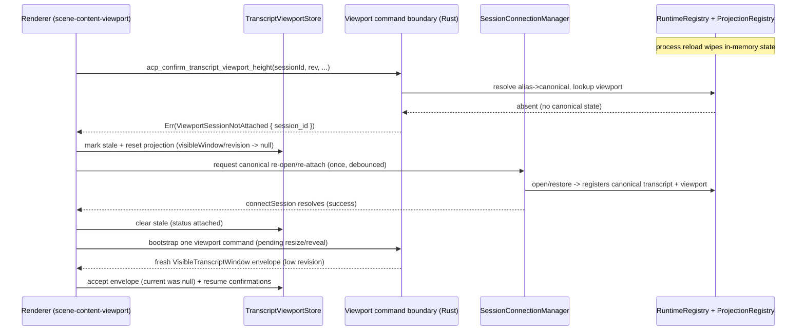

# fix: Resolve transcript viewport attachment drift and collapse parallel viewport state

## Summary

The Rust-owned transcript viewport (shipped in the `2026-05-28-001` migration) renders correctly for the currently-active session, but produces a persistent flood of `No canonical transcript viewport is available for session <id>` errors for sessions whose backend viewport state no longer exists in memory. This plan fixes the root cause — **frontend/backend attachment drift across backend runtime loss** — and removes the parallel `restored_transcript_viewport_inputs` side-table that violates the single-source-of-truth (GOD) rule.

The fix has three coordinated parts:

1. **Typed, recoverable viewport command failures** so the frontend can distinguish "session not attached to this backend runtime" from a genuine bug.
2. **Frontend lifecycle gating + recovery**: stop firing viewport commands (especially `ResizeObserver` height confirmations) at sessions the backend has forgotten, and trigger a single canonical re-open/re-attach instead of looping on swallowed errors.
3. **Collapse the parallel `restored_transcript_viewport_inputs` map** into the canonical projection registries so the viewport builder depends on exactly one transcript source per session.

---

## Problem Frame

The viewport authority lives **only** as transient in-memory state in `SessionGraphRuntimeRegistry`:

- `transcript_viewports: HashMap<String, TranscriptViewport>` — the real viewport FSM (layout index, scroll offset, follow-tail, confirmed row heights).
- `restored_transcript_viewport_inputs: HashMap<String, RestoredTranscriptViewportInputs>` — a **parallel** side-table holding `transcript_snapshot + operations + interactions`, populated **only** during the session-open flow for restored/detached sessions.

The synchronous command builder `build_visible_transcript_window_envelope_for_session` resolves the transcript snapshot as `live_projection_registry ?? restored_inputs` (a `canonical ?? fallback` read), and returns `None` when **both** are absent. The command boundary maps `None` to `InvalidState { "No canonical transcript viewport is available for session {id}" }`.

When the Rust process reloads (which happens on every Rust source change in dev, and on any crash/restart in production), all in-memory registries are wiped. The **frontend keeps the session open** and keeps emitting viewport commands — most damagingly, the renderer's `ResizeObserver` keeps emitting height confirmations — against a backend that no longer has any canonical state for that session. Each command hits the silent `None` branch and is swallowed by the renderer's `.match(applyEnvelope, () => undefined)` error arm, so it re-fires endlessly.

### Live evidence (verified 2026-05-28 via Tauri MCP against the running dev app)

- The currently-active session (`#69`) renders perfectly: DOM rows contiguous, total height 22679px, **`overlaps: []`**. The architecture is sound when state is present.
- A stale session `bc8c990f-7de5-493d-9a84-f7f279112846` floods the console with `No canonical transcript viewport is available` errors from `acp_confirm_transcript_viewport_height`. The failures cluster while that session was active and there is **no** corresponding `"Rejecting ... revision"` warn in the logs — confirming the **silent missing-snapshot branch** (transcript absent from both the projection registry and restored inputs), not a revision-mismatch rejection.
- The running binary (mtime 13:36) already contains the prior alias-restore patch (`session_open_snapshot/mod.rs`, mtime 13:35:47), yet the failure persists — proving the alias-keying patch treated a symptom, not the cause.

### Why the prior alias patch was insufficient

The `2026-05-28-001` migration and a subsequent patch addressed the symptom by registering restored inputs under both canonical and requested (alias) session ids. This is whack-a-mole: it cannot survive a process reload (eager open-time registration does not persist across process death), and it duplicates state under multiple raw-id keys instead of resolving alias→canonical once at the command boundary.

---

## Requirements

Traceability uses the origin requirement IDs from `docs/brainstorms/2026-05-28-rust-owned-transcript-viewport-requirements.md` where applicable.

- **FR1.** Viewport commands for a session whose backend runtime state is absent return a **typed, recoverable** error distinct from a programming-error `InvalidState`. (advances origin R10, R12)
- **FR2.** The frontend renderer must stop emitting viewport commands — especially `ResizeObserver` height confirmations — for a session that is not attached to the current backend runtime, instead of swallowing failures and re-firing. (advances origin R11, R15)
- **FR3.** On a recoverable "not attached" signal, the frontend triggers exactly one canonical re-open/re-attach through the existing session-connection lifecycle, and resumes viewport commands only after receiving a fresh backend visible-window envelope. (advances origin R9)
- **FR4.** The viewport builder depends on exactly one transcript source per session. The parallel `restored_transcript_viewport_inputs` side-table is removed; restored transcript/operation/interaction inputs are registered into their canonical projection registries at open time. (advances origin R3, R16 — "deletes duplicate viewport authority")
- **FR5.** Alias→canonical session-id resolution happens once at the command boundary; viewport state is never duplicated under multiple raw-id keys. (advances origin R3)
- **FR6.** The active-session happy path (live streaming follow-tail, detached anchor stability, bounded historical open, height confirmation) is preserved with no regression. (advances origin R7, R8, R9, R12, R19)
- **FR7.** Open-time materialization remains bounded — no full-transcript layout realization on open or re-attach. (advances origin R13, R20)

**Origin actors:** A1 Developer using Acepe; A3 Rust canonical graph/viewport authority; A4 Svelte desktop renderer; A5 Implementing agent.

**Origin flows touched:** F3 Session open or restore; F4 Row height confirmation. New: F5 Re-attach after backend runtime loss.

---

## Scope Boundaries

- **In scope:** the viewport command error taxonomy; the synchronous viewport builder's failure semantics; removal of `restored_transcript_viewport_inputs` and its open-time population; alias→canonical resolution at the command boundary; frontend renderer command-gating and recovery wiring; tests for all of the above.
- **In scope:** preserving current active-session transcript behavior unchanged.
- **Out of scope:** changing the bounded visible-window protocol shape, the layout index algorithm, or follow-tail/anchor semantics.
- **Out of scope:** introducing durable on-disk viewport persistence, or making the synchronous builder reload transcripts from the DB/journal (recovery belongs to the open/re-attach lifecycle, not the builder).
- **Out of scope:** any GPUI/Canvas rewrite; unrelated sidebar/file/review-panel virtualization.

### Deferred to Follow-Up Work

- A **global** backend "runtime epoch / instance id" handshake that proactively invalidates *all* stale projections on reconnect in one step. This plan brings the **per-session** equivalent in-scope (U5 resets the affected session's projection and bootstraps a fresh envelope on re-attach), which is sufficient for the observed single-session failure. The global handshake — a larger cross-cutting change that would also bound aggregate re-attach load when many sessions go stale at once — is deferred unless U6 shows the per-session path is insufficient at scale.
- Collapsing operation/interaction restored inputs is included in FR4, but if research during U4 shows the operation/interaction projection registries already retain restored sessions, that portion narrows to transcript-only and the rest is deferred.

---

## Context & Research

### Relevant code and patterns

- `packages/desktop/src-tauri/src/acp/session_state_engine/runtime_registry.rs`
  - `transcript_viewports` (~line 78) and `restored_transcript_viewport_inputs` (~line 80): the two parallel maps.
  - `restore_transcript_viewport_inputs` (~line 177), `remove_session` (~line 188).
  - `build_visible_transcript_window_envelope_for_session` (~line 885): the `canonical ?? fallback` snapshot read (~line 901), the silent `?` None (~line 907), revision rejects (~line 908, ~line 922), and the in-memory viewport insert/update (~line 978).
- `packages/desktop/src-tauri/src/acp/commands/transcript_viewport_commands.rs`
  - `build_visible_window_for_command` (~line 31) and the generic `No canonical transcript viewport is available` mapping (~line 53). The four commands: `acp_scroll_transcript_viewport`, `acp_reveal_transcript_viewport_row`, `acp_resize_transcript_viewport`, `acp_confirm_transcript_viewport_height`.
- `packages/desktop/src-tauri/src/acp/error.rs`
  - `SerializableAcpError` enum (~line 81) with `#[serde(rename = ...)]` variants and `Display` impl (~line 200). New typed variant added here.
- `packages/desktop/src-tauri/src/acp/session_open_snapshot/mod.rs`
  - `session_open_result_from_provider_owned_snapshot` (~line 462): `is_alias`, `canonical_session_id`, `restore_session_ids`, and the `restore_transcript_viewport_inputs` calls (~line 636). Existing test `provider_owned_alias_open_restores_requested_id_viewport_authority` (~line 2496).
- `packages/desktop/src-tauri/src/history/commands/session_loading.rs`
  - `restore_session_open_authority` (~line 761) and its `restore_transcript_viewport_inputs` call (~line 820) — the second population site that must be updated in lockstep.
- `packages/desktop/src/lib/acp/components/agent-panel/components/scene-content-viewport.svelte`
  - `revisionInput()` (~line 234), `dispatchHeightConfirmation` (~line 283), and the four dispatchers, all using `.match(applyEnvelope, () => undefined)` — the swallow-and-loop site.
- `packages/desktop/src/lib/acp/store/transcript-viewport-store.svelte.ts`
  - `TranscriptViewportStore` — per-session projection store; the natural home for an "attachment stale / needs re-open" flag.
- `packages/desktop/src/lib/acp/store/services/session-connection-manager.ts` (and its test) — existing re-attach/reconnect lifecycle the recovery path should reuse rather than reinvent.
- `packages/desktop/src/lib/services/acp-types.ts` — `DetachedReason` (~line 400, includes `restoredRequiresAttach`), `LifecycleStatus`, `SessionRecoveryPhase` (~line 491). These lifecycle types are specta-generated. (The new error variant does **not** surface here — `SerializableAcpError` is parsed by the hand-maintained Zod schema in `acp/errors/`, see U1.)

### Institutional constraints (GOD)

- Rust owns canonical viewport truth; the WebView renders a projection and must not repair, reorder, or reconstruct display truth.
- No parallel/dual-system state; no reader-side `canonical ?? fallback`. Fix upstream.
- Raw provider/session ids are metadata; canonical id is authority; resolve aliases before authority lookup.
- The viewport builder is synchronous with no DB handle — keep it pure: `(canonical in-memory projections + revision) -> envelope | typed failure`. Recovery is a lifecycle concern.

---

## High-Level Technical Design

*This illustrates the intended approach and is directional guidance for review, not implementation specification. The implementing agent should treat it as context, not code to reproduce.*

Failure-to-recovery flow after backend runtime loss:

Single-source transcript read after collapsing the side-table:

```mermaid
flowchart TD
    open[Session open / restore] -->|register| proj[TranscriptProjectionRegistry &#40;canonical&#41;]
    open -->|materialize bounded shell| vp[transcript_viewports FSM]
    cmd[Viewport command] -->|alias->canonical once| lookup{viewport present?}
    lookup -->|yes| build[build bounded window]
    lookup -->|no| typed[Err: ViewportSessionNotAttached]
    build --> proj
```

---

## Implementation Units

### U1. Add a typed, recoverable viewport-unavailable error

**Goal:** Replace the generic `InvalidState { "No canonical transcript viewport is available..." }` with a typed, serde-tagged error variant the frontend can branch on without brittle string matching.

**Requirements:** FR1.

**Dependencies:** none.

**Files:**
- `packages/desktop/src-tauri/src/acp/error.rs` (add variant + `Display`)
- `packages/desktop/src-tauri/src/acp/commands/transcript_viewport_commands.rs` (emit the new variant)
- `packages/desktop/src-tauri/src/acp/error/tests.rs` or the existing error test module (serde round-trip)
- `packages/desktop/src/lib/acp/errors/serializable-acp-error.schema.ts` (add the new Zod variant to the `SerializableAcpErrorSchema` discriminated union — `SerializableAcpError` is **not** a specta type; it is parsed by this hand-maintained Zod schema, which `serializable-command-error.schema.ts` imports for `domain.data` validation)
- `packages/desktop/src/lib/acp/errors/deserialize-acp-error.ts` (add the matching `switch` case so `parseSerializableCommandError` constructs the typed error instead of falling back to a generic `Error`)

**Approach:** Add `SerializableAcpError::ViewportSessionNotAttached { session_id: String }` with `#[serde(rename = "viewport_session_not_attached")]` and a `Display` arm. The enum has no `rename_all`, so the data field serializes as `session_id` (snake_case) — match the existing `SessionNotFound { session_id }` convention in both `error.rs` and the Zod schema (`data: z.object({ session_id: z.string() })`). Map the builder's "no canonical state for this session" outcome to this variant at the command boundary. Keep genuine programming errors (e.g., out-of-range window indices) as `InvalidState`. Note: the builder currently returns `Option`; U2 changes its signature so the command boundary can distinguish "not attached" from other `None` causes. **Until U2 lands, do not map the bare `None` to this variant** — the same `None` channel currently carries stale-revision and budget-skip no-ops (runtime_registry.rs ~line 908), so promoting it would make a healthy revision-ahead session look not-attached. Land U1 and U2 together (or have U1 introduce the distinct not-attached signal U2 formalizes) so no intermediate build ships the conflation.

**Patterns to follow:** the existing `#[serde(rename = ...)]` variants and `Display` arms in `error.rs`; the `session_not_found` entry in `serializable-acp-error.schema.ts` (snake_case `session_id`) and its `deserialize-acp-error.ts` case.

**Test scenarios:**
- Serde round-trip (Rust): `ViewportSessionNotAttached { session_id }` serializes with tag `"viewport_session_not_attached"` and a snake_case `session_id` field, and deserializes back.
- Zod round-trip (TS): the new variant parses a `{ type: "viewport_session_not_attached", data: { session_id } }` payload, and `parseSerializableCommandError` yields the typed error (not a fallback `Error`).
- `Display` renders a human-readable message including the session id.
- Covers FR1. A viewport command for an unknown session yields `ViewportSessionNotAttached`, not `InvalidState`.

**Verification:** `cargo test` for the error module passes; `bun run check` and the `deserialize-acp-error` vitest spec pass after the hand-maintained Zod schema + deserializer are updated (no specta regeneration is involved for this type).

---

### U2. Make the viewport builder return a typed result distinguishing "not attached" from rejection

**Goal:** Replace `build_visible_transcript_window_envelope_for_session`'s `Option` return with a `Result` (or a small purpose enum) that distinguishes: success, session-not-attached (no canonical state), stale-revision rejection, and byte-budget skip. This removes the silent `?` and the `canonical ?? fallback` ambiguity.

**Requirements:** FR1, FR6.

**Dependencies:** U1.

**Files:**
- `packages/desktop/src-tauri/src/acp/session_state_engine/runtime_registry.rs` (builder signature + branches)
- `packages/desktop/src-tauri/src/acp/commands/transcript_viewport_commands.rs` (map outcomes to command results)

**Approach:** Define an internal outcome type (e.g., `VisibleWindowOutcome::{ Built(envelope), SessionNotAttached, StaleRevision, BudgetExceeded }`). The "not attached" case is when there is **no transcript snapshot for the (canonical) session in any canonical source** — the builder's `?` early return today fires on the transcript-snapshot lookup alone (runtime_registry.rs ~line 901–907), *before* the viewport FSM is ever consulted (~line 975), so the FSM-entry state is **irrelevant** to this classification and must not be added as a conjunct. `StaleRevision` preserves the existing revision-mismatch warns (a recoverable no-op the frontend already guards against via `isNewerVisibleWindow`). At the command boundary, **only `SessionNotAttached` propagates as the typed `ViewportSessionNotAttached` error (U1)**; `StaleRevision -> Ok(no-op)` and `BudgetExceeded -> Ok(no-op)` keep current skip behavior with their existing `warn!`/diagnostic logging. If the 4-variant enum feels heavier than needed, a `Result<Option<Envelope>, SessionNotAttached>` (where `Ok(None)` covers both no-op exits) is an acceptable equivalent — the only distinction the frontend requires is not-attached vs. everything-else. Do not add a DB handle to the builder.

**Execution note:** Characterization-first — capture the current active-session success path and the current revision-reject behavior before changing the signature, so the refactor provably preserves them.

**Patterns to follow:** existing diagnostic-emitting branches in the builder; the `expected_acp_command_result` wrapper in `transcript_viewport_commands.rs`.

**Test scenarios:**
- Active session with matching revision returns `Built` with a bounded window (characterization of current behavior).
- Session with no in-memory transcript and no viewport returns `SessionNotAttached` (not a silent `None`).
- Stale `transcript_revision` returns `StaleRevision`, not `SessionNotAttached`, and does not corrupt the stored viewport.
- Stale `graph_revision` returns `StaleRevision`.
- Covers FR6. Height confirmation on an attached session still preserves confirmed heights by row version.

**Verification:** `cargo test transcript_viewport`, `cargo test session_state_engine` pass; the active-session path is unchanged.

---

### U3. Resolve alias→canonical once at the command boundary

**Goal:** Resolve the requested (possibly alias) session id to the canonical id a single time at the viewport command boundary, so viewport state is keyed only by canonical id and never duplicated under alias ids.

**Requirements:** FR5.

**Dependencies:** U2.

**Files:**
- `packages/desktop/src-tauri/src/acp/commands/transcript_viewport_commands.rs` (resolve before builder call)
- `packages/desktop/src-tauri/src/acp/session_state_engine/runtime_registry.rs` (canonical-keyed lookup; remove alias duplication)
- the alias-resolution source (session registry / replay context — confirm exact accessor during implementation)

**Approach:** Look up canonical id from the existing session/alias registry; call the builder with the canonical id only. Emit `ViewportSessionNotAttached` when the alias cannot be resolved to a known canonical session. This makes the prior dual-id registration in `session_open_snapshot` (the `restore_session_ids` vec) unnecessary for viewport state — fold it out in U4.

**Test scenarios:**
- A command issued with an alias id resolves to canonical and returns the canonical session's window.
- A command with an unresolvable alias returns `ViewportSessionNotAttached`.
- Covers FR5. Viewport state is stored once under canonical id (assert the registry has no alias-keyed duplicate).

**Verification:** `cargo test` for the command + registry modules; existing alias open test still meaningful (updated in U4).

---

### U4. Collapse `restored_transcript_viewport_inputs` into canonical projection registries

**Goal:** Remove the parallel side-table. At open/restore time, register restored transcript/operation/interaction inputs into their canonical projection registries (the single sources the builder already prefers), and materialize a bounded viewport FSM shell under the canonical id. The builder then reads exactly one transcript source.

**Requirements:** FR4, FR5, FR7.

**Dependencies:** U2, U3.

**Files:**
- `packages/desktop/src-tauri/src/acp/session_state_engine/runtime_registry.rs` (delete `restored_transcript_viewport_inputs`, `restore_transcript_viewport_inputs`, and the fallback reads; update `remove_session`)
- `packages/desktop/src-tauri/src/acp/session_open_snapshot/mod.rs` (register into canonical projection registries instead of the side-table; drop the dual-id `restore_session_ids` for viewport inputs; update/repoint the existing alias test)
- `packages/desktop/src-tauri/src/history/commands/session_loading.rs` (`restore_session_open_authority` — mirror the change at the second population site)

**Approach:** Resolve the ownership boundary explicitly. Today, canonical registry population (`TranscriptProjectionRegistry`, `ProjectionRegistry`) happens in `restore_session_open_authority` (session_loading.rs ~line 777–815), **not** inside `session_open_result_from_provider_owned_snapshot` (which only touches the runtime registry + side-table). After this unit: canonical transcript/operation/interaction registration becomes the single authority for restored sessions; the side-table is deleted; and the two sites are reconciled so a restored session is registered **exactly once** (no double-registration, no broken standalone call). Decide the direction during implementation — either move registration into the shared open path and have `restore_session_open_authority` stop duplicating it, or keep `restore_session_open_authority` as the sole site and ensure every production caller of the provider-owned-snapshot path flows through it. Add a test asserting a restored open is servable by the builder with no orphaned side-table entry and no duplicate registration. Materialize only a **bounded** viewport shell (estimated heights, visible range + overscan), never a full-transcript layout (FR7); lazy FSM creation on first builder call (runtime_registry.rs ~line 983–990) is acceptable if it stays bounded. Delete the side-table and the `canonical ?? fallback` reads in the builder once every consumer reads from the canonical registry. Resolve by authority surface: transcript → `TranscriptProjectionRegistry`, operations → operation projection, interactions → interaction projection. **Also re-point the builder's `active_streaming_tail` read** (runtime_registry.rs ~line 956–965) from the side-table to the live `select_active_streaming_tail(...)` fallback, and lock that equivalence with a test (the side-table value was itself produced by the same call at open time).

**Execution note:** Land after U2/U3 are green so the builder already tolerates a single-source read and canonical-only keying.

**Patterns to follow:** the existing `register_session` / `apply_session_update` projection-registry population used for live sessions.

**Test scenarios:**
- After a restored/detached open, the builder serves a bounded window reading from the canonical transcript projection (no side-table).
- A restored open registers each canonical surface exactly once — calling the provider-owned-snapshot open path is sufficient for the builder to serve a window, with no duplicate registration from `restore_session_open_authority`.
- `active_streaming_tail` for a session restored mid-stream matches between the removed side-table value and the live `select_active_streaming_tail` recomputation (no follow-tail regression).
- `remove_session` clears canonical viewport state and leaves no orphaned side-table entry (the map no longer exists).
- Open-time materialization is bounded: a large restored transcript does not realize a full layout (assert visible-window row count ≤ window+overscan, independent of total entries). Covers FR7.
- The repointed alias open test asserts canonical-keyed viewport authority (no alias duplication). Covers FR4, FR5.
- Covers FR6. Live streaming follow-tail and detached anchor behavior unchanged after the collapse.

**Verification:** `cargo test session_open_snapshot`, `cargo test session_state_engine`, `cargo test transcript_viewport`, `cargo test` for `history::commands::session_loading` all pass; byte-budget tests still pass.

---

### U5. Frontend: gate viewport commands and recover on "not attached"

**Goal:** Stop the renderer from swallowing viewport-command failures and re-firing. On `ViewportSessionNotAttached`, mark the session's viewport projection attachment-stale (halting `ResizeObserver` height confirmations and other intents), trigger exactly one debounced canonical re-open/re-attach via the existing connection manager, **discard the stale frontend projection so the first post-reattach envelope is accepted unconditionally**, and bootstrap one command after re-attach completes so a fresh envelope is actually produced. Surface a terminal failure state if re-attach itself fails, rather than freezing the session silently.

**Requirements:** FR2, FR3, FR6.

**Dependencies:** U1, U2 (typed variant in the error schema **and** the builder returning `SessionNotAttached` distinct from `StaleRevision`/`BudgetExceeded`; without U2, stale-revision no-ops would masquerade as not-attached and trigger spurious re-attach on healthy sessions).

**Files:**
- `packages/desktop/src/lib/acp/components/agent-panel/components/scene-content-viewport.svelte` (replace `() => undefined` error arms with typed handling; gate dispatch when stale)
- `packages/desktop/src/lib/acp/store/transcript-viewport-store.svelte.ts` (per-session attachment status: `attached | stale | reattachFailed`; accessors; **projection reset** that nulls the stored `visibleWindow`/`viewportRevision` so `isNewerVisibleWindow` returns `true` for the next envelope)
- `packages/desktop/src/lib/acp/store/services/session-connection-manager.ts` (entry point for the single re-attach request; reuse existing reconnect path; signal success/failure back to the viewport store)
- co-located vitest specs for the store and the renderer logic

**Approach:** Add a per-session attachment status to `TranscriptViewportStore` (`attached | stale | reattachFailed`) keyed by session id. In the renderer dispatchers, short-circuit when the session is not `attached` (mirroring the existing `revision === null` guard). On a command result whose error is `viewport_session_not_attached`:
1. Set status `stale` and **reset the per-session projection** (null the cached `visibleWindow`/`viewportRevision`). This is essential because a fresh backend after reload seeds `viewport_revision` at `transcript_revision` (runtime_registry.rs ~line 990 / viewport.rs `bump_viewport_revision`), which is *lower* than a long-lived store's incremented value — without the reset, `isNewerVisibleWindow` (transcript-viewport-store.svelte.ts ~line 28–31) silently discards the recovery envelope and `overlaps: []` can never be reached. Clearing the projection makes `current === null`, so the next envelope is accepted unconditionally. This is the in-scope, per-session realization of the projection-invalidation that the global runtime-epoch handshake would generalize.
2. Call the connection manager's re-attach **once** per stale episode (debounced/guarded so a burst of failing confirmations triggers a single re-open).
3. **Bootstrap the envelope exchange:** because the backend never pushes a visible-window envelope unprompted (`handleConnectionComplete` only updates preference caches — session-connection-manager.ts), on successful `connectSession` resolution clear the stale status and fire one viewport command (e.g., the pending resize/reveal intent) so a fresh envelope is produced. Do **not** rely solely on `applyVisibleWindow` to clear the flag, or the session deadlocks (gated → no command → no envelope → never cleared).
4. **On re-attach failure** (`connectSession` rejects, watchdog timeout, or `ConnectionFailed`): transition to `reattachFailed`, stop further automatic attempts, and emit a recovery signal (so the surrounding lifecycle/UI can offer a manual re-open) instead of leaving the session permanently frozen.

Keep all transcript/display truth backend-owned — the frontend only gates, resets its disposable projection, and requests re-open; it never synthesizes rows.

**Execution note:** Test-first for the gating/recovery logic — assert the loop stops, re-attach fires exactly once, the projection is reset, and the post-reattach envelope is accepted.

**Patterns to follow:** the existing `revisionInput()` null-guard pattern; `isNewerVisibleWindow` revision discipline; `session-connection-manager.test.ts` reconnect setups; existing `LifecycleStatus`/`DetachedReason` (`restoredRequiresAttach`) signalling — route the recovery through these rather than a parallel ad-hoc channel where practical.

**Test scenarios:**
- A `viewport_session_not_attached` result sets status `stale`, resets the per-session projection, and suppresses subsequent height confirmations for that session (no repeated commands). Covers FR2.
- Re-attach is requested exactly once per stale episode despite a burst of failing confirmations (debounce/guard). Covers FR3.
- After the projection reset, a post-reattach envelope whose `viewportRevision` is **lower** than the pre-reload store value is still accepted (regression guard for the `isNewerVisibleWindow` rejection path). Covers FR3, FR6.
- On successful re-attach, the status returns to `attached` and exactly one bootstrap command fires to obtain a fresh envelope (no deadlock waiting for an unprompted push). Covers FR3.
- On re-attach failure, the session transitions to `reattachFailed`, no further automatic re-attempts fire, and a recovery signal is emitted (session is not silently frozen).
- A non-recoverable error (e.g., generic `invalid_state`) does **not** set stale/reattach state or trigger re-open (no recovery loop on real bugs).
- A `StaleRevision` no-op result (post-U2) does **not** mark the session stale or trigger re-attach.
- Active-session happy path: confirmations dispatch normally when `attached`. Covers FR6.

**Verification:** `bun run check` passes; `bun test` for the new specs passes; live QA (U6) shows no error flood, the re-attached session accepts its first envelope, and `overlaps: []`.

---

### U6. Live regression verification (Tauri MCP)

**Goal:** Prove the fix end-to-end in the running dev app after the Rust auto-rebuild/reload, since reload is the exact trigger for the bug. *(This is a verification gate, not a code deliverable — it produces no source changes; automated coverage lives in U1–U5.)*

**Requirements:** FR2, FR3, FR6, FR7.

**Dependencies:** U1–U5.

**Files:** none (verification unit).

**Approach:** With the dev app reloaded onto the new binary, attach via the Tauri MCP bridge (port 9223). Open a session, force a Rust reload (the bug trigger), then interact with the previously-open session. Confirm: (a) no `No canonical transcript viewport`/`viewport_session_not_attached` error flood — at most one recoverable signal followed by re-attach; (b) the session re-attaches and **accepts its first post-reload envelope** (verify the store's `visibleWindow` actually updates — exercise a long-lived session whose `viewportRevision` has been incremented many times pre-reload, not a freshly-opened one, so the `isNewerVisibleWindow` regression path is covered); (c) renders with `overlaps: []`; (d) row offsets reflect confirmed heights (no stale 120px estimate overlap); (e) switching between live and historical sessions stays clean; (f) a forced re-attach failure surfaces the `reattachFailed` state rather than a frozen session.

**Test expectation:** none (manual/live verification) — automated coverage lives in U1–U5. Record the DOM `overlaps` probe result, the store-revision-acceptance observation, and the console error scan in the completion notes.

**Verification:** `overlaps: []` on the re-attached session; the store accepted a lower-revision post-reload envelope; console shows no repeating viewport errors; height-confirmed rows are contiguous.

---

## System-Wide Impact

- **Frontend error parsing** changes when the new variant is added: `SerializableAcpError` is **not** a specta type — update the hand-maintained `serializable-acp-error.schema.ts` Zod union and `deserialize-acp-error.ts`, then run `bun run check` and the `deserialize-acp-error` spec. (No specta regeneration is involved for this type.)
- **Two open-time population sites** (`session_open_snapshot/mod.rs` and `history/commands/session_loading.rs`) must change in lockstep when the side-table is removed; missing one would leave a restored session unservable. Confirm there is no third caller of `restore_transcript_viewport_inputs` before deleting it.
- **Renderer error handling** changes from silent-swallow to typed-branch; ensure no other caller relies on the old swallow behavior.
- **No protocol/shape change** to the visible-window envelope. The store's `isNewerVisibleWindow` revision discipline is unaffected for the steady state, but the U5 recovery path deliberately **resets** the per-session projection on re-attach so a lower-revision post-reload envelope is accepted.

---

## Risk Analysis & Mitigation

- **Risk: removing the side-table breaks restored-session rendering** if the canonical projection registries don't retain restored sessions. *Mitigation:* U4 fixes the registration ownership boundary so a restored open registers each canonical surface exactly once; characterization tests in U2 lock the current restored-open success path before the collapse; the `active_streaming_tail` equivalence is tested.
- **Risk: stale-revision conflated with not-attached in an intermediate build** — U1's typed error plus U5's gating could, if U1 ships without U2, promote benign revision-ahead/budget no-ops to `ViewportSessionNotAttached` and trigger spurious re-attach on healthy streaming sessions. *Mitigation:* U5 depends on U2; U1 and U2 land together so no intermediate build maps bare `None` to the typed error.
- **Risk: re-attach deadlock or permanent freeze** — gating all commands while clearing the flag only on an envelope that nothing prompts would freeze the session; a failed re-attach would freeze it permanently. *Mitigation:* U5 bootstraps one command on successful re-attach (does not wait for an unprompted push), and adds a `reattachFailed` terminal state with a recovery signal instead of silent freeze. Tested for both the success-bootstrap and failure paths.
- **Risk: post-reload envelope silently discarded** because the fresh backend's `viewport_revision` seeds below the stale store value. *Mitigation:* U5 resets the per-session projection on re-attach (`current === null`), and U6 verifies acceptance using a high-revision long-lived session.
- **Risk: unbounded open-time materialization** regressing long-session open budgets. *Mitigation:* FR7 + explicit bounded-materialization test in U4; existing byte-budget tests retained.
- **Risk: alias resolution source unavailable at the command boundary.** *Mitigation:* U3 confirms the accessor during implementation; if no accessor is reachable without new plumbing, that plumbing is part of U3's scope; unresolvable alias maps to the recoverable typed error, which the frontend handles via re-open.
- **Risk: N simultaneous stale sessions on reload** each independently fire re-attach, with unbounded aggregate load. *Mitigation (accepted):* the per-session debounce caps per-session attempts; a global re-attach throttle is deferred with the runtime-epoch handshake unless U6 shows aggregate load is a problem.

---

## Verification Strategy

- Rust: `cargo test` (error, transcript_viewport, session_state_engine, session_open_snapshot, history::commands::session_loading), `cargo check`, `cargo clippy`, `cargo fmt --check`.
- TS: `bun run check`, `bun test` for new store/renderer specs.
- Live: U6 Tauri MCP regression on a reloaded dev app, asserting `overlaps: []` and no error flood.

---

## Deferred Implementation Notes

- Exact internal outcome enum name/shape (U2) and the precise alias-resolution accessor (U3) are execution-time choices.
- Whether operation/interaction restored inputs need explicit registration (U4) depends on confirming current projection-registry retention behavior at implementation time.
- A global backend runtime-epoch handshake remains deferred (see Scope Boundaries) unless U6 shows per-command re-attach is insufficient.
- Live evidence to date is from a **dev** Rust hot-reload. In production a full process crash also wipes the WebView, so the drift window is narrower (a backend restart while the WebView briefly survives). The fix still applies, but U6 should note that the dev-reload reproduction is a stronger trigger than the expected production case, not a weaker one.
