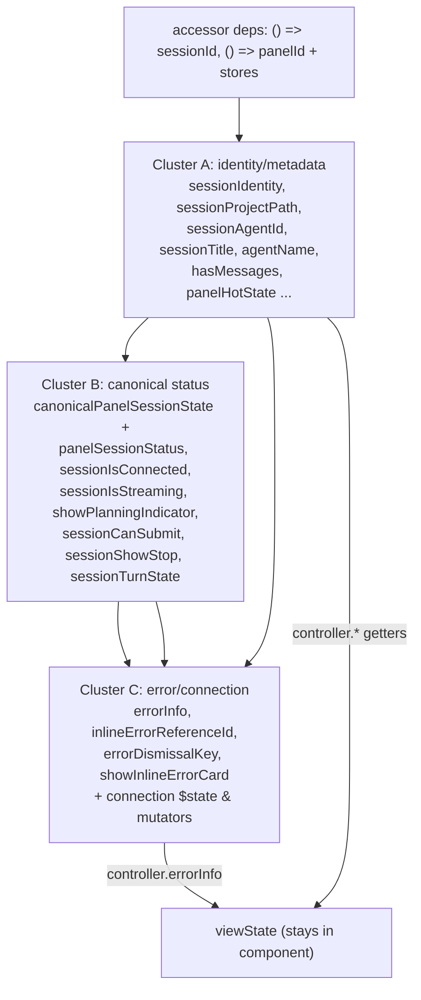

# refactor: Extract AgentPanelSessionController from the agent-panel god controller

## Summary

`agent-panel.svelte` is a 2,638-line component whose `<script>` (~2,055 lines) is a god controller: ~80 interdependent `$derived`/`$state` declarations compute ~40-prop payloads for already-extracted child components (`AgentPanelHeader`, `AgentPanelContent`, etc.). Prior leaf-helper extraction (interaction/export handlers, todo-markdown, pure-helpers) only removed ~6% because the remaining state is coupled through two hubs: `canonicalPanelSessionState` and `viewState`.

This plan extracts the session-derived reactive state into a single `AgentPanelSessionController` class (a `.svelte.ts` module using Svelte 5 runes), built incrementally across three dependency-ordered clusters: **identity → status → error/connection**. The component instantiates the controller once and reads `controller.x`; the connection `$state` + the handlers that mutate it move into the controller as fields + methods. This is the architecturally-correct move per CLAUDE.md's Agent Panel MVC intent — moving truth into a canonical, **independently unit-testable** controller rather than leaving it as untestable `$derived` inside a `.svelte` file.

This is a **behavior-preserving** refactor of **GOD-architecture-sensitive** code (session/transcript display). No reactivity semantics, prop payloads, or display output change.

---

## Problem Frame

The agent panel's child components are already split out; the residual bulk is prop-computation. Because nearly every derivation references `sessionId`/`sessionProjectPath` and funnels into `canonicalPanelSessionState`/`viewState`, no vertical slice extracts cleanly — the clusters share reactive state. The only decomposition that meaningfully shrinks the file is hoisting the derivation graph itself into a class that:

1. Owns the session-derived `$derived` getters (identity, status, error).
2. Owns the connection `$state` that handlers mutate, exposing methods for those mutations.
3. Is constructed once with accessor deps (`() => sessionId`, `() => panelId`) + the stores it reads.
4. Can be **unit-tested directly** (construct with a fake `sessionId` accessor + stub stores; assert getters) — which today is impossible because the logic lives inside reactive `.svelte` scope.

**Scope criterion:** structural hoist of existing derivations into a class. Function bodies move verbatim; only the access path changes (`sessionProjectPath` → `controller.sessionProjectPath`) and reactive scalars become accessor calls inside the class.

---

## Requirements

- **R1.** Every prop payload passed to child components is byte-for-byte equivalent before/after (same values, same reactive update timing).
- **R2.** No `$effect`-based state writes are introduced; computed values stay `$derived` (per CLAUDE.md Svelte rules).
- **R3.** The controller is constructed once per component instance and reads live reactive values via accessor deps — `controller.sessionProjectPath` re-evaluates when `sessionId` changes.
- **R4.** The connection `$state` (`panelConnectionState`, `panelConnectionError`) and its mutators (retry/cancel/dismiss connection flow) move into the controller. The `isRetryingConnection`-clearing `$effect` is **eliminated** by converting `isRetryingConnection` to a `$derived` (see Decision 7); the 4-second fallback timer is preserved as an imperative action. Net behavior (spinner shows on retry, clears when the failure state transitions away, hard-stops after 4s) is identical.
- **R5.** `errorInfo` moves into the controller; the component reads `controller.errorInfo` and feeds it into `viewStateInput` so `viewState` is unchanged.
- **R6.** The controller has direct unit tests (no component render) covering each cluster's getters.
- **R7.** Each cluster lands as one atomic commit; `bun run check` + the agent-panel test suite pass after each.
- **R8.** No change to `AgentPanelState` (the existing plan-dialog/sidebar/edge-drag UI-state class) beyond optional composition — the new controller sits beside it.

---

## Scope Boundaries

### In scope

- New `AgentPanelSessionController` class owning the identity, status, and error/connection derivation clusters.
- Migrating the component's references (script + template) to read through the controller.
- Moving the connection `$state` + its mutator handlers into the controller.
- Direct unit tests for the controller.

### Deferred to Follow-Up Work

- Moving `viewState`/`viewStateInput` itself into the controller (it depends on lifecyclePresentation, entriesCount, and other non-session inputs; defer until the three session clusters prove the pattern).
- Worktree/pre-session-card state cluster (separate concern, separate controller candidate).
- Review-dialog state cluster.
- Checkpoint-timeline state cluster.
- Scroll/viewport `$state` (`contentIsAtBottom`, `scrollContainer`, etc.) — DOM-binding state, not session-derived.
- Expanding `desktop-agent-panel-scene.ts` to build prop payloads (the alternative architecture — see Alternatives Considered).

### Out of scope

- Any behavior, display, or reactivity-timing change.
- Touching child components (`AgentPanelHeader`, `AgentPanelContent`, etc.).
- Provider/canonical-data changes (Rust side, projections, scene model).

---

## Key Technical Decisions

### 1. One controller class, built incrementally

A single `AgentPanelSessionController` in `src/lib/acp/components/agent-panel/state/agent-panel-session-controller.svelte.ts`, grown across three units (identity → status → error). Rationale: the clusters are interdependent (status reads identity's `hasMessages`; error reads status's `sessionTurnState` and identity's `agentName`), so splitting into three separate classes would require cross-class wiring. One class with all getters, added cluster by cluster, keeps each commit verifiable while avoiding inter-class coupling.

### 2. Accessor-dep constructor (the proven pattern from this branch)

The controller constructor takes `{ getSessionId: () => string | null, getPanelId: () => string | null, sessionStore, panelStore, checkpointStore, ... }`. Getters read live reactive values; class `$derived` getters recompute when the underlying reactive source changes. This mirrors the `createAgentPanelInteractionHandlers`/`createKanbanExportHandlers` accessor pattern already merged on this branch, and the `GitOverviewState` reference-passing pattern.

### 3. `$derived` **fields**, not getters, for object/array derivations (identity-preservation)

**Critical for R1/R2.** Svelte 5 supports two reactive-read idioms in a class, and the difference is not cosmetic here:
- `$derived` / `$derived.by` **class field** — memoized; recomputes (and produces a *new* object reference) only when its tracked deps change.
- plain `get x() { return ...reactive reads... }` — reactive when read in a tracking scope, but **recomputes on every access**, producing a *new* object reference each time.

The current component uses `$derived`/`$derived.by` for the object/array-producing hubs (`canonicalPanelSessionState`, `errorInfo`, `sessionIdentity`, `activeTurnError`, etc.). If these become plain getters, their reference identity churns on every read, which changes downstream memoization and update timing (child components and `$derived` consumers that compare by reference would see spurious changes). **Therefore every object/array-producing derivation MUST move as a `$derived`/`$derived.by` class field, preserving memoization and reference identity.** Plain `get x()` getters are permitted only for cheap scalar pass-throughs (e.g. `get sessionId()`), matching the mix already used in `agent-input-state.svelte.ts` (`$state` fields + a few scalar getters).

Each derivation body moves verbatim; local reactive reads of `sessionId` become `this.getSessionId()`, and sibling derivations are read as `this.<field>`. The component template reads `controller.<field>` (no parens). Note R1's "byte-for-byte" really means *same values **and** same reference-identity/memoization semantics* — that is the invariant the field-vs-getter choice protects.

### 4. Connection `$state` ownership

`panelConnectionState`, `panelConnectionError`, `dismissedErrorKey`, and a new `retryActive` flag become `$state` fields on the controller. The mutator handlers (`handleRetryConnection`, `handleCancelConnection`, `handleDismissError`) move into the controller as methods; the component's event bindings call `controller.retryConnection()` etc. This is the one place mutable state moves; it must preserve the exact guard logic in R4.

### 7. Eliminate the retry-busy `$effect` via `$derived` (locked decision)

Today `isRetryingConnection` is a `$state` cleared two ways: (a) an `$effect` that flips it false when `stillFailed` goes false, and (b) a 4s fallback `setTimeout` (so the spinner never hangs if the state machine doesn't bounce). Per CLAUDE.md's no-`$effect`-for-computed-values rule, the controller replaces this with:

- `stillFailed` — a controller `$derived`: `errorInfo.showError || activeTurnError !== null || sessionTurnState === "error" || panelConnectionState === ERROR` (reads Cluster C/B getters).
- `retryActive` — a `$state` flag: set `true` in `retryConnection()`, set `false` by the existing 4s `setTimeout` (kept as an imperative *action*, which CLAUDE.md permits — it is not a computed-value effect).
- `isRetryingConnection` — a `$derived`: `retryActive && stillFailed`.

This removes the `$effect` entirely: the early-clear (state transitions away from failure) falls out of `&& stillFailed`, and the hard-stop remains the timer. **Risk:** the derived must reproduce the imperative clear timing exactly — covered by the U4 test scenarios below. The `retryConnection()` re-entrancy guard (`if (isRetryingConnection) return`) is preserved by reading the derived at entry.

### 5. `errorInfo` back-read into `viewState`

`viewState` stays in the component for now. Its input object reads `controller.errorInfo` (and any other migrated getters). This keeps the highest-fanout hub stable while the session clusters move underneath it.

### 6. Characterization via controller unit tests, not component render

There is no existing render test for `agent-panel.svelte`. Rather than build a brittle full-component harness, the characterization seam is **direct controller unit tests**: construct the controller with a fake `getSessionId` and stubbed stores, drive inputs, assert getter outputs. This is only possible *after* extraction — so each unit writes the controller tests for its cluster as the proof that the moved logic behaves identically. For the pre-existing behavior, the `agent-panel-display-model-identity.vitest.ts` and child-component vitests remain the regression backstop.

---

## High-Level Technical Design

*This illustrates the intended approach and is directional guidance for review, not implementation specification. The implementing agent should treat it as context, not code to reproduce.*

Dependency graph of the three clusters (why the order is forced):



Shape of the controller (directional, not literal):

```text
class AgentPanelSessionController {
  // deps captured in constructor: getSessionId, getPanelId, stores
  get sessionId()  // cheap scalar passthrough -> plain getter OK
  // --- Cluster A (U2) — object/array derivations -> $derived FIELDS ---
  sessionIdentity = $derived(...)        // from this.getSessionId() + sessionStore
  sessionProjectPath = $derived(...)
  agentName = $derived.by(() => ...)
  hasMessages = $derived(...)
  // --- Cluster B (U3) ---
  canonicalPanelSessionState = $derived.by(() => ...)
  sessionTurnState = $derived(...)
  sessionIsStreaming = $derived(...)
  // --- Cluster C (U4) ---
  panelConnectionState = $state(...)     // mutable
  errorInfo = $derived.by(() => ...)     // identity-preserving field, feeds component viewStateInput
  showInlineErrorCard = $derived(...)
  retryConnection() { ... }              // moved mutator
}
```
(Accessed in the component as `controller.sessionProjectPath` — a field read, no parens. See Decision 3 for why these are fields, not getters.)

---

## Implementation Units

### U1. Scaffold controller + characterization harness

**Goal:** Create the empty `AgentPanelSessionController` with its accessor-dep constructor and a unit-test file, wired into the component (instantiated but not yet consumed), proving the construction/reactivity plumbing before any derivation moves.

**Requirements:** R3, R6, R7, R8.

**Dependencies:** None.

**Files:**
- Create: `src/lib/acp/components/agent-panel/state/agent-panel-session-controller.svelte.ts`
- Create: `src/lib/acp/components/agent-panel/state/__tests__/agent-panel-session-controller.vitest.ts`
- Modify: `src/lib/acp/components/agent-panel/components/agent-panel.svelte` (instantiate controller from existing reactive `sessionId`/`panelId` + stores; no reads yet)

**Approach:**
- Constructor takes `{ getSessionId, getPanelId, sessionStore, panelStore, checkpointStore }` (add more stores as later clusters need them).
- Add one trivial pass-through getter (e.g. `get sessionId()`) to anchor the test harness and confirm accessor reactivity works end-to-end.
- Instantiate once in the component `<script>`: `const sessionController = new AgentPanelSessionController({ getSessionId: () => sessionId, getPanelId: () => panelId, sessionStore, panelStore, checkpointStore })`.

**Patterns to follow:**
- Accessor-dep + factory pattern from `agent-panel-interaction-handlers.ts` (this branch).
- `AgentPanelState` (`state/agent-panel-state.svelte.ts`) for class-in-.svelte.ts shape (note: it has no unit test, so it is NOT the test-harness precedent).
- **Rune-class test harness precedent:** `agent-input-state.svelte.ts` is a tested rune class; its tests (`agent-input/state/__tests__/agent-input-state-triggers.vitest.ts`) drive reactivity with `flushSync`. Mirror that harness for the controller tests rather than inventing one.

**Test scenarios:**
- Happy path: construct with `getSessionId: () => "s1"`; `controller.sessionId === "s1"`.
- Reactivity: wrap `getSessionId` over a `$state` cell inside an `$effect.root` (or the `flushSync` harness above); mutate it; assert the field reflects the new value.
- Identity: a `$derived` object field returns the **same reference** across reads when deps are unchanged, and a **new reference** only after a dep changes (guards Decision 3 / R1).
- Edge: `getSessionId: () => null` → `controller.sessionId === null`.

**Verification:** `bun run check` exit 0; new controller test passes; `agent-panel.svelte` still renders identically (no reads migrated yet); existing agent-panel vitests green.

---

### U2. Migrate Cluster A — session identity/metadata

**Goal:** Move the identity/metadata derivations into the controller; component reads `controller.x`.

**Requirements:** R1, R2, R3, R6, R7.

**Dependencies:** U1.

**Files:**
- Modify: `agent-panel-session-controller.svelte.ts` (add identity getters)
- Modify: `components/agent-panel.svelte` (replace local derivations with `controller.*` reads, script + template)
- Modify: `state/__tests__/agent-panel-session-controller.vitest.ts` (identity getter tests)

**Approach:**
- Move: `sessionIdentity`, `sessionMetadata`, `sessionProjectPath`, `sessionAgentId`, `sessionWorktreePath`, `sessionTitle`, `sessionCurrentModelId`, `panelHotState`, `canonicalTranscriptEntries`, `visibleEntryCount`/`knownVisibleEntryCount`, `hasMessages`, `agentName`, `effectivePanelId`, `effectiveProjectPath`/`effectiveProjectName` (and the small helpers they call) into controller getters.
- Each body moves verbatim; `sessionId` → `this.getSessionId()`, sibling derivations → `this.<getter>`.
- Update every reference in `agent-panel.svelte` (script + template) from bare name to `sessionController.<name>`. Expect a large but mechanical ref count here — update by symbol, re-run check between symbols if needed.
- Leave derivations that are NOT session-identity (scroll, worktree, plan-sidebar) in the component.

**Patterns to follow:** the verbatim-move + accessor-swap discipline used in this branch's Rust `super::super::*` splits and the `GitOverviewState` extraction.

**Test scenarios:**
- Happy path: stub `sessionStore.getSessionIdentity` to return `{ projectPath, agentId, worktreePath }`; assert `controller.sessionProjectPath`/`sessionAgentId`/`sessionWorktreePath`.
- Null session: `getSessionId: () => null` → identity getters return `null`/defaults matching current behavior.
- `hasMessages`: stub visible-entry count 0 → false; >0 → true.
- `agentName`: exercise the `$derived.by` branch (selected vs session agent fallback).
- Edge: `effectiveProjectPath` falls back from `effectiveProjectPath` to `sessionProjectPath` correctly.

**Verification:** `bun run check` exit 0; controller identity tests pass; agent-panel vitests + `agent-panel-display-model-identity.vitest.ts` green; manual diff confirms no template prop changed except access path.

---

### U3. Migrate Cluster B — canonical session status

**Goal:** Move `canonicalPanelSessionState` and its derived status booleans into the controller.

**Requirements:** R1, R2, R3, R6, R7.

**Dependencies:** U2.

**Files:**
- Modify: `agent-panel-session-controller.svelte.ts` (status getters)
- Modify: `components/agent-panel.svelte`
- Modify: controller test file (status getter tests)

**Approach:**
- Move: `canonicalPanelSessionSource`, `canonicalSessionActivity`, `agentPanelCanonicalSource`, `canonicalPanelSessionState`, `panelSessionStatus`, `sessionIsConnected`, `sessionIsStreaming`, `isAwaitingModelResponse`, `showPlanningIndicator`, `sessionCanSubmit`, `sessionShowStop`, `sessionTurnState`, `lifecyclePresentation` (if session-scoped).
- These read Cluster A getters (`hasMessages`, `preSessionPendingUserEntry`) — call `this.hasMessages` etc.
- `deriveCanonicalAgentPanelSessionState` / `resolveCanonicalAgentPanelTurnState` calls move verbatim.

**Patterns to follow:** Cluster A's verbatim-move discipline.

**Test scenarios:**
- Happy path: stub a canonical source with known status; assert `panelSessionStatus`, `sessionIsConnected`, `sessionIsStreaming` match `deriveCanonicalAgentPanelSessionState` output.
- `sessionTurnState`: stub source → assert `resolveCanonicalAgentPanelTurnState` result.
- `isAwaitingModelResponse`: activity kind `awaiting_model` → true; other → false.
- Edge: null session source → default status (matches current).
- Integration: status getters that read Cluster A (`hasMessages`) reflect identity changes.

**Verification:** `bun run check` exit 0; controller status tests pass; full agent-panel vitest suite green; spot-check that `AgentPanelHeader`'s `sessionStatus` and the composer's submit/stop props are unchanged.

---

### U4. Migrate Cluster C — error/connection state + mutators

**Goal:** Move the error derivations and the connection `$state` + its mutator handlers into the controller; component reads `controller.errorInfo` and feeds `viewStateInput`.

**Requirements:** R1, R2, R3, R4, R5, R6, R7.

**Dependencies:** U2, U3.

**Files:**
- Modify: `agent-panel-session-controller.svelte.ts` (error getters + connection `$state` fields + mutator methods + the `isRetryingConnection`-clearing `$effect`)
- Modify: `components/agent-panel.svelte` (read `controller.errorInfo` into `viewStateInput`; rebind connection events to controller methods; remove migrated `$state`/handlers)
- Modify: controller test file (error + connection-mutation tests)

**Approach:**
- Move derivations: `sessionConnectionError`, `sessionFailureReason`, `activeTurnError`, `disableSendForFailedFirstSend`, `errorInfo`, `fallbackInlineErrorReferenceId`, `inlineErrorReferenceId`, `inlineErrorReferenceSearchable`, `errorDismissalKey`, `errorDismissed`, `showInlineErrorCard`.
- Move `$state`: `panelConnectionState`, `panelConnectionError`, `dismissedErrorKey` → controller fields; add `retryActive` `$state`.
- Convert retry-busy per Decision 7: add `stillFailed` (`$derived`) and `isRetryingConnection` (`$derived` = `retryActive && stillFailed`); delete the `$effect`. The 4s fallback `setTimeout` stays inside `retryConnection()` and sets `retryActive = false`.
- Move mutators: connection retry/cancel/dismiss handlers → controller methods.
- `errorInfo` reads `this.sessionTurnState` (Cluster B), `this.agentName` (Cluster A) — already available.
- Component: `viewStateInput.errorInfo = sessionController.errorInfo`; event handlers call `sessionController.retryConnection()` etc.
- `createInlineErrorIssueDraft` / `handleIssueFromInlineError` read many controller error getters — leave the issue-draft builder in the component (it also reads non-session fields like `sessionCreatedAt`, `visibleEntryCount`) but source error fields from the controller.

**Execution note:** This is the highest-risk unit — it moves mutable `$state` and converts the retry-busy `$effect` to `$derived` (Decision 7). Write the connection-mutation controller tests first (characterization of: retry → `isRetryingConnection` true; failure state clears → derived flips false; 4s timer fires → false) before deleting the component's versions.

**Test scenarios:**
- Happy path: stub error inputs; assert `errorInfo` equals `derivePanelErrorInfo` output for the same inputs.
- `inlineErrorReferenceId`: `errorInfo.referenceId` present → used directly; absent + details present → minted via `deriveLocalReferenceId`; absent + no details → null.
- `errorDismissalKey`: same `(failureReason, details)` → same key; changed → new key (dismissal auto-lifts).
- Retry-busy derived (Decision 7): call `retryConnection()` with `stillFailed` true → `isRetryingConnection` true; flip the failure inputs so `stillFailed` becomes false → `isRetryingConnection` derives false (no `$effect`); separately, advance the 4s timer with `stillFailed` still true → `retryActive` false → `isRetryingConnection` false (fallback).
- Re-entrancy: second `retryConnection()` while `isRetryingConnection` is true is a no-op.
- Edge: `disableSendForFailedFirstSend` false when `panelConnectionState` null; honors `shouldDisableSendForFailedFirstSend` when set.
- Integration: `viewState` (still in component) reflects `controller.errorInfo` changes identically to before.

**Verification:** `bun run check` exit 0; controller error + connection tests pass; full agent-panel vitest suite green; **manual app QA required** (per acepe-dev-app-qa) — trigger a connection error, retry, dismiss; confirm inline error card, retry spinner, and dismissal behave exactly as before. If the dev app is not running, start it from `packages/desktop` with `bun run tauri`, then run the QA CLI pass.

---

### U5. Collapse now-dead component scaffolding + final sweep

**Goal:** Remove imports and intermediate locals in `agent-panel.svelte` that became dead after U2–U4, and confirm the controller is the single source for session-derived state.

**Requirements:** R1, R7.

**Dependencies:** U2, U3, U4.

**Files:**
- Modify: `components/agent-panel.svelte` (dead-import sweep, biome organize)
- Modify: `agent-panel-session-controller.svelte.ts` (doc comment enumerating owned state)

**Approach:**
- Remove now-unused imports (deriving helpers moved into the controller: `deriveCanonicalAgentPanelSessionState`, `derivePanelErrorInfo`, `deriveLocalReferenceId`, `resolveCanonicalAgentPanelTurnState`, `shouldDisableSendForFailedFirstSend`, etc. — only those with zero remaining component references).
- Run `bunx biome check --write` on both files.
- Record the final line delta (target: agent-panel.svelte well below 2,000; controller ~400–600 lines of focused, tested state).

**Test scenarios:** `Test expectation: none — cleanup only.` Full suite must stay green.

**Verification:** `bun run check` exit 0; biome clean; full agent-panel vitest suite green; `git diff --stat` shows the bulk moved into the controller, not deleted.

---

## System-Wide Impact

| Surface | Impact |
|---|---|
| `agent-panel.svelte` | Shrinks substantially; becomes routing + template + non-session state (scroll/worktree/review/plan-sidebar). |
| Child components | Zero — prop payloads identical (R1). |
| `AgentPanelState` | Unchanged; new controller sits beside it (R8). |
| `desktop-agent-panel-scene.ts` (Model layer) | Unchanged this plan; future convergence noted in Alternatives. |
| Tests | New controller unit tests added; existing vitests are the regression backstop. |
| Reactivity | Must be invisible — same `$derived` graph, same update timing (R1, R2). |

---

## Alternative Approaches Considered

- **Expand the scene-model mapper (`desktop-agent-panel-scene.ts`) instead of a controller class.** The Model layer already maps domain types → `AgentPanelSceneModel`. Pushing prop computation there is the "purest" MVC end state. Rejected as the *first* move because the scene mapper is a pure function with no reactive state, whereas the agent panel's connection `$state` and `$effect` need a stateful home; a controller class absorbs both the derivations and the mutable connection state in one step. The scene-mapper convergence remains a viable follow-up once the controller exists.
- **Three separate cluster classes.** Rejected — the clusters are interdependent (status reads identity, error reads both), so separate classes would need cross-class references; one incrementally-grown class is simpler and still commits cluster-by-cluster.
- **Vertical-slice child components per feature (error card, checkpoint timeline).** Rejected as the headline move because most slices feed the shared `viewState` hub and can't be cut cleanly; some (checkpoint timeline) are viable small follow-ups but don't address the script bulk.

---

## Risk Analysis & Mitigation

| Risk | Likelihood | Mitigation |
|---|---|---|
| `$derived` getter identity/ordering bug changes update timing (R1/R2) | Medium | Verbatim body moves; controller unit tests assert getter outputs; full vitest suite + display-identity test as backstop; manual QA on U4. |
| Connection `$state`/`$effect` move (U4) breaks retry/dismiss flow | Medium-High | U4 is isolated, test-first (characterization of mutation flow before deletion), mandatory manual app QA. |
| Large mechanical ref churn (script + template) introduces a typo'd access path | Medium | Migrate by symbol; `bun run check` between symbols catches unresolved refs; biome organize at the end. |
| `errorInfo` back-read into `viewState` subtly reorders evaluation | Low | `viewState` stays in the component reading `controller.errorInfo`; same input shape, same `derivePanelViewState` call. |
| Accessor-dep closures capture stale values | Low | Getters call `this.getSessionId()` at read time (no caching); U1 reactivity test proves the plumbing. |

---

## Verification Strategy

After **each unit**: `bun run check` exit 0; the controller's unit tests for that cluster pass; the agent-panel vitest suite (`components/__tests__/*.vitest.ts`, `logic/__tests__/agent-panel-display-model-identity.vitest.ts`) stays green; commit.

After **U4 specifically**: manual app QA of the connection-error / retry / dismiss flow (user-driven dev server).

After **all units**: full `bun run check` + full `bun test` clean; `git diff --stat` confirms the derivation graph moved into the controller; agent-panel.svelte line count recorded.

---

## Deferred to Implementation

- Exact getter names and whether a few borderline derivations (e.g. `lifecyclePresentation`, `firstMessageAttachments`) belong in the controller or stay in the component — decide when touching the real references.
- Whether `viewState` itself migrates in a later plan once the three clusters settle.
- Final store-dependency list for the constructor (added as each cluster reveals what it reads).

---

## Done

- `AgentPanelSessionController` owns the identity, status, and error/connection session-derived state, with direct unit tests.
- `agent-panel.svelte` reads session-derived state through the controller; connection mutation flows through controller methods.
- `bun run check` + full agent-panel test suite green; manual QA of the error/retry flow passed.
- Each cluster landed as its own atomic commit; the script bulk is relocated into a tested controller, not merely shaved.
