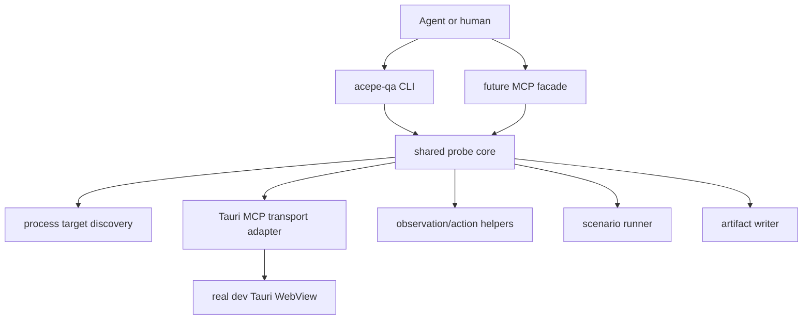

# feat: Build agent app control plane

## Overview

Build an Acepe-specific control plane that lets coding agents inspect and operate the real desktop dev app through small deterministic commands instead of repeated raw Tauri MCP shell snippets. The first deliverable is an agent-facing CLI backed by a shared probe core. The MCP facade comes after the CLI contract is stable, and wraps the same core rather than duplicating behavior.

This plan is intentionally staged. The goal is to make future Acepe QA faster within the first implementation slice, while still pointing toward a durable CLI + MCP control plane.

## Problem Frame

The origin document states that Acepe's current agent-to-app communication is too slow and too fragile for daily work. Agents repeatedly rediscover the dev target, bridge port, stale binary state, console logs, DOM selectors, screenshots, and Tauri MCP wrapper format. That produces long sessions, weak evidence, and mistakes such as inspecting the production bundle instead of the current dev app.

The product need is a deterministic control layer:

```text
agent
  -> compact command
     -> real dev Tauri WebView
        -> structured observation / action / evidence
```

## Requirements Trace

- R1-R3. Target identity and health must be checked before QA actions.
- R4-R6. Observations must be compact and structured before screenshots.
- R7-R9. Actions must use stable refs or named targets and handle contenteditable composer input correctly.
- R10-R12. Named scenarios must emit useful pass/fail artifacts.
- R13-R18. CLI and MCP must share one probe core, with AXI-style compact CLI output.
- R19-R21. QA commands must write evidence bundles and update future skill workflow.
- R22-R24. The control plane must be dev-only, explicit about dangerous operations, and avoid vague high-power MCP tools.

## Scope Boundaries

- This plan does not replace normal unit, Svelte, Rust, or integration tests.
- This plan does not make browser-only `localhost:1420` QA acceptable for Tauri-specific behavior.
- This plan does not make `/Applications/Acepe.app` a valid dev QA target.
- This plan does not build a production telemetry feature.
- This plan does not require a new Acepe UI surface.

### Deferred to Separate Tasks

- Full MCP server hardening beyond the first wrapper: separate follow-up after the CLI core and scenario runner are stable.
- Full scenario catalog for every agent-panel workflow: this plan seeds the catalog and migrates one existing scenario; additional scenarios can land incrementally.
- TOON-native formatter polish: this plan keeps AXI shape and small output, but JSON artifacts remain the canonical evidence format.

## Context & Research

### Relevant Code and Patterns

- `packages/desktop/scripts/qa-transcript-viewport-scroll.ts` already proves a useful pattern: run Tauri MCP CLI, unwrap duplicate payloads, execute focused WebView JS, validate with Zod, emit JSON artifacts, and print a short summary.
- `packages/desktop/package.json` already has `qa:transcript-viewport-scroll`, so a new `qa` command family fits the existing scripts surface.
- `.github/skills/acepe-dev-app-qa/SKILL.md` contains the manual target-validation and Tauri MCP workflow that should become command behavior.
- `docs/solutions/workflow-issues/visual-qa-target-dev-tauri-app-2026-05-20.md` requires proof that QA targets the dev app, not the installed production bundle.
- `docs/solutions/workflow-issues/dom-first-qa-for-css-shape-bugs-2026-05-20.md` supports DOM/structured inspection before screenshots.
- `docs/solutions/workflow-issues/visual-qa-screenshot-evidence-must-be-described-2026-05-20.md` requires screenshot evidence to be described, not silently treated as proof.

### Institutional Learnings

- Running dev app existence is not enough; Rust-backed QA must account for stale binaries and wedged WebViews.
- Tauri MCP responses are verbose and should be unwrapped before entering agent context.
- Raw DOM snapshots are too large for normal agent QA; focused probes and compact facts are better.
- Deterministic scenario scripts catch transient viewport bugs better than manual inspection.

### External References

- Chrome DevTools Protocol: https://chromedevtools.github.io/devtools-protocol/
- WebDriver BiDi: https://developer.mozilla.org/en-US/docs/Web/WebDriver/Reference/BiDi
- Playwright MCP: https://playwright.dev/docs/getting-started-mcp
- Playwright Trace Viewer: https://playwright.dev/docs/debug
- Appium architecture: https://appium.io/docs/en/3.3/intro/appium/
- MCP specification: https://modelcontextprotocol.io/specification/2025-06-18
- Local `agent-browser` skill: ref-based snapshot/action ergonomics to mirror where useful.
- Local `axi` skill: agent-facing CLI output constraints to follow.

## Key Technical Decisions

- Build CLI first, MCP second: CLI gives immediate value, is easy to test, and creates the shared contract the MCP facade should wrap.
- Put shared code under a probe core instead of per-scenario scripts: `qa-transcript-viewport-scroll.ts` becomes a scenario consumer of the shared target, Tauri, artifact, and output helpers.
- Use JSON artifacts as the canonical evidence format: they are easy to validate with Zod, diff, archive, and load from future tools.
- Use compact AXI-style stdout with optional `--format json`: this keeps default output readable and small while still supporting machine consumers.
- Keep the Tauri MCP CLI as the first transport adapter: it is already proven in this repo. The probe core should hide its wrapper and command quirks.
- Treat arbitrary WebView JavaScript as a privileged low-level probe: common flows should use named observation and action helpers, not ad hoc JS strings.
- Model `agent-browser` as an ergonomics benchmark, not a dependency for desktop QA: browser-only CDP cannot prove Tauri IPC or WebView runtime behavior.

## Open Questions

### Resolved During Planning

- **Should the first implementation build the MCP server immediately?** No. Build the shared CLI/probe core first, then wrap it with MCP after the command contract is stable.
- **Should default stdout be JSON or human-readable?** Default should be compact AXI-style text, with JSON artifacts always written and `--format json` available for direct machine output.
- **Where should evidence live?** Default to `/tmp/acepe-qa-*` artifacts first, with an explicit artifact path in output. Retention and project-local artifact storage can be revisited after usage patterns are clear.
- **Should existing transcript viewport QA be deleted or replaced immediately?** No. Migrate it onto the shared core so the existing command keeps working.

### Deferred to Implementation

- Exact helper names and module boundaries inside the probe core: implementation can adjust once code shape is clearer.
- Whether the MCP facade runs as a Bun/Node server or a thin wrapper around the CLI command: decide after the CLI core exists and can be imported or executed cleanly.
- Whether TOON formatting is worth a dedicated formatter dependency: keep output small first, then decide from real usage.

## Output Structure

Expected new/changed shape:

```text
packages/desktop/
  scripts/
    acepe-qa.ts
    acepe-qa/
      cli.ts
      output.ts
      artifacts.ts
      process-target.ts
      tauri-mcp.ts
      observe.ts
      actions.ts
      scenarios.ts
      schemas.ts
      __tests__/
        output.test.ts
        process-target.test.ts
        tauri-mcp.test.ts
        observe.test.ts
        scenarios.test.ts
    qa-transcript-viewport-scroll.ts
```

This structure is a directional scope declaration. The implementing agent may adjust file names if the same boundaries remain clear.

## High-Level Technical Design

> *This illustrates the intended approach and is directional guidance for review, not implementation specification. The implementing agent should treat it as context, not code to reproduce.*



The core should make the common path boring:

```text
doctor
  -> inspect processes
  -> detect dev binary and bridge port
  -> reject production-only target
  -> check stale Rust binary signal
  -> ping WebView with small JS
  -> summarize state + artifact

observe
  -> ensure target
  -> collect focused app facts
  -> collect compact refs/state/errors
  -> optionally screenshot
  -> summarize state + artifact

scenario <name>
  -> ensure target
  -> run named workflow
  -> validate scenario result
  -> summarize pass/fail + artifact
```

## Implementation Units

- [x] **Unit 1: Shared CLI Shell And AXI Output**

**Goal:** Create the `acepe-qa` command entry point with command parsing, compact output helpers, JSON artifact support, and structured errors.

**Requirements:** R13, R14, R17, R18, R19, R20

**Dependencies:** None

**Files:**
- Create: `packages/desktop/scripts/acepe-qa.ts`
- Create: `packages/desktop/scripts/acepe-qa/cli.ts`
- Create: `packages/desktop/scripts/acepe-qa/output.ts`
- Create: `packages/desktop/scripts/acepe-qa/artifacts.ts`
- Create: `packages/desktop/scripts/acepe-qa/schemas.ts`
- Test: `packages/desktop/scripts/acepe-qa/__tests__/output.test.ts`
- Modify: `packages/desktop/package.json`

**Approach:**
- Add a small command dispatcher for `doctor`, `observe`, `scenario`, `logs`, `screenshot`, and a placeholder-gated `act`.
- Keep stdout compact and agent-friendly. Errors should be structured and actionable rather than raw dependency dumps.
- Write JSON artifacts for QA commands and print the artifact path.
- Support a `--format json` path for machine-readable stdout without changing the JSON artifact contract.

**Execution note:** Implement output and error formatting test-first because this becomes the stable agent-facing contract.

**Patterns to follow:**
- `packages/desktop/scripts/qa-transcript-viewport-scroll.ts` for Zod validation and artifact writing.
- `packages/desktop/scripts/analyze-test-timing.ts` for simple script-style CLI conventions.
- Local `axi` skill for stdout and error shape.

**Test scenarios:**
- Happy path: `doctor` handler result with ok status formats compact stdout and includes an artifact path.
- Happy path: `--format json` returns parseable JSON containing status, command, and artifact path.
- Error path: missing required argument exits with usage-style structured error and does not print raw stack traces.
- Error path: dependency error is translated into a short message with one next-step hint.
- Edge case: no findings or empty collections print a definitive empty state rather than blank output.

**Verification:**
- A user can run the new CLI entry point and see content-first output rather than a large help dump.
- Output tests prove stdout stays small and structured.

- [x] **Unit 2: Dev Target Doctor**

**Goal:** Implement target discovery and health checks for the real Acepe dev app.

**Requirements:** R1, R2, R3, R19, R22, R23

**Dependencies:** Unit 1

**Files:**
- Create: `packages/desktop/scripts/acepe-qa/process-target.ts`
- Create: `packages/desktop/scripts/acepe-qa/tauri-mcp.ts`
- Test: `packages/desktop/scripts/acepe-qa/__tests__/process-target.test.ts`
- Test: `packages/desktop/scripts/acepe-qa/__tests__/tauri-mcp.test.ts`
- Modify: `packages/desktop/scripts/acepe-qa/cli.ts`
- Modify: `packages/desktop/scripts/acepe-qa/schemas.ts`

**Approach:**
- Detect dev processes from this checkout: `bun run tauri dev`, Vite, and `target/debug/acepe`.
- Detect production Acepe process separately and fail closed when it is the only visible app target.
- Detect the bridge port from the dev binary, defaulting to `9223` only when process evidence supports it.
- Check stale Rust binary signal by comparing Rust source mtimes with `src-tauri/target/debug/acepe`.
- Ping the WebView through a tiny Tauri MCP call that returns URL/title/basic responsiveness.
- Normalize all results into a small `TargetDoctorResult` artifact.

**Execution note:** Characterize process parsing with tests before wiring the live shell calls.

**Patterns to follow:**
- `.github/skills/acepe-dev-app-qa/SKILL.md` target validation sequence.
- `docs/solutions/workflow-issues/visual-qa-target-dev-tauri-app-2026-05-20.md`.

**Test scenarios:**
- Happy path: dev launcher, Vite, and target debug binary are present; doctor returns usable target with bridge port.
- Error path: only `/Applications/Acepe.app` is present; doctor returns failed status and no usable target.
- Error path: no bridge port is listening; doctor reports bridge unavailable with a next-step hint.
- Edge case: Rust source newer than debug binary; doctor marks binary stale without pretending QA is valid.
- Integration: mocked Tauri MCP ping response with `http://localhost:1420/` is normalized into target evidence.

**Verification:**
- `doctor` can answer "am I attached to the right Acepe dev app?" in one command.
- Failure states are explicit and do not suggest production-app QA.

- [x] **Unit 3: Compact Observe And Screenshot**

**Goal:** Add structured observation of the current Acepe screen and screenshot evidence through the shared core.

**Requirements:** R4, R5, R6, R13, R19, R20

**Dependencies:** Unit 2

**Files:**
- Create: `packages/desktop/scripts/acepe-qa/observe.ts`
- Test: `packages/desktop/scripts/acepe-qa/__tests__/observe.test.ts`
- Modify: `packages/desktop/scripts/acepe-qa/tauri-mcp.ts`
- Modify: `packages/desktop/scripts/acepe-qa/cli.ts`
- Modify: `packages/desktop/scripts/acepe-qa/schemas.ts`

**Approach:**
- Implement `observe --level summary|focused|raw`, defaulting to `summary`.
- Summary should include route, title, selected/focused panel facts, visible session error text, composer state, and console error summary.
- Focused mode can include scoped accessibility refs and relevant element rectangles.
- Raw mode is explicit and should be treated as larger output.
- Screenshot command should write an image path and include it in the JSON artifact.

**Patterns to follow:**
- Tauri MCP compact JS probes from `.github/skills/acepe-dev-app-qa/SKILL.md`.
- `agent-browser snapshot -i` concept for ref-based inspection.
- DOM-first solution docs for structured facts before screenshots.

**Test scenarios:**
- Happy path: summary observation normalizes a WebView JS payload into compact app facts.
- Happy path: focused observation includes refs and omits unrelated DOM text.
- Error path: Tauri MCP wrapper returns malformed payload; observe writes a raw artifact and returns a structured failure.
- Edge case: WebView JS timeout; observe reports wedged WebView instead of returning stale or empty success.
- Integration: screenshot result includes a file path in both stdout summary and artifact.

**Verification:**
- A normal observation can fit into agent context without dumping the DOM.
- Screenshot evidence is available, but the primary facts come from structured observation.

- [ ] **Unit 4: Safe Named Actions**

**Goal:** Add small named actions for common Acepe workflows, with verified post-action state.

**Requirements:** R7, R8, R9, R16, R23

**Dependencies:** Unit 3

**Files:**
- Create: `packages/desktop/scripts/acepe-qa/actions.ts`
- Test: `packages/desktop/scripts/acepe-qa/__tests__/actions.test.ts`
- Modify: `packages/desktop/scripts/acepe-qa/cli.ts`
- Modify: `packages/desktop/scripts/acepe-qa/schemas.ts`

**Approach:**
- Provide a small action vocabulary instead of exposing raw JS as the default interface.
- Include safe actions for composer typing, send, open session by visible title/id, close focused panel, and click retry/error where a stable target exists.
- Composer typing must use the known contenteditable-safe path and verify real `textContent` plus send button enabled state.
- Allow unsafe raw JS only behind an explicit flag or command name that labels the risk.

**Patterns to follow:**
- Contenteditable recipe from `.github/skills/acepe-dev-app-qa/SKILL.md`.
- `agent-browser` ref-based interaction model.

**Test scenarios:**
- Happy path: composer action returns inserted text, send readiness, and target panel facts.
- Happy path: click action by named target records before/after observations.
- Error path: action target is absent; command fails with "target not found" and suggests `observe --level focused`.
- Error path: contenteditable insert does not change `textContent`; command fails rather than claiming success.
- Security: unsafe raw JS command requires explicit opt-in and is visible in output.

**Verification:**
- Common app actions no longer require hand-written `webview-execute-js` snippets.
- Failed actions are safe and explain what to inspect next.

- [ ] **Unit 5: Scenario Runner And Viewport Scenario Migration**

**Goal:** Introduce a reusable scenario runner and migrate the existing transcript viewport scroll QA script onto it without breaking the current package script.

**Requirements:** R10, R11, R12, R19, R20

**Dependencies:** Units 1-3

**Files:**
- Create: `packages/desktop/scripts/acepe-qa/scenarios.ts`
- Test: `packages/desktop/scripts/acepe-qa/__tests__/scenarios.test.ts`
- Modify: `packages/desktop/scripts/qa-transcript-viewport-scroll.ts`
- Modify: `packages/desktop/scripts/acepe-qa/cli.ts`
- Modify: `packages/desktop/package.json`

**Approach:**
- Define a scenario registry where each scenario has a name, description, required target health level, runner, Zod result schema, and artifact writer.
- Migrate transcript viewport fast-scroll QA to reuse target discovery, Tauri MCP wrapper, artifact writing, and output formatting.
- Keep `bun run qa:transcript-viewport-scroll` working as a compatibility command, delegating into the shared scenario.
- Add `acepe-qa scenario transcript-viewport-scroll` as the new canonical route.

**Execution note:** Preserve current transcript viewport scenario behavior with characterization tests before refactoring the script.

**Patterns to follow:**
- Existing `qa-transcript-viewport-scroll.ts` result schema and violation model.
- `docs/solutions/workflow-issues/transcript-viewport-fast-scroll-qa-2026-05-31.md`.

**Test scenarios:**
- Happy path: scenario registry lists transcript viewport scenario with compact metadata.
- Happy path: migrated scenario result writes the same essential fields as the current artifact.
- Error path: scenario receives unusable target; it fails before touching the WebView.
- Error path: scenario raw payload is not JSON; raw artifact is written and referenced.
- Integration: compatibility script delegates to the shared scenario path.

**Verification:**
- Existing viewport QA command still works.
- New scenario route proves the shared runner can host future scenarios.

- [ ] **Unit 6: First Additional Scenario Seed**

**Goal:** Add one high-value non-viewport scenario to prove the control plane generalizes beyond scroll QA.

**Requirements:** R10, R11, R12, R21

**Dependencies:** Units 3-5

**Files:**
- Modify: `packages/desktop/scripts/acepe-qa/scenarios.ts`
- Test: `packages/desktop/scripts/acepe-qa/__tests__/scenarios.test.ts`
- Create or modify: scenario-specific file under `packages/desktop/scripts/acepe-qa/`

**Approach:**
- Prefer `first-send-failure-recovery` as the seed scenario because it directly addresses the recent bad session experience.
- Keep it deterministic and low-risk. If a live provider call is too flaky for a first scenario, design it around a controlled visible state or mocked/provider-safe path and record the limitation.
- The scenario should prove the user-visible behavior: failed first-send does not promote an empty session panel, composer/draft evidence remains recoverable, and the failure is visible in the pre-session panel context.

**Patterns to follow:**
- Recent first-send failure fix tests in `packages/desktop/src/lib/acp/components/agent-input/state/__tests__/send-path-ordering.test.ts`.
- First-send recovery helper tests in `packages/desktop/src/lib/acp/components/agent-input/logic/__tests__/first-send-recovery.test.ts`.

**Test scenarios:**
- Happy path: scenario can collect pre-session panel facts and confirm composer state after a controlled failure.
- Error path: no pre-session panel is available; scenario fails with setup guidance, not a false pass.
- Edge case: a failed session panel is already open from previous history; scenario distinguishes historical failure from the current scenario.
- Integration: scenario artifact includes before/after observations and screenshot path when requested.

**Verification:**
- The scenario runner hosts at least two distinct workflows: viewport scroll and first-send recovery.
- Future scenarios have an obvious pattern to follow.

- [ ] **Unit 7: Minimal MCP Facade**

**Goal:** Expose the stable probe core through a minimal MCP server or MCP-compatible wrapper after CLI behavior is established.

**Requirements:** R13, R15, R16, R22, R23, R24

**Dependencies:** Units 1-5

**Files:**
- Create: `packages/desktop/scripts/acepe-qa/mcp-server.ts` or equivalent wrapper
- Test: `packages/desktop/scripts/acepe-qa/__tests__/mcp-server.test.ts`
- Modify: `packages/desktop/package.json`
- Modify: `.codex` or repo MCP config only if this repo already has an appropriate place for local dev MCP registration

**Approach:**
- Expose small tools that map to core operations: `doctor`, `observe`, `screenshot`, `scenario`, and maybe `act`.
- Do not expose raw JS as a normal tool. If included, make it visibly unsafe.
- Tool results should return the same compact summaries and artifact paths as the CLI.
- Prefer wrapping the shared core directly over shelling out to the CLI if module boundaries make that clean; otherwise shell out as a first bridge and document the tradeoff.

**Execution note:** Implement this after CLI scenarios are stable. Do not block the first useful CLI slice on MCP packaging.

**Patterns to follow:**
- MCP spec tool/resource separation.
- `agent-browser` and Playwright MCP patterns for small semantic tools.

**Test scenarios:**
- Happy path: MCP `doctor` returns the same normalized fields as CLI doctor.
- Happy path: MCP `observe` returns compact app facts and artifact reference.
- Error path: unsafe operation is unavailable or clearly rejected without explicit opt-in.
- Error path: target unavailable maps to a structured MCP error with next-step guidance.
- Integration: CLI and MCP outputs share the same core schema for at least one operation.

**Verification:**
- Future Codex sessions can prefer the MCP facade when available.
- MCP does not become a parallel implementation of the probe logic.

- [ ] **Unit 8: Skills And Workflow Documentation**

**Goal:** Update workflow docs and skills so future sessions use the control plane before raw Tauri MCP snippets.

**Requirements:** R19, R20, R21

**Dependencies:** Units 1-5, Unit 7 if MCP lands in the same implementation cycle

**Files:**
- Modify: `.github/skills/acepe-dev-app-qa/SKILL.md`
- Create: `docs/solutions/workflow-issues/agent-app-control-plane-qa-2026-05-31.md`
- Modify: `docs/solutions/workflow-issues/transcript-viewport-fast-scroll-qa-2026-05-31.md`
- Modify: `docs/brainstorms/2026-05-31-agent-app-control-plane-requirements.md` only if implementation decisions materially change the requirements record

**Approach:**
- Shorten the QA skill's default path to use `acepe-qa doctor` and `acepe-qa observe` first.
- Keep the raw Tauri MCP recipe as fallback/debugging documentation, not the first thing future agents do.
- Document which commands produce which artifacts and how to report them in final answers.
- Preserve the hard rule against production-app QA.

**Patterns to follow:**
- Existing workflow solution docs under `docs/solutions/workflow-issues/`.
- The current `acepe-dev-app-qa` skill's required target checks.

**Test scenarios:**
- Documentation review: skill text still blocks `/Applications/Acepe.app` and browser-only localhost evidence.
- Documentation review: skill explains CLI first, raw Tauri MCP fallback second.
- Documentation review: transcript viewport solution points to the migrated scenario route.

**Verification:**
- A future agent reading the skill has fewer manual commands to copy and a clearer first action.

## System-Wide Impact

- **Interaction graph:** The new CLI becomes a common entry point for agent QA, but does not change the app's runtime interaction graph.
- **Error propagation:** Raw Tauri MCP/process errors must be translated into structured CLI/MCP errors with clear next steps.
- **State lifecycle risks:** Actions can mutate the running dev app, so unsafe actions must be explicit and observations should record before/after state when used in scenarios.
- **API surface parity:** CLI and MCP must share the same core schemas so they do not drift.
- **Integration coverage:** At least one scenario must exercise the real dev WebView through Tauri MCP. Unit tests alone cannot prove the control plane reaches the correct target.
- **Unchanged invariants:** Unit/Svelte/Rust tests remain the primary proof for code correctness. The control plane is runtime QA evidence, not a replacement for tests.

## Risks & Dependencies

| Risk | Likelihood | Impact | Mitigation |
|------|------------|--------|------------|
| Scope balloons into a full automation platform | Medium | High | Land in phases: CLI shell, doctor, observe, scenarios, then MCP. |
| Tauri MCP CLI changes flags or wrapper shape | Medium | Medium | Hide it behind `tauri-mcp.ts` and test wrapper parsing. |
| Agent output becomes too verbose | High | Medium | Enforce compact output tests and keep raw/full output behind flags. |
| Unsafe actions damage user state | Low | High | Dev-only target checks, explicit unsafe flags, and named safe actions first. |
| MCP facade duplicates CLI behavior | Medium | Medium | Require shared schemas/core before MCP wrapper lands. |
| Browser-only tools are mistaken for desktop proof | Medium | High | Keep target doctor and skill docs explicit: real Tauri WebView is required. |

## Success Metrics

- `doctor` answers target readiness in one command with no manual process/lsof sequence.
- `observe` returns a compact state summary without dumping a full DOM tree.
- Existing transcript viewport QA runs through the shared scenario runner.
- Every QA command prints an artifact path.
- Updated skill instructions are shorter and point future agents to the control plane first.

## Phased Delivery

### Phase 1: Useful CLI Spine
- Unit 1: Shared CLI shell and AXI output.
- Unit 2: Dev target doctor.
- Unit 3: Compact observe and screenshot.

### Phase 2: Repeatable QA
- Unit 4: Safe named actions.
- Unit 5: Scenario runner and viewport migration.
- Unit 6: First additional scenario seed.

### Phase 3: Agent Integration
- Unit 7: Minimal MCP facade.
- Unit 8: Skills and workflow documentation.

## Documentation / Operational Notes

- The final workflow docs should tell agents to run the control plane first, not paste raw Tauri MCP snippets.
- The docs must keep saying browser-only localhost QA is insufficient for Tauri-specific desktop behavior.
- The CLI should be treated as dev tooling. Production builds should not expose broad automation hooks because of this plan.

## Sources & References

- **Origin document:** [docs/brainstorms/2026-05-31-agent-app-control-plane-requirements.md](../brainstorms/2026-05-31-agent-app-control-plane-requirements.md)
- Existing scenario script: `packages/desktop/scripts/qa-transcript-viewport-scroll.ts`
- Package scripts: `packages/desktop/package.json`
- QA skill: `.github/skills/acepe-dev-app-qa/SKILL.md`
- Visual QA target learning: `docs/solutions/workflow-issues/visual-qa-target-dev-tauri-app-2026-05-20.md`
- DOM-first QA learning: `docs/solutions/workflow-issues/dom-first-qa-for-css-shape-bugs-2026-05-20.md`
- Screenshot evidence learning: `docs/solutions/workflow-issues/visual-qa-screenshot-evidence-must-be-described-2026-05-20.md`
- Transcript viewport scenario learning: `docs/solutions/workflow-issues/transcript-viewport-fast-scroll-qa-2026-05-31.md`
- Chrome DevTools Protocol: https://chromedevtools.github.io/devtools-protocol/
- WebDriver BiDi: https://developer.mozilla.org/en-US/docs/Web/WebDriver/Reference/BiDi
- Playwright MCP: https://playwright.dev/docs/getting-started-mcp
- Playwright Trace Viewer: https://playwright.dev/docs/debug
- Appium architecture: https://appium.io/docs/en/3.3/intro/appium/
- MCP specification: https://modelcontextprotocol.io/specification/2025-06-18
