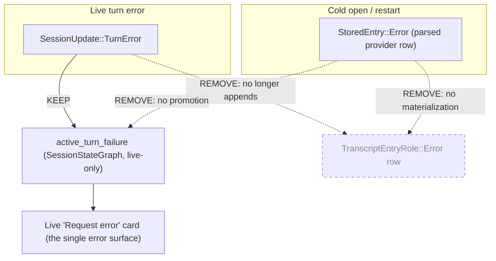

# fix: Errors Are Live-Only Turn-Failure State, Never Restored Transcript Content

## Problem Frame

The agent panel surfaces a provider error twice — as an in-thread "Error" transcript card **and** as a live bottom "Request error" card — and on a restored session the error it shows is **stale**. Live QA on 2026-06-15 reproduced this on a restored Claude Code session ("what is this project?"). Inspecting the CLI's own on-disk JSONL revealed the truth the UI hides:

- The CLI emits a **synthetic** error message: `message.model = "<synthetic>"`, `usage` all zeros, `message.error = null`. The real signal lives at the envelope level: `isApiErrorMessage: true`, `apiErrorStatus: 429`, root `error: "rate_limit"`, `requestId`, and `timestamp: 2026-06-11` — **four days before** it was observed.
- No 429/spend error exists in any of the project's CLI sessions on 2026-06-15; other sessions respond normally. So the displayed error is a **restored four-day-old rate-limit replayed on session-open and surfaced as if it were the current turn's failure**. A 429 window resets, so Acepe is presenting a known-expired condition as live.

**The product decision (user-confirmed at planning time).** Errors are **transient, live-only turn-failure state — never persisted-and-replayed transcript content**. On session re-open or app restart, *nothing error-shaped should resurface*. The only error surface is the live "Request error" card, driven by `active_turn_failure` (live `SessionStateGraph` state). If a failure is genuinely still active, the live stream re-emits it on reattach; if it does not re-emit, Acepe does not show it. The in-thread transcript "Error" row — the *persisted* surface that is read back from transcript on reopen — is removed entirely, for both live and restored sessions.

This resolves two canonical defects, both confirmed via the GOD architecture gate:

1. **Errors are modeled as persisted transcript content.** `SessionUpdate::TurnError` appends a `TranscriptEntryRole::Error` entry to the canonical transcript (`transcript_projection/runtime.rs:336–348`), and the restore/snapshot path re-materializes `StoredEntry::Error` into the same row (`transcript_projection/snapshot.rs:155–158, 259–262`). Because the canonical transcript is persisted and restored, a transient failure becomes durable content that replays on cold open. This is the wrong authority: a turn failure belongs to `SessionStateGraph`, not the transcript.
2. **Stale-as-live promotion.** On cold open, the restore reducer's trailing `StoredEntry::Error` arm (`operations.rs:291–310`) unconditionally promotes the historical error into live `active_turn_failure` and forces `turn_state = Failed`, discarding the original `timestamp`. There is no canonical distinction between "this live turn just failed" and "a prior-day provider error was restored from disk."

A third issue compounds the visible symptom: a dead UI dedup helper (`resolveVisibleSessionEntries`) was written and unit-tested to collapse the two error surfaces but is **never wired into any render path**. It must be deleted — the duplication is resolved canonically (errors stop being transcript content, so only the live card can ever render). Reviving it would be the exact downstream UI-repair pattern the Green Rule forbids.

**Origin authority.** This plan is anchored to `docs/brainstorms/2026-04-22-provider-authoritative-session-restore-requirements.md`, whose **R8** already decided that *transient live-only states (in-flight tool calls, streaming) are not required to be reproduced on cold open*. A turn failure is exactly such a transient state; this plan extends R8 to make error entries transient by construction (see origin: `docs/brainstorms/2026-04-22-provider-authoritative-session-restore-requirements.md`). Origin **R10** ("must surface failure explicitly, must not present a partial restore as successful") is satisfied for *live* failures by the live card; for *restored* sessions the user has decided that a non-live failure is simply where the conversation ended, not a current failure to assert.

---

## Scope Boundaries

**In scope**

- `SessionUpdate::TurnError` updates **only** `SessionStateGraph` turn-failure state (`active_turn_failure` / `turn_state`); it no longer appends an `Error` entry to the canonical transcript.
- The restore/snapshot path no longer materializes `StoredEntry::Error` into a transcript `Error` row, and the restore reducer no longer promotes a trailing `StoredEntry::Error` into live `active_turn_failure` / `turn_state = Failed`.
- Remove the now-dead `TranscriptEntryRole::Error` and `DisplayElementRole::Error` variants (and their TS mirrors / `SessionEntry {type:"error"}` consumers) once nothing materializes them; regenerate specta bindings.
- Delete the dead `resolveVisibleSessionEntries` dedup helper. The in-thread-vs-live duplication is resolved canonically: a restored error has no live failure to render, and no live error produces a transcript row.
- Add a cold-open vs live-stream canonical-projection parity test: neither path yields a transcript error entry; live failure state appears only on the live path.

**Deferred to Follow-Up Work**

- **Widening the canonical turn-error model with provider envelope metadata** (HTTP status, provider error type, `requestId`, synthetic flag, provider timestamp) at the live and disk ingestion edges. With restored errors never displayed and no UI consuming the metadata, this has no consumer; it should land in the plan that introduces a consumer (e.g. a copyable support reference id in the live error card, or expiry-aware annotation). Previously Phase 2 of this plan; explicitly cut.
- Surfacing `requestId` in the error card / "Create issue" report body.
- Auditing Cursor for any analogous restored-as-live behavior (distinct ingestion path).
- Expiry-aware annotation of a possibly-reset rate-limit.
- The broader unified-unexpected-error-reporting / Sentry correlation work (`docs/brainstorms/2026-04-16-unified-unexpected-error-reporting-requirements.md`) — a separate initiative, not a product-identity boundary.

**Outside this product's identity** (carried from origin)

- Redesigning provider file formats or eliminating provider-history reverse-engineering (origin scope boundary).
- Making Acepe a second durable transcript authority (origin R4/R6).

---

## Requirements Traceability

| ID | Requirement | Origin |
|----|-------------|--------|
| R1 | A live `SessionUpdate::TurnError` updates only `SessionStateGraph` turn-failure state and must not append an `Error` entry to the canonical transcript. | this plan, user decision |
| R2 | Error entries are transient live-only state: the restore/snapshot path must not materialize `StoredEntry::Error` into a transcript `Error` row, and the restore reducer must not promote a trailing error into live `active_turn_failure` or force `turn_state = Failed`. | restore R8, user decision |
| R3 | The single error surface is the live `active_turn_failure` card. On cold open it is absent because live failure state is not restored. | restore R8/R10, user decision |
| R4 | The duplicate in-thread/live error surfaces are resolved canonically. The dead UI dedup helper is deleted, not revived or demoted to a fallback. | GOD gate, learnings Doc 6 |
| R5 | Cold-open and live-stream materialization must agree: neither produces a transcript error entry; live failure state is present only on the live path. | restore R3, R8 |

---

## System-Wide Impact

This change touches the canonical transcript and session-state paths — the highest-risk surfaces under the GOD gate. Affected parties:

- **End users:** stop seeing stale/expired provider errors on reopen; stop seeing the duplicate in-thread error card. Live errors still surface via the bottom "Request error" card with its Retry/Dismiss affordances.
- **Rust canonical model:** the transcript projection stops emitting `Error` entries (live and restore); the `TranscriptEntryRole::Error` / `DisplayElementRole::Error` variants are removed; the restore reducer's `StoredEntry::Error` arm changes promotion behavior.
- **TS canonical projection / display:** `SessionEntry {type:"error"}` and its materializers/row-mappers are removed; the live `sessionTurnState === "error"` → card path is **unchanged**.
- **Generated bindings:** specta re-export regenerates `acp-types.ts` (transcript entry role) and related types.

---

## High-Level Technical Design

*Directional guidance for review, not implementation specification.*

The fix moves error truth to its correct authority and deletes the wrong one:

- **Error = state, not content.** `SessionUpdate::TurnError` continues to flow into `SessionStateGraph.active_turn_failure` (via `terminal_turn_guard`, unchanged) and drives the live card. It stops emitting a `TranscriptEntryRole::Error` transcript entry. The canonical transcript no longer has an error role.
- **Restore reproduces no error.** The restore/snapshot path stops materializing `StoredEntry::Error` into a transcript row, and the restore reducer stops promoting a trailing error into `active_turn_failure` / `turn_state = Failed`. `StoredEntry::Error` remains a parsed provider row (we still read the provider's file faithfully); it is simply not projected to the canonical transcript or to live failure state. On cold open, `active_turn_failure` is `None` and the transcript ends at the last non-error entry.
- **One surface, resolved canonically.** With errors no longer transcript content, the in-thread row can never render (live or restored), and a restored session has no live failure — so the dead `resolveVisibleSessionEntries` dedup is deleted rather than wired in.

The regression guard is the cold-open-vs-live parity test: feed a live `SessionUpdate::TurnError` and assert it yields `active_turn_failure` but **no** transcript error entry; feed a snapshot whose trailing `StoredEntry::Error` is present and assert it yields **neither** `active_turn_failure` **nor** a transcript error entry, while preserving every non-error entry and a coherent `turn_state`.

**Note on `turn_state` derivation (settle in U2).** The current `StoredEntry::Error` arm sets `active_turn_failure = Some(...)`, `last_terminal_turn_id = None`, and forces `turn_state = Failed`. Once it stops doing so, `turn_state` derives from the standard logic (`operations.rs:304–310`: `Failed → Running → Completed → Idle`). A restored session whose last entry was an error will derive `Completed` (or `Idle` if empty), which the user has explicitly accepted ("just where the conversation ended"). U2 must assert the concrete derived `turn_state` and verify the downstream consumers that key off it (`urgency`, `session-work-projection.hasError`/work bucket, `live-session-work` activity, `deriveLiveConnectionState`) present the restored session as a normal completed session, not a failed one.

---

## Implementation Units

### U1. Red tests: errors are not transcript content; restore reproduces no failure

**Goal:** Establish failing tests at the canonical seams before changing behavior, per TDD and the GOD gate.

**Requirements:** R1, R2, R3, R5

**Dependencies:** none

**Files:**
- `packages/desktop/src-tauri/src/acp/transcript_projection/runtime.rs` (Rust test module — live `TurnError` no longer emits a transcript entry)
- `packages/desktop/src-tauri/src/acp/transcript_projection/snapshot.rs` (Rust test module — `StoredEntry::Error` no longer materializes a row)
- `packages/desktop/src-tauri/src/acp/projections/operations.rs` (Rust test module — restore reducer no longer promotes)
- `packages/desktop/src/lib/acp/store/__tests__/canonical-projection-parity.test.ts` (extend existing parity test, or add sibling)

**Approach:** Characterization-then-red. First capture current behavior (live `TurnError` appends a `TranscriptEntryRole::Error` entry; `StoredEntry::Error` both materializes a row and promotes to `active_turn_failure`). Then invert the assertions to the target behavior. Keep the live-failure-state assertions green (the live card path is unchanged).

**Execution note:** Start with the failing live-path test in `runtime.rs` (TurnError yields failure state but no transcript entry) — it is the smallest proof of the model change — then the restore-seam test in `operations.rs`/`snapshot.rs`.

**Patterns to follow:**
- Existing `runtime.rs` `TurnError` tests (`runtime.rs:1350`, `1378`, `1436`, `1541`) that currently assert `entry.role == TranscriptEntryRole::Error` (`runtime.rs:1366`) — invert these.
- Existing restore reducer clearing precedent: `operations.rs` `reset_to_running_turn` (`operations.rs:258–262`).
- Existing cc_sdk_bridge error tests for live-failure-state behavior we keep: `translates_assistant_authentication_error_to_turn_error` (`cc_sdk_bridge.rs:964`), `suppresses_success_result_after_assistant_authentication_error` (`cc_sdk_bridge.rs:998`).
- Cold-open vs live-stream parity pattern: `canonical-projection-parity.test.ts` (learnings Doc 1).

**Test scenarios:**
- Covers R1. Live: a `SessionUpdate::TurnError` produces `active_turn_failure = Some` / `turn_state = Failed` (unchanged) and **no** `TranscriptEntryRole::Error` entry in the projected transcript.
- Covers R2. Restore reducer: a `SessionSnapshot` whose final stored entry is `StoredEntry::Error` ⇒ `active_turn_failure == None`, `turn_state` derived normally (assert the concrete value), and **no** error entry in the projected transcript.
- Covers R2. Restore: `StoredEntry::Error` followed by a `StoredEntry::ToolCall` is unaffected (no regression in the `reset_to_running_turn` path).
- Covers R5. Parity: a live `TurnError` path yields live failure state but no transcript error entry; the same content restored from a snapshot yields neither failure state nor a transcript error entry, and preserves all non-error entries in order.
- Regression: a snapshot whose trailing entry is a normal assistant/tool entry materializes unchanged.

**Verification:** New tests fail for the right reason against current code (live emits an error entry; restore promotes and materializes). No production code changed yet.

---

### U2. Make errors live-only: stop emitting and restoring error transcript content; stop restore promotion

**Goal:** Land the canonical change so errors are turn-failure state only.

**Requirements:** R1, R2, R3, R5

**Dependencies:** U1

**Files:**
- `packages/desktop/src-tauri/src/acp/transcript_projection/runtime.rs` (`SessionUpdate::TurnError` arm ~336–348; stop appending an entry. Remove the now-unused `error_segment` helper ~466 if it has no other caller)
- `packages/desktop/src-tauri/src/acp/transcript_projection/snapshot.rs` (`StoredEntry::Error` materialization ~155–158, ~253, ~259–262; stop producing a row. Remove the `TranscriptEntryRole::Error` enum variant ~305 once unused)
- `packages/desktop/src-tauri/src/acp/transcript_projection/display_id.rs` (`DisplayElementRole::Error` ~14, ~127; remove once unused)
- `packages/desktop/src-tauri/src/acp/projections/operations.rs` (`StoredEntry::Error` arm ~291–310; stop setting `active_turn_failure` and forcing `turn_state = Failed`; let `turn_state` derive normally)
- `packages/desktop/src-tauri/src/acp/session_open_snapshot/snapshot.rs` (~253–257; confirm it then carries `active_turn_failure = None` into `SessionOpenFound`)
- `packages/desktop/src/lib/services/acp-types.ts` (regenerated — `TranscriptEntryRole` loses `error`)

**Approach:** In `runtime.rs`, the `SessionUpdate::TurnError` arm stops appending a transcript entry (it must still allow the failure to flow to `SessionStateGraph` via the existing `terminal_turn_guard` path — that is a separate projection and is unchanged). In `snapshot.rs`, the `StoredEntry::Error` arms stop producing a row. Once no code constructs `TranscriptEntryRole::Error` / `DisplayElementRole::Error`, remove those variants and fix the resulting exhaustive-match sites against the compiler. In `operations.rs`, the trailing-error arm stops promoting to `active_turn_failure` and stops forcing `turn_state = Failed`. `StoredEntry::Error` remains a valid parsed provider row — we do not change parsing, only projection. Regenerate specta (`cargo test --lib session_jsonl::export_types::tests::export_types`).

**Patterns to follow:**
- The adjacent clearing precedent `operations.rs:258–262` (`reset_to_running_turn`) — this arm should simply not set failure in the first place.
- `downgrade_stale_active_operation` / `sanitize_operations_for_projection_frontier` thinking (learnings Doc 4): restored history keeps content but does not resurrect non-terminal/live state.
- Live failure-state path (`terminal_turn_guard` set-on-failure / clear-on-next-turn) stays exactly as is (learnings Docs 3 & 4: fix at the projection seam, never the UI).

**Test scenarios:**
- Covers R1, R2, R3, R5. All U1 tests now pass.
- Covers R3. A restored session with a trailing error opens in a non-failed turn state; the live "Request error" card has no `active_turn_failure` to render.
- Regression: live turn-error behavior (set-on-failure, clear-on-next-turn, composer disable) is unchanged; the live card still renders for a current failure.
- Downstream coherence: a restored-with-trailing-error session presents as a normal completed session across `urgency`, `session-work-projection`, `live-session-work` activity, and `deriveLiveConnectionState`.

**Verification:** `cargo test`, `cargo clippy`, and the export-types test pass; generated `acp-types.ts` no longer contains the `error` transcript role.

---

### U3. Remove the error transcript-entry display path and the dead dedup helper (frontend)

**Goal:** Delete the now-orphaned TS consumption of error transcript entries and the dead UI reconciliation, keeping the live card path intact.

**Requirements:** R3, R4

**Dependencies:** U2

**Files:**
- `packages/desktop/src/lib/acp/session-state/entry-materializers.ts` (remove the `role: "error"` default branch ~242–249 that built the in-thread Error card)
- `packages/desktop/src/lib/acp/components/agent-panel/logic/transcript-viewport-row-mapper.ts` (~106; remove `row.kind === "error"` handling)
- `packages/desktop/src/lib/services/acp-types.ts` (regenerated in U2; remove any hand-written `SessionEntry {type:"error"}` shape that no longer has a producer)
- `packages/desktop/src/lib/acp/components/agent-panel/logic/visible-session-entries.ts` (delete)
- `packages/desktop/src/lib/acp/components/agent-panel/logic/index.ts` (remove the re-export, ~line 26)
- `packages/desktop/src/lib/acp/components/agent-panel/logic/__tests__/visible-session-entries.test.ts` (delete)

**Approach:** Remove the materializer and row-mapper branches that render error transcript entries (these have no producer after U2). Delete the dead `resolveVisibleSessionEntries` helper, its barrel re-export, and its test — research confirmed no runtime caller (only the test and barrel reference it). **Do not** touch the live error surface: `sessionTurnState === "error"` / `activeTurnError` (`agent-panel-session-controller.svelte.ts`, `connection-ui.ts:63`, `agent-panel.svelte:1171`) drives the live card and must remain. **Do not** confuse it with `viewState.kind === "error"` (a panel-level error screen) or `result.status === "error"` (tool results) — those are unrelated and out of scope. Do not demote any deleted reader to a `canonical ?? hotState` fallback (learnings Doc 6).

**Test scenarios:**
- Covers R4. Clearance: no remaining import of `resolveVisibleSessionEntries` anywhere in `src/`; no remaining `SessionEntry {type:"error"}` materialization.
- Covers R3. The live error card (`activeTurnError` / `sessionTurnState === "error"`) still renders for a current failure (existing controller tests stay green).

**Verification:** `bun run check` and `bun test` pass; clearance scan clean; re-run `god-architecture-check` on the canonical change.

---

## Visual QA Gate

Because this changes agent-panel error presentation, after implementation run the Acepe dev-app QA pass (`acepe-dev-app-qa`):
- (a) Open a restored session that previously trailed a provider error → confirm **no** "Request error" card **and no** in-thread "Error" row; the transcript ends at the last real entry.
- (b) Induce a fresh **live** turn error → confirm the bottom "Request error" card renders with Retry/Dismiss, and there is **no** in-thread error row.
- (c) Reload/reopen that same session after the live error → confirm the error does **not** resurface.

Cite the DOM/screenshot evidence. (Note: the error card uses `text-destructive`/`WarningCircle`, so the QA wrapper's `[class*='error']` probe is blind to it — assert on the card's `data-qa` / button text, not a class match.)

---

## Risk Analysis & Mitigation

| Risk | Likelihood | Impact | Mitigation |
|------|-----------|--------|------------|
| A genuinely still-active failure is hidden on reopen because live state is not restored | Medium | Medium | User-accepted product stance: only live failures are shown; a still-active failure re-emits on reattach. Documented in R3 and origin R10 carve-out. Revisit if support load shows users losing actionable failures. |
| Removing `TranscriptEntryRole::Error` breaks an exhaustive match or a consumer we missed | Medium | Medium | Remove the variant only after materialization stops; let the compiler enumerate every match site; U1 parity test + `cargo clippy` + `bun run check` cover the cascade. |
| Restored `turn_state` derives to a value some consumer mishandles (e.g. flips to "ready"/"completed" chrome) | Medium | Medium | U2 asserts the concrete derived `turn_state` and verifies `urgency`, `session-work-projection`, `live-session-work`, `deriveLiveConnectionState` present a normal completed session. |
| Accidentally disabling the **live** error card while removing the transcript row | Low | High | The live card is driven by `active_turn_failure` / `sessionTurnState === "error"`, a separate projection; U2/U3 keep it and a regression test asserts it still renders. |
| Reviving the dead dedup helper out of habit | Low | Medium | U3 deletes it; clearance scan asserts zero references. |
| specta regeneration drifts other generated types | Low | Medium | Regenerate via the single export test; review the diff is confined to the transcript-role removal. |

---

## Alternative Approaches Considered

- **Keep the in-thread row for live errors; only suppress on restore (option 2).** Rejected by the user: it preserves the live duplication that prompted the original complaint and keeps error as transcript content, leaving the restore-vs-live distinction near the UI. Making error pure live-only state is the deeper, single-source fix.
- **Tag every failure with live/restored provenance and let the display layer decide.** Rejected: keeps the decision close to the UI and invites a `canonical ?? hotState`-style branch. Not modeling error as transcript content at all is simpler and keeps authority in Rust.
- **Wire the existing `resolveVisibleSessionEntries` dedup into the render path.** Rejected: a downstream UI-repair pass the Green Rule forbids; it would not fix staleness, only duplication.
- **Widen the canonical turn-error model with provider envelope metadata now (former Phase 2).** Deferred: with restored errors never displayed, the metadata has no consumer. Land it with the plan that introduces one.

---

## Dependencies / Sequencing

- U1 → U2 → U3, strictly. U1 establishes the red seam; U2 lands the canonical change and regenerates bindings; U3 removes the orphaned TS display path and dead helper after the producer is gone.
- Single phase. The former Phase 2 (metadata widening) is cut to a follow-up plan.

---

## Deferred Implementation Notes

- The precise `turn_state` derivation for a restored session whose last entry was an error is settled in U2 against the existing terminal-turn logic and asserted by test (expected: `Completed`, or `Idle` for an empty transcript).
- Whether to fully delete the `TranscriptEntryRole::Error` / `DisplayElementRole::Error` variants or leave them unconstructed is decided in U2 against the compiler; prefer deletion (no dead path) unless the cascade reveals a non-error consumer of `DisplayElementRole::Error`.
- `StoredEntry::Error` parsing and the provider JSONL fixtures are unchanged; only projection to the canonical transcript and to live failure state is removed.
