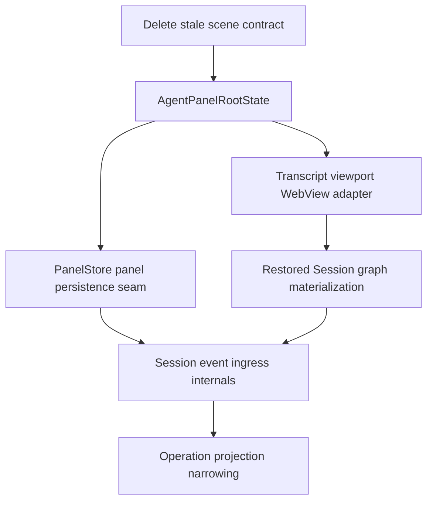
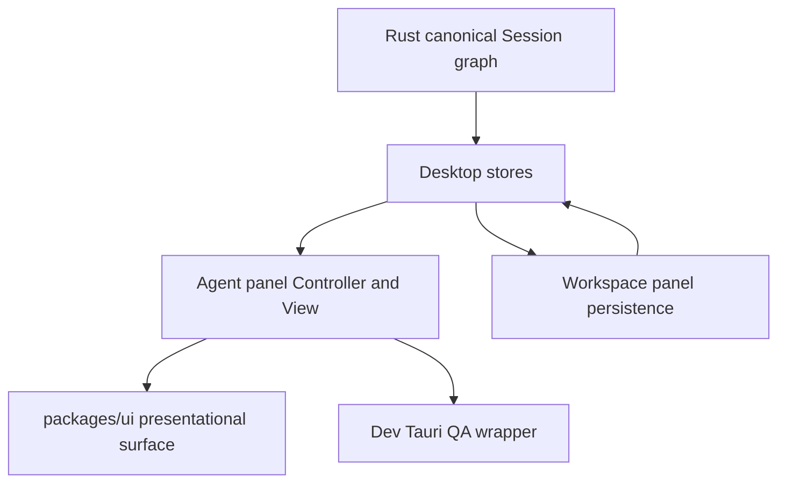

# refactor: Address architecture deepening candidates

## Overview

Address the full architecture review as an ordered refactor program, not as one giant
diff. The review surfaced seven deepening candidates:

1. deepen the Agent panel Controller spine
2. deepen the transcript viewport WebView adapter
3. move workspace panel persistence into `PanelStore`
4. deepen restored Session graph materialization
5. deepen Session event ingress
6. deepen Operation projection
7. delete the shallow Agent panel contract module

The work is intentionally sequenced as small, reviewable implementation slices. Each
slice keeps the existing public surface stable unless the candidate is specifically
about deleting an obsolete surface. For session-shaped, transcript-shaped, and
Agent panel paths, implementation must be characterization-first and GOD-gated
where applicable.

## Problem Frame

Acepe has made strong progress toward deep modules: `SessionStore` and
`PanelStore` are composition roots, Rust transcript viewport ownership is canonical,
and the Agent panel has focused controllers. The remaining friction is in the next
level of module depth:

- some composition seams still live inline in large Svelte modules
- some persistence and restore paths require callers to know implementation details
- some canonical Session graph behavior is split across command, materialization,
  and event-ingress modules
- one obsolete shared scene contract still exists beside the active `@acepe/ui`
  scene model

The goal is to increase locality and leverage without changing product behavior:
bugs should concentrate in fewer modules, tests should exercise behavior through
the same interface as callers, and shallow pass-through modules should either
deepen or disappear.

## Requirements Trace

- R1. All seven architecture-review candidates are either completed or mapped to
  an explicit implementation slice with ownership, tests, and sequencing.
- R2. Existing active plans remain authoritative where they already cover a
  candidate; this program coordinates them instead of duplicating them.
- R3. Agent panel UI work preserves Svelte 5 discipline: no new unguarded
  `$effect`, snippets remain unconditional, `@acepe/ui` stays presentational.
- R4. Session-shaped and transcript-shaped work keeps canonical Rust-owned truth
  upstream; TypeScript and UI code must not repair provider quirks or transcript
  identity.
- R5. Behavior-changing or high-risk refactors start with characterization tests
  before moving code.
- R6. Public callers experience stable interfaces during deepening unless a unit
  explicitly deletes a stale interface.
- R7. UI-visible work is verified in the running dev Tauri WebView through the
  repo QA wrapper after implementation.
- R8. Each new or deepened module earns depth by passing the deletion test: if
  the module disappeared, meaningful complexity would reappear across callers.

## Scope Boundaries

- Do not merge these candidates into one mega-PR.
- Do not change Agent panel product behavior, transcript ordering, provider
  parsing, Session lifecycle semantics, panel focus behavior, or persistence
  schema unless a unit explicitly calls that out.
- Do not create migration/coexistence plans for old and new authorities. Each
  slice should replace or delete the shallow shape directly once its safety net
  is in place.
- Do not move runtime, store, Tauri, or provider logic into `packages/ui`.
- Do not run desktop UI verification in a browser-only localhost context.

### Deferred to Separate Tasks

- Any new product feature discovered while refactoring: separate plan.
- Broad tool-entry payload redesign beyond Operation projection narrowing:
  separate plan after the first six slices reduce surrounding churn.
- New visual design changes in the Agent panel: separate design review.

## Context & Research

### Relevant Code and Patterns

- `docs/plans/2026-06-11-013-refactor-agent-panel-root-state-plan.md`
  already covers AgentPanelRootState as the Controller spine.
- `docs/plans/2026-06-11-011-refactor-panel-store-sub-stores-plan.md`
  completed the sub-store split that the workspace persistence slice should build on.
- `docs/plans/2026-05-31-transcript-viewport-scroll-actuator-plan.md`
  covers the first transcript viewport actuator pass; the new adapter slice
  should continue that direction rather than create a parallel controller.
- `docs/plans/2026-04-10-004-refactor-agent-panel-ui-extraction-reset-plan.md`
  already declares `@acepe/agent-panel-contract` migration residue.
- `packages/desktop/src/lib/acp/components/agent-panel/components/agent-panel.svelte`
  remains the Controller/View mix to shrink behind the root-state seam.
- `packages/desktop/src/lib/acp/components/agent-panel/components/scene-content-viewport.svelte`
  remains the WebView renderer and DOM-command adapter to deepen.
- `packages/desktop/src/lib/acp/store/workspace-store.svelte.ts` reaches through
  `PanelStore` to serialize and restore panel implementation details.
- `packages/desktop/src-tauri/src/acp/session_materialization/mod.rs` is a useful
  core but does not yet hide enough restored graph behavior from open/resume/state callers.
- `packages/desktop/src/lib/acp/store/session-event-service.svelte.ts` is a real
  event ingress module, but it still carries several internal concerns on one
  broad implementation surface.
- `packages/desktop/src/lib/acp/store/operation-store.svelte.ts` owns canonical
  Operation state plus several presentation projections.

### Institutional Learnings

- `docs/adr/0002-composed-sub-stores-for-reactive-decomposition.md` defines the
  composed sub-store shape: disjoint state slices, composition root, accessor
  closures, and behavioral tests before state moves.
- `docs/solutions/architectural/final-god-architecture-2026-04-25.md` and
  `docs/solutions/architectural/live-transcript-display-identity-boundary-2026-05-18.md`
  define the GOD direction: provider data is input, canonical Rust-owned data is truth.
- `docs/solutions/architectural/deterministic-transcript-viewport-controller-2026-05-13.md`
  defines the intended transcript viewport shape: Svelte builds compact row summaries,
  sends typed events, and schedules returned effects.
- `docs/solutions/workflow-issues/reproduction-state-required-for-ui-qa-2026-06-11.md`
  requires real target state in the dev Tauri WebView for UI-visible verification.
- `docs/solutions/best-practices/svelte5-unconditional-snippet-props-2026-04-12.md`
  and `docs/solutions/best-practices/reactive-state-async-callbacks-svelte-2026-04-15.md`
  shape Svelte refactor safety.

### External References

- None. The candidates are grounded in Acepe-specific architecture, ADRs, and
  prior solution docs; external research would not improve the plan.

## Key Technical Decisions

- **Program, not mega-PR:** each candidate lands as a separate implementation
  slice, ordered to reduce churn.
- **Reuse active plans:** AgentPanelRootState and transcript scroll actuator work
  already have plan artifacts. This program references them and fills the missing
  end-to-end sequence.
- **Delete shallow residue first when cheap:** the stale scene contract can be
  removed early because its deletion makes complexity vanish instead of moving it.
- **Finish frontend composition before delicate runtime restore work:** the Agent
  panel and PanelStore persistence slices are easier to verify visually and reduce
  surface churn before Rust canonical restore changes.
- **Keep canonical restore upstream:** restored Session graph and provider replay
  behavior belongs in Rust materialization, not in TypeScript fallback repair.
- **Deepen, then narrow readers:** Operation projection should happen after event
  ingress and restored graph work, so the TypeScript projection has less upstream
  ambiguity to absorb.

## Open Questions

### Resolved During Planning

- **Should all candidates be one implementation unit?** No. That would create an
  unreviewable architecture diff and violate the deletion-test discipline.
- **Should the existing AgentPanelRootState and PanelStore plans be replaced?**
  No. They remain relevant; this plan coordinates and extends them.
- **Should `@acepe/agent-panel-contract` survive as a compatibility shim?** Only
  if an active consumer remains during implementation. The target is deletion or
  a frozen one-way legacy adapter with no new exports.
- **Does transcript viewport work require GOD gate?** Yes when it touches
  transcript-shaped display identity, viewport ownership, or Rust session-state
  paths. The WebView adapter itself must still respect Rust authority.

### Deferred to Implementation

- Exact final names for new internal modules and facade methods: decide while
  editing, preserving local naming patterns.
- Whether Operation projection needs one internal module or separate Tool call
  and modified-file projection modules: decide after characterization tests expose
  the minimal deep seam.
- Whether restored Session graph materialization also absorbs provider audit
  dispatch in the same slice: decide after Rust characterization coverage pins
  production and audit paths.

## High-Level Technical Design

> *This illustrates the intended approach and is directional guidance for review, not implementation specification. The implementing agent should treat it as context, not code to reproduce.*

## Implementation Units

- [x] **Unit 1: Delete the stale Agent panel contract module**

**Goal:** Remove the shallow duplicate scene contract so `@acepe/ui/agent-panel`
is the single active shared presentational interface.

**Requirements:** R1, R6, R8

**Dependencies:** None

**Files:**
- Modify/Delete: `packages/agent-panel-contract/package.json`
- Modify/Delete: `packages/agent-panel-contract/src/index.ts`
- Modify/Delete: `packages/agent-panel-contract/src/agent-panel-conversation-model.ts`
- Modify: `packages/ui/src/components/agent-panel/types.ts`
- Modify: `packages/ui/src/components/agent-panel-scene/agent-panel-scene.svelte`
- Modify: workspace package manifests that still reference `@acepe/agent-panel-contract`
- Test: `packages/ui/src/components/agent-panel/__tests__/agent-panel-types.test.ts`

**Approach:**
- Audit active imports and package dependencies.
- If no active production consumer remains, delete the package and remove workspace
  references.
- If website demos still need a bridge, make `agent-panel-scene` an explicit legacy
  adapter over `@acepe/ui/agent-panel` types, with no new contract-package exports.
- Update `CONTEXT.md` if it still names `packages/agent-panel-contract` as the
  Scene model home.

**Execution note:** Characterization-first for import/dependency behavior. The
implementation should prove the contract package is unused before deleting it.
If Svelte files are touched, load the applicable Svelte guidance before editing.

**Patterns to follow:**
- `docs/plans/2026-04-10-004-refactor-agent-panel-ui-extraction-reset-plan.md`
- `packages/ui/src/components/agent-panel/index.ts`

**Test scenarios:**
- Happy path: desktop compiles with all scene model imports resolved from `@acepe/ui/agent-panel`.
- Happy path: website/demo scene rendering, if still present, consumes the UI-owned
  type surface rather than the deleted contract package.
- Error path: import scan or package test fails if new code imports `@acepe/agent-panel-contract`.
- Integration: workspace package manifests no longer expose a package that has no
  active implementation purpose.

**Verification:**
- One active Scene model home remains.
- Deleting the module removes complexity instead of redistributing it across callers.
- Completed 2026-06-15: live manifests and lockfile no longer reference
  `@acepe/agent-panel-contract`; no active package source imports remain; `CONTEXT.md`
  names `@acepe/ui` as the scene-model home.

- [ ] **Unit 2: Execute the AgentPanelRootState Controller spine plan**

**Goal:** Move Agent panel controller construction and cross-controller wiring
behind a testable Controller spine.

**Requirements:** R1, R2, R3, R5, R7, R8

**Dependencies:** Unit 1, and the preconditions in
`docs/plans/2026-06-11-013-refactor-agent-panel-root-state-plan.md`

**Files:**
- Create: `packages/desktop/src/lib/acp/components/agent-panel/state/agent-panel-root-state.svelte.ts`
- Modify: `packages/desktop/src/lib/acp/components/agent-panel/components/agent-panel.svelte`
- Test: `packages/desktop/src/lib/acp/components/agent-panel/state/__tests__/agent-panel-root-state.vitest.ts`
- Test: `packages/desktop/src/lib/acp/components/agent-panel/components/__tests__/agent-panel-component.test.ts`

**Approach:**
- Follow plan `2026-06-11-013` rather than re-inventing the sequence here.
- Keep event handlers in the component only when they are DOM-shaped.
- Move stateful orchestration and cross-controller deriveds into the root state.
- Keep child component prop contracts stable in this unit.

**Execution note:** Characterization-first. Preserve current render behavior before
moving controller wiring. Load the applicable Svelte guidance before editing
Svelte component or rune state files.

**Patterns to follow:**
- `docs/plans/2026-06-11-013-refactor-agent-panel-root-state-plan.md`
- `packages/desktop/src/lib/acp/components/agent-panel/state/*controller*.svelte.ts`

**Test scenarios:**
- Happy path: root state constructs with stub deps and initializes all controller fields.
- Happy path: connection failure flows through the root-state wiring to existing
  rendered error behavior.
- Edge case: session id changes preserve the same derived View behavior as today.
- Integration: Agent panel renders an existing conversation, worktree setup flow,
  PR card, review workspace, queue strip, and composer without visual regression.

**Verification:**
- The Svelte component is a thin shell over a deep Controller spine.
- UI-visible behavior is verified in the running dev Tauri WebView through the QA wrapper.
- Progress 2026-06-16: `AgentPanelRootState` now owns controller/store
  construction and disposal; `agent-panel.svelte` has zero direct controller
  constructor sites. Remaining root-state work is alias/derived migration and
  final component slimming from `2026-06-11-013` U3/U4.

- [ ] **Unit 3: Move workspace panel persistence into PanelStore**

**Goal:** Stop `WorkspaceStore` from reaching through `PanelStore` implementation
details to serialize and restore panel state.

**Requirements:** R1, R2, R5, R6, R8

**Dependencies:** Unit 2 and the completed sub-store shape from
`docs/plans/2026-06-11-011-refactor-panel-store-sub-stores-plan.md`

**Files:**
- Modify: `packages/desktop/src/lib/acp/store/panel-store.svelte.ts`
- Modify: `packages/desktop/src/lib/acp/store/workspace-store.svelte.ts`
- Modify: `packages/desktop/src/lib/acp/store/panel-agent-state.svelte.ts`
- Modify: `packages/desktop/src/lib/acp/store/panel-file-state.svelte.ts`
- Modify: `packages/desktop/src/lib/acp/store/panel-terminal-state.svelte.ts`
- Test: `packages/desktop/src/lib/acp/store/__tests__/workspace-panels-persistence.test.ts`
- Test: `packages/desktop/src/lib/acp/store/__tests__/panel-store-workspace-panels.vitest.ts`

**Approach:**
- Add a deep panel persistence seam on `PanelStore`: snapshot current persistable
  panel state and restore persisted panel state without exposing sub-store fields.
- Keep `WorkspaceStore` responsible for persistence transport and non-panel provider
  state only.
- Preserve the persisted workspace schema. This is a module-depth refactor, not a
  data migration.
- Route focus, fullscreen, scroll, hot-state, file, terminal, browser, and review
  panel restore through the `PanelStore` interface.

**Execution note:** Characterization-first with round-trip persistence coverage
before changing production restore code.

**Patterns to follow:**
- `PanelStore` composition root and sub-store accessors from plan `2026-06-11-011`
- Existing persistence serializers in `workspace-store.svelte.ts`

**Test scenarios:**
- Happy path: agent + attached file + terminal + browser + review panel workspace
  round-trips through save and restore with identical public accessors.
- Happy path: focused panel and fullscreen/single-view restoration remain identical.
- Edge case: auto-created agent panels are excluded exactly as before.
- Edge case: attached file panel with missing owner is dropped exactly as before.
- Integration: `WorkspaceStore` persists via the new `PanelStore` seam without
  directly reading sub-store implementation fields.

**Verification:**
- `WorkspaceStore` no longer knows panel-family implementation details.
- Panel restore bugs concentrate in `PanelStore` and its sub-stores.
- Progress 2026-06-16: `PanelStore.createWorkspacePersistenceSnapshot()` now
  owns panel serialization for the save path, and `WorkspaceStore.persist()` uses
  that seam. Legacy restore migration remains open.

- [ ] **Unit 4: Deepen the transcript viewport WebView adapter**

**Goal:** Move stateful DOM command timing, scroll recovery, and height confirmation
behavior behind a deeper WebView adapter module while Rust remains viewport truth.

**Requirements:** R1, R3, R4, R5, R7, R8

**Dependencies:** Unit 2 and the scroll-actuator direction in
`docs/plans/2026-05-31-transcript-viewport-scroll-actuator-plan.md`

**Files:**
- Create: `packages/desktop/src/lib/acp/components/agent-panel/logic/transcript-viewport-webview-adapter.svelte.ts`
- Modify: `packages/desktop/src/lib/acp/components/agent-panel/components/scene-content-viewport.svelte`
- Modify: `packages/desktop/src/lib/acp/components/agent-panel/logic/transcript-viewport-scroll-controller.ts`
- Modify: `packages/desktop/src/lib/acp/components/agent-panel/logic/transcript-viewport-height-confirm.ts`
- Test: `packages/desktop/src/lib/acp/components/agent-panel/logic/__tests__/transcript-viewport-webview-adapter.vitest.ts`
- Test: `packages/desktop/src/lib/acp/components/agent-panel/logic/__tests__/transcript-viewport-scroll-controller.test.ts`

**Approach:**
- Keep Rust-owned `bufferProjection` and viewport commands as canonical.
- Preserve pure scroll policy in `transcript-viewport-scroll-controller.ts`.
- Extract the stateful WebView adapter that owns RAF scheduling, DOM measurements,
  physical scroll command execution, outside-buffer recovery loops, and height
  confirmation coordination.
- Leave `scene-content-viewport.svelte` responsible for rendering rows and passing
  DOM refs into the adapter.

**Execution note:** Characterization-first. This touches transcript-shaped display
paths and must run the GOD architecture check before implementation. Load the
applicable Svelte guidance before editing Svelte component or rune state files.

**Patterns to follow:**
- `docs/solutions/architectural/deterministic-transcript-viewport-controller-2026-05-13.md`
- `docs/plans/2026-05-31-transcript-viewport-scroll-actuator-plan.md`

**Test scenarios:**
- Happy path: following-tail projection schedules one physical bottom pin when rows grow.
- Happy path: detached projection preserves anchor after a row height correction.
- Edge case: outside-buffer recovery clamps visible rows while dispatching refill intent.
- Edge case: session id changes clear stale local RAF/recovery state.
- Error path: viewport session-not-attached error is surfaced to the existing reattach path.
- Integration: fast-scroll QA sees visible rows and no oscillation after scroll settles.

**Verification:**
- `scene-content-viewport.svelte` reads as a renderer plus adapter binding.
- UI-visible scroll behavior is verified in the running dev Tauri WebView through
  the QA wrapper and transcript viewport scenario.
- Progress 2026-06-16: `TranscriptViewportWebviewAdapter` now owns DOM refs,
  RAF queues, physical scroll command execution, outside-buffer recovery,
  follow-tail pinning, resize observation, and height confirmation coordination.
  `scene-content-viewport.svelte` delegates WebView timing and DOM actuation to
  the adapter while rendering Rust-owned `bufferProjection.rows`. Focused
  adapter and pure scroll-controller tests pass, and `bun run check` passes.
  QA wrapper confirmed a fresh dev WebView with no visible errors, but the
  current app state had `0` visible `rust-transcript-viewport` nodes; the
  deterministic fast-scroll scenario is pending a scrollable transcript session.

- [ ] **Unit 5: Deepen restored Session graph materialization**

**Goal:** Concentrate historical restore behavior behind one Rust materialization
module: provider snapshot, journal frontier, transcript-operation relinking,
stale active closure, warning policy, and registry restoration.

**Requirements:** R1, R4, R5, R6, R8

**Dependencies:** Unit 4, because transcript viewport restore expectations should
be stable before canonical restore behavior is moved.

**Files:**
- Modify: `packages/desktop/src-tauri/src/acp/session_materialization/mod.rs`
- Modify: `packages/desktop/src-tauri/src/acp/session_open_snapshot/snapshot.rs`
- Modify: `packages/desktop/src-tauri/src/acp/commands/session_commands/resume.rs`
- Modify: `packages/desktop/src-tauri/src/acp/commands/session_commands/state.rs`
- Modify: `packages/desktop/src-tauri/src/acp/session_open_snapshot/transcript_merge.rs`
- Test: `packages/desktop/src-tauri/src/acp/session_materialization/tests.rs`
- Test: `packages/desktop/src-tauri/src/acp/session_open_snapshot/tests.rs`

**Approach:**
- Define a deeper restored Session graph module that takes provider-owned history
  plus Acepe-owned restore context and returns one canonical graph/materialization
  outcome for command callers.
- Move local-journal merge rules, stale active operation closure, transcript-operation
  linking, and warning policy out of open/resume/state command callers.
- Keep command modules responsible for validation, transport, and emitting results.
- If provider audit paths currently bypass production adapter dispatch, route them
  through the same restored graph seam or explicitly defer that as a follow-up
  with a test-proven reason.

**Execution note:** Characterization-first and GOD-gated. Avoid full native-heavy
Rust suites unless the changed surface requires them; use focused Rust tests first.

**Patterns to follow:**
- `docs/solutions/architectural/historical-session-reconnect-frontier-2026-05-16.md`
- `docs/solutions/architectural/live-transcript-display-identity-boundary-2026-05-18.md`
- `packages/desktop/src-tauri/src/acp/session_state_engine/*ledger*.rs`

**Test scenarios:**
- Happy path: provider snapshot with canonical transcript events yields linked
  operations and a canonical graph usable by open and resume.
- Happy path: provider snapshot without canonical transcript events uses the same
  historical relinking behavior as today.
- Edge case: duplicate unlinked replay tool rows are dropped only under the current
  documented conditions.
- Edge case: historical pending operations become terminal/degraded according to
  current closure behavior.
- Error path: unmatched transcript tool entry emits diagnostics but does not make
  TypeScript repair the join.
- Integration: open, resume, and state commands consume the same restored graph
  materialization path.

**Verification:**
- Restore behavior has one Rust interface and command callers lose restore-specific
  implementation knowledge.

- [ ] **Unit 6: Deepen Session event ingress internals**

**Goal:** Keep `SessionEventService` as the event ingress seam while moving frontier,
pending-buffer, and waiter behavior behind smaller internal modules.

**Requirements:** R1, R4, R5, R6, R8

**Dependencies:** Unit 5, so event ingress consumes a stable restored graph model.

**Files:**
- Modify: `packages/desktop/src/lib/acp/store/session-event-service.svelte.ts`
- Modify: `packages/desktop/src/lib/acp/store/session-event-handler.ts`
- Modify: `packages/desktop/src/lib/acp/store/session-store-compose.ts`
- Modify: `packages/desktop/src/lib/acp/store/services/session-connection-manager.ts`
- Test: `packages/desktop/src/lib/acp/store/__tests__/session-event-service-streaming.vitest.ts`
- Test: `packages/desktop/src/lib/acp/store/services/__tests__/session-messaging-service-stream-lifecycle.test.ts`

**Approach:**
- Extract pure or state-owning internal modules for stale frontier comparison,
  pending Session event buffering, duplicate raw-event dedupe, and connection
  materialization waiters.
- Preserve the external event ingress interface and `SessionEventHandler` contract
  until tests prove a narrower contract can be introduced without caller churn.
- Keep raw diagnostic lanes bounded; no transcript or Operation truth is authored
  in TypeScript.

**Execution note:** Characterization-first and GOD-gated because event ingress
touches session-shaped data and canonical envelope application.

**Patterns to follow:**
- `docs/solutions/architectural/final-god-architecture-2026-04-25.md`
- `docs/solutions/logic-errors/pre-reservation-provider-update-lifecycle-race-2026-04-30.md`
- `SessionEnvelopeApplier` stale revision and envelope application tests.

**Test scenarios:**
- Happy path: canonical snapshot event applies once, invokes callbacks once, and
  materializes pending creation exactly as today.
- Happy path: buffered event for pending creation replays after materialization.
- Edge case: stale frontier event is ignored without clearing newer state.
- Edge case: duplicate raw lifecycle event is deduped without swallowing distinct
  canonical graph revisions.
- Error path: connection waiter timeout/failure resolves through the current
  error flow.
- Integration: event service, connection manager, and session store compose without
  broad white-box stubs.

**Verification:**
- `SessionEventService` becomes a readable spine over named internal modules.
- Raw provider lanes remain diagnostics/coordination only.

- [ ] **Unit 7: Deepen Operation projection**

**Goal:** Keep canonical Operation ownership in `OperationStore`, but narrow
presentation projection responsibilities into workflow-shaped internal modules.

**Requirements:** R1, R4, R5, R6, R8

**Dependencies:** Unit 6, so Operation projection receives stable canonical ingress
and fewer raw-event edge cases.

**Files:**
- Modify: `packages/desktop/src/lib/acp/store/operation-store.svelte.ts`
- Modify: `packages/desktop/src/lib/acp/store/session-presentation-model.ts`
- Modify: `packages/desktop/src/lib/acp/store/permission-operation-projection.ts`
- Modify: `packages/desktop/src/lib/acp/store/operation-association.ts`
- Test: `packages/desktop/src/lib/acp/store/__tests__/operation-store.vitest.ts`
- Test: `packages/desktop/src/lib/acp/store/__tests__/permission-store.vitest.ts`

**Approach:**
- Preserve `OperationStore` as the canonical Operation state owner.
- Extract internal projection modules for Tool call DTO materialization, modified-file
  state derivation, and permission visibility when tests show those seams are real.
- Avoid broad new caller-facing interfaces; presentation callers should consume
  workflow-shaped facts instead of reassembling Operation details.
- Keep `source_link` and canonical Operation ids as the only transcript-operation
  join authority.

**Execution note:** Characterization-first and GOD-gated because this touches tool
operation projection and transcript-operation linking.

**Patterns to follow:**
- `docs/solutions/architectural/provider-owned-semantic-tool-pipeline-2026-04-18.md`
- `docs/solutions/architectural/live-transcript-display-identity-boundary-2026-05-18.md`
- Existing lazy array cache tests in `operation-store.vitest.ts`

**Test scenarios:**
- Happy path: Operation snapshots materialize the same Tool call DTO tree as today.
- Happy path: modified-file state is preserved through patches that cannot affect
  modified files.
- Edge case: parent/child Operation changes invalidate only the necessary caches.
- Edge case: degraded or synthetic operations do not fake transcript joins.
- Error path: permission visibility does not hide unrelated permission requests.
- Integration: queue/list presentation reads current, last, and todo Tool call
  facts through the narrowed projection without behavior drift.

**Verification:**
- Operation projection bugs concentrate behind a smaller set of internal modules.
- Operation identity and transcript joins remain canonical.

## System-Wide Impact

- **Interaction graph:** Rust canonical graph and transcript viewport feed desktop
  stores; desktop stores feed Agent panel and workspace persistence; `@acepe/ui`
  remains presentational.
- **Error propagation:** Rust restore and viewport errors should surface as typed
  command/envelope failures, not string-matched downstream repair.
- **State lifecycle risks:** session open/resume, event ingress, Operation cache
  invalidation, panel restore, and viewport RAF state all require explicit cleanup
  tests.
- **API surface parity:** `@acepe/ui/agent-panel` is the shared UI surface;
  `SessionStore`/`PanelStore` public contracts stay stable unless a unit explicitly
  deletes a stale interface.
- **Integration coverage:** UI-visible units require QA wrapper evidence; Rust
  restore units require open/resume/state command integration tests; TS store units
  require store and presentation integration tests.
- **Unchanged invariants:** provider quirks stay in Rust adapters/history parsers;
  transcript order and identity stay canonical; panel workspace ordering stays
  owned by `PanelStore`; `packages/ui` stays dumb.

## Risks & Dependencies

| Risk | Likelihood | Impact | Mitigation |
|------|------------|--------|------------|
| All candidates merge into an unreviewable diff | Medium | High | Program sequencing; each unit is an independent reviewed slice |
| Existing active plans conflict with this program | Medium | Medium | Treat existing plans as authoritative and this plan as coordinator |
| UI-visible regressions hide behind unit tests | Medium | High | QA wrapper verification after Agent panel, viewport, and panel persistence slices |
| GOD violations creep into TypeScript projections | Medium | High | GOD gate before Units 4-7 and explicit canonical-only test scenarios |
| Persistence restore changes accidentally alter saved state schema | Low | High | Unit 3 preserves schema and tests public round-trip behavior |
| Rust restore focused tests miss native integration | Medium | Medium | Focused tests first, then command integration tests on changed seams |

## Documentation / Operational Notes

- Update `CONTEXT.md` after deleting or demoting `packages/agent-panel-contract`.
- Add or refresh `docs/solutions/` only after implementation yields a reusable lesson.
- Before Svelte edits in Units 1, 2, or 4, load the applicable Svelte guidance
  (`svelte-core-bestpractices` and the repo Svelte guide when the exact named
  Svelte skills are unavailable).
- Before Units 4-7, run `god-architecture-check` because those units touch
  transcript-shaped, session-shaped, or Operation projection paths.
- For UI-visible units, final implementation evidence must include QA wrapper
  doctor/observe/inspect and screenshot where layout is affected.
- Do not start the dev server; attach to the existing running dev app.

## Alternative Approaches Considered

- **One mega-refactor PR:** rejected because it destroys locality, reviewability,
  and test attribution.
- **Only implement the top recommendation:** rejected because the user explicitly
  asked to address all candidates.
- **Rewrite Agent panel around a new scene model first:** rejected because the
  reset plan already concluded `@acepe/ui/agent-panel` should own presentational
  types and runtime remains in desktop.
- **Move viewport semantics back into Svelte:** rejected because it contradicts
  Rust-owned transcript viewport authority.

## Success Metrics

- Each candidate has a completed implementation slice or a documented reason it
  was superseded by an equivalent deeper module.
- Large Svelte modules are shells over named state/controller/adapters rather than
  policy owners.
- Command callers no longer need restored graph implementation knowledge.
- `WorkspaceStore` no longer serializes PanelStore internals directly.
- Operation projection test failures localize to projection modules rather than
  broad store behavior.

## Sources & References

- Architecture report: generated OS-temp HTML report from the 2026-06-15
  `improve-codebase-architecture` pass; not checked in.
- `CONTEXT.md`
- `docs/adr/0002-composed-sub-stores-for-reactive-decomposition.md`
- `docs/plans/2026-06-11-013-refactor-agent-panel-root-state-plan.md`
- `docs/plans/2026-06-11-011-refactor-panel-store-sub-stores-plan.md`
- `docs/plans/2026-05-31-transcript-viewport-scroll-actuator-plan.md`
- `docs/plans/2026-04-10-004-refactor-agent-panel-ui-extraction-reset-plan.md`
- `docs/solutions/architectural/final-god-architecture-2026-04-25.md`
- `docs/solutions/architectural/historical-session-reconnect-frontier-2026-05-16.md`
- `docs/solutions/architectural/live-transcript-display-identity-boundary-2026-05-18.md`
- `docs/solutions/architectural/deterministic-transcript-viewport-controller-2026-05-13.md`
