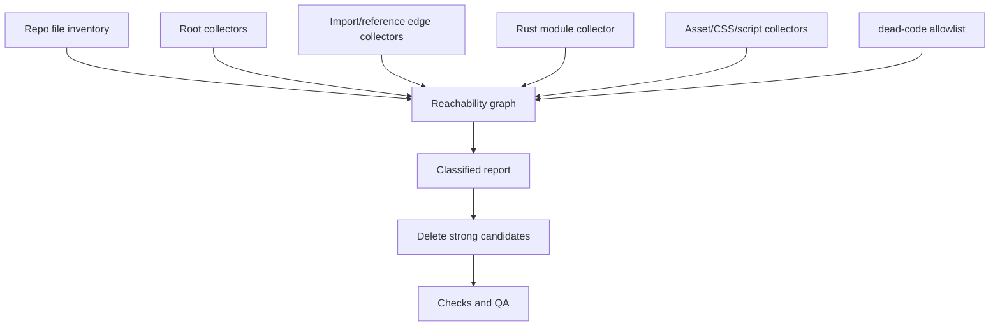

# refactor: Systematically detect and remove dead code

## Overview

Create a repo-local dead-code detection workflow, use it to produce a classified
report, then delete every file that is proven dead by multiple independent signals.
The target is not a one-off grep cleanup. The target is a repeatable detector that
understands Acepe's TypeScript/Svelte, SvelteKit routes, package exports, scripts,
Tauri/Rust module roots, tests, assets, and dynamic entry-point conventions.

The workflow should delete strong candidates in this change and leave ambiguous
candidates in a report with the exact proof they still need.

## Problem Frame

Acepe is a large Tauri 2 + SvelteKit 2 + Svelte 5 workspace with several real
entry-point systems:

- package exports and workspace manifests
- SvelteKit route files, endpoint files, and page/layout entry points
- Tauri/Rust module trees rooted at `src-tauri/src/lib.rs` and `main.rs`
- Cargo bin/test entries declared in `Cargo.toml`
- repo scripts and package scripts
- Tauri config/capability files and generated binding entry points
- test-only helpers and fixtures
- static/public assets referenced from Svelte, CSS, Tauri config, and website routes

That means "not found by `rg`" is not enough. Some files are imported through
barrels, route conventions, Cargo module declarations, Svelte snippets, dynamic
imports, CSS URLs, package exports, or command scripts. Conversely, test-only
production modules and orphaned package exports can look alive when they are only
kept alive by stale tests.

## Requirements Trace

- R1. Build a systematic detector that can be rerun before future cleanup PRs.
- R2. Separate production-reachable, test-only, self-only, script-only,
  dynamically-rooted, generated/vendor, already-deleted, and ambiguous files.
- R3. Delete only candidates with strong evidence: no production root, no package
  export, no route/config/script/Cargo root, no asset reference, and no dynamic
  allowlist reason.
- R4. Preserve user work already present in the dirty worktree; do not use cleanup
  as a reason to revert or rewrite unrelated pending changes.
- R5. Avoid deleting session-shaped, transcript-shaped, Operation, provider-history,
  or canonical projection paths without the GOD architecture gate and focused tests.
- R6. Keep the detector repo-local and dependency-light. Prefer a Bun/TypeScript
  script over introducing a Go toolchain because the repo already uses Bun,
  TypeScript, Svelte, and Rust metadata.
- R7. Verification must prove both the detector and the deletions: detector tests,
  focused package checks, Rust checks when Rust files are affected, and QA wrapper
  evidence when a UI-visible screen or route changes.

## Scope Boundaries

- Do not promise to prove every possible semantic dead branch inside live files in
  this slice. This plan targets dead files, stale package exports, stale script
  roots, orphaned assets, and obviously unreachable helpers first.
- Do not delete files merely because they are old, disliked, or only referenced
  from docs.
- Do not use source-reading structural tests. The detector itself may read the
  repository, but product tests must remain behavior-focused.
- Do not introduce an external dead-code service or network-dependent tool.
- If UI-visible verification is needed and the dev app is not running, start it
  from `packages/desktop` with `bun run tauri`, then run the QA CLI pass.
- Do not turn ambiguous dynamic-use candidates into automatic deletions.

### Deferred to Separate Tasks

- Function-level unused exports inside otherwise-live modules: follow-up after the
  file-level detector is stable.
- Rust dependency-level cleanup such as unused Cargo dependencies: separate pass
  after file deletion, unless a dependency is used only by a file deleted here.
- Broad docs cleanup for historical references: separate docs pass unless a doc is
  the only current source of wrong architecture truth.

## Context & Research

### Relevant Code and Patterns

- `scripts/forbid-ui-package-imports.ts` and `scripts/forbid-structural-tests.ts`
  are simple repo-local Bun scripts that traverse files, classify matches, and
  fail with actionable output.
- `packages/desktop/package.json`, `packages/ui/package.json`,
  `packages/website/package.json`, and root `package.json` define package scripts
  and workspace dependencies that can be roots.
- `packages/ui/package.json` exports are public package roots even when no local
  import currently consumes them.
- `packages/website/src/routes/` and `packages/desktop/src/routes/` style files
  are SvelteKit convention roots, not ordinary imports.
- SvelteKit roots include `+page`, `+layout`, `+server`, and matching `.ts` /
  `.server.ts` module files.
- `packages/desktop/src-tauri/tauri.conf.json`,
  `packages/desktop/src-tauri/tauri.staging.conf.json`, and
  `packages/desktop/src-tauri/capabilities/*.json` are runtime roots for desktop
  config and permissions.
- `packages/desktop/src-tauri/Cargo.toml` declares extra binary and integration
  test roots under `src/bin/` and `tests/`.
- `packages/desktop/src-tauri/src/lib.rs`, `main.rs`, and nested `mod.rs` files
  define Rust module reachability.
- Current worktree already includes unrelated modifications, deletions, and moves,
  so the detector report must mark candidates that are already deleted/renamed in
  the working tree separately from newly detected dead code.

### Institutional Learnings

- `docs/plans/2026-05-18-011-refactor-delete-unused-runtime-state-facade-plan.md`
  and `docs/plans/2026-05-18-014-refactor-remove-unused-event-subscriber-lanes-plan.md`
  used the right cleanup discipline: guard scan first, delete only proven unused
  APIs, then rerun focused tests and scans.
- `docs/solutions/best-practices/canonical-ui-session-selector-boundary-2026-05-18.md`
  reinforces the GOD rule: stale public API deletion is good when it moves readers
  toward canonical selectors, but cleanup must not introduce downstream repair.
- Memory recall for Acepe says UI-visible work needs dev-app DOM verification,
  not just compile success or screenshots.

### External References

- None. This is a repo-specific reachability workflow; local conventions matter
  more than generic dead-code tooling.

## Key Technical Decisions

- **Use a Bun/TypeScript detector, not Go.** A Go script would be fast, but it
  would add another toolchain and would still need custom Svelte/TS/package/Cargo
  knowledge. A Bun script can reuse repository conventions and run through the
  existing package manager.
- **Report before delete.** The script's default mode writes a classified report;
  deletion is a second explicit mode or implementation unit after reviewing the
  report.
- **Roots are explicit and layered.** The detector should seed roots from package
  manifests, SvelteKit routes, configs, scripts, test runners, Rust module roots,
  Cargo `[[bin]]`/`[[test]]`, and an allowlist file.
- **Classify instead of binary alive/dead.** A file can be production-reachable,
  test-only, self-only, script-only, asset-only, generated/vendor, already-deleted,
  or ambiguous. Only the "strong dead" class is eligible for automatic deletion.
- **Keep dynamic-use allowlists in source control.** Add a small JSON allowlist so
  Tauri commands, generated bindings, dynamic imports, and intentional examples
  have durable reasons instead of living in one agent's memory.
- **Treat exports as contracts.** Public package exports are roots until a unit
  deliberately removes the export and verifies downstream packages.
- **GOD gate canonical/session paths.** Dead-code deletion can still break product
  truth if a stale-looking file is an entry point for restore, transcript, tool
  Operation, or provider history behavior.

## Open Questions

### Resolved During Planning

- **Should this use Go?** No for the first implementation. Bun/TypeScript fits
  the repo and can understand TS/Svelte/package metadata without adding a new
  toolchain.
- **Should every reported candidate be deleted?** No. Only strong candidates are
  deleted. Ambiguous and dynamic candidates remain reported.
- **Should tests be roots?** Yes, but the detector must distinguish production
  reachability from test-only reachability. Test-only production modules are
  cleanup candidates, not automatically live.
- **Should current dirty deletions be included?** They should be reported as
  existing working-tree changes, not silently mixed into newly detected candidates.

### Deferred to Implementation

- Final shape of the detector report: JSON plus Markdown is likely, but the exact
  schema can be adjusted once the first candidate inventory is visible.
- Exact allowlist entries: decide from the first detector run, with every entry
  carrying a reason and owner path.
- Whether to add a package script such as `check:dead-code`: decide after the
  detector proves stable enough for CI or local use.

## High-Level Technical Design

> *This illustrates the intended approach and is directional guidance for review,
> not implementation specification. The implementing agent should treat it as
> context, not code to reproduce.*



## Output Structure

```text
scripts/dead-code/
  find-dead-code.ts
  dead-code-allowlist.json
  __tests__/
    find-dead-code.test.ts
docs/reports/
  dead-code-YYYY-MM-DD.md
```

`docs/reports/` can be omitted if the repo already has a better report location
at implementation time. The detector should also support machine-readable JSON
output for repeat runs.

## Implementation Units

- [x] **Unit 1: Build the detector inventory and root collectors**

**Goal:** Produce a complete file inventory and seed all known root files.

**Requirements:** R1, R2, R3, R4, R6

**Dependencies:** None

**Files:**
- Create: `scripts/dead-code/find-dead-code.ts`
- Create: `scripts/dead-code/dead-code-allowlist.json`
- Create: `scripts/dead-code/__tests__/find-dead-code.test.ts`

**Approach:**
- Inventory tracked and working-tree files while excluding generated/vendor
  directories such as `node_modules`, `.svelte-kit`, `dist`, `build`, target
  outputs, and Tauri build artifacts.
- Seed TypeScript/Svelte roots from package `exports`, package script entries,
  config files, SvelteKit route conventions including `+server` and `.server.ts`
  files, public entry barrels, test files, and tool scripts.
- Seed Rust roots from `src-tauri/src/lib.rs`, `main.rs`, `build.rs`, explicit
  Cargo bin/test declarations, and nested module declarations discovered from
  reachable Rust files.
- Seed desktop runtime roots from Tauri config, capabilities, generated schema
  roots, static/public assets, and generated binding files that are read by the
  build or runtime.
- Mark dirty working-tree deletes/moves separately by reading git porcelain output
  so the report does not confuse existing user changes with new candidates.

**Execution note:** Test-first for the detector. Start with small fixture graphs
that prove roots and exclusions before scanning the real repo.

**Patterns to follow:**
- `scripts/forbid-ui-package-imports.ts`
- `scripts/forbid-structural-tests.ts`
- `packages/desktop/scripts/check-transcript-virtualizer-deps.ts`

**Test scenarios:**
- Happy path: package export and SvelteKit route files are classified as roots
  even when no local import references them.
- Happy path: Tauri config/capability files and static assets referenced from
  config or CSS are not emitted as strong-dead candidates.
- Happy path: Cargo `[[bin]]` and `[[test]]` paths are classified as Rust roots.
- Edge case: a file deleted in the working tree is reported as already-deleted,
  not as a new dead-code candidate.
- Edge case: generated/vendor directories are excluded from candidate output.
- Error path: malformed allowlist JSON fails with a useful message.

**Verification:**
- The detector can run in report-only mode without modifying files.
- Detector tests cover each root family.

- [x] **Unit 2: Add TS/Svelte/Rust/reference edge collectors**

**Goal:** Build enough reachability edges to classify real Acepe files.

**Requirements:** R1, R2, R3, R5, R6

**Dependencies:** Unit 1

**Files:**
- Modify: `scripts/dead-code/find-dead-code.ts`
- Modify: `scripts/dead-code/__tests__/find-dead-code.test.ts`

**Approach:**
- Parse static imports, type imports, re-exports, dynamic string imports, and
  Svelte `<script>` blocks.
- Resolve repo-relative imports, extensionless imports, index files, package
  exports, workspace package aliases, and configured TypeScript aliases.
- Collect CSS `url(...)`, Svelte/style asset references, package script file
  references, Tauri config/capability references, static asset references, and
  Markdown links only as low-confidence evidence unless they point to executable
  roots.
- Parse reachable Rust `mod` declarations, `#[path = "..."]` declarations where
  present, and integration test/bin roots from Cargo metadata.
- Do not treat comments as live references.

**Execution note:** Characterization-first against known live files and the
already-deleted `packages/agent-panel-contract` package shape so the detector
demonstrates both alive and dead classification.

**Patterns to follow:**
- Existing repo scripts that strip comments and extract import specifiers.
- Rust module structure under `packages/desktop/src-tauri/src/acp/`.

**Test scenarios:**
- Happy path: a TS file reachable only through a barrel re-export is marked live.
- Happy path: a Svelte component import inside `<script lang="ts">` creates an edge.
- Happy path: a Rust child module declared from reachable `mod.rs` is marked live.
- Edge case: a file imported only by tests is classified as test-only, not
  production-reachable.
- Edge case: CSS asset references keep assets out of strong-dead deletion.
- Error path: unresolved import is reported separately and does not make the
  target file appear alive.

**Verification:**
- Detector output contains classified counts and unresolved-reference diagnostics.
- No deletion happens in this unit.

- [x] **Unit 3: Generate and review the real repo dead-code report**

**Goal:** Produce the first report and select only strong candidates for deletion.

**Requirements:** R2, R3, R4, R5

**Dependencies:** Unit 2

**Files:**
- Create: `docs/reports/dead-code-2026-06-16.md`
- Modify: `scripts/dead-code/dead-code-allowlist.json`

**Approach:**
- Run the detector over the current worktree in report-only mode.
- Classify candidates into:
  - strong dead file
  - stale export/manifold root
  - test-only production file
  - asset-only or docs-only
  - already deleted/renamed in working tree
  - dynamic/ambiguous
  - forbidden until GOD gate
- Add allowlist entries only for real dynamic roots, each with a reason.
- Before deletion, inspect every strong candidate's surrounding package or module
  boundary so deletion does not strand barrels, manifests, or tests.

**Execution note:** Review-first. The report is the characterization artifact for
the deletion units.

**Patterns to follow:**
- The "guard scan first" pattern from the May cleanup plans.

**Test scenarios:**
- Test expectation: none -- this unit creates a report from detector output and
  does not change product behavior.

**Verification:**
- Report names each strong candidate with proof sources.
- Ambiguous candidates are not mixed with delete candidates.
- GOD-gated candidates are not deleted before the gate.

- [x] **Unit 4: Delete strong TS/Svelte/package candidates**

**Goal:** Remove TypeScript/Svelte/package files proven dead by the report.

**Requirements:** R3, R4, R5, R7

**Dependencies:** Unit 3

**Files:**
- Modify/Delete: candidate files named by `docs/reports/dead-code-2026-06-16.md`
- Modify: package barrels, package manifests, route manifests, or tests that only
  existed to keep stale candidates alive

**Approach:**
- Delete only candidates in the strong-dead class.
- If a candidate is exported from a public package barrel, remove the export in
  the same unit and verify downstream workspace packages.
- If a candidate is test-only production code, either delete the stale test with
  the production file or rewrite the test to target the replacement behavior.
- If any candidate touches `packages/ui`, run the UI package boundary checks.
- If any candidate can affect a visible desktop surface, use the QA wrapper after
  compilation and tests.

**Execution note:** Deletion is characterization-first. For every deletion batch,
rerun the detector and focused checks before moving to the next batch.

**Patterns to follow:**
- `docs/plans/2026-06-15-003-refactor-architecture-deepening-program-plan.md`
  Unit 1 contract-package deletion pattern.

**Test scenarios:**
- Happy path: workspace packages compile without deleted files or stale exports.
- Edge case: test-only candidate deletion does not leave stale tests asserting
  obsolete implementation details.
- Error path: detector reports no strong-dead candidate that is still exported
  from a package public surface.
- Integration: desktop and website package checks pass or failures are identified
  as pre-existing unrelated blockers.

**Verification:**
- Detector no longer reports deleted files as candidates except under
  already-deleted working-tree classification.
- `bun run check` in affected TypeScript/Svelte packages passes or has a documented
  pre-existing baseline.
- UI QA wrapper evidence exists if visible surfaces changed.

- [x] **Unit 5: Delete strong Rust candidates**

**Goal:** Remove Rust files proven unreachable from Rust module, bin, or test roots.

**Requirements:** R3, R5, R7

**Dependencies:** Unit 3; can run after or alongside Unit 4 only if candidate files
do not overlap

**Files:**
- Modify/Delete: Rust candidates named by `docs/reports/dead-code-2026-06-16.md`
- Modify: `packages/desktop/src-tauri/src/**/mod.rs` if stale module declarations
  are removed
- Modify: `packages/desktop/src-tauri/Cargo.toml` if stale bin/test entries are
  removed

**Approach:**
- Run the GOD architecture check before deleting candidates under ACP session,
  transcript, provider history, operation projection, or canonical state paths.
- Delete only Rust files unreachable from `lib.rs`, `main.rs`, reachable `mod.rs`,
  Cargo bin/test declarations, and explicit path attributes.
- Remove stale module declarations and Cargo roots in the same batch.
- Keep generated or vendored SDK files unless the detector proves they are outside
  Cargo roots and not intentionally vendored. `cc-sdk-local/`, `gen/`, and
  schema-like generated folders must start in generated/vendor classification,
  not strong-dead classification.

**Execution note:** Characterization-first and GOD-gated for canonical/session
paths.

**Patterns to follow:**
- Rust module structure under `packages/desktop/src-tauri/src/acp/`
- `packages/desktop/src-tauri/Cargo.toml` explicit bin/test roots

**Test scenarios:**
- Happy path: Rust module graph compiles after deleting unreachable files.
- Edge case: integration tests declared with `required-features` remain roots.
- Error path: a stale module declaration for a deleted file fails focused Rust
  check before the unit is complete.

**Verification:**
- Focused Rust tests/checks pass for affected modules.
- `cargo clippy` or a narrower agreed Rust lint/check is run when deletion touches
  production Rust paths.

- [x] **Unit 6: Wire the detector into the repo workflow**

**Goal:** Make future dead-code sweeps cheaper without forcing noisy CI failures
before the detector stabilizes.

**Requirements:** R1, R2, R6, R7

**Dependencies:** Units 1-5

**Files:**
- Modify: root `package.json` or affected package `package.json`
- Modify: `docs/reports/dead-code-2026-06-16.md`
- Optional Modify: `AGENTS.md` or `docs/solutions/` if implementation yields a
  durable workflow lesson

**Approach:**
- Add a script only after detector output is stable and allowlist noise is low.
- Prefer a non-CI local script first, such as `bun run check:dead-code`, unless
  the final report has zero ambiguous/noisy results.
- Document how to run report-only mode and how to add allowlist entries with
  reasons.

**Execution note:** Keep this as workflow hardening, not more deletion.

**Patterns to follow:**
- Existing root and package check scripts.

**Test scenarios:**
- Happy path: the new script runs report-only mode and exits successfully when no
  strong-dead candidates remain.
- Error path: a synthetic fixture or detector unit test proves strong-dead
  candidates produce a non-zero result when strict mode is enabled.

**Verification:**
- Future agents can rerun the detector without reconstructing the process.
- Documentation explains candidate classes and deletion rules.

## System-Wide Impact

## Execution Results

- Added `scripts/dead-code/find-dead-code.ts`,
  `scripts/dead-code/dead-code-allowlist.json`, and detector tests.
- Added root `bun run check:dead-code` strict mode.
- Generated `docs/reports/dead-code-2026-06-16.md`.
- Deleted every strong-dead candidate from the reviewed report, then restored
  false positives found by verification: Svelte markup dynamic-import targets,
  `landing-demo-frame.svelte`, and the ambient `tinykeys.d.ts` declaration.
- Final detector counts: production-reachable 2245, script-only 37, test-only
  666, static-root 2468, generated-vendor 102, already-deleted 432,
  strong-dead 0, ignored 213.
- Final unresolved diagnostics are test-only references only; no
  production-reachable unresolved references remain in the detector report.
- CE review found one detector-hardening issue: malformed allowlist
  classifications were accepted by a cast. This was fixed with runtime
  validation and a regression test.
- Compounded the reusable lesson in
  `docs/solutions/best-practices/dead-code-scans-implicit-roots-2026-06-16.md`.
- Verification run:
  - `bun test scripts/dead-code/__tests__/find-dead-code.test.ts` passed.
  - `bun run check:dead-code` passed with `strong-dead: 0`.
  - `cd packages/desktop && bun run check` passed.
  - `cd packages/desktop/src-tauri && cargo clippy` passed with existing
    warnings.
  - `cd packages/website && bun run check` still fails on pre-existing UI/website
    demo type errors unrelated to the deletion sweep.
  - `cd packages/ui && bun run check` still fails on the pre-existing boundary
    test import/rootDir issue.
  - No DOM QA was run because the final edits are a dead-file deletion sweep plus
    a type-only import repair; no production-reachable rendered UI behavior was
    intentionally changed.

- **Interaction graph:** package exports, routes, scripts, Rust modules, tests, and
  assets become inputs to one reachability graph.
- **Error propagation:** unresolved imports and ambiguous dynamic references should
  be reported, not hidden as either live or dead.
- **State lifecycle risks:** session/transcript/Operation/provider candidates are
  forbidden until GOD-gated and covered by focused behavior tests.
- **API surface parity:** removing public exports requires checking desktop,
  website, and UI consumers together.
- **Integration coverage:** file deletion must be verified by package checks,
  focused tests, Rust checks when applicable, and QA wrapper evidence when visible
  UI changes.
- **Unchanged invariants:** no downstream UI repair of provider quirks; no
  package-boundary violations; no structural source-inspection product tests.

## Risks & Dependencies

| Risk | Likelihood | Impact | Mitigation |
|------|------------|--------|------------|
| Dynamic entry point is falsely classified dead | Medium | High | Explicit root collectors, allowlist with reasons, report review before deletion |
| Dirty worktree deletions are confused with new cleanup | High | Medium | Separate already-deleted/renamed class from new candidates |
| Package public export removed while downstream consumer exists | Medium | High | Treat package exports as roots until deletion unit removes export and checks consumers |
| Rust module parser misses path attribute or Cargo root | Medium | High | Cargo root parsing, module tests, Rust check after deletion |
| Detector becomes noisy and ignored | Medium | Medium | Classify noise, allowlist dynamic roots, wire into workflow only after stable |
| UI-visible deletion passes compilation but breaks a dev-app screen | Medium | High | QA wrapper verification for affected visible routes/components |

## Documentation / Operational Notes

- Keep detector report artifacts concise and reviewable; huge raw JSON belongs in
  temporary output, not hand-authored docs.
- Add `docs/solutions/` learning only if the implementation reveals a reusable
  Acepe-specific dead-code detection rule.
- If a deletion changes desktop UI behavior or route structure, run `bun run qa
  doctor`, `bun run qa observe`, targeted `bun run qa inspect`, and screenshot
  through the existing dev Tauri app.
- If the dev app is not running when UI QA is required, start it from
  `packages/desktop` with `bun run tauri`, then run the QA CLI pass.

## Alternative Approaches Considered

- **Use Go for speed:** rejected for the first pass because it adds a new toolchain
  and still needs custom TS/Svelte/Cargo knowledge.
- **Use only `ts-prune`/Knip-style external tooling:** rejected as the primary
  mechanism because Acepe needs Rust, SvelteKit, package export, Tauri, and dirty
  worktree awareness. External tools can be compared later but should not own the
  rule set.
- **Delete everything with zero import references:** rejected because routes,
  package exports, scripts, assets, and Rust modules can be live without import
  syntax.
- **Only produce a report, no deletion:** rejected because the user asked to delete
  proven dead files now; the report is a safety gate, not the endpoint.

## Success Metrics

- The detector can be rerun and produces stable classified output.
- Every deleted file appears in the report's strong-dead class with proof.
- No deleted candidate remains referenced by package exports, scripts, route roots,
  Rust module roots, asset references, or workspace imports.
- Affected package checks pass or have clearly documented unrelated pre-existing
  blockers.
- Ambiguous candidates are documented with next proof steps instead of deleted.

## Sources & References

- User request: "find all our dead code in a systematic way ... then delete all those files"
- `scripts/forbid-ui-package-imports.ts`
- `scripts/forbid-structural-tests.ts`
- `packages/desktop/scripts/check-transcript-virtualizer-deps.ts`
- `packages/desktop/src-tauri/Cargo.toml`
- `docs/plans/2026-05-18-011-refactor-delete-unused-runtime-state-facade-plan.md`
- `docs/plans/2026-05-18-014-refactor-remove-unused-event-subscriber-lanes-plan.md`
- `docs/plans/2026-06-15-003-refactor-architecture-deepening-program-plan.md`
- `docs/solutions/best-practices/canonical-ui-session-selector-boundary-2026-05-18.md`
