# fix: Reopened managed session composer stays disabled (Rust resume/open lifecycle-seeding gap)

> **⚠️ RE-SCOPE #2 (2026-06-19) — verified live + source evidence relocates the root cause to Rust.**
> The bug has been **reproduced live** against a freshly rebuilt binary and traced to the Rust session-open/resume seam. The earlier FE-only re-scope (mechanism C/D/E in the agent-panel layer) is **superseded**: its "mechanism E — restore-hydration producer gap" intuition was directionally right, but the producer is **Rust-side lifecycle seeding**, not a TypeScript projection/applier defect. The TS reader is correct and must stay untouched (GOD). Former FE units **U1, U8** and the original Rust-v1 units **U2–U6** are retired (U-IDs left as gaps per the stability rule). **U7 (FE dispose-cascade leak fix) survives unchanged** — it is an orthogonal, independently-valid controller-leak fix (G2). New Rust units are **U10 (characterization red test)** and **U11 (canonical seeding fix)**; **U9 (regression + QA)** survives with updated scope.

---

## What the live diagnosis actually showed (verified evidence)

Freshly rebuilt dev binary (bridge `9224`). Opened a **cold** past/managed session from the history sidebar — "What is gateway?", session `83bcaada`, project `godmode` — that was **not** already open.

- **The composer is unsendable, with no error.** `planning-debug` for `83bcaada`: `source=canonical, lifecycle=detached, canSend=false, canSubmit=false, entries=96, turn=completed`. Stuck `> 30s`; `visibleErrors=0`. The disabled send button is the **correct render of a `detached` canonical lifecycle** — `sessionCanSubmit` derives from `deriveCanonicalAgentPanelSessionState(...)` and `canSend = (lifecycle == Ready)`.
- **Rust resume SUCCEEDED.** Logs: `resume.rs:83 acp_resume_session called (attempt_id=3)` → `client_ops.rs:250 "Session resumed: created new client"` → `resume.rs:211 "Async resume completed successfully"`. Exactly one attempt; **no attempt-id supersession**. The Claude CLI subprocess connected and the message stream was obtained.
- **`ConnectionComplete` was emitted** by the success branch (`resume.rs:201-210 → emit_lifecycle_event`).
- **The `activating()` prelude succeeded — so a checkpoint already existed.** This is load-bearing. `resume.rs:122-134` runs `transition_lifecycle_state(... activating())` as a hard `map_err(... InvalidState ...)?` *before* `ConnectionComplete`, and `transition_lifecycle_state` requires an existing checkpoint (else `SessionNotFound` → `InvalidState`, which fails the invoke). Because resume *succeeded and emitted `ConnectionComplete`*, the prelude did **not** error — which **proves a `detached` checkpoint already existed** at resume time. The sub-mechanism is therefore **not** "no checkpoint" (that would have failed the invoke at the prelude, never reaching `ConnectionComplete`); it is a checkpoint that stays/returns to `detached` (clobber) or a stale-revision read at the envelope build. The "no checkpoint" case is already falsified by the plan's own live evidence — U10 must *confirm* this, not treat it as the leading hypothesis.
- **Two authorities, only one seeded.** Transcript/turn data landed (`entries=96`, `turn=completed`) from the `TranscriptProjectionRegistry`; the **lifecycle field** stayed `detached` from the runtime/supervisor checkpoint authority. These are *distinct* envelope sources (KTD-2/KTD-4). "Entries land" only proves the transcript-projection authority is seeded — it says nothing about the lifecycle authority, which `restore_session_open_authority` leaves `runtime: None`. This is **two pipes with only one seeded**, not one pipe with a wrong field — which reinforces the seeding-gap thesis but also flags that the lifecycle *read path* (revision/projection gating) must be verified, not assumed identical to the write path (KTD-1).
- **Warm contrast.** A session that shows `lifecycle=ready/canSubmit=true` took the `client_ops.rs:190 "reused existing client"` path — its checkpoint was already alive. The **cold "created new client"** reopen is what stays `detached`.

**Root cause (verified against source):** `SessionGraphRuntimeRegistry` *wraps* `Arc<SessionSupervisor>`; the envelope builder (`runtime_registry.rs snapshot_for_session → supervisor DashMap`) and the lifecycle transitions read/write **the same store**. So there are **not** two divergent stores — the defect is **seeding presence/ordering**. `acp_new_session` seeds a supervisor checkpoint via `reserve_with_capabilities` before `ConnectionComplete`, so the transition lands on a real checkpoint and the envelope reaches `Ready`. The **cold-resume/open path never leaves a checkpoint that reaches `Ready`**: the only seam that seeds a restored session's runtime checkpoint is the open-snapshot builder, which seeds `detached(RestoredRequiresAttach)` and **only on the provider-owned branch**; `restore_session_open_authority` (the authority used by the completed-local-journal open branches) seeds `ProjectionRegistry` + `TranscriptProjectionRegistry` but **never the runtime registry/supervisor**. Resume itself never re-seeds. Net: when `ConnectionComplete` fires, the lifecycle envelope serializes `detached`, and the composer stays disabled.

---

## Problem Frame

Reopening a past, already-managed agent session renders a settled transcript with a green "done" check, **no connecting overlay, and no visible error** — yet the composer send button is permanently disabled and never recovers. This is a **Rust canonical-lifecycle seeding** defect on the session-open/resume path. The canonical `SessionGraphLifecycle` for the reopened session never advances from `detached` to `Ready`, even though provider resume succeeds, because the runtime-registry/supervisor checkpoint that the lifecycle envelope is built from is either absent or stuck at `detached` for cold-restored sessions.

This is **upstream/canonical product truth** (the GOD authority surface is `SessionStateGraph`, owned by Rust). The TS reader is behaving correctly: `sessionCanSubmit` (`agent-panel.svelte:1632`) derives from `deriveCanonicalAgentPanelSessionState` over the canonical projection, with `canSend = (lifecycle == Ready)`. A disabled composer is the faithful render of a wrong `detached` lifecycle. **The fix must correct the canonical producer in Rust; it must not be patched in TypeScript.**

Bounding `docs/solutions/` learnings:
- `logic-errors/reserved-first-send-routed-through-resume-2026-04-28.md` — `SessionOpenFound` *requires* `lifecycle`/`capabilities`; "New synchronously-created sessions open as `Reserved`; cold restored sessions open as `Detached`. That distinction is made in Rust, not guessed in Svelte." A Detached cold session correctly routes through resume — resume must then *seed* so the lifecycle leaves `detached`.
- `logic-errors/pre-reservation-provider-update-lifecycle-race-2026-04-30.md` — `SessionSupervisor` is the **only** lifecycle-existence authority; `reserve` plus **reviewed restore/seed paths** are the only creation lanes. Seed through the sanctioned restore/seed lane, never via incidental provider-update inserts (that caused `AlreadyReserved`/`MetadataCommitFailed`).
- `architectural/revisioned-session-graph-authority-2026-04-20.md` — the runtime registry is a *materialized cache over canonical state*; on reopen, "let reconnect/live envelopes repopulate runtime lifecycle and capability state after attach." A `detached` envelope is the cache not being seeded.
- `architectural/canonical-projection-widening-2026-04-28.md` — the **parity-test** pattern: feed one `SessionStateGraph` through cold-open (`replaceSessionOpenSnapshot(graphFromSessionOpenFound(...))`) and live-stream (`applySessionStateEnvelope(createSnapshotEnvelope(graph))`) and assert identical `getCanonicalSessionProjection()`.
- `ui-bugs/agent-panel-composer-split-brain-canonical-actionability-2026-04-30.md` — `canonical ?? hotState` is the **documented anti-fix**; the disabled composer must be fixed by correcting canonical lifecycle, never the reader.
- `architectural/historical-session-reconnect-frontier-2026-05-16.md` — reconnect is a first-class job of opening a past session ("museum" symptom = composer disabled / stale controls). Seed on the reconnect/open-token path so the seeded lifecycle is the canonical post-frontier state.

---

## Goal & Success Criteria

- **G1.** Cold-reopening a managed session whose provider resume succeeds drives its canonical lifecycle to `Ready` so the composer is **sendable** without user action — verified live: `planning-debug` for the reopened session shows `lifecycle=ready, canSend=true, canSubmit=true` and `qa observe` shows `composer.sendEnabled: true`.
- **G2.** Closing/reopening panels **does not leak controllers**: the planning-debug source registry returns to a stable count after a panel is closed (no monotonic growth). *(Already addressed by U7.)*
- **G3.** GOD authority preserved: the lifecycle fix lives in the Rust canonical producer (supervisor/runtime-registry seeding on open/resume). The TS reader is untouched — `deriveCanonicalAgentPanelSessionState` / `sessionCanSubmit` keep deriving from the canonical projection. **No `canonical ?? hotState`, no `missing_canonical ?? ready`, no reader-side `$effect`/repair.** Seeding goes through the sanctioned restore/seed lane, never incidental provider-update inserts.

**G1 and G2 are verified independently.** G2 = registry count stable after close (U7). G1 = `lifecycle=ready / canSend=true` on the live cold-reopened session (U11). A green G2 does **not** imply G1.

**Done when:** cold-reopening the repro session (`83bcaada`, or any cold past managed session) reaches `lifecycle=ready, canSubmit=true` and `composer.sendEnabled: true`; a Rust characterization test (U10) that was red — cold resume → envelope lifecycle stays `detached`/`canSend=false` — turns green after U11; the cold-open-vs-live-stream parity test asserts identical canonical projections with `canSend=true`; and the close→reopen cycle leaves the planning-debug source count unchanged (U7).

---

## Scope Boundaries

**In scope**
- U7: complete the `AgentPanelRootState` dispose cascade so controllers/registrations stop leaking (G2, FE, orthogonal — already implemented in the working tree; verify and keep).
- U10: a Rust characterization (red) test at the resume → lifecycle-envelope seam that reproduces "cold resume of a Detached restored session ⇒ envelope lifecycle stays `detached`, `canSend=false`", pinning the exact sub-mechanism (no checkpoint vs detached-only seed vs later re-seed clobber).
- U11: the canonical fix — seed/hydrate the runtime-registry/supervisor checkpoint on the session-open/resume seam through the sanctioned restore/seed lane so the lifecycle envelope reflects real transitions (`Activating` → `Ready` after `ConnectionComplete`) for cold-restored sessions (G1, G3).
- U9: parity + regression tests (cold-open vs live-stream projection parity; Detached-resume → `canSend=true`) and **mandatory live dev-app DOM QA** (cold reopen → `planning-debug canSubmit=true`, `composer.sendEnabled: true`).

### Deferred Hardening (separate from this bug)
- **Richer `SessionGoneUpstream` classification/UX** (`resume.rs:250-271`): producing a *good* user-facing affordance for a genuinely-gone upstream session (clear error, re-create offer) is separate work — classify/handle per `architectural/canonical-reattach-failure-classification-2026-04-30.md`. **What does NOT defer (per adversarial B3):** because this fix is what *newly makes `Ready` reachable* from a seeded checkpoint, the false-positive-enable guard co-lands with U11 — the failure branch (`resume.rs:250`) emits `ConnectionFailed`, which `apply_update` maps to `failed(...)` and must overwrite the seed so the composer is **not** enabled for a dead session. U11 must assert this end-to-end against the real failure branch (see U11 scenario 4). If that assertion cannot go green without touching the failure classification, the classification work is **not** separable and moves in-scope.
- An ADR for resume/open lifecycle-seeding policy — write when U11 lands, since it establishes that **all** open branches must leave a consistent supervisor checkpoint.

### Non-Goals (Outside this change)
- Any TypeScript/`@acepe/ui` change to `deriveCanonicalAgentPanelSessionState`, `sessionCanSubmit`, or the composer reader. Adding `canonical ?? hotState` / `missing_canonical ?? ready` is the documented anti-fix (GOD-forbidden). If only a reader change appears to work, the canonical producer is still wrong — fix Rust.
- Seeding lifecycle via incidental provider-update inserts (reintroduces the `AlreadyReserved`/lifecycle-race class) — seed only through the restore/seed lane.
- Changing the `{#each}` panel key (`panel.id` is already stable — `packages/desktop/src/lib/components/main-app-view/components/content/panels-container.svelte:376`).
- Recreating any deleted broad hot-state object (`getSessionRuntimeState` / `SessionRuntimeState`).

---

## Key Technical Decisions

- **KTD-1 — One store for the checkpoint; verify the read path empirically.** `SessionGraphRuntimeRegistry` wraps `Arc<SessionSupervisor>` (`packages/desktop/src-tauri/src/acp/session_state_engine/runtime_registry.rs`; the same `Arc<SessionSupervisor>` is injected in `lib.rs`). `snapshot_for_session()` delegates to the supervisor `DashMap`, and `transition_lifecycle`/`transition_lifecycle_state` `store_checkpoint` into that same map. The earlier "two divergent stores" hypothesis is **false for the checkpoint**. **But** the live symptom — `detached` serialized *after* a successful `activating()` write (see live diagnosis) — means one of: (a) the envelope's revision/projection gate (`load_live_session_graph_revision`, which takes `runtime_registry` as an *optional* input) resolves a stale graph that predates the write, or (b) a later open pass clobbered the checkpoint. **U10 must verify the single-store claim empirically at the envelope seam** (after an `activating()` write, read `snapshot_for_session` AND build the envelope and assert they agree) before KTD-4 is locked. If they diverge, the bug is on the read/revision path and the seam changes — do not assume "seed the one store" closes it.
- **KTD-2 — `new_session` seeds; `resume`/cold-open does not.** `acp_new_session` calls `SessionSupervisor::reserve_with_capabilities(...)` (creates a `Reserved` checkpoint) before storing the client, so `ConnectionComplete` → `transition_lifecycle` lands on a real checkpoint and sets `lifecycle = ready()`. `acp_resume_session` never seeds the runtime registry/supervisor; it calls `transition_lifecycle_state(activating())` (a read-modify-write that requires an existing checkpoint, else `SessionNotFound`) and `build_snapshot_envelope_for_session` (read-only). The only restored-session runtime seed is the open-snapshot builder, which seeds `detached(RestoredRequiresAttach)` **and only on the provider-owned branch** (`session_open_snapshot/snapshot.rs`); `restore_session_open_authority` (`session_restore/restore_authority.rs`) seeds `ProjectionRegistry`/`TranscriptProjectionRegistry` only, with `runtime: None`.
- **KTD-3 — Seed-if-absent / non-downgrading through the sanctioned restore/seed lane.** Use `SessionGraphRuntimeRegistry::restore_session_state(session_id, graph_revision, lifecycle, capabilities)` (the upsert seeder: `replace` if present, `seed` if absent — never errors `AlreadyReserved`/`SessionNotFound`), carrying the **`SessionOpenFound` lifecycle/capabilities** (the assertion `assertOpenFoundHasGraphAuthority` already fails closed on missing authority). **Critical constraint (feasibility F1): the seed must be seed-if-absent or status-preserving — it must NEVER downgrade a non-`detached` checkpoint to `detached`.** `SessionOpenFound.lifecycle` on the cold-open branches is *unconditionally* `detached(RestoredRequiresAttach)`, and `restore_session_state` is a `replace`-then-`seed` upsert. So a blind seed on a seam that can re-fire on a warm/`Ready`/`activating` session would clobber a live checkpoint back to `detached` — the exact regression in Risk row 3, and a plausible *cause* of the bug (sub-mechanism (ii)). Seed only when no checkpoint exists or the existing one is itself `detached`/default. Do **not** use `reserve_with_capabilities` on the cold-restore path (errors `AlreadyReserved` when a checkpoint exists) and do **not** seed via incidental provider-update paths (lifecycle-race class).
- **KTD-4 — Seam choice is conditional on U10, not a blind default.** The candidate seams are: (a) **durable** — `restore_session_open_authority` seeds the runtime checkpoint too (it already has `found.lifecycle`/`found.capabilities`), closing the gap for all open branches; (b) **narrow** — a resume-prelude seed (`restore_session_state` immediately before the `activating()` prelude in `resume.rs`, with the revision load moved ahead of the seed). **The right seam depends on what U10 reveals, and the live evidence already rules out "no checkpoint" (the `activating()` prelude succeeded — see live diagnosis):** if U10 shows (ii) clobber, the fix is primarily a **clobber-guard** (seed-if-absent, never downgrade) plus closing the gap on whichever pass overwrites; if (iii) stale-revision, the fix is on the envelope's revision read (KTD-1), and seeding alone will *not* close it. Do not commit to "seed on every open branch" as the default — that instinct is matched to the ruled-out (i) "no checkpoint" case. Default to the durable open-authority seam **only if** U10 confirms an absent/`detached` checkpoint with no live-checkpoint re-fire hazard; otherwise the clobber-guard / revision-read fix leads.
- **KTD-5 — GOD: the TS reader stays canonical-only.** `sessionCanSubmit` keeps deriving from `deriveCanonicalAgentPanelSessionState` over the canonical projection. The disabled composer is the correct render of a wrong canonical lifecycle; the only sanctioned lever is making canonical lifecycle correct upstream. No reader fallback, no `$effect` repair.
- **KTD-A — FE dispose cascade (U7) is orthogonal, G2-only.** `AgentPanelRootState.dispose()` must dispose every child controller holding external registrations; code review confirmed exactly two qualify (`connection`, `sessionController`). U7 fixes the controller leak and does **not** change what the live mount's composer reads (G1). Already implemented in the working tree (`agent-panel-root-state.svelte.ts:222`).

---

## High-Level Technical Design

*Directional guidance for review, not implementation specification.*

```mermaid
flowchart TD
    subgraph NEW [acp_new_session — works today]
      N1[new_session] --> N2["reserve_with_capabilities → Reserved checkpoint"]
      N2 --> N3["connect → ConnectionComplete"]
      N3 --> N4["transition_lifecycle finds checkpoint → Ready"]
      N4 --> N5["envelope = Ready → canSend=true"]
    end
    subgraph COLD [cold resume / open — broken]
      C1[open past session] --> C2{which open branch?}
      C2 -->|provider-owned| C3["snapshot builder seeds detached(RestoredRequiresAttach)"]
      C2 -->|completed-local-journal| C4["restore_session_open_authority seeds Projection/Transcript ONLY (runtime: None)"]
      C3 --> C5[resume]
      C4 --> C5
      C5 --> C6["ConnectionComplete → transition lands on missing/detached checkpoint"]
      C6 --> C7["envelope = detached → canSend=false → composer disabled"]
    end
    subgraph FIX [U11 — seed the runtime checkpoint upstream]
      F1["restore_session_open_authority (durable) or resume prelude (narrow)"]
      F1 --> F2["restore_session_state(session_id, revision, SessionOpenFound.lifecycle, caps) — idempotent upsert"]
      F2 --> F3["ConnectionComplete → transition finds checkpoint → Ready → canSend=true"]
    end
```

---

## Implementation Units

> Surviving: **U7** (FE leak, orthogonal). New Rust work: **U10** (red test), **U11** (canonical seeding fix). **U9** (regression + QA) survives, re-scoped. Retired gaps (do not reuse, do not renumber): **U1, U2, U3, U4, U5, U6, U8**. Document order below is dependency order; U-IDs are stable.

### U7. Complete the `AgentPanelRootState` dispose cascade (controller-leak fix — FE, orthogonal, G2 only)

**Goal:** Closing/restoring a panel disposes the two controllers that hold external registrations, so the planning-debug registry stops accumulating (G2). Does **not** claim to fix the disabled composer (G1) — see KTD-A.

**Requirements:** G2, KTD-A.

**Dependencies:** none.

**Status:** Implemented in the working tree (`agent-panel-root-state.svelte.ts:222` now calls `this.sessionController.dispose()`; new test `agent-panel-root-state-dispose.vitest.ts` passing). This unit is retained for traceability — verify it is intact and committed with the fix.

**Files:**
- `packages/desktop/src/lib/acp/components/agent-panel/state/agent-panel-root-state.svelte.ts` (`dispose()`)
- `packages/desktop/src/lib/acp/components/agent-panel/state/__tests__/agent-panel-root-state-dispose.vitest.ts`

**Approach:** `dispose()` calls `this.sessionController.dispose()` in addition to `this.connection.dispose()`. The other six owned controllers expose no `dispose()` and hold no external registrations — do not add teardown for them. `unregisterPlanningDebugSource` is idempotent and `onDestroy` fires once; no new `$effect`.

**Patterns to follow:** `connection-controller.svelte.ts` `dispose()` template; `agent-panel.svelte` `onDestroy → rootState.dispose()`; lifecycle-ownership from `architectural/streaming-state-registry-lifecycle-2026-06-11.md`.

**Test scenarios:**
- Construct→dispose calls `sessionController.dispose()` (spy) and `connection.dispose()`.
- After construct→dispose, planning-debug source count returns to its pre-construct value.
- N construct→dispose→construct cycles leave the registry count stable (no monotonic growth).
- Double-dispose is safe (idempotent; no throw).

**Verification:** Vitest registry assertions pass; dev app — closing a panel shrinks the planning-debug source count to a stable value.

---

### U10. Characterization red test: cold resume leaves the lifecycle envelope `detached` (Rust)

**Goal:** Lock the bug at the Rust unit seam with a failing test, and pin the exact sub-mechanism so U11 targets the right seam. The test asserts that a cold resume of a **Detached** restored session (no warm/reused client) produces a lifecycle envelope whose `lifecycle.status` is `detached` and `actionability.can_send == false` — the current (wrong) behavior — and is expected to turn green after U11 makes it `Ready`/`can_send=true` post-`ConnectionComplete`.

**Requirements:** G1 (red proof), KTD-1, KTD-2.

**Dependencies:** none (characterization of existing behavior).

**Execution note:** Characterization-first. Pin existing behavior before changing it (CLAUDE.md TDD rule). Label which sub-mechanism the test reveals.

**Files:**
- `packages/desktop/src-tauri/src/acp/commands/session_commands/tests.rs` (resume integration suite; reuse the `seed_lifecycle` helper pattern — but the red case deliberately exercises a session whose runtime checkpoint is **not** seeded the way `new_session` seeds it, i.e. the cold-restore path).
- `packages/desktop/src-tauri/src/acp/lifecycle/supervisor_tests.rs` (unit-level: assert `transition_lifecycle_state(activating())` / `transition_lifecycle(ConnectionComplete)` behavior on an unseeded vs `detached`-seeded checkpoint, using `setup_db`/`seed_session_metadata` helpers).

**Approach (pin the sub-mechanism):** The live repro shows resume *succeeds* yet the envelope stays `detached`. **The live evidence already rules out (i) "no checkpoint"** — a successful resume reached and passed the hard-erroring `activating()` prelude (`resume.rs:122-134`), which requires an existing checkpoint. U10 confirms this and distinguishes the remaining mechanisms:
- **(i) no checkpoint (falsified at the integration level; confirm at the unit level only)** — if the open branch never seeded the runtime registry, the `activating()` prelude `map_err(... InvalidState ...)?` fails the *invoke* (`SessionNotFound`), so `ConnectionComplete` is never reached. This is an *invoke-failure* signature, not a `detached`-envelope signature. Assert this only at the **supervisor unit seam** (`supervisor_tests.rs`); the integration test cannot reproduce a *successful* resume under (i).
- **(ii) detached clobber (leading hypothesis)** — a `detached` checkpoint existed, `activating()` ran, but a later open/restore pass re-seeds it back to `detached` (consistent with `provider_load "Loading unified session"` logged twice for `83bcaada`). This is the most likely integration-level mechanism and the one the `session_commands/tests.rs` integration assertion should target.
- **(iii) stale-revision read** — the `activating`/`Ready` write lands in the checkpoint store, but the envelope built at `resume.rs:145` (or the async path) serializes a stale revision via `load_live_session_graph_revision` (which takes `runtime_registry` as *optional*). If this holds, KTD-1's single-store guarantee fails on the *read path*, and seeding alone will not fix the bug (fix the revision read).

**Empirical single-store check (gates KTD-4, per B2):** at the unit seam, after an `activating()` write, read `snapshot_for_session(...)` directly **and** build the envelope (`build_snapshot_envelope_for_session`) and assert their lifecycle agrees. If they diverge, the bug is (iii) and the seam is the revision/projection read — not a seed.

**Three-point checkpoint capture:** drive the resume prelude / `emit_lifecycle_event(ConnectionComplete)` against a cold-restored session fixture and record the checkpoint state at **(1) after the `activating()` prelude, (2) after `ConnectionComplete`, (3) at envelope build**. The point where it reverts to / fails to leave `detached` disambiguates (ii) vs (iii) and selects U11's seam (KTD-4).

**Test scenarios:**
- Integration (`session_commands/tests.rs`): cold-restored Detached session, no reused client — after the resume flow + `ConnectionComplete`, the lifecycle envelope payload reports `lifecycle.status == Detached` and `can_send == false` (RED — current bug). The 3-point capture shows where it reverts (expect (ii) clobber).
- Unit (`supervisor_tests.rs`): `transition_lifecycle_state(activating())` on an **unseeded** checkpoint returns `SessionNotFound` (proves the seeding precondition / invoke-failure signature of (i)) — and on a `detached`-seeded checkpoint succeeds (proves seeding is the missing precondition, not the transition logic).
- Single-store empirical check (unit): after `activating()`, `snapshot_for_session` and the built envelope agree (passes ⇒ KTD-1 holds, seed seam valid; fails ⇒ (iii), revision-read seam).
- Control: `new_session`-shaped seed (`reserve_with_capabilities`) followed by `ConnectionComplete` yields `lifecycle.status == Ready` / `can_send == true` (proves the transition machinery is correct when a checkpoint exists).

**Verification:** The cold-resume integration assertion fails today (envelope `detached`); the control assertion passes. The findings note records the disambiguated sub-mechanism ((ii) clobber or (iii) revision-read — (i) ruled out at integration) and the selected U11 seam.

---

### U11. Seed the canonical lifecycle checkpoint on the open/resume seam (Rust canonical fix — G1)

**Goal:** Cold-restored sessions leave a runtime-registry/supervisor checkpoint that the lifecycle envelope is built from, so a successful provider resume drives `lifecycle` to `Ready` (`can_send=true`) and the composer becomes sendable (G1), with canonical authority preserved (G3). Turns U10 green.

**Requirements:** G1, G3, KTD-1, KTD-2, KTD-3, KTD-4.

**Dependencies:** U10 (names the seam: durable open-authority seed vs narrow resume-prelude seed).

**Execution note:** Test-first — U10's red test is the gate. Invoke `god-architecture-check` before editing and again before committing (session-lifecycle canonical path).

**Files (seam selected by U10's finding — see KTD-4; do not pre-commit to "seed everywhere"):**
- **If (ii) clobber / absent-with-no-refire-hazard — durable seam:** `packages/desktop/src-tauri/src/acp/session_restore/restore_authority.rs` (`restore_session_open_authority` — seed the runtime checkpoint via `restore_session_state` carrying `SessionOpenFound`'s `lifecycle`/`capabilities`, **seed-if-absent / non-downgrading per KTD-3**, closing the gap for all open branches), with `packages/desktop/src-tauri/src/acp/session_restore/open_session.rs` (completed-local-journal branches) as the call sites it covers. If a *re-fire* on a warm session is the clobber source, the fix is the guard, not (only) the seed.
- **If the gap is resume-exclusive — narrow seam:** `packages/desktop/src-tauri/src/acp/commands/session_commands/resume.rs` (idempotent seed-if-absent immediately before the `transition_lifecycle_state(activating())` prelude; note the revision load must move ahead of the seed).
- **If (iii) stale-revision read — revision seam (seeding alone will NOT fix):** the envelope revision gate `load_live_session_graph_revision` in `packages/desktop/src-tauri/src/acp/commands/session_commands/lifecycle.rs` and the `build_snapshot_envelope_for_session` call in `resume.rs:145` — ensure the envelope serializes the post-`activating`/post-`ConnectionComplete` revision, not a stale one.
- Supporting (read for the seed API; do not duplicate): `packages/desktop/src-tauri/src/acp/session_state_engine/runtime_registry.rs` (`restore_session_state` upsert), `packages/desktop/src-tauri/src/acp/lifecycle/supervisor.rs`, `packages/desktop/src-tauri/src/acp/session_open_snapshot/snapshot.rs` (existing `detached` seed precedent).

**Approach:**
- Seed via `SessionGraphRuntimeRegistry::restore_session_state(session_id, graph_revision, lifecycle, capabilities)` — idempotent upsert, sanctioned restore/seed lane (KTD-3). Carry the `SessionOpenFound` lifecycle/capabilities (do not synthesize). For the open-authority seam, seed at the same point it seeds `ProjectionRegistry`/`TranscriptProjectionRegistry`, so all three authorities are consistent.
- Do **not** use `reserve_with_capabilities` (errors `AlreadyReserved` when a checkpoint exists) and do **not** create lifecycle via incidental provider-update inserts (lifecycle-race class). Respect supervisor lock/ordering discipline (`architectural/session-state-engine-ledger-decomposition-2026-06-11.md`).
- If U10's sub-mechanism is (ii) "detached re-seed clobber," ensure the seed is the *single* creation point and later open/restore passes are idempotent replaces that never regress `Ready` → `Detached` after attach (consistent with "reconnect/live envelopes repopulate lifecycle after attach").

**Patterns to follow:** `acp_new_session`'s `reserve_with_capabilities` seed-before-connect ordering (mirror the *timing*, not the primitive); the existing `detached` seed at `session_open_snapshot/snapshot.rs`; the restore/seed lane from `pre-reservation-provider-update-lifecycle-race-2026-04-30.md`.

**Test scenarios:**
- U10's cold-resume assertion turns green: cold-restored Detached session + successful resume + `ConnectionComplete` ⇒ envelope `lifecycle.status == Ready`, `actionability.can_send == true`.
- All three open branches (provider-owned + both completed-local-journal) leave a supervisor checkpoint after open (assert `snapshot_for_session` is non-default for each).
- Idempotency: opening/seeding twice does not error (`AlreadyReserved` not raised) and does not regress a `Ready` checkpoint back to `Detached`.
- **GOD guard (required co-landing, not deferred — B3):** drive the real `SessionGoneUpstream` failure branch (`resume.rs:250`, which emits `ConnectionFailed`) end-to-end against a seeded checkpoint and assert the resulting envelope lifecycle is non-`Ready` / `can_send == false`. The failure update must overwrite the seed (`apply_update(ConnectionFailed) → failed(...)`), so the composer is never enabled for a dead session. If this cannot go green without touching failure classification, that work moves in-scope.

**Verification:** `cargo test` resume + supervisor suites green; U10 green; dev-app cold reopen reaches `lifecycle=ready` (U9 QA).

---

### U9. Parity + regression tests and mandatory dev-app DOM QA

**Goal:** Lock the fix against regression at the canonical seam and verify the real WebView.

**Requirements:** G1, G2, G3.

**Dependencies:** U7, U10, U11.

**Files:**
- Rust parity/regression assertions in `packages/desktop/src-tauri/src/acp/commands/session_commands/tests.rs` and/or the canonical-projection parity test location used by `architectural/canonical-projection-widening-2026-04-28.md`.
- FE leak regression already in `agent-panel-root-state-dispose.vitest.ts` (U7).
- QA evidence via the wrapper (`.codex/state/ui-qa-evidence.json`).

**Approach:**
- **Parity test (the key regression):** feed one Detached restored `SessionStateGraph` through cold-open materialization and live-stream materialization; assert identical `getCanonicalSessionProjection()` with `canSend=true` after the seeded lifecycle resolves. Mirrors the `reserved-first-send` test discipline with a Detached-resume case.
- **Mandatory dev-app DOM QA** (`acepe-dev-app-qa`, this is the live signal that matters): `bun run qa doctor` → open a **cold** past managed session from history → `bun run qa planning-debug` shows `lifecycle=ready, canSend=true, canSubmit=true` for that session → `bun run qa observe` shows `composer.sendEnabled: true` → `screenshot`. Then close the panel and confirm the planning-debug source count drops (U7). Use the correct bridge `--app=<port>` if the dev binary is not on the default.
- Run `cargo test` (affected suites), `bun run check`, and the affected Vitest suite.

**Test scenarios:** (assertions live in U10/U11 + U7 files) — happy path (cold reopen → `Ready`/sendable), parity (cold-open projection == live-stream projection, `canSend=true`), leak (construct→dispose → stable count), GOD guard (genuine resume failure → not force-enabled).

**Verification:** QA evidence stamped; `lifecycle=ready` + `composer.sendEnabled: true` on cold reopen; registry count stable on close; Rust + TS suites green.

---

## Risk Analysis & Mitigation

| Risk | Likelihood | Impact | Mitigation |
|---|---|---|---|
| U10 mis-pins the sub-mechanism → U11 seeds the wrong seam | Med | High | U10 distinguishes (i) no checkpoint / (ii) detached clobber / (iii) ordering with explicit unit + integration assertions; U11's seam (durable open-authority vs narrow resume) follows that result. |
| Seeding via the wrong primitive reintroduces the `AlreadyReserved` / lifecycle-race class | Med | High | KTD-3: use idempotent `restore_session_state` upsert, sanctioned restore/seed lane only; never `reserve_with_capabilities` on cold-restore, never incidental provider-update inserts. Idempotency test in U11. |
| A later open/restore pass clobbers a `Ready` checkpoint back to `Detached` after attach | Med | High | U11 makes the seed the single creation point + idempotent replaces; "reconnect/live envelopes repopulate after attach" is preserved, not regressed; explicit no-regression test. |
| Tempting TS reader patch (force-enable composer / `canonical ?? hotState`) | Low | High | KTD-5 + G3 + documented anti-fix; the disabled composer is the correct render — fix Rust only. |
| Fix masks the genuine `SessionGoneUpstream` failure (false-positive enable) | Low | High | GOD-guard is a **required co-landing** assertion (U11 scenario 4), not deferred: the real `ConnectionFailed` branch (`resume.rs:250`) must overwrite the seed to `failed(...)`. Only the richer classification/UX defers. |
| Seam matched to the ruled-out "no checkpoint" case (B1) | Med | High | Live evidence already falsifies (i) (the `activating()` prelude succeeded); U10 disambiguates (ii) clobber vs (iii) revision-read and the 3-point capture selects the seam. KTD-4 default is conditional, not "seed everywhere." |
| KTD-1 single-store holds for the checkpoint but not the read path (B2) → seeding doesn't fix it | Med | High | U10 asserts `snapshot_for_session` and the built envelope agree after `activating()`; if they diverge, the seam is the revision read (KTD-1/U11 (iii) seam), not a seed. |
| Registry decomposed (2026-06-11) — seed API surface drifted | Low | Med | Confirm `restore_session_state` / supervisor seed surface against current `session_state_engine/` before wiring (research flagged the decomposition). |

---

## Requirements Traceability

| ID | Covered by |
|---|---|
| G1 (cold reopen → sendable composer, canonical Ready) | U10 (red proof), U11 (canonical seeding fix), U9 (parity + live QA) |
| G2 (no controller leak) | U7 (fix), U9 (regression) |
| G3 (GOD: Rust canonical producer, TS reader untouched, sanctioned seed lane) | U11 (KTD-3/KTD-5), U9 (parity + GOD guard) |

---

## Sequencing

`U7` (FE leak — already implemented; verify/keep) → `U10` (Rust characterization red test; pins sub-mechanism) → `U11` (Rust canonical seeding fix; turns U10 green) → `U9` (parity regression + mandatory live dev-app QA). U7 is independent and may land first or alongside; U10 must precede U11.

**Risk-profile note (N1):** U7 carries **zero risk reduction for G1** — the actual bug. It is genuinely orthogonal (a controller leak, G2). All substantive bug-fix work is U10/U11 and rests on U10's sub-mechanism disambiguation. Prefer landing U7 as its own commit so the bug fix's risk profile is not visually diluted by an already-green unit.

## Notes for the Implementer (deferred to execution)

- Invoke `god-architecture-check` before editing the open/resume seeding seam (U11) and again before committing. U7 is GOD-neutral lifecycle hygiene.
- The exact U11 seam (durable `restore_session_open_authority` seed vs narrow resume-prelude seed) is an execution-time decision resolved by U10's sub-mechanism finding; default to the durable open-authority seam.
- Confirm the current `restore_session_state` / supervisor seed API against the post-2026-06-11 `session_state_engine/` decomposition before wiring.
- Mandatory live dev-app DOM QA (U9): cold reopen must reach `lifecycle=ready` / `composer.sendEnabled: true`; unit tests alone are insufficient (the bug only manifests on the live cold-resume path).
- Do not write structural `readFileSync` source-assertion tests (CLAUDE.md TDD rule).
- Strong docs/solutions capture candidate after landing: capture (1) the verified single-store correction (runtime registry wraps the supervisor; the defect is seeding presence/ordering), and (2) the rule that **all** session-open branches must leave a consistent supervisor checkpoint so resume's `ConnectionComplete` can reach `Ready`. Also worth an ADR (resume/open lifecycle-seeding policy).
