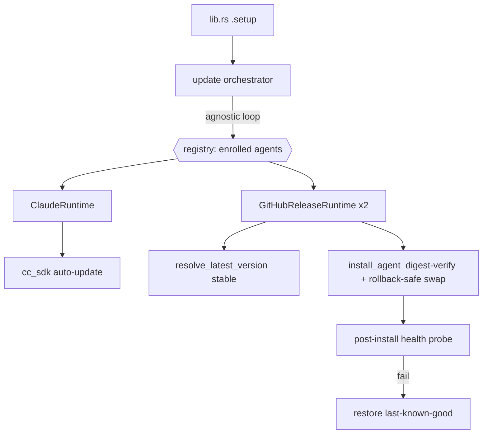

# feat: Unified agent-agnostic auto-update for managed agent CLIs

## Overview

Managed agent CLIs are **frozen after first install** — Acepe installs them only when the binary is absent and never re-checks for a newer version. Claude was just given a bespoke auto-updater (`docs/plans/2026-06-23-002`, commit `773f90c87`); the others never update.

This plan makes "managed CLIs stay current" a **single agent-agnostic capability**: a deep `ManagedAgentRuntime` trait with one adapter per provisioning mechanism, driven by a thin startup orchestrator, with Claude refactored *behind the same trait* (behavior unchanged). No per-agent branching in the orchestrator; no manual version pins.

**Integrity-gated enrollment (decided after review).** Auto-updating an agent means auto-downloading and auto-executing a new binary on launch, so an agent is enrolled **only if its update can be integrity-verified**:

| Agent | Source | Integrity | Enrolled here? |
|---|---|---|---|
| Claude | npm | npm registry integrity (existing) | ✅ (wrap existing updater) |
| Copilot | GitHub release | GitHub asset `digest` (sha256) | ✅ |
| Codex | GitHub release | GitHub asset `digest` (sha256) | ✅ |
| Cursor | ACP registry | **none published** | ❌ deferred to investigation |
| OpenCode | ACP registry | **none published** | ❌ deferred to investigation |

The ACP registry publishes no checksum/digest for Cursor/OpenCode (verified against the live `registry.json`), so they cannot be safely auto-updated from their current source; they stay install-once pending a separate sigstore/upstream-digest investigation (see Deferred). Origin directive: [[feedback-all-clis-auto-update]].

**Containment (decided after review):** ship **last-known-good rollback** with v1 — the upgrade swap becomes crash-safe and the previous binary is retained and restored if the updated binary fails a post-install health probe. No version ceiling (parity with Claude).

---

## Problem Frame

Verified this session against `packages/desktop/src-tauri/src` and the live sources:

- The non-Claude agents install through one pipeline: `acp/agent_installer.rs::install_agent` → `install_agent_inner`, dispatched by `agent_source(agent_id)` to `AgentSource::{Registry, CopilotGitHubRelease, CodexGitHubRelease}`.
- `install_agent` resolves a version per source, verifies SHA-256 **only when `DownloadInfo.official_sha256` is `Some`** (Copilot only today; `None` for Registry and Codex → check skipped, `agent_installer.rs:437,622,692`), extracts with path-traversal protection, writes `meta.json` (`{version, archive_url, sha256, cmd, args}`).
- **Upgrade swap is not crash-atomic:** extract to `<id>.tmp`, then `remove_dir_all(agent_dir)` **followed by** `rename(tmp, agent_dir)` (`:502-507`). Download/extract failures leave the existing binary intact; a crash/rename failure in the swap window leaves the agent dir missing.
- `install_agent` also invalidates + re-warms the catalog **internally for Copilot and ClaudeCode** on success (`:297-323`).
- `get_cached_version(agent_id)` reads the installed version from `meta.json` (`None` for ClaudeCode). `install_guard` (a module-private `Mutex<HashSet<CanonicalAgentId>>`, acquired internally — not a parameter) serializes installs.
- **The gap:** install fires only when the binary is absent — `acp/client_factory.rs:32` calls `install_agent` only when `can_auto_install(agent_id) && !provider.is_available()`. No post-install version re-check exists, so binaries never advance.
- GitHub release asset metadata exposes a per-asset **`digest` ("sha256:…")** for both Copilot and Codex (confirmed via the GitHub API); GitHub release fetchers are currently **unauthenticated** (`User-Agent` only, `:642,832`).
- Codex resolves via `fetch_github_release_download_info`, which lists `/releases` and takes the **first tag-prefix match** (`:653-655`) — can be a pre-release/draft — unlike Copilot's `/releases/latest`. `GitHubRelease` does not currently parse `prerelease`/`draft`; `GitHubAsset` does not parse `digest`.
- Startup wiring lives in `lib.rs` `.setup()` (~lines 759–800): `is_installed`-gated catalog warms + the Claude updater (`cc_sdk::cli_download::ensure_managed_claude_up_to_date`) in its own spawn.

---

## Goal / Success Criteria

1. On a normal launch with network access, every **enrolled** managed agent (Claude, Copilot, Codex) advances to the latest available version without user action.
2. **Every enrolled update is integrity-verified** before the binary is swapped in (npm integrity for Claude; GitHub asset `digest` for Copilot and Codex). An agent with no verifiable integrity source is **not** enrolled.
3. The update path is **agent-agnostic**: the orchestrator has no per-agent `match`; each mechanism lives behind a `ManagedAgentRuntime` adapter (deep module, narrow interface). Adding/enrolling a future agent is an adapter + registry entry, no orchestrator change.
4. Claude's behavior is **unchanged** after being refactored behind the trait.
5. **Last-known-good rollback:** a failed or unhealthy update never leaves the user worse off — the swap is crash-safe and reverts to the previous binary if the new one fails a post-install health probe.
6. Best-effort and non-blocking: offline / registry / GitHub / npm / checksum failure for any agent yields a `Skipped*`/revert outcome, never blocks startup, never aborts the other agents.
7. Cold install stays owned by `client_factory`; the updater skips not-yet-installed agents and shares `install_guard`.

---

## High-Level Technical Design

*Directional guidance for review, not implementation specification. Treat as context, not code to reproduce.*

```
trait ManagedAgentRuntime:
    agent_id() -> CanonicalAgentId
    async ensure_up_to_date(app) -> UpdateOutcome     // encapsulates installed/latest/verify/update/rollback

UpdateOutcome = Updated{from,to} | AlreadyCurrent | SkippedNotInstalled
              | SkippedOffline | SkippedError | RevertedAfterFailedHealthCheck

Adapters (deep modules, behind the trait):
  ClaudeRuntime          -> cc_sdk::cli_download::ensure_managed_claude_up_to_date  (+ catalog re-warm on Updated)
  GitHubReleaseRuntime   -> Copilot, Codex:
                              installed = get_cached_version(id)        (None -> SkippedNotInstalled)
                              latest    = agent_installer::resolve_latest_version(id)   (stable release, metadata only)
                              if latest != installed -> install_agent(id, app)   (now: digest-verified + rollback-safe)

Orchestrator (thin spine, agnostic):
  for rt in registry(): fault-isolated rt.ensure_up_to_date(app); log id+outcome
  registry() = enrolled, integrity-verified agents only (Claude, Copilot, Codex)
  one tauri spawn in lib.rs .setup(), non-blocking, replaces the Claude-only spawn
```



---

## Output Structure

```
packages/desktop/src-tauri/src/acp/agent_runtime/
  mod.rs                 # ManagedAgentRuntime trait, UpdateOutcome, registry(), orchestrator
  adapters/
    claude.rs            # ClaudeRuntime
    github_release.rs     # GitHubReleaseRuntime (Copilot, Codex)
  tests.rs
```

Per-unit `**Files:**` are authoritative; layout may be adjusted.

---

## Key Technical Decisions

- **One deep trait, thin orchestrator.** `ensure_up_to_date` is the whole interface; per-agent quirks (version source, comparison, verification, install, rollback) live in the adapter. Satisfies SC3.
- **Integrity gates enrollment.** Only agents with a verifiable integrity source are in `registry()`. Codex/Copilot use the GitHub asset `digest`; Claude uses npm integrity. Cursor/OpenCode are excluded until an integrity source exists.
- **GitHub integrity via the asset `digest` field, not SHA256SUMS parsing.** The release asset metadata already carries `digest: "sha256:…"`; reading it for the matched asset and populating `official_sha256` makes `install_agent`'s existing check enforce it — for Codex (new) and Copilot (can migrate for consistency). No extra manifest download.
- **Select the latest *stable* GitHub release.** Fix `fetch_github_release_download_info` to skip `prerelease`/`draft` (or use `/releases/latest`) so Codex's `latest` is stable and `!=` cannot flap/downgrade to a pre-release.
- **Comparison is normalized `latest != installed`.** Formats differ (dates vs semver tags); the source points at latest, so any (trimmed) difference means behind. Claude keeps its semver compare in its adapter.
- **Last-known-good rollback inside `install_agent` (benefits every upgrade).** Swap becomes: rename `agent_dir` → `<id>.bak`, move tmp into place, run a health probe, then drop `.bak` on success / restore `.bak` on failure. This both removes the non-atomic window and provides revert.
- **Refactor Claude behind the trait, don't rewrite.** `ClaudeRuntime` delegates to the existing updater (no-arg call); `app` is used only for the existing Claude catalog re-warm on `Updated`. Map cc_sdk `UpdateOutcome` (carries `SemVer`) → shared `UpdateOutcome` (display strings).
- **Catalog re-warm ownership.** `install_agent` already re-warms Copilot internally, so `GitHubReleaseRuntime` adds nothing. Claude's updater bypasses `install_agent`, so `ClaudeRuntime` owns Claude's re-warm — orchestrator stays agnostic.
- **Startup-only cadence** (per user). One pass per launch, reusing the `.setup()` spawn region.

---

## Implementation Units

### U1. `ManagedAgentRuntime` trait, `UpdateOutcome`, module skeleton

**Goal:** Establish the narrow shared interface and the new module.

**Requirements:** SC3.

**Dependencies:** none.

**Files:**
- `packages/desktop/src-tauri/src/acp/agent_runtime/mod.rs` (new)
- `packages/desktop/src-tauri/src/acp/mod.rs` (register module)

**Approach:** Define `#[async_trait] trait ManagedAgentRuntime { fn agent_id(&self) -> CanonicalAgentId; async fn ensure_up_to_date(&self, app: &AppHandle) -> UpdateOutcome; }` and the shared `UpdateOutcome` enum (`Updated { from: String, to: String }`, `AlreadyCurrent`, `SkippedNotInstalled`, `SkippedOffline`, `SkippedError`, `RevertedAfterFailedHealthCheck`). `async_trait` is already a dependency.

**Patterns to follow:** `AgentProvider` trait usage in `acp/providers`.

**Test scenarios:** `Test expectation: none — interface/type definitions; exercised by U2–U8.`

### U2. `ClaudeRuntime` adapter (wrap existing updater)

**Goal:** Put Claude behind the trait, behavior unchanged.

**Requirements:** SC1, SC4.

**Dependencies:** U1.

**Files:**
- `packages/desktop/src-tauri/src/acp/agent_runtime/adapters/claude.rs` (new)

**Approach:**
- `agent_id()` → `ClaudeCode`. `ensure_managed_claude_up_to_date()` takes **no args** (`cli_download.rs:517`, already `pub(crate)` — no visibility change). The `app` is used only for the post-`Updated` Claude catalog invalidate+re-warm (the side effect currently in the `lib.rs` Claude spawn).
- Map cc_sdk `UpdateOutcome` → shared: `Updated { from: SemVer, to: SemVer }` → `Updated { from: String, to: String }` (format the `SemVer`s); `AlreadyCurrent`/`SkippedCold`→`SkippedNotInstalled`/`SkippedOffline`/`SkippedError` accordingly (`BelowFloor` already collapses to `SkippedError` upstream).

**Test scenarios:**
- Each cc_sdk variant maps to the correct shared variant; `Updated` carries correctly formatted version strings.
- `agent_id()` returns `ClaudeCode`.

### U3. GitHub-release integrity (asset `digest`) + latest-stable selection

**Goal:** Make GitHub-release installs digest-verified and resolve the latest *stable* release.

**Requirements:** SC2; fixes the flapping/downgrade and integrity gaps.

**Dependencies:** none (lands in `agent_installer`).

**Files:**
- `packages/desktop/src-tauri/src/acp/agent_installer.rs` (`GitHubAsset` +`digest`; `GitHubRelease` +`prerelease`/`draft`; `fetch_github_release_download_info`)
- tests in `agent_installer.rs`

**Approach:**
- Parse `digest` on `GitHubAsset` and `prerelease`/`draft` on `GitHubRelease`.
- In `fetch_github_release_download_info`: select the newest release that is **not** prerelease/draft and matches the tag prefix; set `official_sha256` from the matched asset's `digest` (strip the `sha256:` prefix; map the existing checksum compare which is lowercase hex). This makes Codex verified and gives Copilot a digest path too.
- Copilot: keep working; optionally migrate `fetch_copilot_download_info` to the asset `digest` for one consistent mechanism (note, not required).

**Execution note:** Start with a failing test for stable-selection + digest extraction using a fixture release JSON.

**Test scenarios:**
- Given a `/releases` fixture where a prerelease/draft is newest, returns the newest **stable** release's version + asset.
- Sets `official_sha256` from the matched asset `digest` (`sha256:ABC…` → `abc…`); a fixture mismatch makes `install_agent`'s existing check fail.
- Missing `digest` on the matched asset → `Err` (do not silently fall back to unverified).
- Existing Copilot behavior unchanged (regression).

### U4. `agent_installer::resolve_latest_version` (version-only resolver)

**Goal:** Cheap latest-version lookup for GitHub-release agents, source logic staying in `agent_installer`.

**Requirements:** SC1, SC6.

**Dependencies:** U3 (shares the stable-selection logic).

**Files:** `packages/desktop/src-tauri/src/acp/agent_installer.rs` (`pub(crate) async fn resolve_latest_version(agent_id) -> AcpResult<String>`)

**Approach:** Build a `reqwest::Client` (mirror `install_agent_inner`), dispatch via `agent_source` to the GitHub fetchers, return `DownloadInfo.version` (stable, metadata only). `ClaudeCode` and Registry sources → `Err` (not enrolled here). Reuse U3's stable-selection.

**Test scenarios:**
- Copilot/Codex route to the GitHub fetcher and return the stable version.
- `ClaudeCode` and registry agents → `Err`.
- Fetcher network/parse failure → `Err`.
- `Test expectation:` assert dispatch + selection + error propagation; never a live version value.

### U5. `GitHubReleaseRuntime` adapter (Copilot, Codex)

**Goal:** One adapter updating the GitHub-release agents via the shared interface.

**Requirements:** SC1, SC2, SC6, SC7.

**Dependencies:** U1, U3, U4, U6.

**Files:** `packages/desktop/src-tauri/src/acp/agent_runtime/adapters/github_release.rs` (new)

**Approach:** `GitHubReleaseRuntime { agent_id }`: `installed = get_cached_version` (`None` → `SkippedNotInstalled`); `latest = resolve_latest_version` (`Err` → `SkippedOffline`); normalized `==` → `AlreadyCurrent`; else `install_agent` → `Updated { from, to }` on ok (digest-verified + rollback-safe via U3/U6), `Err` → `SkippedError`, health-revert → `RevertedAfterFailedHealthCheck`. No source-specific logic in the adapter.

**Execution note:** Test the decision logic first with injected installed+latest values.

**Test scenarios:**
- installed `None` → `SkippedNotInstalled`, `install_agent` not called.
- latest `Err` → `SkippedOffline`, binary untouched.
- normalized equal (incl. trailing whitespace) → `AlreadyCurrent`, no install.
- differing + ok → `Updated { from, to }`.
- differing + checksum/install `Err` → `SkippedError`, no false `Updated`.
- date vs semver formats both compare correctly under normalized `!=`.

### U6. Last-known-good rollback + crash-safe swap in `install_agent`

**Goal:** A failed/unhealthy upgrade never leaves the user without a working binary.

**Requirements:** SC5.

**Dependencies:** none (lands in `agent_installer`); consumed by U5.

**Files:** `packages/desktop/src-tauri/src/acp/agent_installer.rs` (`install_agent_inner` swap step; a post-install health probe)

**Approach:**
- Replace the `remove_dir_all` → `rename` swap with: rename `agent_dir` → `<id>.bak`, `rename(tmp, agent_dir)`; on rename failure restore `.bak`. (Crash-safe swap.)
- After a successful swap, run a **health probe** on the new binary (e.g. spawn `cmd --version`/`--help` with a short timeout). On failure, restore `<id>.bak` and surface a revert signal; on success delete `.bak`.
- Keep within the existing `install_guard` critical section.

**Execution note:** Characterize the current swap first (it is non-atomic), then change it.

**Test scenarios:**
- Successful update: new binary in place, `.bak` removed, returns success.
- Swap rename failure: original binary restored, error surfaced, no partial dir.
- Health probe fails on the new binary: previous binary restored; outcome signals reverted; `meta.json` reflects the retained (old) version.
- Cold install (no existing dir) still works (no `.bak` to manage).

### U7. Orchestrator + enrolled registry + startup wiring

**Goal:** Drive all enrolled adapters from one agent-agnostic startup pass.

**Requirements:** SC1, SC3, SC6.

**Dependencies:** U2, U5.

**Files:**
- `packages/desktop/src-tauri/src/acp/agent_runtime/mod.rs` (`registry()`, `spawn_update_all(app)`)
- `packages/desktop/src-tauri/src/lib.rs` (`.setup()` — replace the Claude-only updater spawn)

**Approach:** `registry()` returns the **enrolled** runtimes: `ClaudeRuntime`, `GitHubReleaseRuntime(Copilot)`, `GitHubReleaseRuntime(Codex)`. (Cursor/OpenCode intentionally absent — no integrity source yet.) Orchestrator loops fault-isolated, logging `agent_id` + outcome, inside one `tauri::async_runtime::spawn`; keep the immediate pre-update catalog warms; the orchestrator adds no catalog side effect (Claude's lives in its adapter; Copilot's in `install_agent`).

**Test scenarios:**
- `registry()` contains exactly the three enrolled agents; Cursor/OpenCode absent.
- One adapter returning `SkippedError`/panicking does not stop the others (fault isolation, stub runtimes).
- `ClaudeRuntime` triggers the catalog re-warm on `Updated`; orchestrator/`GitHubReleaseRuntime` add none (no double-warm).
- `Test expectation:` startup non-blocking is structural (call inside the spawn).

### U8. Cold-install coexistence verification

**Goal:** Confirm the updater never races or duplicates `client_factory`'s first-use install.

**Requirements:** SC7.

**Dependencies:** U7.

**Files:** `packages/desktop/src-tauri/src/acp/client_factory.rs` (verify only); test alongside `agent_runtime`.

**Test scenarios:**
- Agent with no `meta.json` → updater `SkippedNotInstalled`, `install_agent` not invoked; `client_factory` remains the sole cold-install path.
- Concurrent update + first-use install of the same agent serialize on `install_guard`.

---

## System-Wide Impact

- **Affected:** managed-agent update for Copilot + Codex (new, integrity-verified); Claude (wrapped, unchanged); `install_agent` swap (now rollback-safe, benefits all installs incl. Cursor/OpenCode cold installs); startup (one unified pass).
- **Not affected:** model catalogs except Claude's/Copilot's existing re-warm; session/transcript paths; Cursor/OpenCode behavior (still install-once).
- **GOD posture:** runtime/capability provisioning, Rust-owned, generic; no session-shaped data, no provider quirks in TS/UI.

---

## Risk Analysis & Mitigation

- **Enrolled agents are now integrity-verified** (npm / GitHub asset digest), closing the earlier "auto-execute unverified binary" gap for the agents we ship. Residual: GitHub digest is integrity, not full provenance (an account compromise that re-publishes a release + digest passes); sigstore verification is a future hardening (Deferred).
- **No ceiling → a newer CLI could break ACP integration.** Mitigation now includes **last-known-good rollback** (U6): a new binary that fails its health probe is reverted automatically; fault isolation keeps one agent's failure from affecting others or startup. Accepted residual (parity with Claude); a remote kill-switch / version ceiling remains deferred.
- **GitHub rate limits (unauthenticated, 60/hr/IP).** Shared-egress environments could 403 → `SkippedOffline` for all behind that IP (update starvation). Mitigation: metadata-only, background, silent-skip; optional token is a follow-up if observed.
- **Refactoring Claude behind the trait could regress the shipped fix.** Mitigation: pure delegate/mapping wrapper; U2 mapping tests + existing Claude tests.
- **Concurrent-writer race with cold install.** Mitigation: skip-not-installed + shared `install_guard` (U8).
- **Reproducibility / silent change.** Binaries float to latest; surfacing versions/recent updates to the user is a Deferred follow-up.

---

## Deferred to Follow-Up Work

- **Cursor / OpenCode auto-update enrollment — blocked on integrity.** Separate investigation: do their archives carry sigstore/signatures, can the ACP registry publish per-binary digests, or is another verifiable source available? Enroll only once a real integrity source exists (do not self-pin / TOFU).
- Sigstore/provenance verification for the GitHub-release agents (stronger than digest).
- Remote kill-switch / version ceiling (parity with the deferred Claude decision).
- Surfacing managed-agent versions / recent auto-updates to the user (reproducibility/diagnosability).
- Authenticated GitHub requests if rate-limiting proves real for shared-egress users.
- Optional migration of Copilot from `SHA256SUMS.txt` to the asset `digest` for one consistent mechanism.

---

## Open Questions (deferred to implementation)

- Exact field name/shape of the GitHub asset `digest` in the deserialized struct, and whether any enrolled asset can lack a `digest` (confirm during U3; treat missing digest as a hard `Err`).
- The right health-probe command per GitHub-release agent (`--version` vs `--help` vs a short ACP handshake) and its timeout (U6).
- Whether `registry()` should derive from `can_auto_install` minus an integrity/has-adapter predicate, so enrollment can't drift as agents are added.
