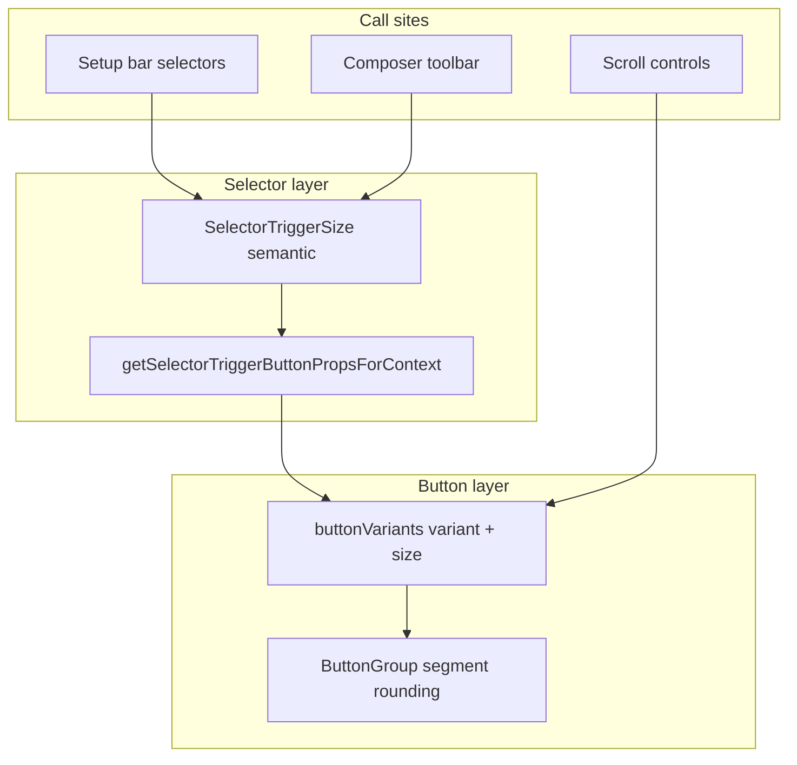

# refactor: Standardize agent chip controls to shadcn button tokens

## Summary

Migrate the agent setup bar and composer chip controls from the legacy `FUSED_CONTROL_*` surface system and ad-hoc class overrides to the shadcn button token model (`secondary` / `ghost` + `sm` / `icon-sm` / `icon-sm-narrow`) composed through `Button`, `ButtonGroup`, and `Selector`. Consolidate fragmented selector context mapping into one helper, fix known layout bugs (branch **+** width crush), and delete obsolete fused-control exports once the targeted surfaces are fully migrated.

---

## Problem Frame

Acepe currently runs **two parallel button systems**:

1. **Shadcn tokens** in `packages/ui/src/components/button/variants.ts` — `secondary`, `ghost`, `sm`, `icon-sm`, `icon-sm-narrow`, etc.
2. **Legacy fused chip surfaces** in `packages/ui/src/components/panel-header/project-card-action-button-class.ts` — `FUSED_CONTROL_*` classes with `bg-accent/30`, manual segment rounding, and raw `<button>` elements.

The setup bar migration is partially complete (project/agent/branch/worktree selectors mostly on `secondary` + `sm`), but composer toolbar, transcript scroll controls, voice mic groups, and several call sites still use fused classes. Selector mapping is split across `getSelectorTriggerButtonVariant`, `getSelectorTriggerButtonSize`, `getSelectorTriggerButtonSizeForContext`, inline `embeddedInGroup` overrides in `selector.svelte`, and per-component `triggerClass` hacks (`w-auto`, `setupBarLayoutClass`). This produces bugs like the branch **+** button collapsing to ~12px width when `w-auto` overrides `icon-sm`'s `size-7`.

---

## Requirements

- R1. All agent **setup bar** and **composer toolbar** chip controls render via `Button` / `Selector` + `ButtonGroup` using shadcn variant/size tokens — no `FUSED_CONTROL_*` surface classes on those surfaces.
- R2. Selector triggers map semantic `triggerSize` + layout context (`embeddedInGroup`) to `{ variant, size }` through **one consolidated helper** — no duplicate context rules in `selector.svelte`.
- R3. Icon-only controls use proper size tokens (`icon-sm`, `icon-sm-narrow`) — no `!` width/height overrides and no layout classes (`w-auto`) that defeat size tokens.
- R4. Fused `ButtonGroup` segments share `secondary` background and correct segment rounding via `ButtonGroup` — not manual cap classes.
- R5. Design-system showcase and unit tests document the chip control matrix (labeled vs icon, standalone vs grouped).
- R6. Each migrated surface verified via QA CLI (`bun run qa inspect`) for height/width on the new-chat setup bar and composer toolbar.

---

## Scope Boundaries

- Agent setup bar (new-thread options): project, agent, branch, worktree, session setup ⋮
- Composer toolbar: model/reasoning selectors, config options, attach, mic + voice model menu, autonomous toggle where fused
- Transcript scroll controls (pre-composer stack)
- `FusedPrimaryOverflowGroup` shell migration to `ButtonGroup` without `FUSED_CONTROL_CHIP_GROUP_CLASS`
- Selector trigger mapping consolidation and cleanup of migrated `getSelectorTriggerSizeClass` overrides

- Panel header chrome (`chromeIcon` close/fullscreen/overflow) — separate follow-up
- Permission/toolbar `headerAction` / `toolbar` variants in agent panel chrome
- Dialog footers (`header` / `invert` buttons in SQL studio, skills, settings)
- Kanban, git panel, sidebar, top bar icon rails
- Website marketing demos
- Removing **all** legacy button tokens repo-wide (only remove tokens with zero remaining call sites after this plan)

### Deferred to Follow-Up Work

- **Panel chrome `chromeIcon` → `ghost` + icon size migration**: ~40+ call sites across headers, sidebars, review navigation — high volume, low coupling to chip controls; separate plan.
- **Desktop duplicate `packages/desktop/src/lib/components/ui/button/variants.ts`**: audit whether desktop-local Button can be retired in favor of `@acepe/ui`; do not block chip migration on full deduplication.
- **Vitest browser CT for chip dimensions**: optional hardening after QA CLI coverage proves stable.

---

## Context & Research

### Relevant Code and Patterns

- **Button tokens**: `packages/ui/src/components/button/variants.ts` — shadcn variants/sizes; `icon-sm-narrow` for grouped trailing overflow icons.
- **Selector mapping**: `packages/ui/src/components/selector/selector-trigger-classes.ts` — semantic `SelectorTriggerSize` → button props; `getSelectorTriggerButtonSizeForContext` (size-only context today).
- **Selector component**: `packages/ui/src/components/selector/selector.svelte` — duplicate variant context rule for `embeddedInGroup && composerChipIcon → secondary`.
- **ButtonGroup**: `packages/ui/src/components/button-group/button-group.svelte` — segment rounding, requires direct `data-slot=button` children.
- **Legacy fused surfaces**: `packages/ui/src/components/panel-header/project-card-action-button-class.ts` — 15+ exports still referenced by ~15 files.
- **Partially migrated setup bar**: `agent-input-new-thread-options.svelte`, `agent-input-agent-selector.svelte`, `agent-input-branch-selector.svelte`.
- **Still legacy**: `agent-panel-transcript-scroll-controls.svelte` (raw `<button>` + FUSED_CONTROL), `agent-input-mic-button.svelte` (FUSED_CONTROL_PRIMARY_BUTTON_CLASS when embedded), `fused-primary-overflow-group.svelte` (FUSED_CONTROL_CHIP_GROUP_CLASS shell).
- **Known bug**: `agent-input-branch-selector.svelte` — `class={setupBarLayoutClass}` (`w-auto flex-none`) on **+** `Button` crushes `icon-sm` width.

### Institutional Learnings

- DOM verification required for UI shape bugs — unit tests alone insufficient (`docs/solutions/workflow-issues/dom-first-qa-for-css-shape-bugs-2026-05-20.md`, `docs/solutions/workflow-issues/verify-dom-and-screenshot-after-ui-changes-2026-06-15.md`).
- QA CLI workflow: `bun run qa doctor` → observe → `inspect --selector=` → screenshot when visual (`docs/solutions/workflow-issues/acepe-qa-wrapper-for-tauri-mcp-friction-2026-06-07.md`).

### External References

- shadcn button scale: default `h-8` (32px); Acepe uses `sm` = `h-7` (28px) for setup chips to match existing density.

---

## Key Technical Decisions

- **Consolidated context helper**: Replace `getSelectorTriggerButtonVariant`, `getSelectorTriggerButtonSize`, `getSelectorTriggerButtonSizeForContext`, and inline `selector.svelte` variant override with `getSelectorTriggerButtonPropsForContext({ triggerSize, embeddedInGroup }) → { variant, size }`. Single source of truth for chip mapping.
- **Chip control matrix** (target end state):

  | Surface | Context | Variant | Size |
  |---------|---------|---------|------|
  | Labeled chip (project, agent, branch, worktree, model) | standalone | `secondary` | `sm` |
  | Labeled chip | grouped leading/middle | `secondary` | `sm` |
  | Icon-only (reasoning, attach standalone) | standalone | `ghost` | `icon-sm` |
  | Icon-only overflow (⋮, gear) | grouped trailing | `secondary` | `icon-sm-narrow` |
  | Plain icon action (+ create branch) | grouped trailing | `secondary` | `icon-sm` or `icon-sm-narrow` |

- **New tokens over overrides**: When a layout needs asymmetric dimensions, add a size token (like `icon-sm-narrow`) rather than `!w-*` classes on call sites.
- **Layout classes forbidden on sized icon buttons**: `w-auto`, `flex-none`, and similar must not be applied to `Button` elements using `icon-sm` / `icon-sm-narrow` — use `shrink-0` on the group shell instead.
- **Mic recording states**: Keep animation/recording-specific classes on `agent-input-mic-button.svelte` (red stop circle, pulse) but migrate the embedded group shell to `Button` + `secondary`/`icon-sm` base — visual state CSS stays, surface tokens replace `FUSED_CONTROL_PRIMARY_BUTTON_CLASS`.
- **Transcript scroll controls**: Replace raw `<button>` + FUSED_CONTROL with `Button variant="secondary" size="icon-sm-narrow"` (or `icon-sm` if square preferred) inside `ButtonGroup` — no `FUSED_CONTROL_CHIP_GROUP_CLASS` wrapper.
- **FusedPrimaryOverflowGroup**: Retain as composition helper but swap shell from `FUSED_CONTROL_CHIP_GROUP_CLASS` to `ButtonGroup` default styling + `secondary` segments on children.

---

## Open Questions

### Resolved During Planning

- **Should `icon-sm-narrow` be used for branch +?** Yes — trailing grouped icon actions should match overflow ⋮ width (24px) unless product prefers full 28px square; default `icon-sm-narrow` for consistency.
- **Keep semantic `SelectorTriggerSize` names?** Yes — they encode product intent (`setupBarChipGrouped` vs `composerChipIcon`); mapping layer translates to shadcn tokens. Do not expose shadcn sizes at every call site yet.

### Deferred to Implementation

- **Mic download-progress wide segment**: May need a dedicated size token (`sm-wide` or inline width only on that state) — evaluate during U4 when recording/download layouts are migrated.
- **Whether `setupBarChip` vs `setupBarChipGrouped` can collapse** to one trigger size with context flag — only if mapping table proves identical after migration.

---

## High-Level Technical Design

> *This illustrates the intended approach and is directional guidance for review, not implementation specification.*



**Mapping consolidation (directional):**

```
getSelectorTriggerButtonPropsForContext({ triggerSize, embeddedInGroup })
  → if fused chip sizes: secondary + sm (labeled) or ghost/icon-sm (icon standalone)
  → if composerChipIcon + embeddedInGroup: secondary + icon-sm-narrow
  → else: delegate to existing getSelectorTriggerButtonVariant/Size
```

---

## Implementation Units

### U1. Consolidate selector context mapping + fix branch + width bug

**Goal:** Single `{ variant, size }` helper; remove duplicate rules from `selector.svelte`; fix branch **+** crushed width.

**Requirements:** R2, R3

**Dependencies:** None

**Files:**
- Modify: `packages/ui/src/components/selector/selector-trigger-classes.ts`
- Modify: `packages/ui/src/components/selector/selector.svelte`
- Modify: `packages/ui/src/components/agent-panel/agent-input-branch-selector.svelte`
- Test: `packages/ui/src/components/selector/selector-trigger-classes.test.ts`

**Approach:**
- Add `getSelectorTriggerButtonPropsForContext` returning `{ variant, size }`; migrate embedded `composerChipIcon` rules from `selector.svelte` into this function.
- Deprecate direct use of separate size/variant context helpers internally (keep exports temporarily if external tests import them).
- Branch **+**: remove `setupBarLayoutClass` from the `Button`; use `variant="secondary" size="icon-sm-narrow"` (or `icon-sm` if grouped cap should be square — prefer narrow for parity with ⋮).
- Keep `setupBarLayoutClass` only on Selector shell / labeled trigger where `w-auto` is intentional.

**Execution note:** Extend existing mapping unit tests before changing `selector.svelte`.

**Test scenarios:**
- Happy path: `composerChipIcon` standalone → `{ ghost, icon-sm }`
- Happy path: `composerChipIcon` embedded → `{ secondary, icon-sm-narrow }`
- Happy path: `setupBarChipGrouped` → `{ secondary, sm }`
- Edge case: `embeddedInGroup: false` never returns `icon-sm-narrow`
- Integration: branch selector render test still opens branch rows from fused setup chip trigger (existing vitest)

**Verification:**
- All selector-trigger-classes tests pass
- QA inspect on branch **+** shows width ≥ 24px and height 28px

---

### U2. Finish setup bar fused groups (worktree, session options)

**Goal:** Setup bar fully on shadcn tokens; no remaining `FUSED_CONTROL_*` or `bg-accent/30` in new-thread options path.

**Requirements:** R1, R4, R6

**Dependencies:** U1

**Files:**
- Modify: `packages/ui/src/components/agent-panel/agent-input-new-thread-options.svelte`
- Modify: `packages/ui/src/components/agent-panel/agent-input-agent-selector.svelte`
- Modify: `packages/ui/src/components/agent-panel/agent-input-branch-selector.svelte`
- Modify: `packages/desktop/src/lib/acp/components/branch-picker/branch-picker.svelte`
- Modify: `packages/desktop/src/lib/acp/components/project-selector.svelte`
- Test: `packages/ui/src/components/agent-panel/agent-input-branch-selector.svelte.vitest.ts`

**Approach:**
- Audit each setup bar control for stray `FUSED_CONTROL_*`, manual rounded cap classes, or `triggerClass` overrides.
- Worktree toggle: ensure primary segment uses `buttonVariants({ secondary, sm })` without fused surface wrapper.
- Session setup ⋮: confirm `embeddedInGroup` + `composerChipIcon` picks up consolidated mapping from U1.
- Remove unused imports of fused constants where migration complete.

**Test scenarios:**
- Happy path: branch selector fused group opens dropdown from chip trigger
- Happy path: worktree + session setup in same bar share `secondary` background (visual QA)

**Verification:**
- QA CLI on new-chat panel: project, agent, branch, worktree, session setup all 28px tall with `bg-secondary`
- No `FUSED_CONTROL_` imports remain in setup bar component files

---

### U3. Migrate composer toolbar selectors and attach

**Goal:** Model, reasoning, config option, and attach controls use shadcn chip matrix; remove fused composer chip classes from these components.

**Requirements:** R1, R2, R5

**Dependencies:** U1

**Files:**
- Modify: `packages/ui/src/components/agent-panel/agent-input-standard-model-selector.svelte`
- Modify: `packages/ui/src/components/agent-panel/agent-input-reasoning-model-selector.svelte`
- Modify: `packages/ui/src/components/agent-panel/agent-input-config-option-selector.svelte`
- Modify: `packages/ui/src/components/agent-panel/agent-input-attach-menu.svelte`
- Modify: `packages/ui/src/components/agent-panel/agent-input-autonomous-toggle.svelte`
- Modify: `packages/ui/src/components/agent-panel/agent-input-reasoning-effort-trigger.svelte`
- Test: `packages/ui/src/components/agent-panel/agent-input-config-option-selector-state.test.ts`
- Test: `packages/ui/src/components/agent-panel/agent-input-reasoning-effort-trigger-props.test.ts`

**Approach:**
- Labeled selectors: `composerChipLabel` / equivalent → already maps to `secondary` + `sm`; strip any remaining `FUSED_CONTROL_COMPOSER_CHIP_*` from trigger snippets.
- Standalone icon triggers: `ghost` + `icon-sm`.
- Remove `FUSED_CONTROL_COMPOSER_ICON_SIZE_CLASS` from trigger content where `[&_svg]` sizing can live in selector child class or icon component props.

**Test scenarios:**
- Happy path: config option selector state still resolves `composerChipIcon` vs `composerChipLabel` by display mode
- Happy path: reasoning effort trigger size constant unchanged semantically

**Verification:**
- Composer toolbar renders without `bg-accent/30` on model/reasoning/attach chips
- QA inspect on composer chip row confirms token classes

---

### U4. Migrate voice mic group and FusedPrimaryOverflowGroup shell

**Goal:** Voice mic + model menu fused group uses `ButtonGroup` + shadcn tokens; drop `FUSED_CONTROL_CHIP_GROUP_CLASS` from overflow group shell.

**Requirements:** R1, R4

**Dependencies:** U1, U3

**Files:**
- Modify: `packages/ui/src/components/panel-header/fused-primary-overflow-group.svelte`
- Modify: `packages/ui/src/components/agent-panel/agent-input-mic-button.svelte`
- Modify: `packages/ui/src/components/agent-panel/agent-input-voice-model-menu.svelte`
- Modify: `packages/ui/src/components/agent-panel/agent-panel-footer-chrome.svelte` (if wires mic group)

**Approach:**
- `FusedPrimaryOverflowGroup`: replace `FUSED_CONTROL_CHIP_GROUP_CLASS` with plain `ButtonGroup` + optional `class` for layout; children supply `secondary`/`sm`/`icon-sm-narrow`.
- Mic button embedded mode: use `Button` or `data-slot="button"` with `secondary` + appropriate size instead of `FUSED_CONTROL_PRIMARY_BUTTON_CLASS`; preserve recording/download animation classes separately.
- Voice model menu: `embeddedInGroup ? composerChipIcon : chromeIcon` — after migration, embedded path uses consolidated mapping; standalone path stays `ghost`/`icon-sm` (defer chromeIcon panel migration).

**Test scenarios:**
- Edge case: mic embedded download-progress wide state still renders progress bar without clipping
- Happy path: voice model overflow in group uses `icon-sm-narrow` via Selector mapping

**Verification:**
- QA inspect mic group and overflow ⋮ segment dimensions
- No `FUSED_CONTROL_CHIP_GROUP_CLASS` in `fused-primary-overflow-group.svelte`

---

### U5. Migrate transcript scroll controls to Button + ButtonGroup

**Goal:** Replace raw `<button>` + FUSED_CONTROL in transcript scroll controls with tokenized `Button` components.

**Requirements:** R1, R3

**Dependencies:** U1

**Files:**
- Modify: `packages/ui/src/components/agent-panel/agent-panel-transcript-scroll-controls.svelte`
- Test: add or extend vitest if scroll control test seam exists; otherwise QA-only verification documented

**Approach:**
- Use `ButtonGroup` without fused shell class.
- Each scroll arrow: `Button variant="secondary" size="icon-sm-narrow"` (grouped) or `icon-sm` (standalone single control).
- Remove imports of `FUSED_CONTROL_SETUP_*` constants.

**Test scenarios:**
- Test expectation: none — presentational swap with no logic change; verify via QA inspect on `[data-testid=transcript-scroll-controls]`

**Verification:**
- Scroll controls visible in session with long transcript; QA inspect confirms 28px height and secondary background

---

### U6. Slim selector trigger classes + design-system matrix

**Goal:** Remove obsolete `!` overrides from migrated trigger sizes; document chip matrix in design system.

**Requirements:** R5

**Dependencies:** U2, U3, U4, U5

**Files:**
- Modify: `packages/ui/src/components/selector/selector-trigger-classes.ts`
- Modify: `packages/ui/src/components/button/control-tokens-showcase-meta.ts`
- Modify: `packages/ui/src/components/button/control-tokens-showcase.svelte`
- Test: `packages/ui/src/components/selector/selector-trigger-classes.test.ts`

**Approach:**
- For `setupBarChip*`, `composerChipLabel`, `composerChipIcon`: ensure `getSelectorTriggerSizeClass` only applies child SVG sizing (`CHIP_TRIGGER_CHILD_SVG_CLASS`), not surface/height overrides.
- Add design-system row or annotation for agent chip matrix (labeled `secondary+sm`, grouped overflow `secondary+icon-sm-narrow`).
- Delete unused fused chip exports from `project-card-action-button-class.ts` **only if** grep shows zero references after U2–U5.

**Test scenarios:**
- Happy path: mapping tests still pass after slimming size class switch
- Happy path: design system renders `icon-sm-narrow` column

**Verification:**
- `rg FUSED_CONTROL_(SETUP|COMPOSER|CHIP)` under `packages/ui/src/components/agent-panel` returns no matches
- Obsolete exports removed or marked `@deprecated` with zero call sites

---

### U7. QA regression pass and light-theme secondary verification

**Goal:** End-to-end DOM verification of migrated surfaces; confirm light-theme chip contrast still acceptable.

**Requirements:** R6

**Dependencies:** U2, U3, U4, U5, U6

**Files:**
- Modify: `packages/desktop/.codex/state/ui-qa-evidence.json` (via QA CLI, not hand-edited)
- Reference: `packages/desktop/src/app.css` (`--secondary` token)

**Approach:**
- Run QA doctor → open new chat → inspect setup bar controls and composer toolbar selectors.
- Capture width/height/class for: project, agent, branch, branch +, worktree, session ⋮, model, reasoning, attach, mic, scroll controls.
- Screenshot if any dimension regression vs 28px row height target.

**Test scenarios:**
- Integration: each listed selector returns `data-slot=button` with expected computed height 28px
- Integration: branch + width ≥ 24px; session ⋮ width ~24px (icon-sm-narrow)

**Verification:**
- QA evidence artifact updated with post-migration inspect output
- No crushed icon buttons in screenshot review

---

## System-Wide Impact

- **Interaction graph:** Setup bar and composer are presentational `@acepe/ui` components; desktop controllers pass data/callbacks unchanged. `ButtonGroup` requires `data-slot=button` on direct children — `Selector` with `embeddedInGroup` already satisfies this.
- **Error propagation:** None — visual-only refactor.
- **State lifecycle risks:** None — no store or session data path changes.
- **API surface parity:** `SelectorTriggerSize` public type unchanged; internal mapping consolidation may deprecate but not remove exports until downstream imports updated.
- **Integration coverage:** QA CLI cross-checks real Tauri WebView rendering; website demos using `@acepe/ui` may pick up visual changes automatically — spot-check landing demos if they render agent input.
- **Unchanged invariants:** Panel header `chromeIcon` controls, dialog buttons, permission bars, and store/session logic explicitly untouched.

---

## Risks & Dependencies

| Risk | Mitigation |
|------|------------|
| Mic recording UI breaks when replacing fused primary class | Migrate shell tokens first; keep animation CSS isolated; QA mic states (idle, recording, download) |
| ButtonGroup segment rounding regressions | Compare before/after screenshots on worktree group and branch group |
| Removing FUSED_CONTROL too early breaks unmigrated import | Delete exports only in U6 after grep confirms zero references in scoped paths |
| Light theme secondary too faint on composer `bg-input/30` | Re-verify `--secondary` in `app.css`; adjust token if chips disappear after losing `bg-accent/30` |
| Desktop duplicate button variants drift | Sync `icon-sm-narrow` when added; defer full deduplication |

---

## Documentation / Operational Notes

- Update design-system showcase with chip matrix after U6.
- If meaningful, add `docs/solutions/best-practices/agent-chip-button-token-matrix-2026-06-29.md` via docs/solutions capture after execution — not part of this plan's deliverables.

---

## Sources & References

- Conversation context: setup bar migration, `icon-sm-narrow`, branch + width bug, `getSelectorTriggerButtonSizeForContext`
- `packages/ui/src/components/button/variants.ts`
- `packages/ui/src/components/selector/selector-trigger-classes.ts`
- `packages/ui/src/components/panel-header/project-card-action-button-class.ts`
- `docs/solutions/workflow-issues/dom-first-qa-for-css-shape-bugs-2026-05-20.md`
- `docs/solutions/workflow-issues/acepe-qa-wrapper-for-tauri-mcp-friction-2026-06-07.md`
