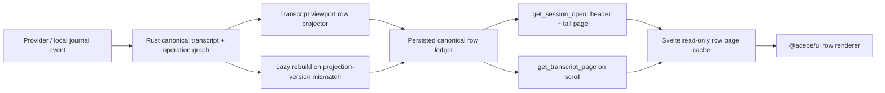

# refactor: Persist canonical transcript row ledger

## Overview

Move restored-session first content display from open-time full snapshot rebuild to a Rust-owned, persisted, render-ready transcript row ledger.

The current restored-session path does O(session length) work to satisfy an O(viewport) need. Session `119` measured about `2387ms` first row paint, with `get_session_open_result` taking about `2124ms`: provider load about `282ms`, snapshot assembly about `925ms`, restore authority about `169ms`, and IPC compaction about `721ms`. The clean target is not a faster monolith. It is deleting the monolith from the first-paint path.

## Problem Frame

Acepe opens large restored sessions by rebuilding canonical transcript and operation state, then compacting the result so the WebView can render the tail rows. For session `119`, that meant touching about `6472` transcript entries and `6471` tool operations before first content was visible.

That shape caused two problems:

- Performance: open cost grows with session length even though the user needs only the current viewport.
- Correctness risk: read-time IPC compaction became a second projection with its own rules. A recent bug dropped completed operation facts during compaction, causing visible tool rows to degrade to generic `Tool`.

The GOD-correct solution is a canonical materialized view, not a UI cache. Rust should maintain render-ready row facts as canonical derived state at write time. Session open should read the tail page of that ledger and session header, then let background restore/reconnect continue after first paint.

## Requirements Trace

- R1. Session open first content must be O(viewport), not O(session length).
- R2. Rust remains the only authority for transcript order, row identity, tool operation facts, interaction links, lifecycle, activity, and turn state.
- R3. Svelte may hold immutable canonical row facts by revision, but must not invent labels, repair missing operation data, reorder rows, or branch on provider quirks.
- R4. Visible tool rows must have required canonical display facts when a canonical operation exists; generic `Tool` must be unrepresentable for complete canonical operation rows.
- R5. First paint must not require provider history load, full transcript rebuild, full operation rebuild, or read-time IPC compaction.
- R6. Ledger rows must stay byte/semantic-equivalent to the existing from-scratch canonical viewport projection for the same revision.
- R7. Ledger staleness must be detectable through projection version and session revision, with lazy rebuild from canonical sources on mismatch or corruption.
- R8. Scroll paging must keep ADR-0003: Rust sends ordered rows and canonical row facts, not pixel offsets, total spacer heights, or scrollTop authority.
- R9. Metrics must prove flatness across 1k, 10k, and 100k row fixtures.
- R10. Legacy sessions created before the ledger exists must have an explicit rebuild/backfill lane. They must not silently masquerade as hot ledger-backed opens.
- R11. DOM-measured row height is display cache state only. Persisted ledger state may include deterministic row facts and deterministic height class/estimate hints, but not live WebView measurements as canonical truth.

## Scope Boundaries

- This plan does not redesign provider parsers or transcript identity rules beyond what the ledger must consume.
- This plan does not reintroduce Rust-owned scroll pixels, virtual spacer height, or scrollTop control; ADR-0003 stays in force.
- This plan does not optimize cold OS process launch, WebKit boot, bundle load, or provider reconnect.
- This plan does not replace the visual row components in `@acepe/ui`.

### Deferred to Separate Tasks

- Binary IPC/raw-byte transport optimization. The ledger repository should hide storage encoding so this can be added if page-sized JSON still misses latency gates.
- Full deletion of old open snapshot fields after all callers migrate. This plan creates the replacement path and gates it; cleanup can follow once parity is proven.

## Context & Research

### Relevant Code and Patterns

- `packages/desktop/src-tauri/src/acp/session_restore/open_session.rs` is the current restored-session command path. It measures provider load, assembly, restore authority, and compaction.
- `packages/desktop/src-tauri/src/acp/session_open_snapshot/types.rs` defines `SessionOpenResult` and currently includes full transcript/projection state plus an optional initial viewport envelope.
- `packages/desktop/src-tauri/src/acp/session_open_snapshot/snapshot.rs` assembles `SessionOpenFound`, builds the initial viewport envelope, and compacts oversized open results.
- `packages/desktop/src-tauri/src/acp/session_wire_compaction.rs` is the current read-time compaction path; it should leave the first-paint path.
- `packages/desktop/src-tauri/src/acp/transcript_viewport/projection.rs` projects canonical transcript + operations + interactions into `TranscriptViewportRow`.
- `packages/desktop/src-tauri/src/acp/session_state_engine/transcript_rows_ledger.rs` is an in-memory materializer/finalizer today, not yet the persisted write-through ledger this plan needs.
- `packages/desktop/src-tauri/src/acp/session_state_engine/buffer_emission_tracker.rs` already has an initial tail limit (`128`) and envelope sequencing.
- `packages/desktop/src-tauri/src/acp/session_journal.rs` can rebuild canonical projection/transcript from persisted journal events.
- `packages/desktop/src-tauri/src/acp/transcript_projection/runtime.rs` owns canonical transcript projection and revisioned snapshots.
- `packages/desktop/src-tauri/src/db/migrations/` and `packages/desktop/src-tauri/src/db/repository/` show the existing SeaORM migration/repository style.
- `packages/desktop/src/lib/acp/store/transcript-rows-store.svelte.ts` and `packages/desktop/src/lib/acp/store/session-envelope-applier.svelte.ts` apply viewport buffer pushes/deltas in the WebView.
- `packages/desktop/src/lib/acp/session-state/viewport-operation-scene-entry-resolver.ts` is the current frontend bridge for compact operation facts. The target should reduce its fallback role by making visible row operation facts required upstream.

### Institutional Learnings

- `docs/solutions/architectural/session-state-engine-ledger-decomposition-2026-06-11.md`: keep session-state ledgers cohesive and make cross-lock order structural.
- `docs/solutions/architectural/live-transcript-display-identity-boundary-2026-05-18.md`: provider IDs are metadata; Acepe display identity is canonical.
- `docs/solutions/transcript-viewport-dom-authority-baseline.md` and ADR-0003: DOM owns scroll pixels; Rust should not send spacer/offset authority.
- `docs/solutions/performance-issues/svelte-prop-spread-descriptor-churn-2026-07-02.md`: row rendering should keep large structures lazy and avoid hot-path JS proxy churn.

### External References

- Fable advisory review from this session: the target should be a persistent, incrementally maintained materialized view, not a bespoke "packet cache"; literal sub-1ms end-to-end through Tauri/WebView is not honest, but Rust hot tail-page lookup under 1ms is a valid target.

## Key Technical Decisions

- **Use a persisted canonical row ledger, not an open-ready cache:** the tail page is a query over a write-through materialized view. It cannot go stale independently from the ledger because it is not a separate artifact.
- **Move projection cost to write time:** provider/session updates should update canonical transcript/projection, then persist render-ready row facts downstream.
- **Make compact operation display facts part of row truth:** a tool row with a linked canonical operation must carry required display facts needed by the renderer. Missing facts are a Rust canonical bug, not a UI fallback opportunity.
- **Keep DOM scroll authority:** the ledger stores row order, row identity, row content, row version, anchor eligibility, and deterministic row estimate hints only. Live measured heights, scrollTop, spacer correction, and pixel viewport commands stay in the WebView display layer.
- **Make first-paint open O(viewport):** restored open should read session header + last N rows + revision metadata. Full provider load and full projection rebuild are background/recovery work.
- **Hide storage encoding behind a repository:** start with the repo's existing serde/SQLite style unless benchmarks prove it is too slow. The public contract is page-sized canonical rows, not JSON as architecture.
- **Use projection version stamps:** schema/projection changes trigger lazy rebuild from canonical journal/provider-owned sources before serving stale rows as truth.

### Operation Display Facts Contract

Tool and operation rows need a typed compact display contract rather than an optional rescued copy of `OperationSnapshot`.

For a row linked to a canonical operation, the row payload must include:

- canonical operation id and row/link id
- operation kind/category
- semantic display title
- status/state
- short command/path/result/error summary when available
- interaction or follow-up link ids needed by the scene renderer
- enough metadata for copy/open/detail actions already shown by the current UI

If canonical operation data exists but required display facts cannot be produced, the Rust projector should mark the ledger stale or fail the row projection. The frontend should not turn that into a generic `Tool` label.

### Legacy Session Backfill Contract

New or recently written sessions should get ledger rows at write time. Existing sessions created before this ledger exists need a separate path:

```text
legacy session without current ledger
  -> classify as rebuild_required / legacy_rebuild
  -> rebuild from canonical journal/projection sources
  -> serve ledger rows after rebuild
  -> future opens use hot ledger path
```

The app may warm the current/recent sessions during a bounded post-startup idle lane, but it must not rebuild every session during app startup. Timing probes must label `hot_ledger`, `legacy_rebuild`, and `compat_snapshot` separately so we never confuse a slow fallback with the target architecture.

## Open Questions

### Resolved During Planning

- **Is "precomputed packet" the right noun?** No. Use "canonical transcript row ledger" or "materialized row ledger". A packet sounds like an independent cache.
- **Should Svelte cache row pages?** Yes, only as immutable memoization keyed by session, row id/range, and revision. It must be invalidated by Rust revision, never inferred in TS.
- **Should compaction be optimized or removed?** Removed from first paint. Page-sized payloads should not need read-time compaction.
- **Does this conflict with ADR-0003?** No, if Rust sends rows only and keeps pixels/scroll authority out of the ledger protocol.

### Deferred to Implementation

- Exact SeaORM entity names and migration id.
- Whether row payload starts as JSON text or a binary blob. The repository should make this swappable.
- Exact projection version string/hash. It must change when row semantics change.
- Whether old snapshots are kept during a compatibility window or trimmed only after the new open path is proven.

## High-Level Technical Design

> *This illustrates the intended approach and is directional guidance for review, not implementation specification. The implementing agent should treat it as context, not code to reproduce.*



First-paint target flow:

```text
user selects restored session
  -> read session header
  -> read last N ledger rows
  -> return page-sized canonical open result
  -> paint rows
  -> provider reconnect / full reconcile continues in background
```

Forbidden first-paint work:

```text
provider history load
full transcript rebuild
full operation rebuild
open-result compaction
frontend label repair
```

## Implementation Units

- [x] **Unit 1: Define persisted canonical row ledger schema**

**Goal:** Add the durable storage contract for render-ready transcript rows and per-session ledger metadata.

**Requirements:** R1, R2, R4, R6, R7, R8, R11

**Dependencies:** None

**Files:**
- Create: `packages/desktop/src-tauri/src/acp/transcript_viewport/ledger.rs`
- Create: `packages/desktop/src-tauri/src/db/entities/session_transcript_row.rs`
- Create: `packages/desktop/src-tauri/src/db/entities/session_transcript_row_ledger.rs`
- Create: `packages/desktop/src-tauri/src/db/migrations/m20260705_000001_create_session_transcript_row_ledger.rs`
- Modify: `packages/desktop/src-tauri/src/db/entities/mod.rs`
- Modify: `packages/desktop/src-tauri/src/db/migrations/mod.rs`
- Test: `packages/desktop/src-tauri/src/db/repository_test.rs`

**Approach:**
- Model rows by `(session_id, row_index)` and include row id, source entry id, kind, row version, transcript revision, graph revision, projection version, and serialized row payload.
- Model one per-session ledger metadata row with row count, latest graph/transcript revision, projection version, updated time, and rebuild status.
- Store canonical row payload behind a repository abstraction so JSON text vs binary blob remains an implementation detail.
- Keep operation display facts inside the row payload for linked tool rows. Required compact facts should include enough data for the current scene renderer to show semantic title, status, command/path summary, result/error summary, and interaction links without full operation-list lookup.
- Do not persist live DOM-measured heights in the ledger. Persist only deterministic row estimate hints if they come from canonical row kind/content.
- Add indexes for tail-page and range reads: `(session_id, row_index)` primary access and row id lookup if needed by paging/debug tooling.

**Execution note:** Start with storage and repository behavior tests before wiring open-session code.

**Patterns to follow:**
- `packages/desktop/src-tauri/src/db/migrations/m20260408_000001_create_session_projection_snapshots.rs`
- `packages/desktop/src-tauri/src/db/entities/session_journal_event.rs`
- `packages/desktop/src-tauri/src/acp/transcript_viewport/row.rs`

**Test scenarios:**
- Happy path: writing three ledger rows for one session then reading the tail page returns rows in row-index order with ledger metadata.
- Happy path: reading a middle page by range returns only the requested rows and preserves row identity/version.
- Happy path: a linked operation row cannot serialize as current without required compact display facts.
- Edge case: reading a missing session returns an explicit missing-ledger result, not an empty canonical session.
- Edge case: stale projection version is reported by metadata and does not silently serve rows as current.
- Error path: corrupt serialized row payload returns a typed repository failure that callers can route to rebuild.
- Integration: deleting `session_metadata` cascades or cleanup removes associated row ledger data according to the chosen migration constraint.

**Verification:**
- A ledger tail read has no dependency on provider history, full transcript snapshot, or operation vector loading.

- [ ] **Unit 2: Build write-through row ledger materialization**

**Goal:** Persist row-ledger updates whenever Rust canonical transcript/projection state changes, so open-time does not recompute rows from the full session.

**Requirements:** R1, R2, R4, R6, R7, R11

**Dependencies:** Unit 1

**Files:**
- Modify: `packages/desktop/src-tauri/src/acp/transcript_viewport/projection.rs`
- Modify: `packages/desktop/src-tauri/src/acp/transcript_viewport/row.rs`
- Modify: `packages/desktop/src-tauri/src/acp/session_state_engine/transcript_rows_ledger.rs`
- Modify: `packages/desktop/src-tauri/src/acp/ui_event_dispatcher/persistence.rs`
- Modify: `packages/desktop/src-tauri/src/acp/session_journal.rs`
- Test: `packages/desktop/src-tauri/src/acp/transcript_viewport/projection.rs`
- Test: `packages/desktop/src-tauri/src/acp/session_state_engine/transcript_rows_ledger.rs`

**Approach:**
- Split row projection into a reusable canonical projector that can produce one or more changed row facts from canonical transcript deltas and operation/interaction updates.
- On append/update paths, write changed rows and ledger metadata after canonical transcript/projection updates are accepted.
- Keep ledger writes downstream of canonical truth: if ledger persistence fails, canonical transcript/projection remains authority and the ledger is marked rebuild-needed rather than allowing partial row truth.
- Make compact operation facts a first-class row payload shape instead of embedding optional full `OperationSnapshot` data as a read-time rescue path.
- Preserve row equality/identity semantics: operation display fact enrichment may change row version but must not change row id.
- Use a single row-ledger writer boundary so live event handling does not grow multiple partial writers. The writer may batch changed rows, but canonical projection acceptance remains upstream of ledger persistence.

**Execution note:** Add parity/characterization tests against current `project_transcript_viewport_rows` before replacing write paths.

**Patterns to follow:**
- `packages/desktop/src-tauri/src/acp/transcript_projection/runtime.rs`
- `packages/desktop/src-tauri/src/acp/session_state_engine/reducer.rs`
- `packages/desktop/src-tauri/src/acp/projections/operations.rs`

**Test scenarios:**
- Happy path: appending a user row writes one canonical ledger row with stable row id and version.
- Happy path: appending a tool operation writes a tool row with required compact operation display facts.
- Happy path: completing an operation updates the row version and display facts without changing row id.
- Edge case: reused provider assistant ids still produce Acepe-owned row ids and order through canonical transcript identity.
- Error path: ledger write failure marks ledger stale/rebuild-needed and does not mutate UI-visible canonical transcript truth.
- Integration: row ledger generated incrementally equals the rows from a from-scratch full projection for the same transcript/projection revision.

**Verification:**
- The ledger can be rebuilt from canonical journal/projection and produces the same row sequence as the current canonical viewport projector.

**Implementation status:** Backend write-through materialization is partially implemented. Current code persists a Rust-owned row ledger after transcript/operation/interaction changes, stores compact operation display facts, rejects linked operation rows without display facts, and stores a small open header/replay frontier. Live persistence now carries a conservative write hint from transcript deltas, tool patches, and interaction patches. The repository can replace only the changed row suffix while preserving earlier rows and updating metadata in one transaction, and the runtime writer falls back to full replace when suffix application is not safe. The common live streaming case now has a true partial projection path: Rust resolves changed source entries, changed tool calls, and changed interactions to canonical transcript entries, de-duplicates them, picks the earliest canonical row index, projects only that suffix, and persists it with the full row count. This now covers final-row changes, safe non-tail source/tool/interaction changes, and mixed multi-hint updates. The mixed-hint test now compares every fast-path suffix row with the corresponding full materialization row, and interaction-linked operations are required to belong to the same session before the optimized suffix path can run. Placeholder-sensitive awaiting-model states still use the full materialization fallback, so the next step is proving parity under larger fixture workloads and then removing any remaining full-list materialization from non-ambiguous live-write paths.

- [ ] **Unit 3: Change restored session open to read header plus tail ledger page**

**Goal:** Remove full snapshot assembly and open-result compaction from the first-paint path for sessions with a current row ledger.

**Requirements:** R1, R2, R3, R5, R7, R10

**Dependencies:** Units 1-2

**Files:**
- Modify: `packages/desktop/src-tauri/src/acp/session_restore/open_session.rs`
- Modify: `packages/desktop/src-tauri/src/acp/session_open_snapshot/types.rs`
- Modify: `packages/desktop/src-tauri/src/acp/session_open_snapshot/snapshot.rs`
- Modify: `packages/desktop/src-tauri/src/acp/session_restore/restore_authority.rs`
- Modify: `packages/desktop/src-tauri/src/acp/session_state_engine/snapshot_builder.rs`
- Test: `packages/desktop/src-tauri/src/acp/session_open_snapshot/tests.rs`
- Test: `packages/desktop/src-tauri/src/acp/session_restore/open_session.rs`

**Approach:**
- Add a page-sized open result path for ledger-current sessions: session header, lifecycle/activity/turn state, revision, total row count, and tail page rows.
- Avoid provider history load on first paint when canonical ledger/header state is current enough to render.
- Arm live event/open-token authority from the ledger revision so post-open events replay only after the served frontier.
- If ledger is absent/stale/corrupt, return an explicit rebuild-required path that can rebuild from canonical sources and then serve rows. Do not silently display empty data.
- Keep old snapshot-open path only as a named compatibility path while parity is being proven. It must report `compat_snapshot` timing and must never run for a ledger-current session.
- Ensure `compact_oversized_session_open_result` is not called for the ledger tail-page open path.

**Patterns to follow:**
- `packages/desktop/src-tauri/src/acp/session_restore/open_session.rs`
- `packages/desktop/src-tauri/src/acp/session_restore/restore_authority.rs`
- `packages/desktop/src-tauri/src/acp/session_state_engine/snapshot_builder.rs`

**Test scenarios:**
- Happy path: ledger-current large session open returns a tail page and reports zero full transcript entries serialized on the hot path.
- Happy path: restored open preserves lifecycle/actionability fields from Rust-owned canonical session state.
- Edge case: ledger revision behind canonical session revision triggers rebuild-required behavior instead of stale rows.
- Edge case: legacy session without a current ledger is classified as `legacy_rebuild`, not `hot_ledger`.
- Error path: corrupt ledger row payload surfaces a rebuild/open error and does not render an empty transcript as truth.
- Integration: open packet at revision R plus replayed events greater than R equals full projection at latest revision.

**Verification:**
- Hot ledger-backed open path performs no provider load, no full transcript assembly, and no IPC compaction before returning first content.

**Implementation status:** Backend hot-open read is partially implemented for current ledgers. `get_session_open_result` now tries a current row ledger before provider load and returns a `hot_ledger` result with an initial row page and existing viewport push compatibility envelope. Missing/stale ledgers now fall through to an explicitly labeled `legacy_rebuild` provider-owned rebuild path, and the successful rebuild path attempts to persist a row ledger for future hot opens. Frontend row-page caching is partially wired through the initial row page and page API. Full explicit rebuild error states and continuity/parity proof are still open.

- [ ] **Unit 4: Add transcript page API and Svelte read-through row cache**

**Goal:** Let the WebView render the first tail page immediately and page older rows through the same canonical ledger without duplicating product truth.

**Requirements:** R1, R3, R5, R8, R11

**Dependencies:** Unit 3

**Files:**
- Create: `packages/desktop/src-tauri/src/acp/commands/transcript_row_page_commands.rs`
- Modify: `packages/desktop/src-tauri/src/acp/commands/mod.rs`
- Modify: `packages/desktop/src/lib/services/acp-types.ts`
- Modify: `packages/desktop/src/lib/acp/store/transcript-rows-store.svelte.ts`
- Modify: `packages/desktop/src/lib/acp/store/session-envelope-applier.svelte.ts`
- Modify: `packages/desktop/src/lib/acp/session-state/session-state-viewport-command-service.ts`
- Modify: `packages/desktop/src/lib/acp/components/agent-panel/components/scene-content-viewport.svelte`
- Test: `packages/desktop/src/lib/acp/store/session-state-command-router.test.ts`
- Test: `packages/desktop/src/lib/acp/components/agent-panel/logic/__tests__/transcript-viewport-rendered-rows.test.ts`

**Approach:**
- Add a Rust command to read a page by session id, anchor/range, count, and expected revision.
- Route returned pages through the same viewport row store shape where possible so the renderer stays dumb.
- In Svelte, cache immutable row pages keyed by session id and revision. Invalidate only on Rust revision changes.
- Preserve DOM-authority scrolling: Svelte can decide when to request older rows based on scroll proximity, but requested rows are canonical facts from Rust.
- Maintain a small ahead/behind page window so fast upward/downward scrolling requests rows before the viewport reaches missing content. This addresses the user's "empty space in the direction we scroll" complaint without moving scroll-pixel authority to Rust.
- Keep measured row heights as WebView-local display cache keyed by row id + row version. Never send those measurements back as canonical ledger truth.
- Remove UI repair expectations from the operation resolver once row payloads carry required display facts.

**Patterns to follow:**
- `packages/desktop/src-tauri/src/acp/commands/transcript_viewport_commands.rs`
- `packages/desktop/src/lib/acp/session-state/session-state-viewport-command-service.ts`
- `packages/desktop/src/lib/acp/store/transcript-rows-store.svelte.ts`
- `packages/ui/src/components/agent-panel/message-scroller.svelte`

**Test scenarios:**
- Happy path: applying an open tail page renders rows without requesting full graph operations.
- Happy path: requesting an older page prepends canonical rows without changing already-rendered row ids.
- Happy path: fast scroll near a page boundary triggers prefetch before visible rows are missing.
- Edge case: stale page response with old revision is ignored by the store.
- Edge case: missing row page returns a typed load state and does not synthesize placeholder transcript content.
- Integration: visible tool row from ledger payload renders semantic title/status without full operation-list fallback.

**Verification:**
- The desktop app can open a restored session and scroll upward through paged ledger rows without generic `Tool` labels or large blank spaces from missing rows.

**Implementation status:** Rust row-page command and frontend read-through path are implemented for the restored-session hot path. The WebView applies the initial tail page and pages older canonical rows near the top edge. Session `119` QA now proves the real restored-session scroll path: initial hot page `7577..7593` with `16` rows, upward scroll loaded older pages to `7065..7593` with `528` rows, last page apply `applied`, `loadedMoreRows=yes`, `distinctRows=89`, `distinctFirstRows=12`, `blankViewportSamples=0`, `maxEmpty=0`, `genericExact=0`, and `genericPrefix=0`. During this pass we fixed two frontend boundary bugs: the older-row command result is normalized from Rust snake_case to app camelCase at the IPC boundary, and request-generated empty fresh pushes can no longer erase an already-loaded ledger page.

- [ ] **Unit 5: Add rebuild, parity, and migration safety**

**Goal:** Make the materialized ledger safe by proving it can be rebuilt and cannot drift silently from canonical projection.

**Requirements:** R6, R7, R9, R10

**Dependencies:** Units 1-4

**Files:**
- Create: `packages/desktop/src-tauri/src/acp/transcript_viewport/ledger_rebuild.rs`
- Modify: `packages/desktop/src-tauri/src/acp/session_journal.rs`
- Modify: `packages/desktop/src-tauri/src/acp/session_open_snapshot/snapshot.rs`
- Test: `packages/desktop/src-tauri/src/acp/transcript_viewport/ledger_rebuild.rs`
- Test: `packages/desktop/src-tauri/src/acp/session_journal.rs`

**Approach:**
- Add a rebuild path from canonical journal/projection/provider-owned persisted sources into the row ledger.
- Stamp every ledger with projection version and rebuild status.
- Add parity tests comparing ledger rows to from-scratch `project_transcript_viewport_rows` output for representative sessions.
- Make rebuild lazy per session. Do not scan/rebuild all sessions on app startup.
- Add a bounded idle backfill lane for the current/recent sessions after shell readiness, using the same "wider protected idle lane" strategy already used for non-critical startup work.
- Ensure rebuild failures surface as explicit open/rebuild errors and do not cause the UI to treat missing ledger rows as empty transcript truth.

**Patterns to follow:**
- `packages/desktop/src-tauri/src/acp/session_journal.rs`
- `packages/desktop/src-tauri/src/acp/session_materialization/mod.rs`
- `packages/desktop/src-tauri/src/acp/session_open_snapshot/tests.rs`

**Test scenarios:**
- Happy path: rebuilding a ledger from journal events creates rows equivalent to full projection.
- Happy path: projection version mismatch marks session rebuild-needed and a rebuild upgrades metadata.
- Happy path: idle backfill warms only bounded current/recent sessions and does not block shell-ready startup.
- Edge case: session with only a materialization barrier rebuilds to true empty rows, not missing-ledger error.
- Error path: malformed persisted canonical input leaves prior ledger unavailable/stale and surfaces a typed rebuild failure.
- Integration: opening the same rebuilt session twice uses the ledger on the second open without rebuilding again.

**Verification:**
- No ledger-current session can serve stale row semantics after a projection version change.

**Implementation status:** Partially implemented. Added `ledger_rebuild.rs` with a journal rebuild path that serializes rows through the same current-ledger validator and parity-tests the result against a from-scratch viewport projection. Barrier-only sessions rebuild to a true empty ledger, and local-journal fallback opens now persist a current ledger for the next open. The DB integration test `journal_rebuild_upgrades_stale_ledger_and_next_open_is_hot` proves a stale ledger is rejected, rebuilt from journal truth, upgraded to current metadata, and then opened through the standard hot-ledger reader. Corrupt current ledger headers or row payloads are now marked `rebuild_needed` and rejected from hot open, covered by `corrupt_current_row_ledger_header_is_marked_rebuild_needed` and `corrupt_current_row_ledger_row_is_marked_rebuild_needed`. Still open: provider-owned persisted-source rebuild for full tool-operation parity, broader projection-version upgrade flow, and bounded idle backfill.

- [ ] **Unit 6: Add performance gates and QA probes**

**Goal:** Prove the new architecture is flat with session size and does not regress UI-visible transcript correctness.

**Requirements:** R1, R4, R5, R9, R10

**Dependencies:** Units 1-5

**Files:**
- Modify: `packages/desktop/scripts/acepe-qa/cli.ts`
- Modify: `packages/desktop/scripts/acepe-qa/interact.ts`
- Modify: `packages/desktop/scripts/acepe-qa/schemas.ts`
- Modify: `packages/desktop/src/lib/components/main-app-view/logic/session-open-content-probe.ts`
- Test: `packages/desktop/scripts/acepe-qa/__tests__/interact.test.ts`
- Test: `packages/desktop/src/lib/components/main-app-view/tests/session-open-content-probe.test.ts`
- Test: `packages/desktop/src-tauri/tests/startup_scan_benchmark.rs`

**Approach:**
- Extend the session-open probe to report open path classification (`hot_ledger`, `legacy_rebuild`, `compat_snapshot`), ledger tail-read duration, returned row count, payload size, compaction duration, and whether provider load/full assembly happened before first paint.
- Add benchmark fixtures or synthetic tests at 1k, 10k, and 100k rows to prove open-tail read time and payload size are approximately flat.
- Add DOM QA checks for visible generic `Tool` labels on the large restored fixture.
- Keep current timing fields while adding ledger-specific timings so before/after comparisons remain possible.

**Patterns to follow:**
- `packages/desktop/scripts/acepe-qa/interact.ts`
- `packages/desktop/src/lib/components/main-app-view/logic/session-open-content-probe.ts`
- `packages/desktop/src-tauri/tests/startup_scan_benchmark.rs`

**Test scenarios:**
- Happy path: hot ledger-backed session open reports provider load, full assembly, and compaction absent from first-paint path.
- Happy path: legacy/rebuild and compatibility paths are labeled separately and cannot satisfy hot-path success gates.
- Happy path: 1k, 10k, and 100k fixture opens have similar Rust tail-read latency and payload size.
- Edge case: stale ledger path reports rebuild-required timing separately from hot open timing.
- Integration: QA DOM scan on large restored session reports zero exact generic `Tool` rows when canonical operation data exists.
- Integration: first row paint stays below the planned hot/cold thresholds in the running Tauri WebView.

**Verification:**
- Performance gates fail if open latency scales with transcript row count or if first-paint path reintroduces full snapshot compaction.

**Implementation status:** Partially implemented. The QA schema now preserves Rust-reported `openPath`, `ledgerTailReadMs`, and `ledgerProbeStatus` fields instead of dropping them. The `session-open-content-probe` CLI summary now reports backend source/path/ledger timing and grades first-row paint against path-aware thresholds: hot ledger opens can pass at `<=32ms`, while legacy/rebuild/unknown paths are capped at `<=100ms` but remain `warn` because they are not hot-path eligible. The backend line also exposes `providerBeforePaint`, `assembleBeforePaint`, `compactBeforePaint`, `tailRows`, `totalRows`, `startRow`, and `payloadBytes`, so hot-path contamination and accidental full-transcript delivery are visible without frontend stringification. Row payload bytes are computed from already-read persisted ledger row JSON in Rust, then passed through the row-page/open diagnostic path. Large-ledger structural probes now cover 1k and 10k rows in the default current-row-ledger filter, plus an explicit ignored 100k probe; they prove the open result stays bounded to the requested 128-row tail with an empty full transcript snapshot and page-sized payload bytes. The 10k probe exposed a real SQLite `too many SQL variables` failure in ledger persistence, fixed by chunking transcript-row ledger inserts inside the existing transaction. Detailed ledger lookup status now distinguishes `missing`, `stale_projection`, `rebuild_needed`, `behind_journal`, `missing_open_header`, `corrupt_open_header`, and `corrupt_row`; fallback timing carries this status so stale/rebuild paths are labeled separately from true hot opens. Added focused tests covering hot pass, hot target miss, non-hot warning, older payload formatting, schema preservation, explicit pre-paint work flags, diagnostic row-page count/payload capture, stale/rebuild-needed lookup labeling, row-page payload bytes, 1k/10k/100k bounded-tail open, row-page IPC snake_case normalization, older-row revision selection, stale fresh-bootstrap invalidation, and empty request-push preservation of loaded ledger pages. Added `agent-panel-row-scan` and `agent-panel-scroll-page-probe` QA wrapper coverage for the visible-row generic `Tool`, blank-space, and page traversal gates. The QA doctor now checks all Rust sources under `src-tauri/src` against `target/debug/acepe`, so a stale dev binary cannot quietly invalidate app QA. Real session `119` dev-app evidence: hot-ledger open showed `path=hot_ledger`, `total=10ms`, `ledger=8ms`, `provider=0ms`, `assemble=0ms`, `compact=0ms`, `tailRows=16`, `totalRows=7593`, and `payloadBytes=45516`; after scroll, root DOM reported `data-buffer-start-index=7065`, `data-buffer-end-index=7593`, `data-buffer-row-count=528`, and last page apply `applied`. Fresh-process QA after the suffix-writer change: doctor `ok` on app `9225` with binary `fresh`; observe found `panels=1`, composer present, visible errors `0`; inspect found one `[data-testid="agent-panel-host"]` for session `119`; scroll-page probe passed with `loadedMoreRows=yes`, `distinctRows=74`, `distinctFirstRows=10`, `blankViewportSamples=0`, `maxEmpty=0`, `genericExact=0`, and `genericPrefix=0`. After the source-entry, linked tool-call, linked interaction final-row fast-path slices, safe non-tail source/tool/interaction suffix slices, mixed multi-hint suffix slice, and cross-session interaction guard, focused ledger tests passed, `cargo check` passed, and `cargo build` passed. The row-affecting journal cutoff query now walks the existing `(session_id, event_seq)` index backward and stops at the latest non-barrier event instead of aggregating over the session journal; focused tests cover trailing barriers and barrier-only sessions, and `cargo test current_row_ledger_hot_open` passed barrier-tail, behind-journal, 1k, and 10k hot-open coverage. Latest dev-app QA on app `9225`: doctor `ok` with binary `fresh`; session-open probe for canonical session `019f2019-f365-77f1-b885-2f2cd999ced9` showed `path=hot_ledger`, warm backend `total=2ms`, `ledger=1ms`, `ledgerJournal=0ms`, `provider=0ms`, `assemble=0ms`, `compact=0ms`, `tailRows=16`, `totalRows=7593`, and `payloadBytes=45516`; inspect found one `[data-testid="agent-panel-host"]` for session `119`; row scan found `rows=10`, `empty=0`, `genericExact=0`, and `genericPrefix=0`; scroll-page probe passed with `loadedMoreRows=yes`, `distinctRows=74`, `distinctFirstRows=10`, `blankViewportSamples=0`, `maxEmpty=0`, `genericExact=0`, and `genericPrefix=0`. FPS remains unproven because the current macOS automation session keeps all Acepe dev WebViews at `visibility=hidden focus=no`. The cleaned `focus-app` path now routes foreground work through trusted Rust `activate_window`, and focused tests plus `cargo check` pass, but macOS still rejects frontmost activation (`lsappinfo setfront` returned `permErr`, and AppleScript Accessibility is unavailable). Frame timing from this state is throttled and cannot be used for a 120Hz pass/fail; the latest frame-rate probe on app `9225` reported `hidden focus=no`, `estimated fps: invalid`, and a throttled one-sample cadence.

## System-Wide Impact

- **Interaction graph:** Session open, session state restore, viewport buffer emission, transcript paging, and frontend transcript row rendering are all touched.
- **Error propagation:** missing/stale/corrupt ledgers must surface as rebuild-required or open errors, never as empty transcript truth.
- **State lifecycle risks:** the ledger is a materialized view, so drift is the main risk. Projection version, rebuild status, parity tests, and single-writer discipline mitigate it.
- **API surface parity:** restored open, resume, and scroll paging must all consume the same canonical row facts.
- **Integration coverage:** unit tests must prove row parity; QA must prove real Tauri first paint and DOM row labels.
- **Unchanged invariants:** Rust remains canonical authority; DOM remains scroll-pixel authority; `@acepe/ui` remains presentational.

## Alternative Approaches Considered

| Approach | Why it is tempting | Why rejected |
|---|---|---|
| Make snapshot assembly faster | Smaller diff; keeps current API | Still O(session length) and still delays first paint |
| Keep building full snapshot but improve compaction | Addresses payload size | Preserves the second projection that caused the generic `Tool` bug |
| Add TS localStorage/open cache | Fast first paint | Duplicates product truth downstream and violates GOD authority |
| Precompute one open-ready packet | Close to target | Independent packet cache can drift; ledger tail page is cleaner |
| Rust-owned pixel virtualizer | Strong control | Conflicts with ADR-0003 and reintroduces blank-space risk |

## Success Metrics

- Rust hot ledger tail read: p95 under `1ms` on a warm process for page-sized reads.
- Ledger-backed `get_session_open` hot path: p95 under `50ms`.
- First row paint in Tauri WebView: hot path under `32ms`, cold/rebuild path under `100ms` when no provider reconnect is needed before paint.
- First-paint path serializes zero full transcript entries and zero full operation-list payloads.
- First-paint compaction duration is `0ms` for ledger-backed opens.
- Hot-path metrics count only `hot_ledger` opens. `legacy_rebuild` and `compat_snapshot` are reported separately and cannot be used to claim the hot-path target passed.
- Open latency and payload size remain approximately flat across 1k, 10k, and 100k row fixtures.
- Large restored session fixture has zero visible generic `Tool` rows when canonical operation data exists.

## Risk Analysis & Mitigation

| Risk | Likelihood | Impact | Mitigation |
|------|------------|--------|------------|
| Materialized ledger drifts from canonical projection | Medium | High | Projection version stamps, parity tests, lazy rebuild, single writer |
| Ledger write slows live streaming | Medium | Medium | Batch writes downstream of canonical acceptance; mark rebuild-needed on failure instead of blocking UI truth |
| New row schema accidentally allows missing tool facts | Medium | High | Required compact operation facts for linked tool rows; tests where generic `Tool` is impossible |
| Open-token/replay frontier gets wrong after tail-page open | Medium | High | Revision R contract and continuity tests: open page at R plus events greater than R equals full projection |
| Paging causes scroll jank or blank feeling | Medium | Medium | Preserve DOM-authority scroll, use row estimates/measurements, QA scroll probes after implementation |
| DOM measurement leaks into canonical state | Low | Medium | Persist only deterministic row estimate hints; keep measured heights in WebView-local display cache |
| Legacy sessions make results look worse than hot architecture | Medium | Medium | Explicit `legacy_rebuild` classification, bounded idle backfill, separate success gates |
| Storage migration increases complexity | Medium | Medium | Small additive tables, lazy per-session rebuild, no startup-wide migration rebuild |

## Phased Delivery

### Phase 1: Ledger Foundation

- Unit 1 and Unit 2 land the persisted ledger and write-through materialization behind tests, without changing the user-visible open path yet.

### Phase 2: Hot Open Path

- Unit 3 and Unit 4 switch restored open and paging to ledger-backed tail pages while preserving canonical revision/replay semantics.

### Phase 3: Safety and Proof

- Unit 5 and Unit 6 add rebuild/parity/performance gates, then retire first-paint compaction as a hot-path requirement.

## Documentation / Operational Notes

- Add "canonical transcript row ledger" to `CONTEXT.md` once the implementation starts, because this becomes a named authority surface.
- If the ledger semantics are accepted, write a new ADR that supersedes or narrows ADR-0003 only if row-ledger state changes the architectural interpretation. Do not edit accepted ADRs in place.
- Add a solution note after implementation if the ledger removes the session `119` open-time compaction bottleneck.

## Sources & References

- Related requirements: `docs/brainstorms/2026-07-03-god-startup-snapshot-requirements.md`
- Related plan: `docs/plans/2026-05-28-001-refactor-rust-owned-transcript-viewport-plan.md`
- Related plan: `docs/plans/2026-04-17-001-refactor-canonical-session-open-plan.md`
- Related ADR: `docs/adr/0003-dom-authority-transcript-viewport.md`
- Related solution: `docs/solutions/architectural/session-state-engine-ledger-decomposition-2026-06-11.md`
- Related solution: `docs/solutions/architectural/live-transcript-display-identity-boundary-2026-05-18.md`
- Related performance solution: `docs/solutions/performance-issues/svelte-prop-spread-descriptor-churn-2026-07-02.md`
